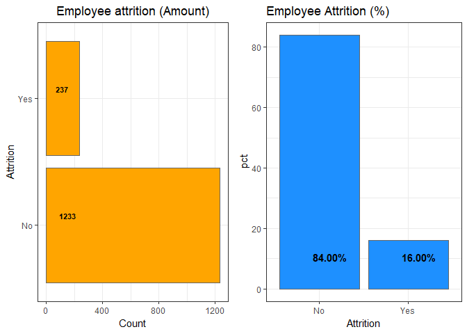

Objective: Analyzing attrition in an organization

---------------------------------------------------------------------------
# Importing libraries
---------------------------------------------------------------------------

##Pacman

Pacman is more than just a nicer way to load packages. Instead of having to write 5 lines of code to load for 5 common data munging packages, like so:

library(dplyr)
library(tidyr)
library(plyr) 
library(magrittr)
library(ggplot2)

You can write one line

pacman::p_load(dplyr,tidyr,plyr,ggplot2, magrittr)

##require()

The library() and require() can be used to attach and load add-on packages which are already installed. 
The main difference between these functions are,

The library() by default returns an error if the requested package does not exist.

example:
library(xyz)
Error in library(xyz) : there is no package called ‘xyz’

The require() is designed to be used inside functions as it gives a warning message and returns a logical value say, FALSE if the requested package is not found and TRUE if the package is loaded.

example:
 require(xyz)
 
 
##How to resize the plots in a Jupyter notebook?

To set the plot width and height to something else, e.g. 4 inches wide and 3 inches high, use:

options(repr.plot.width=4, repr.plot.height=3)


##How to suppress warnings globally in an R Script?

I could use
suppressWarnings(expr)

for single statements. But how can I suppress warnings in R globally?

You want options(warn=-1). However, note that warn=0 is not the safest warning level and it should not be assumed as the current one, particularly within scripts or functions. Thus the safest way to temporary turn off warnings is:

oldw <- getOption("warn")
options(warn = -1)

[your "silenced" code]

options(warn = oldw)

note:oldw was 1 in aditi's default case.


## Description of packages installed below: 

**tidyverse**- Collection of R packages designed for data science such as tibble,dplyr,tidyr by Hadley Wickham.

**skimr**-skimr is designed to provide summary statistics about variables. It is opinionated in its defaults, but easy to modify.
In base R, the most similar functions are summary() for vectors and data frames and fivenum() for numeric vectors.

**GGally**-The R package 'ggplot2' is a plotting system based on the grammar of graphics. 'GGally' extends 'ggplot2' by adding several functions to reduce the complexity of combining geometric objects with transformed data. Some of these functions include a pairwise plot matrix, a two group pairwise plot matrix, a parallel coordinates plot, a survival plot, and several functions to plot networks.

**plotly**-It makes fairly nice charts/graphs/whatever, with a little more interactability (technical term) than your typical visual output.

**viridis**- A good color palette

**caret**-Classification and regression testing is essentially a wrapper for 200+ machine learning algorithms. Additionally, it provides several features which makes it a one stop solution for all the modeling needs for supervised machine learning problems.

**randomForest**- implements random forest algorithm for classification and regression. It can also be used in unsupervised mode for assessing proximities among data points.

**e1071**-Functions for latent class analysis, short time Fourier transform, fuzzy clustering, support vector machines, shortest path computation, bagged clustering, naive Bayes classifier, ...

**rpart**-Recursive partitioning for classification, regression and survival trees. 

**xgboost**-XGBoost is an implementation of gradient boosted decision trees designed for speed and performance.

**h20**-R interface for 'H2O', the scalable open source machine learning platform that offers parallelized implementations of many supervised and unsupervised machine learning algorithms such as Generalized Linear Models, Gradient Boosting Machines (including XGBoost), Random Forests, Deep Neural Networks (Deep Learning), Stacked Ensembles, Naive Bayes, Cox Proportional Hazards, K-Means, PCA, Word2Vec, as well as a fully automatic machine learning algorithm (AutoML).

**ggcorrplot**-The 'ggcorrplot' package can be used to visualize easily a
correlation matrix using 'ggplot2'. It provides a solution for reordering the
correlation matrix and displays the significance level on the plot. It also
includes a function for computing a matrix of correlation p-values.

**rpart.plot**-Plot 'rpart' models. Extends plot.rpart() and text.rpart() in the 'rpart' package.

**corrgram**-Correlograms help us visualize the data in correlation matrices. 

**lightgbm**-LightGBM is a gradient boosting framework that uses tree based learning algorithms.

**ggplot2**-ggplot2 is a system for declaratively creating graphics, based on The Grammar of Graphics. You provide the data, tell ggplot2 how to map variables to aesthetics, what graphical primitives to use, and it takes care of the details.

**highcharter**- Highcharter is a R wrapper for Highcharts javascript libray and its modules. Highcharts is very mature and flexible javascript charting library and it has a great and powerful API.

**ggthemes**-Some extra themes, geoms, and scales for 'ggplot2'. Provides 'ggplot2' themes and scales that replicate the look of plots by Edward Tufte, Stephen Few, 'Fivethirtyeight', 'The Economist', 'Stata', 'Excel', and 'The Wall Street Journal', among others. Provides 'geoms' for Tufte's box plot and range frame.

**psych**-A general purpose toolbox for personality, psychometric theory and experimental psychology. Functions are primarily for multivariate analysis and scale construction using factor analysis, principal component analysis, cluster analysis and reliability analysis, although others provide basic descriptive statistics.

**scales**-Graphical scales map data to aesthetics, and provide methods for automatically determining breaks and labels for axes and legends.

**treemap**-A treemap is similar to a pie chart in that it visually displays proportions by varying the area of a shape. A treemap has two useful advantages over a pie chart. First, you can display a lot more elements. In a pie chart, there is an upper-limit to the number of wedges that can be comfortably added to the circle. In a treemap, you can display hundreds, or thousands, of pieces of information.

**treemapify**- Functions to create treemaps with maximum automation and minimum effort.

**repr**-Specify an object and a format to represent it in. Will stop() if no such format is known.

**cowplot**-The cowplot package is meant to provide a publication-ready theme for ggplot2, one that requires a minimum amount of fiddling with sizes of axis labels, plot backgrounds, etc. It meets my personal needs; you may or may not like my style.

**magittr**-magrittr provides a new “pipe”-like operator, %>%, with which you may pipe a value forward into an expression or function call; something along the lines of x %>% f, rather than f(x)

**ggpubr**-The 'ggpubr' package provides some easy-to-use functions for creating and customizing 'ggplot2'- based publication ready plots

**RColorBrewer**-Creates nice looking color palettes especially for thematic maps

**plotrix**-Lots of plots, various labeling, axis and color scaling functions.

**ggrepel**-Provides text and label geoms for 'ggplot2' that help to avoid overlapping text labels. Labels repel away from each other and away from the data points.

**forcats**-The goal of the forcats package is to provide a suite of tools that solve common problems with factors, including changing the order of levels or the values. 

**reshape2**-retired package.Flexibly restructure and aggregate data using just two functions: melt and 'dcast' (or 'acast').

**caTools**-Contains several basic utility functions including: moving (rolling, running) window statistic functions, read/write for GIF and ENVI binary files, fast calculation of AUC, LogitBoost classifier, base64 encoder/decoder, round-off-error-free sum and cumsum, etc.

**tree**-Classification and regression trees package.

**rattle**-R Analytic Tool To Learn Easily.Rattle is a popular GUI for data mining using R. It presents statistical and visual summaries of data, transforms data so that it can be readily modelled, builds both unsupervised and supervised machine learning models from the data, presents the performance of models graphically, and scores new datasets for deployment into production. A key features is that all of your interactions through the graphical user interface are captured as an R script that can be readily executed in R independently of the Rattle interface. Use it as a tool to learn and develop your skills in R and then to build your initial models in Rattle to then be tuned in R which provides considerably more powerful options.


```r
if(!require("pacman")) install.packages("pacman")
```

```
## Loading required package: pacman
```

```
## Warning: package 'pacman' was built under R version 3.5.2
```

```r
pacman::p_load(tidyverse,skimr,GGally,plotly,viridis,caret,randomForest,e1071,rpart,xgboost,h2o,ggcorrplot,rpart.plot,corrgram,lightgbm,ggplot2,highcharter,ggthemes,psych,scales,treemap,treemapify,repr,cowplot,magrittr,ggpubr,RColorBrewer,plotrix,ggrepel,forcats,reshape2,caTools,tree,rattle)
```

```
## Installing package into 'C:/Users/aditi/OneDrive/Documents/R/win-library/3.5'
## (as 'lib' is unspecified)
```

```
## Warning: package 'lightgbm' is not available (for R version 3.5.1)
```

```
## Warning: unable to access index for repository http://www.stats.ox.ac.uk/pub/RWin/bin/windows/contrib/3.5:
##   cannot open URL 'http://www.stats.ox.ac.uk/pub/RWin/bin/windows/contrib/3.5/PACKAGES'
```

```
## Warning: 'BiocManager' not available.  Could not check Bioconductor.
## 
## Please use `install.packages('BiocManager')` and then retry.
```

```
## Warning in p_install(package, character.only = TRUE, ...):
```

```
## Warning in library(package, lib.loc = lib.loc, character.only = TRUE,
## logical.return = TRUE, : there is no package called 'lightgbm'
```

```
## Warning in pacman::p_load(tidyverse, skimr, GGally, plotly, viridis, caret, : Failed to install/load:
## lightgbm
```

```r
oldw <- getOption("warn")
options(warn = -1)
oldw
```

```
## [1] 0
```

```r
getOption("warn")
```

```
## [1] -1
```

```r
df <- read.csv("WA_Fn-UseC_-HR-Employee-Attrition.csv")
head(df)
```

```
##   ï..Age Attrition    BusinessTravel DailyRate             Department
## 1     41       Yes     Travel_Rarely      1102                  Sales
## 2     49        No Travel_Frequently       279 Research & Development
## 3     37       Yes     Travel_Rarely      1373 Research & Development
## 4     33        No Travel_Frequently      1392 Research & Development
## 5     27        No     Travel_Rarely       591 Research & Development
## 6     32        No Travel_Frequently      1005 Research & Development
##   DistanceFromHome Education EducationField EmployeeCount EmployeeNumber
## 1                1         2  Life Sciences             1              1
## 2                8         1  Life Sciences             1              2
## 3                2         2          Other             1              4
## 4                3         4  Life Sciences             1              5
## 5                2         1        Medical             1              7
## 6                2         2  Life Sciences             1              8
##   EnvironmentSatisfaction Gender HourlyRate JobInvolvement JobLevel
## 1                       2 Female         94              3        2
## 2                       3   Male         61              2        2
## 3                       4   Male         92              2        1
## 4                       4 Female         56              3        1
## 5                       1   Male         40              3        1
## 6                       4   Male         79              3        1
##                 JobRole JobSatisfaction MaritalStatus MonthlyIncome
## 1       Sales Executive               4        Single          5993
## 2    Research Scientist               2       Married          5130
## 3 Laboratory Technician               3        Single          2090
## 4    Research Scientist               3       Married          2909
## 5 Laboratory Technician               2       Married          3468
## 6 Laboratory Technician               4        Single          3068
##   MonthlyRate NumCompaniesWorked Over18 OverTime PercentSalaryHike
## 1       19479                  8      Y      Yes                11
## 2       24907                  1      Y       No                23
## 3        2396                  6      Y      Yes                15
## 4       23159                  1      Y      Yes                11
## 5       16632                  9      Y       No                12
## 6       11864                  0      Y       No                13
##   PerformanceRating RelationshipSatisfaction StandardHours
## 1                 3                        1            80
## 2                 4                        4            80
## 3                 3                        2            80
## 4                 3                        3            80
## 5                 3                        4            80
## 6                 3                        3            80
##   StockOptionLevel TotalWorkingYears TrainingTimesLastYear WorkLifeBalance
## 1                0                 8                     0               1
## 2                1                10                     3               3
## 3                0                 7                     3               3
## 4                0                 8                     3               3
## 5                1                 6                     3               3
## 6                0                 8                     2               2
##   YearsAtCompany YearsInCurrentRole YearsSinceLastPromotion
## 1              6                  4                       0
## 2             10                  7                       1
## 3              0                  0                       0
## 4              8                  7                       3
## 5              2                  2                       2
## 6              7                  7                       3
##   YearsWithCurrManager
## 1                    5
## 2                    7
## 3                    0
## 4                    0
## 5                    2
## 6                    6
```

```r
# This will be used for training and testing.
original_df<-df
```
##skim() 
is an alternative to summary(), quickly providing a broad overview of a data frame. It handles data of all types, dispatching a different set of summary functions based on the types of columns in the data frame.It also provides a neat histogram of variables.

##kable
Create Tables In LaTeX, HTML, Markdown And ReStructuredText
This is a very simple table generator. It is simple by design. It is not intended to replace any other R packages for making tables.


```r
df %>% skim() %>% kable()
```

```
## Skim summary statistics  
##  n obs: 1470    
##  n variables: 35    
## 
## Variable type: factor
## 
##     variable       missing    complete     n      n_unique                  top_counts                  ordered 
## ----------------  ---------  ----------  ------  ----------  ----------------------------------------  ---------
##    Attrition          0         1470      1470       2              No: 1233, Yes: 237, NA: 0            FALSE  
##  BusinessTravel       0         1470      1470       3         Tra: 1043, Tra: 277, Non: 150, NA: 0      FALSE  
##    Department         0         1470      1470       3          Res: 961, Sal: 446, Hum: 63, NA: 0       FALSE  
##  EducationField       0         1470      1470       6        Lif: 606, Med: 464, Mar: 159, Tec: 132     FALSE  
##      Gender           0         1470      1470       2              Mal: 882, Fem: 588, NA: 0            FALSE  
##     JobRole           0         1470      1470       9        Sal: 326, Res: 292, Lab: 259, Man: 145     FALSE  
##  MaritalStatus        0         1470      1470       3         Mar: 673, Sin: 470, Div: 327, NA: 0       FALSE  
##      Over18           0         1470      1470       1                    Y: 1470, NA: 0                 FALSE  
##     OverTime          0         1470      1470       2              No: 1054, Yes: 416, NA: 0            FALSE  
## 
## Variable type: integer
## 
##          variable            missing    complete     n       mean        sd        p0      p25        p50        p75      p100       hist   
## --------------------------  ---------  ----------  ------  ---------  ---------  ------  --------  ---------  ---------  -------  ----------
##         DailyRate               0         1470      1470    802.49     403.51     102      465        802       1157      1499     <U+2587><U+2587><U+2587><U+2587><U+2587><U+2587><U+2587><U+2587> 
##      DistanceFromHome           0         1470      1470     9.19       8.11       1        2          7         14        29      <U+2587><U+2585><U+2583><U+2581><U+2581><U+2581><U+2581><U+2581> 
##         Education               0         1470      1470     2.91       1.02       1        2          3          4         5      <U+2582><U+2583><U+2581><U+2587><U+2581><U+2586><U+2581><U+2581> 
##       EmployeeCount             0         1470      1470       1          0        1        1          1          1         1      <U+2581><U+2581><U+2581><U+2587><U+2581><U+2581><U+2581><U+2581> 
##       EmployeeNumber            0         1470      1470    1024.87    602.02      1      491.25    1020.5     1555.75    2068     <U+2587><U+2587><U+2587><U+2587><U+2587><U+2587><U+2587><U+2587> 
##  EnvironmentSatisfaction        0         1470      1470     2.72       1.09       1        2          3          4         4      <U+2585><U+2581><U+2585><U+2581><U+2581><U+2587><U+2581><U+2587> 
##         HourlyRate              0         1470      1470     65.89      20.33      30       48        66        83.75      100     <U+2586><U+2587><U+2587><U+2587><U+2586><U+2587><U+2587><U+2587> 
##           ï..Age                0         1470      1470     36.92      9.14       18       30        36         43        60      <U+2582><U+2583><U+2587><U+2587><U+2585><U+2583><U+2582><U+2582> 
##       JobInvolvement            0         1470      1470     2.73       0.71       1        2          3          3         4      <U+2581><U+2581><U+2583><U+2581><U+2581><U+2587><U+2581><U+2581> 
##          JobLevel               0         1470      1470     2.06       1.11       1        1          2          3         5      <U+2587><U+2587><U+2581><U+2583><U+2581><U+2582><U+2581><U+2581> 
##      JobSatisfaction            0         1470      1470     2.73        1.1       1        2          3          4         4      <U+2585><U+2581><U+2585><U+2581><U+2581><U+2587><U+2581><U+2587> 
##       MonthlyIncome             0         1470      1470    6502.93    4707.96    1009     2911      4919       8379      19999    <U+2587><U+2587><U+2583><U+2582><U+2581><U+2581><U+2581><U+2582> 
##        MonthlyRate              0         1470      1470    14313.1    7117.79    2094     8047     14235.5    20461.5    26999    <U+2587><U+2587><U+2587><U+2587><U+2587><U+2587><U+2587><U+2586> 
##     NumCompaniesWorked          0         1470      1470     2.69        2.5       0        1          2          4         9      <U+2587><U+2582><U+2582><U+2582><U+2581><U+2581><U+2581><U+2581> 
##     PercentSalaryHike           0         1470      1470     15.21      3.66       11       12        14         18        25      <U+2587><U+2587><U+2583><U+2583><U+2582><U+2582><U+2582><U+2581> 
##     PerformanceRating           0         1470      1470     3.15       0.36       3        3          3          3         4      <U+2587><U+2581><U+2581><U+2581><U+2581><U+2581><U+2581><U+2582> 
##  RelationshipSatisfaction       0         1470      1470     2.71       1.08       1        2          3          4         4      <U+2585><U+2581><U+2585><U+2581><U+2581><U+2587><U+2581><U+2587> 
##       StandardHours             0         1470      1470      80          0        80       80        80         80        80      <U+2581><U+2581><U+2581><U+2587><U+2581><U+2581><U+2581><U+2581> 
##      StockOptionLevel           0         1470      1470     0.79       0.85       0        0          1          1         3      <U+2587><U+2581><U+2587><U+2581><U+2581><U+2582><U+2581><U+2581> 
##     TotalWorkingYears           0         1470      1470     11.28      7.78       0        6         10         15        40      <U+2585><U+2587><U+2582><U+2582><U+2582><U+2581><U+2581><U+2581> 
##   TrainingTimesLastYear         0         1470      1470      2.8       1.29       0        2          3          3         6      <U+2581><U+2581><U+2587><U+2587><U+2581><U+2582><U+2582><U+2581> 
##      WorkLifeBalance            0         1470      1470     2.76       0.71       1        2          3          3         4      <U+2581><U+2581><U+2583><U+2581><U+2581><U+2587><U+2581><U+2582> 
##       YearsAtCompany            0         1470      1470     7.01       6.13       0        3          5          9        40      <U+2587><U+2585><U+2581><U+2581><U+2581><U+2581><U+2581><U+2581> 
##     YearsInCurrentRole          0         1470      1470     4.23       3.62       0        2          3          7        18      <U+2587><U+2583><U+2581><U+2585><U+2581><U+2581><U+2581><U+2581> 
##  YearsSinceLastPromotion        0         1470      1470     2.19       3.22       0        0          1          3        15      <U+2587><U+2582><U+2581><U+2581><U+2581><U+2581><U+2581><U+2581> 
##    YearsWithCurrManager         0         1470      1470     4.12       3.57       0        2          3          7        17      <U+2587><U+2583><U+2581><U+2583><U+2581><U+2581><U+2581><U+2581>
```

##geom_bar vs geom_col

There are two types of bar charts: geom_bar() and geom_col(). geom_bar() makes the height of the bar proportional to the number of cases in each group (or if the weight aesthetic is supplied, the sum of the weights). If you want the heights of the bars to represent values in the data, use geom_col() instead. geom_bar() uses stat_count() by default: it counts the number of cases at each x position. geom_col() uses stat_identity(): it leaves the data as is.

##geom_bar vs geom_hist
Bar charts provide a visual presentation of categorical data. Examples:
The number of people with red, black and brown hair

Histograms are used to plot density of interval (usually numeric) data. Examples,
Distributions of age and height
The examples are distribution of movie ratings.

After a bit more investigating, I think in ggplot2 there is no difference between geom_bar and geom_histogram. From the docs:
geom_histogram is an alias for geom_bar plus stat_bin


```r
options(repr.plot.height = 8, repr.plot.width = 4)


attritions_number<- df %>% group_by(Attrition) %>% summarise(Count=n()) %>%
  ggplot(aes(x=Attrition, y=Count))+ 
  geom_bar(stat="identity",fill="orange",color="grey40") + labs(title = "Employee attrition (Amount)", x="Attrition",y="Count")+coord_flip()+theme_bw()+geom_text(aes(x=Attrition,y=0.01,label=Count),hjust=-0.8,vjust=-1,size=3,fontface="bold")+theme(plot.title = element_text(hjust=0.5))


attrition_pct <- df %>% group_by(Attrition) %>% summarise(Count=n()) %>% mutate(pct=round(prop.table(Count),2)*100) %>%
  ggplot(aes(x=Attrition,y=pct)) +      geom_bar(stat="identity",fill="dodgerblue",color="grey40") +
geom_text(aes(x=Attrition,y=0.9,label=sprintf("%.2f%%",pct)),fontface="bold",hjust=0.2,vjust=-3,size=4) + labs(title="Employee Attrition (%)", xlab="E Attrition",ylab="Percentage")+ 
  theme(plot.title=element_text(hjust=0.5))+
  theme_bw()

plot_grid(attritions_number,attrition_pct,align="h",ncol=2)
```

<!-- -->


