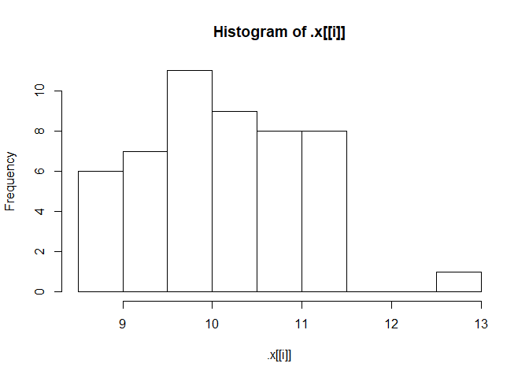
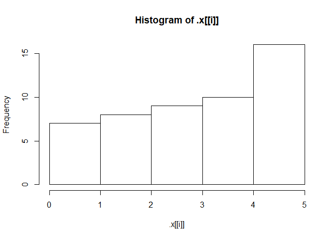
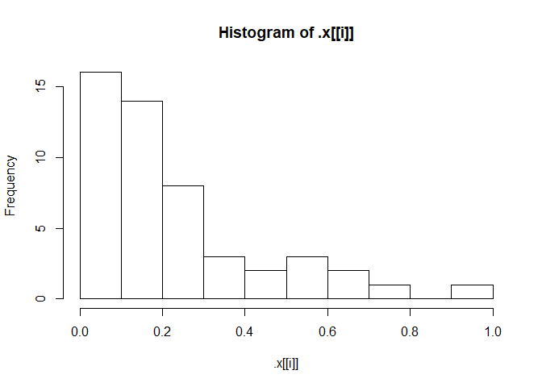

***
***
***
***
*************
#Introduction to R
*************
***
***
***
***
***

**Basic data types in R**
- Numeric (eg:4.5), Integers (eg:4), Boolean(eg: FALSE), characters(eg:"a") 

check variable type in r: class(variable_name)

If you want to check out the contents of the workspace, you can type ls() in the console.

This will give you a quick overview of the contents of a variable:summary(my_var)

## Vectors
are one-dimension arrays that can hold numeric data, character data, or logical data.In R, you create a vector with the combine function c(). You place the vector elements separated by a comma between the parentheses. For example:

numeric_vector <- c(1, 2, 3)
character_vector <- c("a", "b", "c")

You can give a name to the elements of a vector with the names() function. Have a look at this example:
some_vector <- c("John Doe", "poker player")
names(some_vector) <- c("Name", "Profession")

**sum()**

It calculates the sum of all elements of a vector. For example, to calculate the total amount of money you have lost/won with poker you do:

total_poker <- sum(poker_vector)

To select the first element of the vector, you type poker_vector[1] and so on.

Suppose you want to select the first and the fifth day of the week: use the vector c(1, 5) between the square brackets. For example, the code below selects the first and fifth element of poker_vector:

poker_vector[c(1, 5)]
c(2, 3, 4) can be abbreviated to 2:4.

Just like you did in the previous exercise with numerics, you can also use the element names to select multiple elements, for example:

poker_vector[c("Monday","Tuesday")]


## matrix 
is a collection of elements of the same data type (numeric, character, or logical) arranged into a fixed number of rows and columns. Since you are only working with rows and columns, a matrix is called two-dimensional.

You can construct a matrix in R with the matrix() function. Consider the following example:

matrix(1:9, byrow = TRUE, nrow = 3)

Similar to vectors, you can add names for the rows and the columns of a matrix

rownames(my_matrix) <- row_names_vector
colnames(my_matrix) <- col_names_vector

 rowSums() conveniently calculates the totals for each row of a matrix. This function creates a new vector:

rowSums(my_matrix)

You can add a column or multiple columns to a matrix with the cbind() function, which merges matrices and/or vectors together by column. For example:

big_matrix <- cbind(matrix1, matrix2, vector1 ...)

## factor 
To create factors in R, you make use of the function factor(). First thing that you have to do is create a vector that contains all the observations that belong to a limited number of categories. For example, sex_vector contains the sex of 5 different individuals:

sex_vector <- c("Male","Female","Female","Male","Male")
It is clear that there are two categories, or in R-terms 'factor levels', at work here: "Male" and "Female".

The function factor() will encode the vector as a factor:

factor_sex_vector <- factor(sex_vector)

temperature_vector <- c("High", "Low", "High","Low", "Medium")

factor_temperature_vector <- factor(temperature_vector, order = TRUE, levels = c("Low", "Medium", "High"))

## Data frame

You construct a data frame with the data.frame() function. As arguments, you pass the vectors from before: they will become the different columns of your data frame. Because every column has the same length, the vectors you pass should also have the same length. But don't forget that it is possible (and likely) that they contain different types of data.

name <- c("Mercury", "Venus", "Earth", "Mars", "Jupiter", "Saturn", "Uranus", "Neptune")

type <- c("Terrestrial planet", "Terrestrial planet", "Terrestrial planet", 
          "Terrestrial planet", "Gas giant", "Gas giant", "Gas giant", "Gas giant")

diameter <- c(0.382, 0.949, 1, 0.532, 11.209, 9.449, 4.007, 3.883)


** Create a data frame from the vectors**
planets_df <-data.frame(name,type,diameter)


** Select planets with diameter < 1**
subset(planets_df,subset=diameter<1)

order() is a function that gives you the ranked position of each element when it is applied on a variable, such as a vector for example:

> a <- c(100, 10, 1000)
> order(a)
[1] 2 1 3


** Sorting the data frame**

Use order() to create positions
positions <-  order(planets_df$diameter)

Use positions to sort planets_df
planets_df[positions,]


## Lists

A list in R is similar to your to-do list at work or school: the different items on that list most likely differ in length, characteristic, and type of activity that has to be done.

A list in R allows you to gather a variety of objects under one name (that is, the name of the list) in an ordered way. These objects can be matrices, vectors, data frames, even other lists, etc. It is not even required that these objects are related to each other in any way.

You could say that a list is some kind super data type: you can store practically any piece of information in it!

Construct list with these different elements:
my_list <- list(my_vector,my_matrix,my_df)


**Selecting elements from a list**

One way to select a component is using the numbered position of that component. For example, to "grab" the first component of shining_list you type

shining_list[[1]]
A quick way to check this out is typing it in the console. Important to remember: to select elements from vectors, you use single square brackets: [ ]. Don't mix them up!

You can also refer to the names of the components, with [[ ]] or with the $ sign. Both will select the data frame representing the reviews:

shining_list[["reviews"]]
shining_list$reviews
Besides selecting components, you often need to select specific elements out of these components. For example, with shining_list[[2]][1] you select from the second component, actors (shining_list[[2]]), the first element ([1]). When you type this in the console, you will see the answer is Jack Nicholson.

To conveniently add elements to lists you can use the c() function, that you also used to build vectors:

ext_list <- c(my_list , my_val)
This will simply extend the original list, my_list, with the component my_val. This component gets appended to the end of the list. If you want to give the new list item a name, you just add the name as you did before:

ext_list <- c(my_list, my_name = my_val)

***
***
***
***
*************
#Intermediate R
*************
***
***
***
***
***


## The if statement

if (condition1) {
  expr1
} else if (condition2) {
  expr2
} else if (condition3) {
  expr3
} else {
  expr4
}

## while loop and break

while (speed > 30) {
  print(paste("Your speed is", speed))
  
  # Break the while loop when speed exceeds 80
  if ( speed>80) {
    break
  }
}

## for loop over a vector

primes <- c(2, 3, 5, 7, 11, 13)

loop version 1
for (p in primes) {
  print(p)
}

loop version 2
for (i in 1:length(primes)) {
  print(primes[i])
}


## for loop over a list

primes_list <- list(2, 3, 5, 7, 11, 13)

loop version 1
for (p in primes_list) {
  print(p)
}

loop version 2
for (i in 1:length(primes_list)) {
  print(primes_list[[i]])
}


## Loop over a matrix

 The tic-tac-toe matrix ttt has already been defined for you
ttt
 define the double for loop
for (i in 1:nrow(ttt)) {
  for (j in 1:ncol(ttt)) {
    print(paste("On row", i, "and column", j, "the board contains", ttt[i,j]))
  }# Pre-defined variables


Loop over a string
rquote <- "r's internals are irrefutably intriguing"
chars <- strsplit(rquote, split = "")[[1]]

Initialize rcount
rcount <- 0

Finish the for loop

for (char in chars) {
  if(char=="r"){
    rcount<-rcount+1
      }else if (char=="u"){
break        
        }
              }
 
 print(rcount)
  
}

The break statement abandons the active loop: the remaining code in the loop is skipped and the loop is not iterated over anymore.
The next statement skips the remainder of the code in the loop, but continues the iteration.

## Functions

mean() function also has this argument, na.rm, and it does the exact same thing. By default, it is set to FALSE, as the Usage of the default S3 method shows:

mean(x, trim = 0, na.rm = FALSE, ...)

**Creating your own functions**

Create a function pow_two()
pow_two<- function(x){
  return(x*x)
}

## Packages

install.packages(), which as you can expect, installs a given package.
library() which loads packages, i.e. attaches them to the search list on your R workspace.

search(), to look at the currently attached packages and
qplot(mtcars$wt, mtcars$hp), to build a plot of two variables of the mtcars data frame.


## Apply functions

**lapply(X, FUN, ...)**

To put it generally, lapply takes a vector or list X, and applies the function FUN to each of its members. If FUN requires additional arguments, you pass them after you've specified X and FUN (...). The output of lapply() is a list, the same length as X, where each element is the result of applying FUN on the corresponding element of X.

split_low<-lapply(split_math,tolower)

** Use anonymous function inside lapply()**
lapply(list(1,2,3), function(x) { 3 * x })

** lapply with additional arguments**
multiply <- function(x, factor) {
  x * factor
}
lapply(list(1,2,3), multiply, factor = 3)


Suppose you want to display the structure of every element of a list. You could use the str() function for this, which returns NULL:

lapply(list(1, "a", TRUE), str)
This call actually returns a list, the same size as the input list, containing all NULL values. On the other hand calling

str(TRUE)
on its own prints only the structure of the logical to the console, not NULL. That's because str() uses invisible() behind the scenes, which returns an invisible copy of the return value, NULL in this case. This prevents it from being printed when the result of str() is not assigned.


**sapply()**
You can use sapply() similar to how you used lapply(). The first argument of sapply() is the list or vector X over which you want to apply a function, FUN. Potential additional arguments to this function are specified afterwards (...):

sapply(X, FUN, ...)

sapply function simplifies the output format wherever it can. else the result is same as lapply.


** vapply()**

vapply(X, FUN, FUN.VALUE, ..., USE.NAMES = TRUE)
Over the elements inside X, the function FUN is applied. The FUN.VALUE argument expects a template for the return argument of this function FUN. USE.NAMES is TRUE by default; in this case vapply() tries to generate a named array, if possible.

there are cases where the structure of the output of the function you want to apply, FUN, does not correspond to the template you specify in FUN.VALUE. In that case, vapply() will throw an error that informs you about the misalignment between expected and actual output

vapply(temp, basics, numeric(4))

As highlighted before, vapply() can be considered a more robust version of sapply(), because you explicitly restrict the output of the function you want to apply. Converting your sapply() expressions in your own R scripts to vapply() expressions is therefore a good practice (and also a breeze!).

**Convert to vapply() expression**
sapply(temp, function(x, y) { mean(x) > y }, y = 5)
vapply(temp, function(x, y) { mean(x) > y }, y = 5,logical(1))


## Utility functions

Reverse Elements
rev provides a reversed version of its argument.

seq(): Generate sequences, by specifying the from, to, and by arguments.
rep(): Replicate elements of vectors and lists.
sort(): Sort a vector in ascending order. Works on numerics, but also on character strings and logicals.
rev(): Reverse the elements in a data structures for which reversal is defined.
str(): Display the structure of any R object.
append(): Merge vectors or lists.
is.*(): Check for the class of an R object.
as.*(): Convert an R object from one class to another.
unlist(): Flatten (possibly embedded) lists to produce a vector.

eg:rep(seq(1, 7, by = 2), times = 7)
 output: 1 3 5 7 1 3 5 7 1 3 5 7 1 3 5 7 1 3 5 7 1 3 5 7 1 3 5 7


## Regular expressions

grepl & grep
In their most basic form, regular expressions can be used to see whether a pattern exists inside a character string or a vector of character strings. For this purpose, you can use:

grepl(), which returns TRUE when a pattern is found in the corresponding character string.
grep(), which returns a vector of indices of the character strings that contains the pattern.
Both functions need a pattern and an x argument, where pattern is the regular expression you want to match for, and the x argument is the character vector from which matches should be sought.

You can use the caret, ^, and the dollar sign, $ to match the content located in the start and end of a string, respectively. This could take us one step closer to a correct pattern for matching only the ".edu" email addresses from our list of emails. But there's more that can be added to make the pattern more robust:

@, because a valid email must contain an at-sign.

```r
# The emails vector has already been defined for you
emails <- c("john.doe@ivyleague.edu", "education@world.gov", "dalai.lama@peace.org",
            "invalid.edu", "quant@bigdatacollege.edu", "cookie.monster@sesame.tv")

# Use grepl() to match for .edu addresses more robustly
grepl("@.*\\.edu$",emails)
```

```
## [1]  TRUE FALSE FALSE FALSE  TRUE FALSE
```

```r
# Use grep() to match for .edu addresses more robustly, save result to hits
hits<-grep("@.*\\.edu$",emails)

# Subset emails using hits
emails[hits]
```

```
## [1] "john.doe@ivyleague.edu"   "quant@bigdatacollege.edu"
```
 
**sub & gsub**
While grep() and grepl() were used to simply check whether a regular expression could be matched with a character vector, sub() and gsub() take it one step further: you can specify a replacement argument. If inside the character vector x, the regular expression pattern is found, the matching element(s) will be replaced with replacement.sub() only replaces the first match, whereas gsub() replaces all matches.


```r
# The emails vector has already been defined for you
emails <- c("john.doe@ivyleague.edu", "education@world.gov", "global@peace.org",
            "invalid.edu", "quant@bigdatacollege.edu", "cookie.monster@sesame.tv")

# Use sub() to convert the email domains to datacamp.edu
sub("@.*\\.edu$","@datacamp.edu",emails)
```

```
## [1] "john.doe@datacamp.edu"    "education@world.gov"     
## [3] "global@peace.org"         "invalid.edu"             
## [5] "quant@datacamp.edu"       "cookie.monster@sesame.tv"
```

## Time in R

In R, dates are represented by Date objects, while times are represented by POSIXct objects. Under the hood, however, these dates and times are simple numerical values. Date objects store the number of days since the 1st of January in 1970. POSIXct objects on the other hand, store the number of seconds since the 1st of January in 1970.


```r
# Get the current date: today
today<-Sys.Date()

# See what today looks like under the hood
unclass(today)
```

```
## [1] 17973
```

```r
# Get the current time: now
now<-Sys.time()

# See what now looks like under the hood
unclass(now)
```

```
## [1] 1552971694
```

Create and format dates
To create a Date object from a simple character string in R, you can use the as.Date() function. The character string has to obey a format that can be defined using a set of symbols (the examples correspond to 13 January, 1982):

%Y: 4-digit year (1982)
%y: 2-digit year (82)
%m: 2-digit month (01)
%d: 2-digit day of the month (13)
%A: weekday (Wednesday)
%a: abbreviated weekday (Wed)
%B: month (January)
%b: abbreviated month (Jan)

 default R matches your character string to the formats "%Y-%m-%d" or "%Y/%m/%d".


```r
# Definition of character strings representing dates
str1 <- "May 23, '96"
str2 <- "2012-03-15"
str3 <- "30/January/2006"

# Convert the strings to dates: date1, date2, date3
date1 <- as.Date(str1, format = "%b %d, '%y")
date2<-as.Date(str2)
date3<-as.Date(str3,format="%d/%B/%Y")

# Convert dates to formatted strings
format(date1, "%A")
```

```
## [1] "Thursday"
```

```r
format(date2, "%d")
```

```
## [1] "15"
```

```r
format(date3, "%b %Y")
```

```
## [1] "Jan 2006"
```

Create and format times
Similar to working with dates, you can use as.POSIXct() to convert from a character string to a POSIXct object, and format() to convert from a POSIXct object to a character string. Again, you have a wide variety of symbols:

%H: hours as a decimal number (00-23)
%I: hours as a decimal number (01-12)
%M: minutes as a decimal number
%S: seconds as a decimal number
%T: shorthand notation for the typical format %H:%M:%S
%p: AM/PM indicator
For a full list of conversion symbols, consult the strptime documentation in the console:

?strptime
Again,as.POSIXct() uses a default format to match character strings. In this case, it's %Y-%m-%d %H:%M:%S. In this exercise, abstraction is made of different time zones.


```r
# Definition of character strings representing times
str1 <- "May 23, '96 hours:23 minutes:01 seconds:45"
str2 <- "2012-3-12 14:23:08"

# Convert the strings to POSIXct objects: time1, time2
time1 <- as.POSIXct(str1, format = "%B %d, '%y hours:%H minutes:%M seconds:%S")
time2<-as.POSIXct(str2)

# Convert times to formatted strings
format(time1,"%M")
```

```
## [1] "01"
```

```r
format(time2,"%I:%M %p")
```

```
## [1] "02:23 PM"
```
***
***
***
***
*************
#Tidyverse
*************
***
***
***
***
***

**Filtering**

library(dplyr)

eg: Filter for China in 2002
gapminder %>% filter(year==2002, country=="China")

**Arranging**

Sort in ascending order of lifeExp
gapminder %>% arrange(lifeExp)

  
Sort in descending order of lifeExp
gapminder %>% arrange(desc(lifeExp))


Filter for the year 1957, then arrange in descending order of population
gapminder %>% filter(year==1957) %>% arrange(desc(pop))

Use mutate to change lifeExp to be in months
gapminder %>% mutate(lifeExp=lifeExp*12)

Change this plot to put the x-axis on a log scale
ggplot(gapminder_1952, aes(x = pop, y = lifeExp)) +
  geom_point()+scale_x_log10()
  
Scatter plot comparing gdpPercap and lifeExp, with color representing continent
and size representing population, faceted by year
ggplot(gapminder,aes(x=gdpPercap,y=lifeExp,color=continent,size=pop))+geom_point()+
scale_x_log10()+facet_wrap(~year)

Summarize to find the median life expectancy
gapminder %>% summarize(medianLifeExp=median(lifeExp))

Find median life expectancy and maximum GDP per capita in each year
gapminder %>% group_by(year) %>% summarize(medianLifeExp=median(lifeExp),
maxGdpPercap=max(gdpPercap))

Be sure to add expand_limits(y = 0) to make sure the plot's y-axis includes zero.

Add a title to this graph: "Comparing GDP per capita across continents"
ggplot(gapminder_1952, aes(x = continent, y = gdpPercap)) +
  geom_boxplot() +ggtitle("Comparing GDP per capita across continents")
  scale_y_log10()
  
  
***
***
***
***
*************
# Importing data in R (part1)
*************
***
***
***
***
***

read.csv
The utils package, which is automatically loaded in your R session on startup, can import CSV files with the read.csv() function.

stringsAsFactors
With stringsAsFactors, you can tell R whether it should convert strings in the flat file to factors.

For all importing functions in the utils package, this argument is TRUE, which means that you import strings as factors. This only makes sense if the strings you import represent categorical variables in R. If you set stringsAsFactors to FALSE, the data frame columns corresponding to strings in your text file will be character.


Import swimming_pools.csv correctly: pools
pools<-read.csv("swimming_pools.csv",stringsAsFactors=FALSE)

Check the structure of pools
str(pools)

read.delim
Aside from .csv files, there are also the .txt files which are basically text files. You can import these functions with read.delim(). By default, it sets the sep argument to "\t" (fields in a record are delimited by tabs) and the header argument to TRUE (the first row contains the field names).


read.table
If you're dealing with more exotic flat file formats, you'll want to use read.table(). It's the most basic importing function; you can specify tons of different arguments in this function. Unlike read.csv() and read.delim(), the header argument defaults to FALSE and the sep argument is "" by default.

Path to the hotdogs.txt file: path
path <- file.path("data", "hotdogs.txt")

Import the hotdogs.txt file: hotdogs
hotdogs <- read.table(path, 
                      sep= "", 
                      col.names = c("type", "calories", "sodium"))

Call head() on hotdogs
head(hotdogs)


Finish the read.delim() call
hotdogs <- read.delim("hotdogs.txt", header = FALSE, col.names = c("type", "calories", "sodium"))

Select the hot dog with the least calories: lily
lily <- hotdogs[which.min(hotdogs$calories), ]

Select the observation with the most sodium: tom
tom<-hotdogs[which.max(hotdogs$sodium),]

Column classes
Next to column names, you can also specify the column types or column classes of the resulting data frame. You can do this by setting the colClasses argument to a vector of strings representing classes:

read.delim("my_file.txt", 
           colClasses = c("character",
                          "numeric",
                          "logical"))
                          
                          
read_tsv
Where you use read_csv() to easily read in CSV files, you use read_tsv() to easily read in TSV files. TSV is short for tab-separated values.

This time, the potatoes data comes in the form of a tab-separated values file; potatoes.txt is available in your workspace. In contrast to potatoes.csv, this file does not contain columns names in the first row, though.

There's a vector properties that you can use to specify these column names manually.


```r
# readr is already loaded

# Column names
properties <- c("area", "temp", "size", "storage", "method",
                "texture", "flavor", "moistness")

# Import potatoes.txt: potatoes
# potatoes<-read_tsv("potatoes.txt",col_names=properties)

# Call head() on potatoes
#head(potatoes)
```

**read_delim**
Just as read.table() was the main utils function, read_delim() is the main readr function.

read_delim() takes two mandatory arguments:

file: the file that contains the data
delim: the character that separates the values in the data file


eg:

```r
# readr is already loaded

# Column names
properties <- c("area", "temp", "size", "storage", "method",
                "texture", "flavor", "moistness")

# Import potatoes.txt using read_delim(): potatoes
#potatoes<-read_delim("potatoes.txt",delim="\t",col_names=properties)
```


skip and n_max
Through skip and n_max you can control which part of your flat file you're actually importing into R.

skip specifies the number of lines you're ignoring in the flat file before actually starting to import data.
n_max specifies the number of lines you're actually importing.
Say for example you have a CSV file with 20 lines, and set skip = 2 and n_max = 3, you're only reading in lines 3, 4 and 5 of the file.

Watch out: Once you skip some lines, you also skip the first line that can contain column names!


```r
# Import 5 observations from potatoes.txt: potatoes_fragment
#potatoes_fragment <- read_tsv("potatoes.txt", skip = 6, n_max = 5, col_names = properties)
```

col_types
You can also specify which types the columns in your imported data frame should have. You can do this with col_types. If set to NULL, the default, functions from the readr package will try to find the correct types themselves. You can manually set the types with a string, where each character denotes the class of the column: character, double, integer and logical. _ skips the column as a whole.


```r
# readr is already loaded

# Column names
properties <- c("area", "temp", "size", "storage", "method",
                "texture", "flavor", "moistness")

# Import all data, but force all columns to be character: potatoes_char
# potatoes_char <- read_tsv("potatoes.txt", col_types = "cccccccc", col_names = properties)
```

col_types with collectors
Another way of setting the types of the imported columns is using collectors. Collector functions can be passed in a list() to the col_types argument of read_ functions to tell them how to interpret values in a column.

For a complete list of collector functions, you can take a look at the collector documentation. For this exercise you will need two collector functions:

col_integer(): the column should be interpreted as an integer.
col_factor(levels, ordered = FALSE): the column should be interpreted as a factor with levels.


```r
# readr is already loaded

# The collectors you will need to import the data
# fac <- col_factor(levels = c("Beef", "Meat", "Poultry"))
# int <- col_integer()

# Edit the col_types argument to import the data correctly: hotdogs_factor
# hotdogs_factor <- read_tsv("hotdogs.txt",
#                           col_names = c("type", "calories", "sodium"),
#                           col_types = list(fac,int, int))
```
fread
You still remember how to use read.table(), right? Well, fread() is a function that does the same job with very similar arguments. It is extremely easy to use and blazingly fast!


```r
# load the data.table package
library(data.table)

# Import potatoes.csv with fread(): potatoes
# potatoes<-fread('potatoes.csv')
```
Now that you know the basics about fread(), you should know about two arguments of the function: drop and select, to drop or select variables of interest.

Suppose you have a dataset that contains 5 variables and you want to keep the first and fifth variable, named "a" and "e". The following options will all do the trick:

fread("path/to/file.txt", drop = 2:4)
fread("path/to/file.txt", select = c(1, 5))
fread("path/to/file.txt", drop = c("b", "c", "d"))
fread("path/to/file.txt", select = c("a", "e"))

# Importing excel

find out which sheets are available in the workbook. You can use the excel_sheets() function for this.


```r
# Load the readxl package
library(readxl)
```

```
## Warning: package 'readxl' was built under R version 3.5.2
```

```r
# Print the names of all worksheets
# excel_sheets("urbanpop.xlsx")
```

data <- read_excel("data.xlsx", sheet = "my_sheet")
This call simply imports the sheet with the name "my_sheet" from the "data.xlsx" file. You can also pass a number to the sheet argument; this will cause read_excel() to import the sheet with the given sheet number. sheet = 1 will import the first sheet, sheet = 2 will import the second sheet, and so on.

my_workbook <- lapply(excel_sheets("data.xlsx"),
                      read_excel,
                      path = "data.xlsx")
                      
The read_excel() function is called multiple times on the "data.xlsx" file and each sheet is loaded in one after the other. The result is a list of data frames, each data frame representing one of the sheets in data.xlsx.


```r
# The readxl package is already loaded

# Read all Excel sheets with lapply(): pop_list
# pop_list=lapply(excel_sheets("urbanpop.xlsx"),read_excel,path="urbanpop.xlsx")
```
The col_names argument
Apart from path and sheet, there are several other arguments you can specify in read_excel(). One of these arguments is called col_names.

By default it is TRUE, denoting whether the first row in the Excel sheets contains the column names. If this is not the case, you can set col_names to FALSE. In this case, R will choose column names for you. You can also choose to set col_names to a character vector with names for each column. It works exactly the same as in the readr package.


```r
# The readxl package is already loaded

# Import the first Excel sheet of urbanpop_nonames.xlsx (R gives names): pop_a
# pop_a=read_excel("urbanpop_nonames.xlsx",col_names=FALSE)

# Import the first Excel sheet of urbanpop_nonames.xlsx (specify col_names): pop_b
cols <- c("country", paste0("year_", 1960:1966))
# pop_b=read_excel("urbanpop_nonames.xlsx",col_names=cols)
```

The skip argument
Another argument that can be very useful when reading in Excel files that are less tidy, is skip. With skip, you can tell R to ignore a specified number of rows inside the Excel sheets you're trying to pull data from. Have a look at this example:

read_excel("data.xlsx", skip = 15)
In this case, the first 15 rows in the first sheet of "data.xlsx" are ignored.


```r
# The readxl package is already loaded

# Import the second sheet of urbanpop.xlsx, skipping the first 21 rows: urbanpop_sel
# urbanpop_sel<-read_excel('urbanpop.xlsx',sheet=2,col_names=FALSE, skip=21)
```


```r
# Load the gdata package
library(gdata)
```

```
## Warning: package 'gdata' was built under R version 3.5.2
```

```
## gdata: Unable to locate valid perl interpreter
## gdata: 
## gdata: read.xls() will be unable to read Excel XLS and XLSX files
## gdata: unless the 'perl=' argument is used to specify the location
## gdata: of a valid perl intrpreter.
## gdata: 
## gdata: (To avoid display of this message in the future, please
## gdata: ensure perl is installed and available on the executable
## gdata: search path.)
```

```
## gdata: Unable to load perl libaries needed by read.xls()
## gdata: to support 'XLX' (Excel 97-2004) files.
```

```
## 
```

```
## gdata: Unable to load perl libaries needed by read.xls()
## gdata: to support 'XLSX' (Excel 2007+) files.
```

```
## 
```

```
## gdata: Run the function 'installXLSXsupport()'
## gdata: to automatically download and install the perl
## gdata: libaries needed to support Excel XLS and XLSX formats.
```

```
## 
## Attaching package: 'gdata'
```

```
## The following objects are masked from 'package:data.table':
## 
##     first, last
```

```
## The following object is masked from 'package:stats':
## 
##     nobs
```

```
## The following object is masked from 'package:utils':
## 
##     object.size
```

```
## The following object is masked from 'package:base':
## 
##     startsWith
```

```r
# Import the second sheet of urbanpop.xls: urban_pop
# urban_pop=read.xls('urbanpop.xls',sheet=2)
```
Connect to a workbook
When working with XLConnect, the first step will be to load a workbook in your R session with loadWorkbook(); this function will build a "bridge" between your Excel file and your R session.


```r
# urbanpop.xlsx is available in your working directory

# Load the XLConnect package
# library(XLConnect)

# Build connection to urbanpop.xlsx: my_book
# my_book<-loadWorkbook('urbanpop.xlsx')

# Print out the class of my_book
# class(my_book)
```
Just as readxl and gdata, you can use XLConnect to import data from Excel file into R.

To list the sheets in an Excel file, use getSheets(). To actually import data from a sheet, you can use readWorksheet(). Both functions require an XLConnect workbook object as the first argument.


```r
# XLConnect is already available

# Build connection to urbanpop.xlsx
# my_book <- loadWorkbook("urbanpop.xlsx")

# List the sheets in my_book
# getSheets(my_book)

# Import the second sheet in my_book
# readWorksheet(my_book, sheet=2)

# Import columns 3, 4, and 5 from second sheet in my_book: urbanpop_sel
# urbanpop_sel <- readWorksheet(my_book, sheet = 2,startCol=3, endCol=5)

# Import first column from second sheet in my_book: countries
# countries<-readWorksheet(my_book,sheet=2, startCol=1, endCol=1)

# cbind() urbanpop_sel and countries together: selection
# selection<-cbind(countries,urbanpop_sel)
```

Add worksheet
Where readxl and gdata were only able to import Excel data, XLConnect's approach of providing an actual interface to an Excel file makes it able to edit your Excel files from inside R


```r
# Add a worksheet to my_book, named "data_summary"
# createSheet(my_book,name="data_summary")

# Use getSheets() on my_book
# getSheets(my_book)
```

Populate worksheet
The first step of creating a sheet is done; let's populate it with some data now! summ, a data frame with some summary statistics on the two Excel sheets is already coded so you can take it from there.


```r
# XLConnect is already available

# Build connection to urbanpop.xlsx
# my_book <- loadWorkbook("urbanpop.xlsx")

# Add a worksheet to my_book, named "data_summary"
# createSheet(my_book, "data_summary")

# Create data frame: summ
# sheets <- getSheets(my_book)[1:3]
# dims <- sapply(sheets, function(x) dim(readWorksheet(my_book, sheet = x)), USE.NAMES = FALSE)
# summ <- data.frame(sheets = sheets,
  #                 nrows = dims[1, ],
   #                ncols = dims[2, ])

# Add data in summ to "data_summary" sheet
# writeWorksheet(my_book,summ,sheet="data_summary")

# Save workbook as summary.xlsx
# saveWorkbook(my_book,"summary.xlsx")
```

Renaming sheets
Come to think of it, "data_summary" is not an ideal name. As the summary of these excel sheets is always data-related, you simply want to name the sheet "summary".


```r
# my_book is available

# Rename "data_summary" sheet to "summary"
# renameSheet(my_book,"data_Summary","summary")

# Print out sheets of my_book
# getSheets(my_book)

# Save workbook to "renamed.xlsx"
# saveWorkbook(my_book,"renamed.xlsx")
```
Removing sheets
After presenting the new Excel sheet to your peers, it appears not everybody is a big fan. Why summarize sheets and store the info in Excel if all the information is implicitly available? To hell with it, just remove the entire fourth sheet!


```r
# Remove the fourth sheet
# removeSheet(my_book,"summary")


# Save workbook to "clean.xlsx"
# saveWorkbook(my_book,"clean.xlsx")
```


***
***
***
***
*************
# Importing data in R (part2)
*************
***
***
***
***
***


# Importing data from databases
The first step to import data from a SQL database is creating a connection to it. 
dbConnect() creates a connection between your R session and a SQL database. The first argument has to be a DBIdriver object, that specifies how connections are made and how data is mapped between R and the database. Specifically for MySQL databases, you can build such a driver with RMySQL::MySQL().

If the MySQL database is a remote database hosted on a server, you'll also have to specify the following arguments in dbConnect(): dbname, host, port, user and password. Most of these details have already been provided.


```r
# Load the DBI package
library("DBI")
```

```
## Warning: package 'DBI' was built under R version 3.5.2
```

```r
# Edit dbConnect() call
#con <- dbConnect(RMySQL::MySQL(), 
          #       dbname = "tweater", 
           #      host = "courses.csrrinzqubik.us-east-1.rds.amazonaws.com", 
            #     port = 3306,
             #    user = "student",
              #   password = "datacamp")
```

List the database tables
After you've successfully connected to a remote MySQL database, the next step is to see what tables the database contains. You can do this with the dbListTables() function.


```r
# Build a vector of table names: tables
# tables<-dbListTables(con)
```

Import users
The database contains data on a more tasty version of Twitter, namely Tweater.  There are three tables: users, tweats, and comments that have relations among them. 
Let's start by importing the data on the users into your R session. You do this with the dbReadTable() function. Simply pass it the connection object (con), followed by the name of the table you want to import. The resulting object is a standard R data frame.


```r
# Import the users table from tweater: users
# users<-dbReadTable(con,"users")
```

Finish the lapply() function to import the users, tweats and comments tables in a single call. The result, a list of data frames, will be stored in the variable tables.


```r
# Get table names
# table_names <- dbListTables(con)

# Import all tables
# tables <- lapply(table_names, dbReadTable, conn = con)
```

 it's a good idea to send SQL queries to your database, and only import the data you actually need into R.

dbGetQuery() is what you need. As usual, you first pass the connection object to it. The second argument is an SQL query in the form of a character string. This example selects the age variable from the people dataset where gender equals "male":

dbGetQuery(con, "SELECT age FROM people WHERE gender = 'male'")
A connection to the tweater database has already been coded for you.


```r
# Import tweat_id column of comments where user_id is 1: elisabeth
# elisabeth<- dbGetQuery(con, "select tweat_id from comments where user_id=1")


# Create a data frame, short, that selects the id and name columns from the users table where the number of characters in the name is strictly less than 5.
# short<-dbGetQuery(con,"select id, name from users where char_length(name)<5")
```

*Send - Fetch - Clear*

You've used dbGetQuery() multiple times now. This is a virtual function from the DBI package, but is actually implemented by the RMySQL package. Behind the scenes, the following steps are performed:

Sending the specified query with dbSendQuery();
Fetching the result of executing the query on the database with dbFetch();
Clearing the result with dbClearResult().
Let's not use dbGetQuery() this time and implement the steps above. This is tedious to write, but it gives you the ability to fetch the query's result in chunks rather than all at once. You can do this by specifying the n argument inside dbFetch().

*Connect to the database*
library(DBI)
con <- dbConnect(RMySQL::MySQL(),
                 dbname = "tweater",
                 host = "courses.csrrinzqubik.us-east-1.rds.amazonaws.com",
                 port = 3306,
                 user = "student",
                 password = "datacamp")

*Send query to the database*
res <- dbSendQuery(con, "SELECT * FROM comments WHERE user_id > 4")

Use dbFetch() twice. In the first call, import only two records of the query result by setting the n argument to 2. In the second call, import all remaining queries (don't specify n). In both calls, simply print the resulting data frames.

*Use dbFetch() twice*
dbFetch(res,n=2)
dbFetch(res)


*Clear res with dbClearResult().*
dbClearResult(res)

Every time you connect to a database using dbConnect(), you're creating a new connection to the database you're referencing. RMySQL automatically specifies a maximum of open connections and closes some of the connections for you, but still: it's always polite to manually disconnect from the database afterwards. You do this with the dbDisconnect() function.

*Disconnect from the database*
dbDisconnect(con)


# Importing data from web


```r
# Load the readr package
library(readr)
```

```
## Warning: package 'readr' was built under R version 3.5.2
```

```r
# Import the csv file: pools
url_csv <- "http://s3.amazonaws.com/assets.datacamp.com/production/course_1478/datasets/swimming_pools.csv"


# Import the txt file: potatoes
url_delim <- "http://s3.amazonaws.com/assets.datacamp.com/production/course_1478/datasets/potatoes.txt"
# pools<-read_csv(url_csv)
# potatoes<-read_tsv(url_delim)
```

Load the readxl and gdata package
library(readxl)
library(gdata)

Specification of url: url_xls
url_xls <- "http://s3.amazonaws.com/assets.datacamp.com/production/course_1478/datasets/latitude.xls"

Import the .xls file with gdata: excel_gdata
excel_gdata<-read.xls(url_xls)

Download file behind URL, name it local_latitude.xls
download.file(url_xls,'local_latitude.xls')

Import the local .xls file with readxl: excel_readxl
excel_readxl<-read_excel('local_latitude.xls')


*Downloading other types of files*

There's more: with download.file() you can download any kind of file from the web, using HTTP and HTTPS: images, executable files, but also .RData files. An RData file is very efficient format to store R data.


```r
# https URL to the wine RData file.
url_rdata <- "https://s3.amazonaws.com/assets.datacamp.com/production/course_1478/datasets/wine.RData"

# Download the wine file to your working directory
download.file(url_rdata, "wine_local.RData")

# Load the wine data into your workspace using load()
# load("wine_local.RData")

# Print out the summary of the wine data
# summary(wine)
```

Downloading a file from the Internet means sending a GET request and receiving the file you asked for. Internally, all the previously discussed functions use a GET request to download files.

httr provides a convenient function, GET() to execute this GET request. The result is a response object, that provides easy access to the status code, content-type and, of course, the actual content.


```r
# Load the httr package
library(httr)
```

```
## Warning: package 'httr' was built under R version 3.5.2
```

```r
# Get the url, save response to resp
# url <- "http://www.example.com/"
# resp<-GET(url)

# Print resp
# resp

# Get the raw content of resp: raw_content
# raw_content<-content(resp,as="raw")

# Print the head of raw_content
# head(raw_content)
```

From JSON to R
In the simplest setting, fromJSON() can convert character strings that represent JSON data into a nicely structured R list.


```r
library(jsonlite)

# wine_json is a JSON
wine_json <- '{"name":"Chateau Migraine", "year":1997, "alcohol_pct":12.4, "color":"red", "awarded":false}'

# Convert wine_json into a list: wine
wine<-fromJSON(wine_json)
```
Change the assignment of json1 such that the R vector after conversion contains the numbers 1 up to 6, in ascending order. Next, call fromJSON() on json1.

Adapt the code for json2 such that it's converted to a named list with two elements: a, containing the numbers 1, 2 and 3 and b, containing the numbers 4, 5 and 6. Next, call fromJSON() on json2.

```r
# jsonlite is already loaded

# Challenge 1
json1 <- '[1, 2,3, 4,5, 6]'
fromJSON(json1)
```

```
## [1] 1 2 3 4 5 6
```

```r
# Challenge 2
json2 <- '{"a": [1, 2, 3],"b":[4,5,6]}'
fromJSON(json2)
```

```
## $a
## [1] 1 2 3
## 
## $b
## [1] 4 5 6
```
Remove characters from json1 to build a 2 by 2 matrix containing only 1, 2, 3 and 4. Call fromJSON() on json1.
Add characters to json2 such that the data frame in which the json is converted contains an additional observation in the last row. For this observations, a equals 5 and b equals 6. Call fromJSON() one last time, on json2.


```r
# jsonlite is already loaded

# Challenge 1
json1 <- '[[1, 2], [3, 4]]'
fromJSON(json1)
```

```
##      [,1] [,2]
## [1,]    1    2
## [2,]    3    4
```

```r
# Challenge 2
json2 <- '[{"a": 1, "b": 2}, {"a": 3, "b": 4},{"a":5,"b":6}]'
fromJSON(json2)
```

```
##   a b
## 1 1 2
## 2 3 4
## 3 5 6
```

Apart from converting JSON to R with fromJSON(), you can also use toJSON() to convert R data to a JSON format. In its most basic use, you simply pass this function an R object to convert to a JSON. The result is an R object of the class json, which is basically a character string representing that JSON.


```r
# Convert the data file according to the requirements
# water_json<-toJSON(water)
```

Minify and prettify
JSONs can come in different formats. Take these two JSONs, that are in fact exactly the same: the first one is in a minified format, the second one is in a pretty format with indentation, whitespace and new lines:

 Mini
{"a":1,"b":2,"c":{"x":5,"y":6}}

 Pretty
{
  "a": 1,
  "b": 2,
  "c": {
    "x": 5,
    "y": 6
  }
}
Unless you're a computer, you surely prefer the second version. However, the standard form that toJSON() returns, is the minified version, as it is more concise. You can adapt this behavior by setting the pretty argument inside toJSON() to TRUE. If you already have a JSON string, you can use prettify() or minify() to make the JSON pretty or as concise as possible.


```r
# jsonlite is already loaded

# Convert mtcars to a pretty JSON: pretty_json
# pretty_json<-toJSON(mtcars,pretty=TRUE)

# Print pretty_json
# pretty_json

# Minify pretty_json: mini_json
# mini_json<-minify(pretty_json)

# Print mini_json
# mini_json
```


# Importing data from statistical softwares

Import SAS data with haven
haven is an extremely easy-to-use package to import data from three software packages: SAS, STATA and SPSS. Depending on the software, you use different functions:

SAS: read_sas()
STATA: read_dta() (or read_stata(), which are identical)
SPSS: read_sav() or read_por(), depending on the file type.
All these functions take one key argument: the path to your local file. In fact, you can even pass a URL; haven will then automatically download the file for you before importing it.


```r
# Load the haven package
library(haven)
```

```
## Warning: package 'haven' was built under R version 3.5.2
```

```r
# Import sales.sas7bdat: sales
# sales<-read_sas('sales.sas7bdat')

# Display the structure of sales
# str(sales)
```

Import STATA data with haven
Next up are STATA data files; you can use read_dta() for these.

When inspecting the result of the read_dta() call, you will notice that one column will be imported as a labelled vector, an R equivalent for the common data structure in other statistical environments. In order to effectively continue working on the data in R, it's best to change this data into a standard R class. To convert a variable of the class labelled to a factor, you'll need haven's as_factor() function.


```r
# haven is already loaded

# Import the data from the URL: sugar
# sugar<-read_dta('http://assets.datacamp.com/production/course_1478/datasets/trade.dta')

# Structure of sugar
# str(sugar)

# Convert values in Date column to dates
# sugar$Date<-as.Date(as_factor(sugar$Date))
```

Import SPSS data with haven
The haven package can also import data files from SPSS. Again, importing the data is pretty straightforward. Depending on the SPSS data file you're working with, you'll need either read_sav() - for .sav files - or read_por() - for .por files.


```r
# haven is already loaded

# Import person.sav: traits
# traits<-read_sav('person.sav')

# foreign is already loaded

# Import international.sav as a data frame: demo
# demo<-read.spss('international.sav',to.data.frame=TRUE)
```
Import STATA data with foreign 

The foreign package offers a simple function to import and read STATA data: read.dta().


```r
# Load the foreign package
library(foreign)

# Import florida.dta and name the resulting data frame florida
# florida<-read.dta('florida.dta')
```

***
***
***
***
*************
# Cleaning data in R 
*************
***
***
***
***
***


Getting a feel for your data

Check the class of bmi
class(bmi)

Check the dimensions of bmi
dim(bmi)

View the column names of bmi
names(bmi)

 glimpse() 
 function from dplyr is a slightly cleaner alternative to str(). str() and glimpse() give you a preview of your data, which may reveal issues with the way columns are labelled, how variables are encoded, etc.


Check the structure of bmi
str(bmi)

Load dplyr
library(dplyr)

Check the structure of bmi, the dplyr way
glimpse(bmi)


View a summary of bmi
summary(bmi)

Visualizing your data

Histogram of BMIs from 2008
hist(bmi$Y2008)

Scatter plot comparing BMIs from 1980 to those from 2008
plot(bmi$Y1980,bmi$Y2008)


*Tidy data- tidyr*


Gathering columns into key-value pairs
The most important function in tidyr is gather(). It should be used when you have columns that are not variables and you want to collapse them into key-value pairs.

Apply the gather() function to bmi, saving the result to bmi_long. This will create two new columns:
year, containing as values what are currently column headers
bmi_val, the actual BMI values

Apply gather() to bmi and save the result as bmi_long
bmi_long <- gather(bmi, year, bmi_val, -Country)

View the first 20 rows of the result
head(bmi_long,20)


Spreading key-value pairs into columns
The opposite of gather() is spread(), which takes key-values pairs and spreads them across multiple columns. This is useful when values in a column should actually be column names (i.e. variables). It can also make data more compact and easier to read.

spread(long_df, my_key, my_val)


Separating columns
The separate() function allows you to separate one column into multiple columns. Unless you tell it otherwise, it will attempt to separate on any character that is not a letter or number. You can also specify a specific separator using the sep argument.


```r
# Apply separate() to bmi_cc
# bmi_cc_clean <- separate(bmi_cc, col = Country_ISO, into = c("Country", "ISO"), sep = "/")
```


Uniting columns
The opposite of separate() is unite(), which takes multiple columns and pastes them together. By default, the contents of the columns will be separated by underscores in the new column, but this behavior can be altered via the sep argument.

We've loaded the treatments data into your workspace again, but this time the year_mo column has been separated into year and month. The original column can be recreated by putting year and month back together:

unite(treatments, year_mo, year, month)


```r
# Apply unite() to bmi_cc_clean
# bmi_cc <- unite(bmi_cc_clean, Country_ISO, c('Country','ISO'), sep = "-")
```


*Spread the columns*


```r
## tidyr is already loaded for you

# View first 50 rows of census_long
# head(census_long,50)
# str(census_long)

# Spread the type column
# census_long2 <- spread(census_long,type,amount)

# View first 20 rows of census_long2
# head(census_long2,20)
```


*Conversion of variable types*

Make this evaluate to "character"
class(as.character(TRUE))

Make this evaluate to "numeric"
class(as.numeric("8484.00"))

Make this evaluate to "integer"
class(as.integer(99))

Make this evaluate to "factor"
class(as.factor("factor"))


*Working with dates*

Dates can be a challenge to work with in any programming language, but thanks to the lubridate package, working with dates in R isn't so bad. Since this course is about cleaning data, we only cover the most basic functions from lubridate to help us standardize the format of dates and times in our data.

As you saw in the video, these functions combine the letters y, m, d, h, m, s, which stand for year, month, day, hour, minute, and second, respectively. The order of the letters in the function should match the order of the date/time you are attempting to read in, although not all combinations are valid. 


```r
# Load the lubridate package
# library(lubridate)

# Parse as date
# dmy("17 Sep 2015")

# Parse as date and time (with no seconds!)
# mdy_hm("July 15, 2012 12:56")

# Coerce dob to a date (with no time)
# students2$dob <- ymd(students2$dob)

# Coerce nurse_visit to a date and time
# students2$nurse_visit <- ymd_hms(students2$nurse_visit)
```


*Trimming and padding strings*

One common issue that comes up when cleaning data is the need to remove leading and/or trailing white space. The str_trim() function from stringr makes it easy to do this while leaving intact the part of the string that you actually want.

 str_trim("  this is a test     ")
[1] "this is a test"
A similar issue is when you need to pad strings to make them a certain number of characters wide. One example is if you had a bunch of employee ID numbers, some of which begin with one or more zeros. When reading these data in, you find that the leading zeros have been dropped somewhere along the way (probably because the variable was thought to be numeric and in that case, leading zeros would be unnecessary.)

 str_pad("24493", width = 7, side = "left", pad = "0")
[1] "0024493"

*Upper and lower case*

In addition to trimming and padding strings, you may need to adjust their case from time to time. Making strings uppercase or lowercase is very straightforward in (base) R thanks to toupper() and tolower(). Each function takes exactly one argument: the character string (or vector/column of strings) to be converted to the desired case.

*Finding and replacing strings*

The stringr package provides two functions that are very useful for finding and/or replacing patterns in strings: str_detect() and str_replace().

Like all functions in stringr, the first argument of each is the string of interest. The second argument of each is the pattern of interest. In the case of str_detect(), this is the pattern we are searching for. In the case of str_replace(), this is the pattern we want to replace. Finally, str_replace() has a third argument, which is the string to replace with.


```r
# Detect all dates of birth (dob) in 1997
# str_detect(students3$dob,"1997")

# In the sex column, replace "F" with "Female" ...
# students3$sex <- str_replace(students3$sex,"F","Female")

# ... and "M" with "Male"
# students3$sex <- str_replace(students3$sex,"M","Male") 
```

*Finding missing values*

Call is.na() on the full social_df to spot all NAs
is.na(social_df)

Use the any() function to ask whether there are any NAs in the data
any(is.na(social_df))

View a summary() of the dataset
summary(social_df)

Call table() on the status column
table(social_df$status)

*Dealing with missing values*

The stringr package is preloaded.

Use complete.cases() to see which rows have no missing values
complete.cases(social_df)

Use na.omit() to remove all rows with any missing values
na.omit(social_df)


***
***
***
***
*************
# Importing & Cleaning data in R 
*************
***
***
***
***
***

Find the row number of the incorrect value: i
i=which(mbta6$Boat>30)


Gather columns of mbta3: mbta4
mbta4<-gather(mbta3,month,thou_riders,-mode)


Spread the contents of mbta4: mbta5
mbta5<-spread(mbta4,mode,thou_riders)


Remove all periods in state column
att5$state <- str_replace_all(att5$state,"\\.","")


***
***
***
***
*************
# Writing functions in R 
*************
***
***
***
***
***
*Scoping*

y <- 10
f <- function(x) {
  x + y
}

What will f(10) return?
20

***

f <- function(x) {
  y <- 5
  x + y
}
f(5)

Typing y will result in an error.

***

* Missing Values*


```r
typeof(NULL)
```

```
## [1] "NULL"
```

```r
length(NULL)
```

```
## [1] 0
```

```r
typeof(NA)
```

```
## [1] "logical"
```

```r
length(NA)
```

```
## [1] 1
```

```r
x<-c(1,2,3,NA,5)
x
```

```
## [1]  1  2  3 NA  5
```

```r
is.na(x)
```

```
## [1] FALSE FALSE FALSE  TRUE FALSE
```
Null is often used to indicate the absence of a vector.

N.A is used to indicate the absence of a value in a vector, a.k.a missing value.

#Subsetting lists

There are a few ways to subset a list. Throughout the course we'll mostly use double bracket ([[]]) subsetting by index and by name.

That is, my_list[[1]] extracts the first element of the list my_list, and my_list[["name"]] extracts the element in my_list that is called name.


```r
# 2nd element in tricky_list
# tricky_list
# typeof(tricky_list[[2]])

# Element called x in tricky_list
# typeof(tricky_list[["x"]])

# 2nd element inside the element called x in tricky_list
# typeof(tricky_list[["x"]][[2]])
```


*Exploring lists*


Calling names() on a list will give you names at the top level of the list and str() will give you a full description of the entire list (which can sometimes be a little overwhelming).

Use names() and str() on the model element
names(tricky_list$model)
str(tricky_list$model)

#A safer way to create the sequence
Let's take a look at the sequence component of our for loop:

i in 1:ncol(df)
Each time our for loop iterates, i takes the next value in 1:ncol(df). This is a pretty common model for a sequence: a sequence of consecutive integers designed to index over one dimension of our data.

What might surprise you is that this isn't the best way to generate such a sequence, especially when you are using for loops inside your own functions. Let's look at an example where df is an empty data frame:

df <- data.frame()
1:ncol(df)

for (i in 1:ncol(df)) {
  print(median(df[[i]]))
}
Our sequence is now the somewhat non-sensical: 1, 0. You might think you wouldn't be silly enough to use a for loop with an empty data frame, but once you start writing your own functions, there's no telling what the input will be.

A better method is to use the seq_along() function. This function generates a sequence along the index of the object passed to it, but handles the empty case much better.


 Replace the 1:ncol(df) sequence
for (i in seq_along(df)) {
  print(median(df[[i]]))
}

 Change the value of df
df<-data.frame()

 Repeat for loop to verify there is no error
for (i in seq_along(df)) {
  print(median(df[[i]]))
}


# Keeping output
Our for loop does a good job displaying the column medians, but we might want to store these medians in a vector for future use.

Before you start the loop, you must always allocate sufficient space for the output, let's say an object called output. This is very important for efficiency: if you grow the for loop at each iteration (e.g. using c()), your for loop will be very slow.


```r
# Create new double vector: output
# output<-vector(mode="double", length=ncol(df))

# Alter the loop
# for (i in seq_along(df)) {
  # Change code to store result in output
# output[i]<- median(df[[i]])
#}
```

 Define example vectors x and y
x <- c( 1, 2, NA, 3, NA)
y <- c(NA, 3, NA, 3,  4)

 Count how many elements are missing in both x and y
z<-is.na(x)&is.na(y)
sum(z)

# Return statements
One of your colleagues has noticed if you pass mean_ci() an empty vector it returns a confidence interval with missing values at both ends (try it: mean_ci(numeric(0))). In this case, they decided it would make more sense to produce a warning "x was empty" and return c(-Inf, Inf) and have edited the function to be:

mean_ci <- function(x, level = 0.95) {
  if (length(x) == 0) {
    warning("`x` was empty", call. = FALSE)
    interval <- c(-Inf, Inf)
  } else { 
    se <- sd(x) / sqrt(length(x))
    alpha <- 1 - level
    interval <- mean(x) + 
      se * qnorm(c(alpha / 2, 1 - alpha / 2))
  }
  interval
}

It is also bad practice to use cat() for anything other than a print() method (a function designed just to display output). Having an important message just print to the screen makes it very hard for other people who might be programming with your function to capture the output and handle it appropriately.

The official R way to supply simple diagnostic information is the message() function. The unnamed arguments are pasted together with no separator (and no need for a newline at the end) and by default are printed to the screen.

replace_missings <- function(x, replacement) {
  is_miss <- is.na(x)
  x[is_miss] <- replacement
  
  # Rewrite to use message()
  message(sum(is_miss),"missings replaced by the value " ,replacement,"\n")
  x
}

replace_missings(df$z,0)


#Using a function as an argument


```r
#col_summary <- function(df, fun) {
 # output <- numeric(ncol(df))
  #for (i in seq_along(df)) {
   # output[[i]] <- fun(df[[i]])
  #}
  #output
#}
```

The map functions
All the map functions in purrr take a vector, .x, as the first argument, then return .f applied to each element of .x. The type of object that is returned is determined by function suffix (the part after _):

map() returns a list or data frame
map_lgl() returns a logical vector
map_int() returns a integer vector
map_dbl() returns a double vector
map_chr() returns a character vector
Let's repeat our column summaries using a map function instead of our col_summary() function.


```r
# Load the purrr package
# library(purrr)

# Use map_dbl() to find column means
# map_dbl(df,mean)
# Use map_dbl() to column medians
# map_dbl(df,median)
# Use map_dbl() to find column standard deviations
# map_dbl(df,sd)
```
The ... argument to the map functions
The map functions use the ... ("dot dot dot") argument to pass along additional arguments to .f each time it’s called. For example, we can pass the trim argument to the mean() function:

map_dbl(df, mean, trim = 0.5)
Multiple arguments can be passed along using commas to separate them. For example, we can also pass the na.rm argument to mean():

map_dbl(df, mean, trim = 0.5, na.rm = TRUE)


If you know what type of output you expect, you are better to use the corresponding map function. That way, if you expect one thing and get another, you'll know immediately because the map function will return an error.

For example, try running:

map_lgl(df, mean)
The map functions are what we call type consistent. This means you know exactly what type of output to expect regardless of the input. map_lgl() either returns either a logical vector or an error. map_dbl() returns either a double or an error.


*Using anonymous function and shortcuts with map funcn*


```r
# Rewrite to call an anonymous function
# map(cyl, function(df) lm(mpg~wt,data=df))

#Shortcut
# map(cyl,~lm(mpg~wt, data=.))
```
Using a string
There are also some useful shortcuts that come in handy when you want to subset each element of the .x argument. If the .f argument to a map function is set equal to a string, let's say "name", then purrr extracts the "name" element from every element of .x.

This is a really common situation you find yourself in when you work with nested lists. For example, if we have a list of where every element contains an a and b element:

list_of_results <- list(
  list(a = 1, b = "A"), 
  list(a = 2, b = "C"), 
  list(a = 3, b = "D")
)
We might want to pull out the a element from every entry. We could do it with the string shortcut like this:

map(list_of_results, "a")


```r
# Save the result from the previous exercise to the variable models
# models<-map(cyl, ~ lm(mpg ~ wt, data = .))
# str(models)

# Use map and coef to get the coefficients for each model: coefs
# coefs<-map(models,coef)
# coefs

# Use string shortcut to extract the wt coefficient 
# map(coefs,2)
```

Using a numeric vector
Another useful shortcut for subsetting is to pass a numeric vector as the .f argument. This works just like passing a string but subsets by index rather than name. For example, with your previous list_of_results:

list_of_results <- list(
  list(a = 1, b = "A"), 
  list(a = 2, b = "C"), 
  list(a = 3, b = "D")
)
Another way to pull out the a element from each list, is to pull out the first element:

map(list_of_results, 1)


*Putting it together with pipes*

purrr also includes a pipe operator: %>%. The pipe operator is another shortcut that saves typing, but also increases readability. The explanation of the pipe operator is quite simple: x %>% f(y) is another way of writing f(x, y). 

mtcars %>% 
  split(mtcars$cyl) %>%
  map(~ lm(mpg ~ wt, data = .)) %>%
  map(coef) %>% 
  map_dbl("wt")
  
  
 Rewrite to be a single command using pipes 
 summaries <- map(models, summary)
 map_dbl(summaries, "r.squared")
models %>% map(summary) %>% map_dbl("r.squared")


# Advanced inputs and outputs

*Creating a safe function*

safely() takes a function as an argument and it returns a function as its output. The function that is returned is modified so it never throws an error (and never stops the rest of your computation!).

Instead, it always returns a list with two elements:

1. result is the original result. If there was an error, this will be NULL.

2. error is an error object. If the operation was successful this will be NULL.


```r
#install.packages("purrr")

#unloadNamespace("purrr")   # or lapply()-ing as you attempted with `detach`
#update.packages("purrr")
library(purrr) 
```

```
## Warning: package 'purrr' was built under R version 3.5.2
```

```
## 
## Attaching package: 'purrr'
```

```
## The following object is masked from 'package:jsonlite':
## 
##     flatten
```

```
## The following object is masked from 'package:gdata':
## 
##     keep
```

```
## The following object is masked from 'package:data.table':
## 
##     transpose
```

```r
#library(purrr)
# Create safe_readLines() by passing readLines() to safely()
safe_readLines<-safely(readLines)


# Call safe_readLines() on "http://example.org"
safe_readLines("http://example.org")
```

```
## $result
##  [1] "<!doctype html>"                                                                                      
##  [2] "<html>"                                                                                               
##  [3] "<head>"                                                                                               
##  [4] "    <title>Example Domain</title>"                                                                    
##  [5] ""                                                                                                     
##  [6] "    <meta charset=\"utf-8\" />"                                                                       
##  [7] "    <meta http-equiv=\"Content-type\" content=\"text/html; charset=utf-8\" />"                        
##  [8] "    <meta name=\"viewport\" content=\"width=device-width, initial-scale=1\" />"                       
##  [9] "    <style type=\"text/css\">"                                                                        
## [10] "    body {"                                                                                           
## [11] "        background-color: #f0f0f2;"                                                                   
## [12] "        margin: 0;"                                                                                   
## [13] "        padding: 0;"                                                                                  
## [14] "        font-family: \"Open Sans\", \"Helvetica Neue\", Helvetica, Arial, sans-serif;"                
## [15] "        "                                                                                             
## [16] "    }"                                                                                                
## [17] "    div {"                                                                                            
## [18] "        width: 600px;"                                                                                
## [19] "        margin: 5em auto;"                                                                            
## [20] "        padding: 50px;"                                                                               
## [21] "        background-color: #fff;"                                                                      
## [22] "        border-radius: 1em;"                                                                          
## [23] "    }"                                                                                                
## [24] "    a:link, a:visited {"                                                                              
## [25] "        color: #38488f;"                                                                              
## [26] "        text-decoration: none;"                                                                       
## [27] "    }"                                                                                                
## [28] "    @media (max-width: 700px) {"                                                                      
## [29] "        body {"                                                                                       
## [30] "            background-color: #fff;"                                                                  
## [31] "        }"                                                                                            
## [32] "        div {"                                                                                        
## [33] "            width: auto;"                                                                             
## [34] "            margin: 0 auto;"                                                                          
## [35] "            border-radius: 0;"                                                                        
## [36] "            padding: 1em;"                                                                            
## [37] "        }"                                                                                            
## [38] "    }"                                                                                                
## [39] "    </style>    "                                                                                     
## [40] "</head>"                                                                                              
## [41] ""                                                                                                     
## [42] "<body>"                                                                                               
## [43] "<div>"                                                                                                
## [44] "    <h1>Example Domain</h1>"                                                                          
## [45] "    <p>This domain is established to be used for illustrative examples in documents. You may use this"
## [46] "    domain in examples without prior coordination or asking for permission.</p>"                      
## [47] "    <p><a href=\"http://www.iana.org/domains/example\">More information...</a></p>"                   
## [48] "</div>"                                                                                               
## [49] "</body>"                                                                                              
## [50] "</html>"                                                                                              
## 
## $error
## NULL
```

```r
# Call safe_readLines() on "http://asdfasdasdkfjlda"
safe_readLines("http://asdfasdasdkfjlda")
```

```
## Warning in file(con, "r"): InternetOpenUrl failed: 'The server name or
## address could not be resolved'
```

```
## $result
## NULL
## 
## $error
## <simpleError in file(con, "r"): cannot open the connection>
```

```r
urls <- list(
  example = "http://example.org",
  rproj = "http://www.r-project.org",
  asdf = "http://asdfasdasdkfjlda"
)

# Define safe_readLines()
safe_readLines <- safely(readLines)

# Use the safe_readLines() function with map(): html
html <- map(urls, safe_readLines)
```

```
## Warning in file(con, "r"): InternetOpenUrl failed: 'The server name or
## address could not be resolved'
```

```r
# Call str() on html
str(html)
```

```
## List of 3
##  $ example:List of 2
##   ..$ result: chr [1:50] "<!doctype html>" "<html>" "<head>" "    <title>Example Domain</title>" ...
##   ..$ error : NULL
##  $ rproj  :List of 2
##   ..$ result: chr [1:123] "<!DOCTYPE html>" "<html lang=\"en\">" "  <head>" "    <meta charset=\"utf-8\">" ...
##   ..$ error : NULL
##  $ asdf   :List of 2
##   ..$ result: NULL
##   ..$ error :List of 2
##   .. ..$ message: chr "cannot open the connection"
##   .. ..$ call   : language file(con, "r")
##   .. ..- attr(*, "class")= chr [1:3] "simpleError" "error" "condition"
```

```r
# Extract the result from one of the successful elements
html[["example"]][["result"]]
```

```
##  [1] "<!doctype html>"                                                                                      
##  [2] "<html>"                                                                                               
##  [3] "<head>"                                                                                               
##  [4] "    <title>Example Domain</title>"                                                                    
##  [5] ""                                                                                                     
##  [6] "    <meta charset=\"utf-8\" />"                                                                       
##  [7] "    <meta http-equiv=\"Content-type\" content=\"text/html; charset=utf-8\" />"                        
##  [8] "    <meta name=\"viewport\" content=\"width=device-width, initial-scale=1\" />"                       
##  [9] "    <style type=\"text/css\">"                                                                        
## [10] "    body {"                                                                                           
## [11] "        background-color: #f0f0f2;"                                                                   
## [12] "        margin: 0;"                                                                                   
## [13] "        padding: 0;"                                                                                  
## [14] "        font-family: \"Open Sans\", \"Helvetica Neue\", Helvetica, Arial, sans-serif;"                
## [15] "        "                                                                                             
## [16] "    }"                                                                                                
## [17] "    div {"                                                                                            
## [18] "        width: 600px;"                                                                                
## [19] "        margin: 5em auto;"                                                                            
## [20] "        padding: 50px;"                                                                               
## [21] "        background-color: #fff;"                                                                      
## [22] "        border-radius: 1em;"                                                                          
## [23] "    }"                                                                                                
## [24] "    a:link, a:visited {"                                                                              
## [25] "        color: #38488f;"                                                                              
## [26] "        text-decoration: none;"                                                                       
## [27] "    }"                                                                                                
## [28] "    @media (max-width: 700px) {"                                                                      
## [29] "        body {"                                                                                       
## [30] "            background-color: #fff;"                                                                  
## [31] "        }"                                                                                            
## [32] "        div {"                                                                                        
## [33] "            width: auto;"                                                                             
## [34] "            margin: 0 auto;"                                                                          
## [35] "            border-radius: 0;"                                                                        
## [36] "            padding: 1em;"                                                                            
## [37] "        }"                                                                                            
## [38] "    }"                                                                                                
## [39] "    </style>    "                                                                                     
## [40] "</head>"                                                                                              
## [41] ""                                                                                                     
## [42] "<body>"                                                                                               
## [43] "<div>"                                                                                                
## [44] "    <h1>Example Domain</h1>"                                                                          
## [45] "    <p>This domain is established to be used for illustrative examples in documents. You may use this"
## [46] "    domain in examples without prior coordination or asking for permission.</p>"                      
## [47] "    <p><a href=\"http://www.iana.org/domains/example\">More information...</a></p>"                   
## [48] "</div>"                                                                                               
## [49] "</body>"                                                                                              
## [50] "</html>"
```

```r
# Extract the error from the element that was unsuccessful
html[["asdf"]][["error"]]
```

```
## <simpleError in file(con, "r"): cannot open the connection>
```
purrr provides a function *transpose()* that reshapes a list so the inner-most level becomes the outer-most level. In otherwords, it turns a list-of-lists "inside-out". Consider the following list:

nested_list <- list(
   x1 = list(a = 1, b = 2),
   x2 = list(a = 3, b = 4)
)
If I need to extract the a element in x1, I could do nested_list[["x1"]][["a"]]. However, if I transpose the list first, the order of subsetting reverses. That is, to extract the same element I could also do transpose(nested_list)[["a"]][["x1"]].

This is really handy for safe output, since we can grab all the results or all the errors really easily.


```r
# Define safe_readLines() and html
safe_readLines <- safely(readLines)
html <- map(urls, safe_readLines)
```

```
## Warning in file(con, "r"): InternetOpenUrl failed: 'The server name or
## address could not be resolved'
```

```r
# Examine the structure of transpose(html)
str(transpose(html))
```

```
## List of 2
##  $ result:List of 3
##   ..$ example: chr [1:50] "<!doctype html>" "<html>" "<head>" "    <title>Example Domain</title>" ...
##   ..$ rproj  : chr [1:123] "<!DOCTYPE html>" "<html lang=\"en\">" "  <head>" "    <meta charset=\"utf-8\">" ...
##   ..$ asdf   : NULL
##  $ error :List of 3
##   ..$ example: NULL
##   ..$ rproj  : NULL
##   ..$ asdf   :List of 2
##   .. ..$ message: chr "cannot open the connection"
##   .. ..$ call   : language file(con, "r")
##   .. ..- attr(*, "class")= chr [1:3] "simpleError" "error" "condition"
```

```r
# Extract the results: res
res<-transpose(html)[["result"]]

# Extract the errors: errs
errs<-transpose(html)[["error"]]

# Create a logical vector is_ok

is_ok<-map_lgl(errs,is_null)
is_ok
```

```
## example   rproj    asdf 
##    TRUE    TRUE   FALSE
```
# Generating distributions from random number

To get started, let's imagine simulating 5 random numbers from a Normal distribution. You can do this in R with the rnorm() function. For example, to generate 5 random numbers from a Normal distribution with mean zero, we can do:

rnorm(n = 5)

Now, imagine you want to do this three times, but each time with a different sample size. You already know how! Let's use the map() function to get it done.


```r
# Create a list n containing the values: 5, 10, and 20
n=list(5,10,20)

# Call map() on n with rnorm() to simulate three samples
map(n,rnorm)
```

```
## [[1]]
## [1] -1.3687182 -0.4053308 -0.5577690 -0.7827517  0.2638927
## 
## [[2]]
##  [1]  1.0646690  0.8315893 -0.2517928  1.6505228  2.6640989  0.3881390
##  [7]  0.8803012 -0.5009443  1.1178837 -1.2505636
## 
## [[3]]
##  [1]  0.94075514 -0.64795461  0.57595068 -0.32346801 -1.06776958
##  [6] -1.38102685 -2.52002542 -0.70419365  1.14866509 -0.60060143
## [11] -0.05207983 -0.06649148  1.43876608  1.54748299 -0.31303098
## [16]  0.03896742 -1.66748993  0.18446441  1.48332859  0.71250916
```


Mapping over two arguments
Ok, but now imagine we don't just want to vary the sample size, we also want to vary the mean. The mean can be specified in rnorm() by the argument mean. Now there are two arguments to rnorm() we want to vary: n and mean.

The map2() function is designed exactly for this purpose; it allows iteration over two objects. The first two arguments to map2() are the objects to iterate over and the third argument .f is the function to apply.

Let's use map2() to simulate three samples with different sample sizes and different means.


```r
# Initialize n
n <- list(5, 10, 20)

# Create a list mu containing the values: 1, 5, and 10
mu<-list(1,5,10)

# Edit to call map2() on n and mu with rnorm() to simulate three samples
map2(n,mu, rnorm)
```

```
## [[1]]
## [1]  0.69746517  1.40282114 -0.32745178 -0.01497807  1.89741956
## 
## [[2]]
##  [1] 3.335916 2.834326 3.302699 3.859899 5.904553 3.627172 3.965744
##  [8] 4.535869 5.947795 7.137805
## 
## [[3]]
##  [1] 10.395075 10.817330  9.741738  8.957837 10.143043 11.856707 11.789839
##  [8]  9.907418  8.608094  9.703391 11.546966 11.625341  9.340313 10.666944
## [15] 10.665153  8.611623 12.126725  7.161053 12.237692 10.410198
```

*Mapping over more than two arguments*

But wait, there's another argument to rnorm() we might want to vary: sd, the standard deviation of the Normal distribution. You might think there is a map3() function, but there isn't. Instead purrr provides a pmap() function that iterates over 2 or more arguments.

First, let's take a look at pmap() for the situation we just solved: iterating over two arguments. Instead of providing each item to iterate over as arguments, pmap() takes a list of arguments as its input. For example, we could replicate our previous example, iterating over both n and mu with the following:

n <- list(5, 10, 20)
mu <- list(1, 5, 10)

pmap(list(n, mu), rnorm)
Notice how we had to put our two items to iterate over (n and mu) into a list.

Let's expand this code to iterate over varying standard deviations too.


```r
# Initialize n and mu
n <- list(5, 10, 20)
mu <- list(1, 5, 10)

# Create a sd list with the values: 0.1, 1 and 0.1
sd<-list(0.1,1,0.1)

# Edit this call to pmap() to iterate over the sd list as well
pmap(list(n, mu,sd), rnorm)
```

```
## [[1]]
## [1] 1.1223378 0.8192655 1.1092663 0.9745476 1.0202612
## 
## [[2]]
##  [1] 6.823467 4.297822 4.902098 5.347709 6.690443 5.867130 4.981322
##  [8] 5.293665 5.134214 7.662973
## 
## [[3]]
##  [1]  9.863425 10.026418  9.984046 10.001339  9.964853  9.858161 10.175978
##  [8]  9.935091 10.046953 10.056106 10.117214  9.951885  9.798118  9.994355
## [15] 10.026120  9.927273  9.983088  9.896314 10.028154  9.989618
```

```r
# Name the elements of the argument list to avoid unintended argument matching by R
pmap(list(mean=mu, n=n,sd= sd), rnorm)
```

```
## [[1]]
## [1] 1.086044 1.107410 1.031005 1.097374 1.089910
## 
## [[2]]
##  [1] 5.444462 3.830284 2.543095 5.856722 5.829137 4.486997 6.668025
##  [8] 4.525202 3.610164 4.229807
## 
## [[3]]
##  [1]  9.927141  9.828733  9.793095  9.944082 10.097846 10.091814 10.024837
##  [8] 10.095202 10.130837 10.026827  9.838594 10.102188  9.984855  9.886200
## [15]  9.872502  9.970460  9.877268  9.909511 10.135138  9.962179
```

*Mapping over functions and their arguments*

Sometimes it's not the arguments to a function you want to iterate over, but a set of functions themselves. Imagine that instead of varying the parameters to rnorm() we want to simulate from different distributions, say, using rnorm(), runif(), and rexp(). How do we iterate over calling these functions?

In purrr, this is handled by the invoke_map() function. The first argument is a list of functions. In our example, something like:

funs <- list("rnorm", "runif", "rexp")
The second argument specifies the arguments to the functions. In the simplest case, all the functions take the same argument, and we can specify it directly, relying on ... to pass it to each function. In this case, call each function with the argument n = 5:

invoke_map(funs, n = 5)
In more complicated cases, the functions may take different arguments, or we may want to pass different values to each function. In this case, we need to supply invoke_map() with a list, where each element specifies the arguments to the corresponding function.

Let's use this approach to simulate three samples from the following three distributions: Normal(10, 1), Uniform(0, 5), and Exponential(5).


```r
# Define list of functions
f <- list("rnorm", "runif", "rexp")

# Parameter list for rnorm()
rnorm_params <- list(mean = 10)

# Add a min element with value 0 and max element with value 5
runif_params <- list(min=0,max=5)

# Add a rate element with value 5
rexp_params <- list(rate=5)

# Define params for each function
params <- list(
  rnorm_params,
  runif_params,
  rexp_params
)

# Call invoke_map() on f supplying params as the second argument
invoke_map(f,params, n = 5)
```

```
## [[1]]
## [1]  9.520490 10.416500 12.081448  8.626903 10.496310
## 
## [[2]]
## [1] 4.8051082 1.4861234 2.0736857 0.1674714 2.0227364
## 
## [[3]]
## [1] 0.37986579 0.22149746 0.04735541 0.14923116 0.20055173
```

*Walk*

walk() operates just like map() except it's designed for functions that don't return anything. You use walk() for functions with side effects like printing, plotting or saving.

Let's check that our simulated samples are in fact what we think they are by plotting a histogram for each one.


```r
# Define list of functions
f <- list(Normal = "rnorm", Uniform = "runif", Exp = "rexp")

# Define params
params <- list(
  Normal = list(mean = 10),
  Uniform = list(min = 0, max = 5),
  Exp = list(rate = 5)
)

# Assign the simulated samples to sims
sims<-invoke_map(f, params, n = 50)

# Use walk() to make a histogram of each element in sims
walk(sims,hist)
```

<!-- --><!-- --><!-- -->
Walking over two or more arguments

Those histograms were pretty good, but they really needed better breaks for the bins on the x-axis. That means we need to vary two arguments to hist(): x and breaks. Remember map2()? That allowed us to iterate over two arguments. Guess what? There is a walk2(), too!

Let's use walk2() to improve those histograms with better breaks.

# Replace "Sturges" with reasonable breaks for each sample
breaks_list <- list(
  Normal = seq(6,16,0.5),
  Uniform = seq(0,5,0.25),
  Exp = seq(0,1.5,0.1)
)

# Use walk2() to make histograms with the right breaks
walk2(sims,breaks_list,hist)

Let's start by writing our own function find_breaks(), which copies the default breaks in the ggplot2 package: break the range of the data in 30 bins.

How do we start? Simple, of course! Here's a snippet of code that works for the first sample:

rng <- range(sims[[1]], na.rm = TRUE)
seq(rng[1], rng[2], length.out = 30)

Turn this snippet into find_breaks()
find_breaks<-function(x){
  rng <- range(x, na.rm = TRUE)
 return( seq(rng[1], rng[2], length.out = 30))
  
}

Call find_breaks() on sims[[1]]
find_breaks(sims[[1]])

Now that we have find_breaks(), we can find nice breaks for all the samples using map(). Then, pass the result into walk2() to get nice (but custom breaks) for our samples.

Use map() to iterate find_breaks() over sims: nice_breaks
nice_breaks<-map(sims,find_breaks)

Use nice_breaks as the second argument to walk2()
walk2(sims,nice_breaks,hist)


> Increase sample size to 1000
sims <- invoke_map(f, params, n = 1000)

> Compute nice_breaks (don't change this)
nice_breaks <- map(sims, find_breaks)

> Create a vector nice_titles
nice_titles=c('Normal(10, 1)','Uniform(0, 5)','Exp(5)')

> Use pwalk() instead of walk2()
pwalk(list(x=sims,breaks=nice_breaks,main=nice_titles),hist,xlab="")

One of the nice things about the walk() functions is that they return the object you passed to them. This means they can easily be used in pipelines (a pipeline is just a short way of saying "a statement with lots of pipes").

> Pipe this along to map(), using summary() as .f

sims %>%
  walk(hist) %>%
map(summary)


# Robust Functions

*Three main problems:*
1. Type unstable functions- functions returns different type of output for different inputs.
2. Non standard evaluation- ggplot2 and dplyr
3. Hidden arguments-stringsAsFactors


Using stopifnot() is a quick way to have your function stop, if a condition isn't met. stopifnot() takes logical expressions as arguments and if any are FALSE an error will occur.


```r
# Define troublesome x and y
x <- c(NA, NA, NA)
y <- c( 1, NA, NA, NA)

both_na <- function(x, y) {
  # Add stopifnot() to check length of x and y
  stopifnot(length(x)==length(y))
  
  sum(is.na(x) & is.na(y))
}

# Call both_na() on x and y
# both_na(x, y)---> this throws error
```

An informative error is even better
Using stop() instead of stopifnot() allows you to specify a more informative error message. Recall the general pattern for using stop() is:

if (condition) {
  stop("Error", call. = FALSE)
}

Writing good error messages is an important part of writing a good function! We recommend your error tells the user what should be true, not what is false. For example, here a good error would be "x and y must have the same length", rather than the bad error "x and y don't have the same length".


```r
# Define troublesome x and y
x <- c(NA, NA, NA)
y <- c( 1, NA, NA, NA)

both_na <- function(x, y) {
  # Replace condition with logical
  if (length(x)!=length(y)) {
    # Replace "Error" with better message
    stop("x and y must have the same length", call. = FALSE)
  }  
  
  sum(is.na(x) & is.na(y))
}

# Call both_na() 
# both_na(x, y)----> it will throw error that x and y should be of same length.
```

A different kind of surprise: side effects

Side effects describe the things that happen when you run a function that alters the state of your R session. If foo() is a function with no side effects (a.k.a. pure), then when we run x <- foo(), the only change we expect is that the variable x now has a new value. No other variables in the global environment should be changed or created, no output should be printed, no plots displayed, no files saved, no options changed. We know exactly the changes to the state of the session just by reading the call to the function.


*Type unstable functions*

Single bracket subsetting.

sapply() is another common offender returning unstable types. The type of output returned from sapply() depends on the type of input.

Consider the following data frame and two calls to sapply():


```r
df <- data.frame(
  a = 1L,
  b = 1.5,
  y = Sys.time(),
  z = ordered(1)
)

A <- sapply(df[1:4], class) 
B <- sapply(df[3:4], class)

str(A)
```

```
## List of 4
##  $ a: chr "integer"
##  $ b: chr "numeric"
##  $ y: chr [1:2] "POSIXct" "POSIXt"
##  $ z: chr [1:2] "ordered" "factor"
```

```r
str(B)
```

```
##  chr [1:2, 1:2] "POSIXct" "POSIXt" "ordered" "factor"
##  - attr(*, "dimnames")=List of 2
##   ..$ : NULL
##   ..$ : chr [1:2] "y" "z"
```

Here A will be a list and B a character matrix

Using purrr solves the problem
This unpredictable behaviour is a sign that you shouldn't rely on sapply() inside your own functions.

So, what do you do? Use alternate functions that are type consistent! And you already know a whole set: the map() functions in purrr.

In this example, when we call class() on the columns of the data frame we are expecting character output, so our function of choice should be: map_chr():


df <- data.frame(
  a = 1L,
  b = 1.5,
  y = Sys.time(),
  z = ordered(1)
)

A <- map_chr(df[1:4], class) 

B <- map_chr(df[3:4], class)

Except that gives us errors. This is a good thing! It alerts us that our assumption (that class() would return purely character output) is wrong.

Let's look at a couple of solutions. First, we could use map() instead of map_chr(). Our result will always be a list, no matter the input.


A type consistent solution
If we wrap our solution into a function, we can be confident that this function will always return a list because we've used a type consistent function, map():

col_classes <- function(df) {
  map(df, class)
}
But what if you wanted this function to always return a character string?

One option would be to decide what should happen if class() returns something longer than length 1. For example, we might simply take the first element of the vector returned by class().


```r
col_classes <- function(df) {
  # Assign list output to class_list
  class_list<-map(df, class)
  
  # Use map_chr() to extract first element in class_list
  map_chr(class_list,1)
}

# Check that our new function is type consistent
df %>% col_classes() %>% str()
```

```
##  Named chr [1:4] "integer" "numeric" "POSIXct" "ordered"
##  - attr(*, "names")= chr [1:4] "a" "b" "y" "z"
```

```r
df[3:4] %>% col_classes() %>% str()
```

```
##  Named chr [1:2] "POSIXct" "ordered"
##  - attr(*, "names")= chr [1:2] "y" "z"
```

```r
df[1:2] %>% col_classes() %>% str()
```

```
##  Named chr [1:2] "integer" "numeric"
##  - attr(*, "names")= chr [1:2] "a" "b"
```

Or fail early if something goes wrong
Another option would be to simply fail. We could rely on map_chr()'s type consistency to fail for us:

col_classes <- function(df) {
  map_chr(df, class)
}

df %>% col_classes() %>% str()


```r
col_classes <- function(df) {
  class_list <- map(df, class)
  
  # Add a check that no element of class_list has length > 1
  if (any(map_dbl(class_list,length)>1)) {
    stop("Some columns have more than one class", call. = FALSE)
  }
  
  # Use flatten_chr() to return a character vector
  flatten_chr(class_list)
}

# Check that our new function is type consistent
# df %>% col_classes() %>% str()---- this throws error
# df[3:4] %>% col_classes() %>% str()---- this throws error
df[1:2] %>% col_classes() %>% str()
```

```
##  chr [1:2] "integer" "numeric"
```


* Non standard evaluation functions*

Programming with NSE functions
Let's take a look at a function that uses the non-standard evaluation (NSE) function filter() from the dplyr package:

big_x <- function(df, threshold) {
  dplyr::filter(df, x > threshold)
}
This big_x() function attempts to return all rows in df where the x column exceeds a certain threshold. Let's get a feel for how it might be used.

># Use big_x() to find rows in diamonds_sub where x > 7

big_x(diamonds_sub,7)

When things go wrong
Now, let's see how this function might fail. There are two instances in which the non-standard evaluation of filter() could cause surprising results:

The x column doesn't exist in df.
There is a threshold column in df.
Let's illustrate these failures. In each case we'll use big_x() in the same way as the previous exercise, so we should expect the same output. However, not only do we get unexpected outputs, there is no indication (i.e. error message) that lets us know something might have gone wrong.

What to do?
To avoid the problems caused by non-standard evaluation functions, you could avoid using them. In our example, we could achieve the same results by using standard subsetting (i.e. []) instead of filter(). For more insight into dealing with NSE and how to write your own non-standard evaluation functions, we recommend reading Hadley's vignette on the topic. Also, programming with the NSE functions in dplyr will be easier in a future version.

If you do need to use non-standard evaluation functions, it's up to you to provide protection against the problem cases. That means you need to know what the problem cases are, to check for them, and to fail explicitly.

To see what that might look like, let's rewrite big_x() to fail for our problem cases.

big_x <- function(df, threshold) {
  > Write a check for x not being in df
  
  if(!"x" %in% names(df)){
    stop("df must contain variable called x",call.=FALSE)
  }
   
   if ("threshold" %in% names(df)){
     stop("df must not contain variable called threshold",call.=FALSE)
   }
  
  
  >Write a check for threshold being in df
  
  dplyr::filter(df, x > threshold)
}


*Hidden Arguments*


A hidden dependence
A classic example of a hidden dependence is the stringsAsFactors argument to the read.csv() function (and a few other data frame functions.)

When you see the following code, you don't know exactly what the result will be:

pools <- read.csv("swimming_pools.csv")
That's because if the argument stringsAsFactors isn't specified, it inherits its value from getOption("stringsAsFactors"), a global option that a user may change.

Just to prove that this is the case, let's illustrate the problem.

> Read in the swimming_pools.csv to pools

pools <- read.csv("swimming_pools.csv")

> Examine the structure of pools

str(pools)


> Change the global stringsAsFactors option to FALSE

options(stringsAsFactors = FALSE)

> Read in the swimming_pools.csv to pools2

pools2 <- read.csv("swimming_pools.csv")

> Examine the structure of pools2

str(pools2)

Legitimate use of options
In general, you want to avoid having the return value of your own functions depend on any global options. That way, you and others can reason about your functions without needing to know the current state of the options.

It is, however, okay to have side effects of a function depend on global options. For example, the print() function uses getOption("digits") as the default for the digits argument. This gives users some control over how results are displayed, but doesn't change the underlying computation.

Let's take a look at an example function that uses a global default sensibly. The print.lm() function has the options digits with default max(3, getOption("digits") - 3)
We've fit a regression model of fuel efficiency on weight using the mtcars dataset.

Use summary() to take a look at the fitted regression model. Pay particular attention to number of decimal places reported.
Set the global digits option to 2: options(digits = 2).
Take another look at the fitted model using summary(). Notice the number of decimal places has changed, but there is no change to the underlying fit object.

> Fit a regression model

fit <- lm(mpg ~ wt, data = mtcars)

> Look at the summary of the model

summary(fit)

> Set the global digits option to 2

options(digits = 2)

> Take another look at the summary

summary(fit)


  
***
***
***
***
*************
# Data Manipulation in R with dplyr
*************
***
***
***
***
***

dplyr allows you to combine speed of C with convenience of R to access data. 

*Load the dplyr package*
library(dplyr)

tbl (tibble) is a special type of data frame in dplyr.


```r
#convert hflighyts database to tibble for ease of analysis.
# hflights<-tbl_df(hflights)

# now this will show only important variables in tibble and only some observations.
# head(hflights)

# glimpse provides more information on tibble such as variable type.
# glimpse(hflights)

# to convert from tibble to data frame
# as.data.frame(hflights)
```

Convert data.frame to tibble
As explained, a tbl (pronounced tibble) is just a special kind of data.frame. They make your data easier to look at, but also easier to work with. On top of this, it is straightforward to derive a tbl from a data.frame structure using as_tibble().

The tbl format changes how R displays your data, but it does not change the data's underlying data structure. A tbl inherits the original class of its input, in this case, a data.frame. This means that you can still manipulate the tbl as if it were a data.frame. In other words, you can do anything with the hflights tbl that you could do with the hflights data.frame.


Changing labels of hflights, part 1 of 2
A bit of cleaning would be a good idea since the UniqueCarrier variable of hflights uses a confusing code system.

To do this, let's work with a lookup table, that comes in the form of a named vector. When you subset the lookup table with a character string (like the character strings in UniqueCarrier), R will return the values of the lookup table that correspond to the names in the character string. To see how this works, run following code in the console:


```r
two <- c("AA", "AS")
lut <- c("AA" = "American", 
         "AS" = "Alaska", 
         "B6" = "JetBlue")
two <- lut[two]
two
```

```
##         AA         AS 
## "American"   "Alaska"
```

> Both the dplyr and hflights packages are loaded into workspace

lut <- c("AA" = "American", "AS" = "Alaska", "B6" = "JetBlue", "CO" = "Continental", 
         "DL" = "Delta", "OO" = "SkyWest", "UA" = "United", "US" = "US_Airways", 
         "WN" = "Southwest", "EV" = "Atlantic_Southeast", "F9" = "Frontier", 
         "FL" = "AirTran", "MQ" = "American_Eagle", "XE" = "ExpressJet", "YV" = "Mesa")

> Add the Carrier column to hflights

hflights$Carrier <- lut[hflights$UniqueCarrier]

> Glimpse at hflights

glimpse(hflights)

Changing labels of hflights, part 2 of 2

Let's try a similar thing, but this time to change the labels in the CancellationCode column. This column lists reasons why a flight was cancelled using a non-informative alphabetical code. Execute

unique(hflights$CancellationCode)
A lookup table lut has already been created for you, that converts the alphabetical codes into more meaningful strings.


```r
# The hflights tbl you built in the previous exercise is available in the workspace.

# The lookup table
# lut <- c("A" = "carrier", "B" = "weather", "C" = "FFA", "D" = "security", "E" = "not cancelled")

# Add the Code column
# hflights$Code <-lut[hflights$CancellationCode] 

# Glimpse at hflights
# glimpse(hflights)
```

# The five verbs and their meaning
The dplyr package contains five key data manipulation functions, also called verbs:

select(), which returns a subset of the columns,
filter(), that is able to return a subset of the rows,
arrange(), that reorders the rows according to single or multiple variables,
mutate(), used to add columns from existing data,
summarize(), which reduces each group to a single row by calculating aggregate measures.


> select

You can also use : to select a range of variables and - to exclude some variables, similar to indexing a data.frame with square brackets. You can use both variable's names as well as integer indexes. This call selects the four first variables except for the second one of a data frame df:

select(df, 1:4, -2)
select() does not change the data frame it is called on; you have to explicitly assign the result of select() to a variable to store the result.

Helper functions for variable selection

dplyr comes with a set of helper functions that can help you select groups of variables inside a select() call:

starts_with("X"): every name that starts with "X",
ends_with("X"): every name that ends with "X",
contains("X"): every name that contains "X",
matches("X"): every name that matches "X", where "X" can be a regular expression,
num_range("x", 1:5): the variables named x01, x02, x03, x04 and x05,
one_of(x): every name that appears in x, which should be a character vector.
Pay attention here: When you refer to columns directly inside select(), you don't use quotes. If you use the helper functions, you do use quotes.


> Print out a tbl containing just ArrDelay and DepDelay

select(hflights,contains("Delay"))

> Print out a tbl as described in the second instruction, using both helper functions and variable names

select(hflights, one_of('UniqueCarrier','FlightNum','TailNum','Cancelled','CancellationCode'))


> Print out a tbl as described in the third instruction, using only helper functions.

select(hflights, contains('Time'),contains('Delay'))


> Mutating is creating

mutate() is the second of five data manipulation functions you will get familiar with in this course. mutate() creates new columns which are added to a copy of the dataset.

Take this example that adds a new column, z, which is the element-wise sum of the columns x and y, to the data frame df:

mutate(df, z = x + y)
mutate(my_df, x = a + b, y = x + c)


>Filter

Logical operators
R comes with a set of logical operators that you can use inside filter():

x < y, TRUE if x is less than y
x <= y, TRUE if x is less than or equal to y
x == y, TRUE if x equals y
x != y, TRUE if x does not equal y
x >= y, TRUE if x is greater than or equal to y
x > y, TRUE if x is greater than y
x %in% c(a, b, c), TRUE if x is in the vector c(a, b, c)
The following example filters df such that only the observations for which a is positive, are kept:

filter(df, a > 0)

R also comes with a set of boolean operators that you can use to combine multiple logical tests into a single test. These include & (and), | (or), and ! (not). Instead of using the & operator, you can also pass several logical tests to filter(), separated by commas. 


> Arrange

arrange() can be used to rearrange rows according to any type of data. If you pass arrange() a character variable, for example, R will rearrange the rows in alphabetical order according to values of the variable. If you pass a factor variable, R will rearrange the rows according to the order of the levels in your factor (running levels() on the variable reveals this order).

By default, arrange() arranges the rows from smallest to largest. Rows with the smallest value of the variable will appear at the top of the data set. You can reverse this behavior with the desc() function. 


Arrange according to carrier and decreasing departure delays
arrange(hflights,UniqueCarrier,desc(DepDelay))


> Summarize

Print out a summary with variables min_dist and max_dist
summarise(hflights, min_dist=min(Distance),max_dist=max(Distance))

Aggregate functions
You can use any function you like in summarize() so long as the function can take a vector of data and return a single number. R contains many aggregating functions, as dplyr calls them:

min(x) - minimum value of vector x.
max(x) - maximum value of vector x.
mean(x) - mean value of vector x.
median(x) - median value of vector x.
quantile(x, p) - pth quantile of vector x.
sd(x) - standard deviation of vector x.
var(x) - variance of vector x.
IQR(x) - Inter Quartile Range (IQR) of vector x.
diff(range(x)) - total range of vector x.


dplyr aggregate functions
dplyr provides several helpful aggregate functions of its own, in addition to the ones that are already defined in R. These include:

first(x) - The first element of vector x.
last(x) - The last element of vector x.
nth(x, n) - The nth element of vector x.
n() - The number of rows in the data.frame or group of observations that summarize() describes.
n_distinct(x) - The number of unique values in vector x.
Next to these dplyr-specific functions, you can also turn a logical test into an aggregating function with sum() or mean(). A logical test returns a vector of TRUE's and FALSE's. When you apply sum() or mean() to such a vector, R coerces each TRUE to a 1 and each FALSE to a 0. sum() then represents the total number of observations that passed the test; mean() represents the proportion.


```r
# Generate summarizing statistics for hflights
# summarise(hflights, n_obs = n(), n_carrier = n_distinct(UniqueCarrier), n_dest = n_distinct(Dest))

# All American Airline flights
# aa <- filter(hflights, UniqueCarrier == "American")

# Generate summarizing statistics for aa 
# summarise(aa, n_flights = n(), n_canc = sum(Cancelled == 1),avg_delay = mean(ArrDelay, na.rm = TRUE))
```


> Group_by

Make an ordered per-carrier summary of hflights
hflights %>%
  group_by(UniqueCarrier) %>%
  summarise(p_canc = mean(Cancelled==1)*100,
            avg_delay = mean(ArrDelay,na.rm=TRUE)) %>%
  arrange(avg_delay, p_canc)


You can also combine group_by() with mutate(). When you mutate grouped data, mutate() will calculate the new variables independently for each group. This is particularly useful when mutate() uses the rank() function, that calculates within-group rankings. rank() takes a group of values and calculates the rank of each value within the group, e.g.

rank(c(21, 22, 24, 23))
has output

[1] 1 2 4 3
As with arrange(), rank() ranks values from the smallest to the largest.


Ordered overview of average arrival delays per carrier
hflights %>% filter(ArrDelay>0 & !is.na(ArrDelay)) %>%
group_by(UniqueCarrier) %>%
summarise(avg=mean(ArrDelay)) %>%
mutate(rank=rank(avg)) %>%
arrange(rank)


Find the most visited destination for each carrier
hflights %>%
  group_by(UniqueCarrier,Dest) %>%
  summarise(n=n()) %>%
  mutate(rank=rank(desc(n))) %>%
  filter(rank==1)
  
  
> Dplyr with databases

dplyr deals with different types
hflights2 is a copy of hflights that is saved as a data table. hflights2 was made available in the background using the following code:

library(data.table)
hflights2 <- as.data.table(hflights)
hflights2 contains all of the same information as hflights, but the information is stored in a different data structure. You can see this structure by typing hflights2 at the command line.

Even though hflights2 is a different data structure, you can use the same dplyr functions to manipulate hflights2 as you used to manipulate hflights.

 hflights2 is pre-loaded as a data.table
str(hflights2)

 Use summarise to calculate n_carrier
hflights2 %>% summarise(n_carrier=n_distinct(UniqueCarrier))


> dplyr and mySQL databases

DataCamp hosts a mySQL database with data about flights that departed from New York City in 2013. The data is similar to the data in hflights, but it does not contain information about cancellations or diversions. With the tbl() function, we already created a reference to a table in this information.

Although nycflights is a reference to data that lives outside of R, you can use the dplyr commands on them as usual. Behind the scenes, dplyr will convert the commands to the database's native language (in this case, SQL), and return the results. This allows you to pull data that is too large to fit in R: only the fraction of the data that you need will actually be downloaded into R, which will usually fit into R without memory issues.  

 Set up a connection to the mysql database
my_db <- src_mysql(dbname = "dplyr", 
                   host = "courses.csrrinzqubik.us-east-1.rds.amazonaws.com", 
                   port = 3306, 
                   user = "student",
                   password = "datacamp")

 Reference a table within that source: nycflights
nycflights <- tbl(my_db, "dplyr")


glimpse at nycflights
glimpse(nycflights)

 Ordered, grouped summary of nycflights
  nycflights %>% group_by(carrier) %>% summarise(n_flights=n(),
  avg_delay=mean(arr_delay)) %>% arrange(avg_delay)


 
***
***
***
***
*************
# Joining data in R with dplyr
*************
***
***
***
***
***

*A basic join*
As Garrett mentioned in the video, left_join() is the basic join function in dplyr. You can use it whenever you want to augment a data frame with information from another data frame.

For example, left_join(x, y) joins y to x. The second dataset you specify is joined to the first dataset. Keep that in mind as you go through the course.

Use right_join() to create bands3, a new dataset that contains the same information as bands2.
Use setequal() to check that the datasets are the same.

> Finish the code below to recreate bands3 with a right join

bands2 <- left_join(bands, artists, by = c("first", "last"))
bands3 <- right_join(artists,bands,by=c("first","last"))

> Check that bands3 is equal to bands2

setequal(bands2,bands3)

You can think of inner joins as the most strict type of join: they only retain observations that appear in both datasets. In contrast, full joins are the most permissive type of join: they return all of the data that appears in both datasets (often resulting in many missing values).

> Join albums to songs using inner_join()

inner_join(songs, albums, "album" )

> Join bands to artists using full_join()

full_join(artists,bands, c("first","last"))


Pipes

> Find guitarists in bands dataset (don't change)

temp <- left_join(bands, artists, by = c("first", "last"))
temp <- filter(temp, instrument == "Guitar")
select(temp, first, last, band)

> Reproduce code above using pipes

bands %>% 
left_join(artists,by=c("first","last")) %>%
filter(instrument=="Guitar") %>%
  select(first,last,band)


Semi Join

Apply a semi-join
As you saw in the video, semi-joins provide a concise way to filter data from the first dataset based on information in a second dataset.

For example, the code in the editor uses semi_join() to create a data frame of the artists in artists who have written a song in songs.

> View the output of semi_join()

artists %>% 
  semi_join(songs, by = c("first", "last"))

> Create the same result

artists %>% 
  right_join(songs, by = c("first", "last")) %>% 
  filter(!is.na(instrument) ) %>% 
  select(first, last, instrument)
  
  
Exploring with semi-joins
Semi-joins provide a useful way to explore the connections between multiple tables of data.

For example, you can use a semi-join to determine the number of albums in the albums dataset that were made by a band in the bands dataset.

albums %>% 
  # Collect the albums made by a band
  semi_join(bands, by="band") %>% 
  # Count the albums made by a band
  nrow()
  
  We've attempted to rewrite this semi-join as a filter. Will it return the same results?

tracks %>% semi_join(
  matches,
  by = c("band", "year", "first")
)

tracks %>% filter(
  (band == "The Beatles" & 
     year == 1964 & first == "Paul") |
    (band == "The Beatles" & 
       year == 1965 & first == "John") |
    (band == "Simon and Garfunkel" & 
       year == 1966 & first == "Paul")
)


Anti join

Use an anti_join() to return the rows of artists for which you don't have any bands info. Note: Don't forget to mention the by argument.

> Return rows of artists that don't have bands info

artists %>% 
  anti_join(bands, by=c("first","last"))
  
  
  Anti-joins with anti_join() also provide a great way to diagnose joins that go wrong.

For example, they can help you zero-in on rows that have capitalization or spelling errors in the keys. These things will make your primary and secondary keys appear different to R, even though you know they refer to the same thing.

labels describes the record labels of the albums in albums. Compare the spellings of album names in labels with the names in albums. Are any of the album names of labels mis-entered? Use anti_join() to check. Note: Don't forget to mention the by argument.

> Check whether album names in labels are mis-entered

labels %>% 
  anti_join(albums, by="album")
  
  
*Set operations*
  
  aerosmith %>% 
  # Create the new dataset using a set operation
union(greatest_hits)   %>% 
  # Count the total number of songs
  nrow()
  
  
  # Create the new dataset using a set operation
aerosmith %>% 
  intersect(greatest_hits)
  
  Use a set operation to create a dataset of songs in live that are not in greatest_hits.
  
  # Create the new dataset using a set operation
live_songs %>% setdiff(greatest_songs)


> Select songs from live and greatest_hits

live_songs <- live %>% select(song)
greatest_songs <- greatest_hits %>% select(song)

> Return the songs that only exist in one dataset

all_songs<-union(live_songs,greatest_songs)
common_songs<-intersect(greatest_songs,live_songs)
all_songs %>% setdiff(common_songs)


Use identical() to determine whether definitive and complete contain the same songs in the same order.
Use setequal() to determine whether definitive and complete contain the same songs in any order.
Use setdiff() to see which songs (if any) are in definitive but not complete.
Use setdiff() to see which songs (if any) are in complete but not definitive.

> Check if same order: definitive and complete

identical(definitive,complete)

> Check if any order: definitive and complete

setequal(definitive,complete)

> Songs in definitive but not complete

setdiff(definitive, complete)


*bind_rows() and bind_cols() are faster than rbind() and cbind().*

> Bind side_one and side_two into a single dataset

side_one %>% 
  bind_rows(side_two)
  
  
  What is the biggest risk when using bind_cols()?
  Observations may not align across the rows of your data frames.
  
  
  Use data_frame() to combine hank_year, hank_song, and hank_peak into a data frame that has the column names year, song, and peak; in that order.
  
  > Make combined data frame using data_frame()

data_frame(
year=hank_year,song=hank_song,peak=hank_peak) %>% 
> Extract songs where peak equals 1

  filter(peak==1)
  
  
  R's data frames can store important information in the row.names attribute. This is not a tidy way to store data, but it does happen quite commonly. If the primary key of your dataset is stored in row.names, you will have trouble joining it to other datasets.

For example, stage_songs contains information about songs that appear in musicals. However, it stores the primary key (song name) in the row.names attribute. As a result, you cannot access the key with a join function.

One way to remedy this problem is to use the function rownames_to_column() from the tibble package. rownames_to_column() returns a copy of a dataset with the row names added to the data as a column.

 Load the tibble package
library(tibble)

stage_songs %>% 
  # Add row names as a column named song
  rownames_to_column("song") %>% 
  # Left join stage_writers to stage_songs
  left_join(stage_writers,by="song")
  
  
  *Missing keys*
  
> Remove NA's from key before joining

two_songs %>% 
  filter(!is.na(movie))%>% 
  inner_join(singers, by = "movie")
  
  
Often the same column name will be used by two datasets to refer to different things. For example, the data frame movie_studios uses name to refer to the name of a movie studio. movie_years uses name to refer to the name of an actor.

You could join these datasets (they describe the same movies), but you wouldn't want to use the name column to do so!

dplyr will ignore duplicate column names if you set the by argument and do not include the duplicated name in the argument. When you do this, dplyr will treat the columns in the normal fashion, but it will add .x and .y to the duplicated names to help you tell the columns apart.

movie_years %>% 
  # Left join movie_studios to movie_years
  left_join(movie_studios, by = "movie") %>% 
  # Rename the columns: artist and studio
  rename(artist = name.x, studio = name.y)
  
Just as the same name can refer to different things in different datasets, different names can refer to the same thing. For example, elvis_movies and elvis_songs both describe movies starring Elvis Presley, but each uses a different column name to describe the name of the movie.


x %>% left_join(y, by = c("x.name1" = "y.name2"))
dplyr will make the join and retain the names in the primary dataset. 


elvis_movies %>% 
  *Left join elvis_songs to elvis_movies by this column*
  left_join(elvis_songs,by=c("name"="movie")) %>% 
  *Rename columns*
  rename(movie=name,song=name.y)
  
  
  
*Join multiple tables*

purrr's reduce() function is very useful for joining together multiple datasets. Let's practice using it with three new datasets.

supergroups lists the members of several "supergroup" bands, which are bands made from the members of other famous bands. more_bands lists the original band membership of many musicians, including those in supergroups. And more_artists lists the instruments that various artists played.

Can you join these datasets into a single, coherent dataset?

> Load the purrr library

library(purrr)

> Place supergroups, more_bands, and more_artists into a list

list(supergroups, more_bands, more_artists) %>% 
  # Use reduce to join together the contents of the list
  reduce(left_join,by=c("first","last"))
  
  
  Filter multiple tables
Nice work! The job of reduce() is to apply a function in an iterative fashion to many datasets. As a result, reduce() works well with all of the dplyr join functions.

For example, you can use reduce() to filter observations with a filtering join.

list(more_artists, more_bands, supergroups) %>% 
  # Return rows of more_artists in all three datasets
  reduce(semi_join,by=c("first","last"))
  
  
  lahmanNames %>% 
  # Bind the data frames
bind_rows(.id="dataframe") %>%
  # Filter the results
  filter(var=="playerID") %>% 
  # Extract the dataframe variable
  `$`(dataframe)
  
  
  
   use distinct() to find unique rows for all columns in a table. You can also find unique rows for specific columns using the following syntax:

tbl %>%
  # Find unique rows of columns a,b, and c
  distinct(a, b, c)
  
  
  
 
***
***
***
***
*************
# Intro to SQL for data science
*************
***
***
***
***
***

 
***
***
***
***
*************
# data visualization with gg plot 1
*************
***
***
***
***
***

Before you begin, you need to add a new column called Flower that contains a unique identifier for each row in the data frame. This is because you'll rearrange the data frame afterwards and you need to keep track of which row, or which specific flower, each value came from. It's done for you, no need to add anything yourself.
gather() rearranges the data frame by specifying the columns that are categorical variables with a - notation. In this case, Species and Flower are categorical. Complete the command.
separate() splits up the new key column, which contains the former headers, according to .. The new column names "Part" and "Measure" are given in a character vector.
The last step is to use spread() to distribute the new Measure column and associated value column into two columns.

> Load the tidyr package

library(tidyr)

> Add column with unique ids (don't need to change)

iris$Flower <- 1:nrow(iris)

> Fill in the ___ to produce to the correct iris.wide dataset

iris.wide <- iris %>%
  gather(key, value, -Species, -Flower)  %>%
  separate(key, c("Part","Measure"), "\\.") %>%
  spread(Measure, value)
  head(iris.wide)


These are the aesthetics you can consider within aes() in this chapter: x, y, color, fill, size, alpha, labels and shape.

  
> Expand to draw text with label rownames(mtcars) and color red

ggplot(mtcars, aes(x = wt, y = mpg, fill = cyl,color="red")) +geom_text(aes(label=(rownames(mtcars))))


scale_x_discrete() takes as its only argument the x-axis label: "Cylinders".
scale_y_continuous() takes as its only argument the y-axis label: "Number".
scale_fill_manual() fixes the legend. The first argument is the title of the legend: "Transmission". Next, values and labels are set to predefined values for you. These are the colors and the labels in the legend.


 The base layer, cyl.am, is available for you
 Add geom (position = "stack" by default)
cyl.am + 
  geom_bar()

 Fill - show proportion
cyl.am + 
  geom_bar(position = "fill")

 Dodging - principles of similarity and proximity
cyl.am +
  geom_bar(position = "dodge") 

 Clean up the axes with scale_ functions
val = c("#E41A1C", "#377EB8")
lab = c("Manual", "Automatic")
cyl.am +
  geom_bar(position = "dodge") +
  scale_x_discrete("Cylinders") + 
  scale_y_continuous('Number') +
  scale_fill_manual("Transmission", 
                    values = val,
                    labels = lab) 
                    
1 - Create jittered plot of mtcars, mpg onto x, 0 onto y
ggplot(mtcars, aes(x =mpg, y =0)) +
  geom_jitter()

ggplot(mtcars, aes(x =mpg, y =0)) +
  scale_y_continuous(limits=c(-2,2))+geom_jitter()
  
  
  
  Histograms
Histograms are one of the most common and intuitive ways of showing distributions. In this exercise you'll use the mtcars data frame to explore typical variations of simple histograms. But first, some background:

The x axis/aesthetic: The documentation for geom_histogram() states the argument stat = "bin" as a default. Recall that histograms cut up a continuous variable into discrete bins - that's what the stat "bin" is doing. You always get 30 evenly-sized bins by default, which is specified with the default argument binwidth = range/30. This is a pretty good starting point if you don't know anything about the variable being ploted and want to start exploring.

The y axis/aesthetic: geom_histogram() only requires one aesthetic: x. But there is clearly a y axis on your plot, so where does it come from? Actually, there is a variable mapped to the y aesthetic, it's called ..count... When geom_histogram() executed the binning statistic (see above), it not only cut up the data into discrete bins, but it also counted how many values are in each bin. So there is an internal data frame where this information is stored. The .. calls the variable count from this internal data frame. This is what appears on the y aesthetic. But it gets better! The density has also been calculated. This is the proportional frequency of this bin in relation to the whole data set. You use ..density.. to access this information.


  # 2 - Plot 1, plus set binwidth to 1 in the geom layer
ggplot(mtcars, aes(x = mpg)) +
  geom_histogram(binwidth=1)

> 3 - Plot 2, plus MAP ..density.. to the y aesthetic (i.e. in a second aes() function)

ggplot(mtcars, aes(x = mpg)) +
  geom_histogram(binwidth=1,aes(y=..density..))
  
Position
In the previous chapter you saw that there are lots of ways to position scatter plots. Likewise, the geom_bar() and geom_histogram() geoms also have a position argument, which you can use to specify how to draw the bars of the plot.

Three position arguments will be introduced here:

stack: place the bars on top of each other. Counts are used. This is the default position.
fill: place the bars on top of each other, but this time use proportions.
dodge: place the bars next to each other. Counts are used.

ggplot(mtcars, aes(x =cyl, fill = am)) +
  geom_bar(position="dodge")


Notice how you can set the color palette used to fill the bars with scale_fill_brewer(). For a full list of possible color sets, have a look at ?brewer.pal.

> Example of how to use a brewed color palette

ggplot(mtcars, aes(x = cyl, fill = am)) +
  geom_bar() +
  scale_fill_brewer(palette = "Set1")


Using qplot
For simple exploratory plots, there are a variety of functions available. ggplot2 offers a powerful and diverse array of functions, but qplot() allows for quick and dirty plots. Plus, you should also be familiar with basic plotting notation.

The old way (shown)
plot(mpg ~ wt, data = mtcars) # formula notation
with(mtcars, plot(wt, mpg)) # x, y notation

Using ggplot:
ggplot(mtcars, aes(x=wt, y=mpg)) +
  geom_point()

Using qplot:
qplot(wt, mpg, data = mtcars)


>basic qplot scatter plot:

qplot(wt, mpg, data = mtcars)

> Categorical variable mapped onto size:

cyl
qplot(wt, mpg, data = mtcars, size = factor(cyl))

gear
qplot(wt, mpg, data = mtcars, size = factor(gear))


> Continuous variable mapped onto col:

hp
qplot(wt, mpg, data = mtcars, color = hp)

qsec
qplot(wt, mpg, data = mtcars, color = qsec)

> qplot() with geom set to jitter manually

qplot(x=factor(cyl),y=factor(vs),data=mtcars,geom="jitter")


 
***
***
***
***
*************
# data visualization with gg plot 2
*************
***
***
***
***
***


ggplot(mtcars, aes(x = wt, y = mpg)) +
  geom_point()+geom_smooth(method="lm",se=FALSE)
  
  # Plot 1: Jittered scatter plot, add a linear model (lm) smooth
ggplot(Vocab, aes(x = education, y = vocabulary)) +
  geom_jitter(alpha = 0.2) +
  stat_smooth(method="lm",se=FALSE) # smooth
  
  
  Another useful stat function is stat_sum(). This function calculates the total number of overlapping observations and is another good alternative to overplotting.
  
*Plot 1: Jittering only*

p <- ggplot(Vocab, aes(x = education, y = vocabulary)) +
  geom_jitter(alpha = 0.2)

*Plot 2: Add stat_sum*

p + stat_sum() # sum statistic

> Basic ggplot() command, coded for you

p <- ggplot(mtcars, aes(x = wt, y = hp, col = am)) + geom_point() + geom_smooth()

> Add scale_x_continuous()

p+scale_x_continuous(limits=c(3,6),expand=c(0,0))

> Add coord_cartesian(): the proper way to zoom in

p+coord_cartesian(xlim=c(3,6))


> Basic scatter plot

p <- ggplot(mtcars, aes(x = wt, y = mpg)) +
  geom_point()

> 1 - Separate rows according to transmission type, am

p +  facet_grid(am ~ .)

> 2 - Separate columns according to cylinders, cyl

p +  facet_grid(. ~ cyl)
  
  

 
***
***
***
***
*************
# working with dates in R
*************
***
***
***
***
***

  
  
   R doesn't know something is a date unless you tell it. If you have a character string that represents a date in the ISO 8601 standard you can turn it into a Date using the as.Date() function. Just pass the character string (or a vector of character strings) as the first argument.
   
   
*Store April 10 2014 as a Date*
april_10_2014 <- as.Date("2014-04-10")

Some functions that read in data will automatically recognize and parse dates in a variety of formats. In particular the import functions, like read_csv(), in the readr package will recognize dates in a few common formats.

There is also the anytime() function in the anytime package whose sole goal is to automatically parse strings as dates regardless of the format.

> Load the readr package

library(readr)

> Use read_csv() to import rversions.csv

releases <- read_csv("rversions.csv")

> Examine the structure of the date column

str(releases$date)

> Load the anytime package

library(anytime)

> Various ways of writing Sep 10 2009

sep_10_2009 <- c("September 10 2009", "2009-09-10", "10 Sep 2009", "09-10-2009")

> Use anytime() to parse sep_10_2009

anytime(sep_10_2009)

*Plotting*

If you plot a Date on the axis of a plot, you expect the dates to be in calendar order, and that's exactly what happens with plot() or ggplot().

In this exercise you'll make some plots with the R version releases data from the previous exercises using ggplot2. There are two big differences when a Date is on an axis:

If you specify limits they must be Date objects.

To control the behavior of the scale you use the scale_x_date() function.

library(ggplot2)

> Set the x axis to the date column

ggplot(releases, aes(x = date, y = type)) +
  geom_line(aes(group = 1, color = factor(major)))

> Limit the axis to between 2010-01-01 and 2014-01-01

ggplot(releases, aes(x = date, y = type)) +
  geom_line(aes(group = 1, color = factor(major))) +
  xlim(as.Date("2010-01-01"), as.Date("2014-01-01"))

> Specify breaks every ten years and labels with "%Y"

ggplot(releases, aes(x = date, y = type)) +
  geom_line(aes(group = 1, color = factor(major))) +
  scale_x_date(date_breaks = "10 years", date_labels = "%Y")
  
  
  Arithmetic and logical operators
Since Date objects are internally represented as the number of days since 1970-01-01 you can do basic math and comparisons with dates. You can compare dates with the usual logical operators (<, ==, > etc.), find extremes with min() and max(), and even subtract two dates to find out the time between them.

> Find the largest date

last_release_date <- max(releases$date)

> Filter row for last release

last_release <- filter(releases, date==last_release_date)

> Print last_release

last_release

> How long since last release?

Sys.Date() - last_release_date


*Getting datetimes into R*

Just like dates without times, if you want R to recognize a string as a datetime you need to convert it, although now you use as.POSIXct(). as.POSIXct() expects strings to be in the format YYYY-MM-DD HH:MM:SS.

The only tricky thing is that times will be interpreted in local time based on your machine's set up. You can check your timezone with Sys.timezone(). If you want the time to be interpreted in a different timezone, you just set the tz argument of as.POSIXct()

> Use as.POSIXct to enter the datetime 

as.POSIXct("2010-10-01 12:12:00")

> Use as.POSIXct again but set the timezone to `"America/Los_Angeles"`

as.POSIXct("2010-10-01 12:12:00", tz ="America/Los_Angeles")

> Use read_csv to import rversions.csv

releases <- read_csv("rversions.csv")

> Examine structure of datetime column

str(releases$datetime)


*Selecting the right parsing function*

lubridate provides a set of functions for parsing dates of a known order. For example, ymd() will parse dates with year first, followed by month and then day. The parsing is flexible, for example, it will parse the m whether it is numeric (e.g. 9 or 09), a full month name (e.g. September), or an abbreviated month name (e.g. Sep).

All the functions with y, m and d in any order exist. If your dates have times as well, you can use the functions that start with ymd, dmy, mdy or ydm and are followed by any of _h, _hm or _hms.

To see all the functions available look at ymd() for dates and ymd_hms() for datetimes.

library(lubridate)

> Parse x 

x <- "2010 September 20th" # 2010-09-20
ymd(x)

> Parse y 

y <- "02.01.2010"  # 2010-01-02
dmy(y)

> Parse z 

z <- "Sep, 12th 2010 14:00"  # 2010-09-12T14:00
mdy_hm(z)

*Specifying an order with `parse_date_time()`*

What about if you have something in a really weird order like dym_msh? There's no named function just for that order, but that is where parse_date_time() comes in. parse_date_time() takes an additional argument orders where you can specify the order of the components in the date.

For example, to parse "2010 September 20th" you could say parse_date_time("2010 September 20th", orders = "ymd") and that would be equivalent to using the ymd() function from the previous exercise.

One advantage of parse_date_time() is that you can use more format characters. For example, you can specify weekday names with a, I for 12 hour time, am/pm indicators with p and many others. You can see a whole list on the help page ?parse_date_time.

Another big advantage is that you can specify a vector of orders, and that allows parsing of dates where multiple formats might be used.

> Specify an order string to parse x

x <- "Monday June 1st 2010 at 4pm"
parse_date_time(x, orders = "amdyIp")

> Specify order to include both "mdy" and "dmy"

two_orders <- c("October 7, 2001", "October 13, 2002", "April 13, 2003", 
  "17 April 2005", "23 April 2017")
parse_date_time(two_orders, orders = c("mdy","dmy"))

> Specify order to include "dOmY", "OmY" and "Y"

short_dates <- c("11 December 1282", "May 1372", "1253")
parse_date_time(short_dates, orders = c("dOmY","OmY","Y"))


library(lubridate)
library(readr)
library(dplyr)
library(ggplot2)

> Import CSV with read_csv()

akl_daily_raw <- read_csv("akl_weather_daily.csv")

> Print akl_daily_raw

akl_daily_raw

> Parse date 

akl_daily <- akl_daily_raw %>%
  mutate(date = ymd(date))

> Print akl_daily

akl_daily

> Plot to check work

ggplot(akl_daily, aes(x = date, y = max_temp)) +
  geom_line() 
  
  The hourly data is a little different. The date information is spread over three columns year, month and mday, so you'll need to use make_date() to combine them.

Then the time information is in a separate column again, time. It's quite common to find date and time split across different variables. One way to construct the datetimes is to paste the date and time together and then parse them. You'll do that in this exercise

library(lubridate)
library(readr)
library(dplyr)
library(ggplot2)

> Import "akl_weather_hourly_2016.csv"

akl_hourly_raw <- read_csv("akl_weather_hourly_2016.csv")

> Print akl_hourly_raw

akl_hourly_raw

> Use make_date() to combine year, month and mday 

akl_hourly  <- akl_hourly_raw  %>% 
  mutate(date = make_date(year = year, month = month, day = mday))

> Parse datetime_string 

akl_hourly <- akl_hourly  %>% 
  mutate(
    datetime_string = paste(date, time, sep = "T"),
    datetime = ymd_hms(datetime_string)
  )

> Print date, time and datetime columns of akl_hourly

akl_hourly %>% select(date, time, datetime)


What can you extract?
As you saw in the video, components of a datetime can be extracted by lubridate functions with the same name like year(), month(), day(), hour(), minute() and second(). They all work the same way just pass in a datetime or vector of datetimes.

There are also a few useful functions that return other aspects of a datetime like if it occurs in the morning am(), during daylight savings dst(), in a leap_year(), or which quarter() or semester() it occurs in.

> Examine the head() of release_time

head(release_time)

> Examine the head() of the months of release_time

head(month(release_time))

> Extract the month of releases 

month(release_time) %>% table()

> Extract the year of releases

year(release_time) %>% table()

> How often is the hour before 12 (noon)?

mean(hour(release_time) < 12)

> How often is the release in am?

mean(am(release_time))
  
  
  Adding useful labels
In the previous exercise you found the month of releases:

head(month(release_time))
and received numeric months in return. Sometimes it's nicer (especially for plotting or tables) to have named months. Both the month() and wday() (day of the week) functions have additional arguments label and abbr to achieve just that. Set label = TRUE to have the output labelled with month (or weekday) names, and abbr = FALSE for those names to be written in full rather than abbreviated.

For example, try running:

head(month(release_time, label = TRUE, abbr = FALSE))

*Practice by examining the popular days of the week for R releases.*

library(ggplot2)

> Use wday() to tabulate release by day of the week

wday(releases$datetime) %>% table()

> Add label = TRUE to make table more readable

wday(releases$datetime, label=TRUE) %>% table()

 round_date() rounds a date to the nearest value, floor_date() rounds down, and ceiling_date() rounds up.

All three take a unit argument which specifies the resolution of rounding. You can specify "second", "minute", "hour", "day", "week", "month", "bimonth", "quarter", "halfyear", or "year". Or, you can specify any multiple of those units, e.g. "5 years", "3 minutes" etc.


r_3_4_1 <- ymd_hms("2016-05-03 07:13:28 UTC")

> Round down to day

floor_date(r_3_4_1, unit = "day")

> Round to nearest 5 minutes

round_date(r_3_4_1, unit = "5 minutes")

> Round up to week 

ceiling_date(r_3_4_1, unit = "week")

> Subtract r_3_4_1 rounded down to day

r_3_4_1 - round_date(r_3_4_1, unit = "day")


To get finer control over a difference between datetimes use the base function difftime(). For example instead of time1 - time2, you use difftime(time1, time2).

difftime() takes an argument units which specifies the units for the difference. Your options are "secs", "mins", "hours", "days", or "weeks".

> The date of landing and moment of step

date_landing <- mdy("July 20, 1969")
moment_step <- mdy_hms("July 20, 1969, 02:56:15", tz = "UTC")

> How many days since the first man on the moon?

difftime(today(),date_landing, units = "days")

> How many seconds since the first man on the moon?

difftime(now(),moment_step, units = "secs")


*Adding or subtracting a time span to a datetime*

A common use of time spans is to add or subtract them from a moment in time. For, example to calculate the time one day in the future from mar_11 (from the previous exercises), you could do either of:

mar_11 + days(1)
mar_11 + ddays(1)
Try them in the console, you get different results! But which one is the right one? It depends on your intent. If you want to account for the fact that time units, in this case days, have different lengths (i.e. due to daylight savings), you want a period days(). If you want the time 86400 seconds in the future you use a duration ddays().

Generating sequences of datetimes
By combining addition and multiplication with sequences you can generate sequences of datetimes. For example, you can generate a sequence of periods from 1 day up to 10 days with,

1:10 * days(1)
Then by adding this sequence to a specific datetime, you can construct a sequence of datetimes from 1 day up to 10 days into the future

today() + 1:10 * days(1)

What should ymd("2018-01-31") + months(1) return? Should it be 30, 31 or 28 days in the future? Try it. In general lubridate returns the same day of the month in the next month, but since the 31st of February doesn't exist lubridate returns a missing value, NA.

There are alternative addition and subtraction operators: %m+% and %m-% that have different behavior. Rather than returning an NA for a non-existent date, they roll back to the last existing date.

> A sequence of 1 to 12 periods of 1 month

month_seq <- 1:12 * months(1)

> Add 1 to 12 months to jan_31

jan_31 + month_seq 

> Replace + with %m+%

jan_31 %m+% month_seq

> Replace + with %m-%

jan_31 %m-% month_seq


You can create an interval by using the operator %--% with two datetimes. For example ymd("2001-01-01") %--% ymd("2001-12-31") creates an interval for the year of 2001.

Once you have an interval you can find out certain properties like its start, end and length with int_start(), int_end() and int_length() respectively.

The operator %within% tests if the datetime (or interval) on the left hand side is within the interval of the right hand side. For example, if y2001 is the interval covering the year 2001,

y2001 <- ymd("2001-01-01") %--% ymd("2001-12-31")
Then ymd("2001-03-30") %within% y2001 will return TRUE and ymd("2002-03-30") %within% y2001 will return FALSE.

int_overlaps() performs a similar test, but will return true if two intervals overlap at all.


Intervals are the most specific way to represent a span of time since they retain information about the exact start and end moments. They can be converted to periods and durations exactly: it's possible to calculate both the exact number of seconds elapsed between the start and end date, as well as the perceived change in clock time.

To do so you use the as.period(), and as.duration() functions, parsing in an interval as the only argument.

> New columns for duration and period

monarchs <- monarchs %>%
  mutate(
    duration = as.duration(reign),
    period = as.period(reign)) 
    
    
    Setting the timezone
If you import a datetime and it has the wrong timezone, you can set it with force_tz(). Pass in the datetime as the first argument and the appropriate timezone to the tzone argument.

To view a datetime in another timezone use with_tz(). The syntax of with_tz() is the same as force_tz(), passing a datetime and set the tzone argument to the desired timezone. Unlike force_tz(), with_tz() isn't changing the underlying moment of time, just how it is displayed.

For example, the difference between now() displayed in the "America/Los_Angeles" timezone and and "Pacific/Auckland" timezone is 0:

now <- now()
with_tz(now, "America/Los_Angeles") - 
  with_tz(now,  "Pacific/Auckland")


To view a datetime in another timezone use with_tz(). The syntax of with_tz() is the same as force_tz(), passing a datetime and set the tzone argument to the desired timezone. Unlike force_tz(), with_tz() isn't changing the underlying moment of time, just how it is displayed.

For example, the difference between now() displayed in the "America/Los_Angeles" timezone and and "Pacific/Auckland" timezone is 0:

now <- now()
with_tz(now, "America/Los_Angeles") - 
  with_tz(now,  "Pacific/Auckland")
  
  
 the hms package provides an hms class of object for holding times without dates, and the best place to start would be with as.hms().


Fast parsing with `fasttime`
The fasttime package provides a single function fastPOSIXct(), designed to read in datetimes formatted according to ISO 8601. Because it only reads in one format, and doesn't have to guess a format, it is really fast!

> Use fastPOSIXct() to parse dates

fastPOSIXct(dates) %>% str()

Fast parsing with `lubridate::fast_strptime`
lubridate provides its own fast datetime parser: fast_strptime(). Instead of taking an order argument like parse_date_time() it takes a format argument and the format must comply with the strptime() style.

> Parse dates with fast_strptime

fast_strptime(dates, 
    format = "%Y-%m-%dT%H:%M:%SZ") %>% str()


An easy way to output dates is to use the stamp() function in lubridate. stamp() takes a string which should be an example of how the date should be formatted, and returns a function that can be used to format dates.

> Create a stamp based on "Sep 20 2017"

date_stamp <- stamp("Sep 20 2017")

> Print date_stamp

date_stamp

> Call date_stamp on today()

date_stamp(today())

> Create and call a stamp based on "09/20/2017"

stamp("09/20/2017")(today())


 
***
***
***
***
*************
# introduction to data
*************
***
***
***
***
***

> Load data

data(email50)

The droplevels() function removes unused levels of factor variables from our dataset. As we saw in the video, it's often useful to determine which levels are unused (i.e. contain zero values) with the table() function.

> Table of the number variable

table(email50_big$number)

> Drop levels

email50_big$number <- droplevels(email50_big$number)

> Another table of the number variable

table(email50_big$number)


Combining levels of a different factor
Another common way of creating a new variable based on an existing one is by combining levels of a categorical variable. For example, the email50 dataset has a categorical variable called number with levels "none", "small", and "big", but suppose we're only interested in whether an email contains a number. In this exercise, we will create a variable containing this information and also visualize it

> Create number_yn column in email50

email50_fortified <- email50 %>%
  mutate(number_yn = case_when(
    (number=="none") ~ "no", # if number is "none", make number_yn "no"
    (number!="none") ~ "yes"  # if number is not "none", make number_yn "yes"
    )
  )
  
> Count number of male and female applicants admitted

ucb_admit %>%
  count(Gender, Admit)
  
  # Simple random sample: states_srs
states_srs <- us_regions %>%
  sample_n(8)


Stratified sample in R
In the previous exercise, we took a simple random sample of eight states. However, we did not have any control over how many states from each region got sampled. The goal of stratified sampling in this context is to have control over the number of states sampled from each region. Our goal for this exercise is to sample an equal number of states from each region.

The dplyr package has been loaded and us_regions is still available in your workspace.

*Stratified sample*
states_str <- us_regions %>%
  group_by(region) %>%
  sample_n(2)
  
   
***
***
***
***
*************
# exploratory data analysis
*************
***
***
***
***
***


> Check the levels of gender

levels(comics$gender)

> Create a 2-way contingency table

table(comics$gender,comics$align)

tab <- table(comics$align, comics$gender)
options(scipen = 999, digits = 3) # Print fewer digits
prop.table(tab)     # Joint proportions
prop.table(tab, 2)  # Conditional on columns

> Plot proportion of gender, conditional on align

ggplot(comics, aes(x = align, fill = gender)) + 
  geom_bar(position = "fill") +
  ylab("proportion")
  
  # Change the order of the levels in align
comics$align <- factor(comics$align, 
                       levels = c("Bad", "Neutral","Good"))

> Create plot of align

ggplot(comics, aes(x = align)) + 
  geom_bar()
  
  # Create hist of horsepwr for affordable cars
cars %>% 
  filter(msrp<25000) %>%
  ggplot(aes(horsepwr)) +
  geom_histogram() +
  xlim(c(90, 550)) +
  ggtitle("affordable hist")
  
  Three binwidths
Before you take these plots for granted, it's a good idea to see how things change when you alter the binwidth. The binwidth determines how smooth your distribution will appear: the smaller the binwidth, the more jagged your distribution becomes. It's good practice to consider several binwidths in order to detect different types of structure in your data.

cars %>%
  ggplot(aes(x=horsepwr)) +
  geom_histogram(binwidth = 30) +
  ggtitle("30")

> Compute groupwise measures of spread

gap2007 %>%
  group_by(continent) %>%
  summarize(sd(lifeExp),
            IQR(lifeExp),
            n())
            
            
Here you'll focus on the population variable, which exhibits strong right skew, and transform it with the natural logarithm function (log() in R).

>Create density plot of old variable

gap2007 %>%
  ggplot(aes(x = pop)) +
  geom_density()

> Transform the skewed pop variable

gap2007 <- gap2007 %>%
  mutate(log_pop=log(pop))

   
***
***
***
***
*************
# exploratory data analysis in R case study
*************
***
***
***
***
***


> Perform a linear regression of percent_yes by year: US_fit

US_fit<-lm(percent_yes~ year,US_by_year)

> Perform summary() on the US_fit object

summary(US_fit)


Tidying a linear regression model
In the last section, you fit a linear model. Now, you'll use the tidy() function in the broom package to turn that model into a tidy data frame.

> Load the broom package

library(broom)

> Call the tidy() function on the US_fit object

tidy(US_fit)

Combining models for multiple countries
One important advantage of changing models to tidied data frames is that they can be combined.

In an earlier section, you fit a linear model to the percentage of "yes" votes for each year in the United States. Now you'll fit the same model for the United Kingdom and combine the results from both countries.

> Linear regression of percent_yes by year for US

US_by_year <- by_year_country %>%
  filter(country == "United States")
US_fit <- lm(percent_yes ~ year, US_by_year)

> Fit model for the United Kingdom

UK_by_year <- by_year_country %>%
  filter(country == "United Kingdom")
UK_fit <- lm(percent_yes ~ year, UK_by_year)


> Create US_tidied and UK_tidied

US_tidied=tidy(US_fit)
UK_tidied=tidy(UK_fit)

> Combine the two tidied models

bind_rows(US_tidied,UK_tidied)

Nesting a data frame
Right now, the by_year_country data frame has one row per country-vote pair. So that you can model each country individually, you're going to "nest" all columns besides country, which will result in a data frame with one row per country. The data for each individual country will then be stored in a list column called data

> Load the tidyr package

library(tidyr)

by_year_country

*Nest all columns besides country*

by_year_country %>% nest(-country)


List columns
This "nested" data has an interesting structure. The second column, data, is a list, a type of R object that hasn't yet come up in this course that allows complicated objects to be stored within each row. This is because each item of the data column is itself a data frame.

 A tibble: 200 ? 2
                           country              data
                             <chr>            <list>
1                      Afghanistan <tibble [34 ? 3]>
2                        Argentina <tibble [34 ? 3]>
3                        Australia <tibble [34 ? 3]>
4                          Belarus <tibble [34 ? 3]>
5                          Belgium <tibble [34 ? 3]>
6  Bolivia, Plurinational State of <tibble [34 ? 3]>
7                           Brazil <tibble [34 ? 3]>
8                           Canada <tibble [34 ? 3]>
9                            Chile <tibble [34 ? 3]>
10                        Colombia <tibble [34 ? 3]>


You can use nested$data to access this list column and double brackets to access a particular element. For example, nested$data[[1]] would give you the data frame with Afghanistan's voting history (the percent_yes per year), since Afghanistan is the first row of the table.

*Unnesting*
The opposite of the nest() operation is the unnest() operation. This takes each of the data frames in the list column and brings those rows back to the main data frame.

In this exercise, you are just undoing the nest() operation. In the next section, you'll learn how to fit a model in between these nesting and unnesting steps that makes this process useful.


> All countries are nested besides country

nested <- by_year_country %>%
  nest(-country)

> Unnest the data column to return it to its original form

nested %>%
unnest(data)


Performing linear regression on each nested dataset
Now that you've divided the data for each country into a separate dataset in the data column, you need to fit a linear model to each of these datasets.

The map() function from purrr works by applying a formula to each item in a list, where . represents the individual item. For example, you could add one to each of a list of numbers:

map(numbers, ~ 1 + .)
This means that to fit a model to each dataset, you can do:

map(data, ~ lm(percent_yes ~ year, data = .))
where . represents each individual item from the data column in by_year_country. Recall that each item in the data column is a dataset that pertains to a specific country.

> Load tidyr and purrr

library(tidyr)
library(purrr)


> Perform a linear regression on each item in the data column

by_year_country %>%
  nest(-country) %>%
  mutate(model=map(data,~ lm(percent_yes ~ year,data=.)))


*Tidy each linear regression model*

You've now performed a linear regression on each nested dataset and have a linear model stored in the list column model. But you can't recombine the models until you've tidied each into a table of coefficients. To do that, you'll need to use map() one more time and the tidy() function from the broom package.


> Load the broom package

library(broom)

> Add another mutate that applies tidy() to each model

by_year_country %>%
  nest(-country) %>%
  mutate(model = map(data, ~ lm(percent_yes ~ year, data = .)))%>%
  mutate(tidied=map(model,tidy))
  
  Filtering for significant countries
Not all slopes are significant, and you can use the p-value to guess which are and which are not.

However, when you have lots of p-values, like one for each country, you run into the problem of multiple hypothesis testing, where you have to set a stricter threshold. The p.adjust() function is a simple way to correct for this, where p.adjust(p.value) on a vector of p-values returns a set that you can trust.

Here you'll add two steps to process the slope_terms dataset: use a mutate to create the new, adjusted p-value column, and filter to filter for those below a .05 threshold.

> Filter for only the slope terms

slope_terms <- country_coefficients %>%
  filter(term == "year")
  
slope_terms

> Add p.adjusted column, then filter

slope_terms %>% mutate(p.adjusted=p.adjust(p.value)) %>%
filter(p.adjusted<0.05)


Joining datasets with inner_join

> Load dplyr package

library(dplyr)

> Join them together based on the "rcid" and "session" columns

votes_joined <- votes_processed %>% inner_join(descriptions, by=c("rcid","session"))


Using gather to tidy a dataset
In order to represent the joined vote-topic data in a tidy form so we can analyze and graph by topic, we need to transform the data so that each row has one combination of country-vote-topic. This will change the data from having six columns (me, nu, di, hr, co, ec) to having two columns (topic and has_topic).

> Load the tidyr package

library(tidyr)

> Gather the six me/nu/di/hr/co/ec columns

votes_joined %>% gather(topic,has_topic,me:ec)

> Perform gather again, then filter

votes_gathered <- votes_joined %>% gather(topic,has_topic,me:ec) %>%
filter(has_topic==1)


So that you can interpret the data more easily, recode the data to replace these codes with their full name. You can do that with dplyr's recode() function, which replaces values with ones you specify:

example <- c("apple", "banana", "apple", "orange")
recode(example,
       apple = "plum",
       banana = "grape")
       
       
       # Replace the two-letter codes in topic: votes_tidied
votes_tidied <- votes_gathered %>%
  mutate(topic = recode(topic,
                        me = "Palestinian conflict",
                        nu = "Nuclear weapons and nuclear material",
                        di = "Arms control and disarmament",
                        hr = "Human rights",
                        co = "Colonialism",
                        ec = "Economic development"))
                        
                        
                        
  # Print votes_tidied
votes_tidied

> Summarize the percentage "yes" per country-year-topic

by_country_year_topic <- votes_tidied %>% 
group_by(country,year,topic) %>%
summarise(total=n(),percent_yes=mean(vote==1)) %>% ungroup()

> Print by_country_year_topic

by_country_year_topic


Now, you'll again be modeling change in "percentage" yes over time, but instead of fitting one model for each country, you'll fit one for each combination of country and topic.

> Load purrr, tidyr, and broom

library(purrr)
library(tidyr)
library(broom)

> Print by_country_year_topic

by_country_year_topic

> Fit model on the by_country_year_topic dataset

country_topic_coefficients <- by_country_year_topic %>%
  nest(-country, -topic) %>%
  mutate(model = map(data, ~ lm(percent_yes ~ year, data = .)),
         tidied = map(model, tidy)) %>%
  unnest(tidied)

> Print country_topic_coefficients

country_topic_coefficients

  

***
***
***
***
*************
# correlation and regression
*************
***
***
***
***
***

Boxplots as discretized/conditioned scatterplots
If it is helpful, you can think of boxplots as scatterplots for which the variable on the x-axis has been discretized.

The cut() function takes two arguments: the continuous variable you want to discretize and the number of breaks that you want to make in that continuous variable in order to discretize it.

> Boxplot of weight vs. weeks

ggplot(data = ncbirths, 
       aes(x = cut(weeks, breaks = 5), y = weight)) + 
  geom_boxplot()
  
  Transformations
The relationship between two variables may not be linear. In these cases we can sometimes see strange and even inscrutable patterns in a scatterplot of the data. Sometimes there really is no meaningful relationship between the two variables. Other times, a careful transformation of one or both of the variables can reveal a clear relationship.

ggplot2 provides several different mechanisms for viewing transformed relationships. The coord_trans() function transforms the coordinates of the plot. Alternatively, the scale_x_log10() and scale_y_log10() functions perform a base-10 log transformation of each axis. Note the differences in the appearance of the axes.

*Scatterplot with coord_trans()*

ggplot(data = mammals, aes(x = BodyWt, y = BrainWt)) +
  geom_point() + 
  coord_trans(x = "log10", y = "log10")

*Scatterplot with scale_x_log10() and scale_y_log10() to get the same thing*

ggplot(data = mammals, aes(x = BodyWt, y = BrainWt)) +
  geom_point() +
  scale_x_log10() + scale_y_log10()
  
  
  
*Computing correlation*

The cor(x, y) function will compute the Pearson product-moment correlation between variables, x and y. Since this quantity is symmetric with respect to x and y, it doesn't matter in which order you put the variables.

At the same time, the cor() function is very conservative when it encounters missing data (e.g. NAs). The use argument allows you to override the default behavior of returning NA whenever any of the values encountered is NA. Setting the use argument to "pairwise.complete.obs" allows cor() to compute the correlation coefficient for those observations where the values of x and y are both not missing.


> Compute correlation

ncbirths %>%
  summarize(N = n(), r = cor(mage, weight))

> Compute correlation for all non-missing pairs

ncbirths %>%
  summarize(N = n(), r = cor(weight, weeks, use ="pairwise.complete.obs"))
  
  
  The "best fit" line
The simple linear regression model for a numeric response as a function of a numeric explanatory variable can be visualized on the corresponding scatterplot by a straight line. This is a "best fit" line that cuts through the data in a way that minimizes the distance between the line and the data points.

We might consider linear regression to be a specific example of a larger class of smooth models. The geom_smooth() function allows you to draw such models over a scatterplot of the data itself. This technique is known as visualizing the model in the data space. The method argument to geom_smooth() allows you to specify what class of smooth model you want to see. Since we are exploring linear models, we'll set this argument to the value "lm".

Note that geom_smooth() also takes an se argument that controls the standard error, which we will ignore for now.

> Scatterplot with regression line

ggplot(data = bdims, aes(x = hgt , y = wgt)) + 
  geom_point() + 
  geom_smooth(method = "lm", se = FALSE)
  
  Fitting a linear model "by hand"
  
Recall the simple linear regression model:
Y=b0+b1???X
Two facts enable you to compute the slope b1 and intercept b0 of a simple linear regression model from some basic summary statistics.

First, the slope can be defined as:

b1=rX,Y???sYsX
where rX,Y represents the correlation (cor()) of X and Y and sX and sY represent the standard deviation (sd()) of X and Y, respectively.

Second, the point (x?,y?) is always on the least squares regression line, where x? and y? denote the average of x and y, respectively.


Fitted values and residuals
Once you have fit a regression model, you are often interested in the fitted values (y^i) and the residuals (ei), where i indexes the observations. Recall that:

ei=yi???y^i
The least squares fitting procedure guarantees that the mean of the residuals is zero (n.b., numerical instability may result in the computed values not being exactly zero). At the same time, the mean of the fitted values must equal the mean of the response variable.

In this exercise, we will confirm these two mathematical facts by accessing the fitted values and residuals with the fitted.values() and residuals() functions, respectively, for the following model:

mod <- lm(wgt ~ hgt, data = bdims

> Mean of weights equal to mean of fitted values?

mean(bdims$wgt) == mean(fitted.values(mod))

> Mean of the residuals

mean(residuals(mod))

*Tidying your linear model*

As you fit a regression model, there are some quantities (e.g. R2) that apply to the model as a whole, while others apply to each observation (e.g. y^i). If there are several of these per-observation quantities, it is sometimes convenient to attach them to the original data as new variables.

The augment() function from the broom package does exactly this. It takes a model object as an argument and returns a data frame that contains the data on which the model was fit, along with several quantities specific to the regression model, including the fitted values, residuals, leverage scores, and standardized residuals.


> Load broom

library(broom)

> Create bdims_tidy

bdims_tidy=augment(mod)

> Glimpse the resulting data frame

glimpse(bdims_tidy)


*Standard error of residuals*

One way to assess strength of fit is to consider how far off the model is for a typical case. That is, for some observations, the fitted value will be very close to the actual value, while for others it will not. The magnitude of a typical residual can give us a sense of generally how close our estimates are.

However, recall that some of the residuals are positive, while others are negative. In fact, it is guaranteed by the least squares fitting procedure that the mean of the residuals is zero. Thus, it makes more sense to compute the square root of the mean squared residual, or root mean squared error (RMSE). R calls this quantity the residual standard error.

To make this estimate unbiased, you have to divide the sum of the squared residuals by the degrees of freedom in the model. Thus,

> View summary of model

summary(mod)

> Compute the mean of the residuals

mean(residuals(mod))

> Compute RMSE

sqrt(sum(residuals(mod)^2) / df.residual(mod))

Assessing simple linear model fit
Recall that the coefficient of determination (R2), can be computed as
R2=1???(SSE/SST)=1???(Var(e)/Var(y)),
where e is the vector of residuals and y is the response variable. This gives us the interpretation of R2 as the percentage of the variability in the response that is explained by the model, since the residuals are the part of that variability that remains unexplained by the model.

> View model summary

summary(mod)

> Compute R-squared

bdims_tidy %>%
  summarize(var_y = var(wgt), var_e = var(residuals(mod))) %>%
  mutate(R_squared = 1-var_e/var_y)
  
# Leverage

The leverage of an observation in a regression model is defined entirely in terms of the distance of that observation from the mean of the explanatory variable. That is, observations close to the mean of the explanatory variable have low leverage, while observations far from the mean of the explanatory variable have high leverage. Points of high leverage may or may not be influential.

The augment() function from the broom package will add the leverage scores (.hat) to a model data frame.

*Rank points of high leverage*
mod %>%
  augment() %>%
  arrange(desc(.hat)) %>%
  head()
  
# Influence
As noted previously, observations of high leverage may or may not be influential. The influence of an observation depends not only on its leverage, but also on the magnitude of its residual. Recall that while leverage only takes into account the explanatory variable (x), the residual depends on the response variable (y) and the fitted value (y^).

Influential points are likely to have high leverage and deviate from the general relationship between the two variables. We measure influence using Cook's distance, which incorporates both the leverage and residual of each observation.

*Rank influential points*

augment(mod) %>% arrange(desc(.cooksd)) %>% head(6)

The linear model, mod, is available in your workspace. Use a combination of augment(), arrange() with two arguments, and head() to find the top 6 observations with the highest leverage but the lowest Cook's distance.

*Rank high leverage points*

mod %>% augment() %>%
arrange(desc(.hat),.cooksd) %>%
head(6)


***
***
***
***
*************
# cluster analysis in R
*************
***
***
***
***
***


> Plot the positions of the players

ggplot(two_players, aes(x = x, y = y)) + 
  geom_point() +
  # Assuming a 40x60 field
  lims(x = c(-30,30), y = c(-20, 20))

> Split the players data frame into two observations

player1 <- two_players[1, ]
player2 <- two_players[2, ]

> Calculate and print their distance using the Euclidean Distance formula

player_distance <- sqrt( (player1$x - player2$x)^2 + (player1$y - player2$y)^2 )
player_distance

Using the dist() function
Using the Euclidean formula manually may be practical for 2 observations but can get more complicated rather quickly when measuring the distance between many observations.

The dist() function simplifies this process by calculating distances between our observations (rows) using their features (columns). In this case the observations are the player positions and the dimensions are their x and y coordinates.

Note: The default distance calculation for the dist() function is Euclidean distance


> Calculate the Distance Between two_players

dist_two_players <- dist(two_players)
dist_two_players

> Calculate the Distance Between three_players

dist_three_players <- dist(three_players)
dist_three_players

Effects of scale
You have learned that when a variable is on a larger scale than other variables in your data it may disproportionately influence the resulting distance calculated between your observations. Lets see this in action by observing a sample of data from the trees data set.

You will leverage the scale() function which by default centers & scales our column features.

Our variables are the following:

Girth - tree diameter in inches
Height - tree height in inches


> Calculate distance for three_trees 

dist_trees <- dist(three_trees)

> Scale three trees & calculate the distance  

scaled_three_trees <- scale(three_trees)
dist_scaled_trees <- dist(scaled_three_trees)

> Output the results of both Matrices

print('Without Scaling')
dist_trees

print('With Scaling')
dist_scaled_trees

# Calculating distance between categorical variables

In this exercise you will explore how to calculate binary (Jaccard) distances. In order to calculate distances we will first have to dummify our categories using the dummy.data.frame() from the library dummies

You will use a small collection of survey observations stored in the data frame job_survey with the following columns:

job_satisfaction Possible options: "Hi", "Mid", "Low"
is_happy Possible options: "Yes", "No"

*Dummify the Survey Data*
dummy_survey <- dummy.data.frame(job_survey)


Generate a Jaccard distance matrix for the dummified survey data dist_survey using the dist() function using the parameter method = 'binary'


> Calculate the Distance

dist_survey <- dist(dummy_survey,method="binary")

> Print the Original Data

job_survey

> Print the Distance Matrix

dist_survey


# Assign cluster membership
In this exercise you will leverage the hclust() function to calculate the iterative linkage steps and you will use the cutree() function to extract the cluster assignments for the desired number (k) of clusters.

You know that this match has two teams (k = 2), let's use the clustering methods you learned to assign which team each player belongs in based on their position.

Notes:

The linkage method can be passed via the method parameter: hclust(distance_matrix, method = "complete")

> Calculate the Distance

dist_players <- dist(lineup,method="euclidean")

> Perform the hierarchical clustering using the complete linkage

hc_players <- hclust(dist_players,method="complete")

> Calculate the assignment vector with a k of 2

clusters_k2 <- cutree(hc_players,k=2)

> Create a new dataframe storing these results

lineup_k2_complete <- mutate(lineup, cluster = clusters_k2)


Using count() from dplyr, count the number of players assigned to each cluster.

> Count the cluster assignments

count(lineup_k2_complete, cluster)

> Plot the positions of the players and color them using their cluster

ggplot(lineup_k2_complete, aes(x = x, y = y, color = factor(cluster))) +
  geom_point()
  
  
*Comparing average, single & complete linkage*
  
  
  # Prepare the Distance Matrix
dist_players <- dist(lineup)

> Generate hclust for complete, single & average linkage methods

hc_complete <- hclust(dist_players, method="complete")
hc_single <- hclust(dist_players, method="single")
hc_average <- hclust(dist_players, method="average")

> Plot & Label the 3 Dendrograms Side-by-Side
> Hint: To see these Side-by-Side run the 4 lines together as one command

par(mfrow = c(1,3))
plot(hc_complete, main = 'Complete Linkage')
plot(hc_single, main = 'Single Linkage')
plot(hc_average, main = 'Average Linkage')


*Clusters based on height*

In previous exercises you have grouped your observations into clusters using a pre-defined number of clusters (k). In this exercise you will leverage the visual representation of the dendrogram in order to group your observations into clusters using a maximum height (h), below which clusters form.

You will work the color_branches() function from the dendextend library in order to visually inspect the clusters that form at any height along the dendrogram.

The hc_players has been carried over from your previous work with the soccer line-up data.


library(dendextend)
dist_players <- dist(lineup, method = 'euclidean')
hc_players <- hclust(dist_players, method = "complete")

> Create a dendrogram object from the hclust variable

dend_players <- as.dendrogram(hc_players)

> Plot the dendrogram

plot(dend_players)

> Color branches by cluster formed from the cut at a height of 20 & plot

dend_20 <- color_branches(dend_players, h = 20)

> Plot the dendrogram with clusters colored below height 20

plot(dend_20)

> Color branches by cluster formed from the cut at a height of 40 & plot

dend_40 <- color_branches(dend_players,h=40)

> Plot the dendrogram with clusters colored below height 40

plot(dend_40)


The cutree() function you used in exercises 5 & 6 can also be used to cut a tree at a given height by using the h parameter.


dist_players <- dist(lineup, method = 'euclidean')
hc_players <- hclust(dist_players, method = "complete")

Build the cluster assignment vector clusters_h20 using cutree() with a h = 20

> Calculate the assignment vector with a h of 20

clusters_h20 <- cutree(hc_players,h=20)

Append the cluster assignments as a column cluster to the lineup data frame and save the results to a new dataframe called lineup_h20_complete

> Create a new dataframe storing these results

lineup_h20_complete <- mutate(lineup, cluster = clusters_h20)

Repeat the above two steps for a height of 40, generating the variables clusters_h40 and lineup_h40_complete
Use ggplot2 to create a scatter plot, colored by the cluster assignment for both heights

> Calculate the assignment vector with a h of 40

clusters_h40 <- cutree(hc_players,h=40)

> Create a new dataframe storing these results

lineup_h40_complete <- mutate(lineup, cluster= clusters_h40)

> Plot the positions of the players and color them using their cluster for height = 20

ggplot(lineup_h20_complete, aes(x = x, y = y, color = factor(cluster))) +
  geom_point()

> Plot the positions of the players and color them using their cluster for height = 40

ggplot(lineup_h40_complete, aes(x = x, y = y, color = factor(cluster))) +
  geom_point()


dist_customers <- dist(customers_spend)
hc_customers <- hclust(dist_customers)
clust_customers <- cutree(hc_customers, h = 15000)
segment_customers <- mutate(customers_spend, cluster = clust_customers)

> Count the number of customers that fall into each cluster

count(segment_customers, cluster)

> Color the dendrogram based on the height cutoff

dend_customers <- as.dendrogram(hc_customers)
dend_colored <- color_branches(dend_customers, h=15000)

> Plot the colored dendrogram

plot(dend_colored)

> Calculate the mean for each category

segment_customers %>% 
  group_by(cluster) %>% 
  summarise_all(funs(mean(.)))


# kmeans

Note that in the kmeans() function k is specified using the centers parameter.
As a reminder, the lineup dataframe contains the positions of 12 players at the start of a 6v6 soccer match.


> Build a kmeans model

model_km2 <- kmeans(lineup, centers = 2)

> Extract the cluster assignment vector from the kmeans model

clust_km2 <- model_km2$cluster

> Create a new dataframe appending the cluster assignment

lineup_km2 <- mutate(lineup, cluster = clust_km2)

> Plot the positions of the players and color them using their cluster

ggplot(lineup_km2, aes(x = x, y = y, color = factor(cluster))) +
  geom_point()


In this exercise you will leverage map_dbl() from the purrr library to run k-means using values of k ranging from 1 to 10 and extract the total within-cluster sum of squares metric from each one. This will be the first step towards visualizing the elbow plot.

library(purrr)

> Use map_dbl to run many models with varying value of k (centers)

tot_withinss <- map_dbl(1:10,  function(k){
  model <- kmeans(x = lineup, centers = k )
  model$tot.withinss
})

> Generate a data frame containing both k and tot_withinss

elbow_df <- data.frame(
  k = 1:10,
  tot_withinss = tot_withinss
)

*Elbow (Scree) plot*

In the previous exercises you have calculated the total within-cluster sum of squares for values of k ranging from 1 to 10. You can visualize this relationship using a line plot to create what is known as an elbow plot (or scree plot).

When looking at an elbow plot you want to see a sharp decline from one k to another followed by a more gradual decrease in slope. The last value of k before the slope of the plot levels off suggests a "good" value of k.


> Use map_dbl to run many models with varying value of k (centers)

tot_withinss <- map_dbl(1:10,  function(k){
  model <- kmeans(x = lineup, centers = k)
  model$tot.withinss
})

> Generate a data frame containing both k and tot_withinss

elbow_df <- data.frame(
  k = 1:10,
  tot_withinss = tot_withinss
)

> Plot the elbow plot

ggplot(elbow_df, aes(x = k, y = tot_withinss)) +
  geom_line() +
  scale_x_continuous(breaks = 1:10)
  
  
# Silhouette analysis

Silhouette analysis allows you to calculate how similar each observations is with the cluster it is assigned relative to other clusters. This metric (silhouette width) ranges from -1 to 1 for each observation in your data and can be interpreted as follows:

Values close to 1 suggest that the observation is well matched to the assigned cluster
Values close to 0 suggest that the observation is borderline matched between two clusters
Values close to -1 suggest that the observations may be assigned to the wrong cluster
In this exercise you will leverage the pam() and the silhouette() functions from the cluster library to perform silhouette analysis to compare the results of models with a k of 2 and a k of 3. You'll continue working with the lineup dataset.


library(cluster)

> Generate a k-means model using the pam() function with a k = 2

pam_k2 <- pam(lineup, k = 2)

> Plot the silhouette visual for the pam_k2 model

plot(silhouette(pam_k2))

> Generate a k-means model using the pam() function with a k = 3

pam_k3 <- pam(lineup,k=3)

> Plot the silhouette visual for the pam_k3 model

plot(silhouette(pam_k3))

The first step will be to determine the "best" value of k using average silhouette width.


> Use map_dbl to run many models with varying value of k

sil_width <- map_dbl(2:10,  function(k){
  model <- pam(x = customers_spend, k = k)
  model$silinfo$avg.width
})

> Generate a data frame containing both k and sil_width

sil_df <- data.frame(
  k = 2:10,
  sil_width = sil_width
)


> Plot the relationship between k and sil_width

ggplot(sil_df, aes(x = k, y = sil_width)) +
  geom_line() +
  scale_x_continuous(breaks = 2:10)


# Hierarchical clustering: Occupation trees


> Calculate Euclidean distance between the occupations

dist_oes <- dist(oes, method = "euclidean")

> Generate an average linkage analysis 

hc_oes <- hclust(dist_oes, method = "average")

# Create a dendrogram object from the hclust variable
dend_oes <- as.dendrogram(hc_oes)

> Plot the dendrogram

plot(dend_oes)

> Color branches by cluster formed from the cut at a height of 100000

dend_colored <- color_branches(dend_oes, h = 100000)


> Plot the colored dendrogram

plot(dend_colored)


> dist_oes <- dist(oes, method = 'euclidean')
> hc_oes <- hclust(dist_oes, method = 'average')
> 
> library(tibble)
> library(tidyr)
> 
> head(oes)
                           2001  2002  2003  2004  2005  2006  2007   2008
Management                70800 78870 83400 87090 88450 91930 96150 100310
Business Operations       50580 53350 56000 57120 57930 60000 62410  64720
Computer Science          60350 61630 64150 66370 67100 69240 72190  74500
Architecture/Engineering  56330 58020 60390 63060 63910 66190 68880  71430
Life/Physical/Social Sci. 49710 52380 54930 57550 58030 59660 62020  64280
Community Services        34190 34630 35800 37050 37530 39000 40540  41790
                            2010   2011   2012   2013   2014   2015   2016
Management                105440 107410 108570 110550 112490 115020 118020
Business Operations        67690  68740  69550  71020  72410  73800  75070
Computer Science           77230  78730  80180  82010  83970  86170  87880
Architecture/Engineering   75550  77120  79000  80100  81520  82980  84300
Life/Physical/Social Sci.  66390  67470  68360  69400  70070  71220  72930
Community Services         43180  43830  44240  44710  45310  46160  47200
> # Use rownames_to_column to move the rownames into a column of the data frame
> df_oes <- rownames_to_column(as.data.frame(oes), var = 'occupation')
> 
> head(df_oes)
                 occupation  2001  2002  2003  2004  2005  2006  2007   2008
1                Management 70800 78870 83400 87090 88450 91930 96150 100310
2       Business Operations 50580 53350 56000 57120 57930 60000 62410  64720
3          Computer Science 60350 61630 64150 66370 67100 69240 72190  74500
4  Architecture/Engineering 56330 58020 60390 63060 63910 66190 68880  71430
5 Life/Physical/Social Sci. 49710 52380 54930 57550 58030 59660 62020  64280
6        Community Services 34190 34630 35800 37050 37530 39000 40540  41790
    2010   2011   2012   2013   2014   2015   2016
1 105440 107410 108570 110550 112490 115020 118020
2  67690  68740  69550  71020  72410  73800  75070
3  77230  78730  80180  82010  83970  86170  87880
4  75550  77120  79000  80100  81520  82980  84300
5  66390  67470  68360  69400  70070  71220  72930
6  43180  43830  44240  44710  45310  46160  47200
> # Create a cluster assignment vector at h = 100,000
> cut_oes <- cutree(hc_oes, h = 100000)
> 
> # Generate the segmented the oes dataframe
> clust_oes <- mutate(df_oes, cluster = cut_oes)
> 
> head(clust_oes)
                 occupation  2001  2002  2003  2004  2005  2006  2007   2008
1                Management 70800 78870 83400 87090 88450 91930 96150 100310
2       Business Operations 50580 53350 56000 57120 57930 60000 62410  64720
3          Computer Science 60350 61630 64150 66370 67100 69240 72190  74500
4  Architecture/Engineering 56330 58020 60390 63060 63910 66190 68880  71430
5 Life/Physical/Social Sci. 49710 52380 54930 57550 58030 59660 62020  64280
6        Community Services 34190 34630 35800 37050 37530 39000 40540  41790
    2010   2011   2012   2013   2014   2015   2016 cluster
1 105440 107410 108570 110550 112490 115020 118020       1
2  67690  68740  69550  71020  72410  73800  75070       2
3  77230  78730  80180  82010  83970  86170  87880       2
4  75550  77120  79000  80100  81520  82980  84300       2
5  66390  67470  68360  69400  70070  71220  72930       2
6  43180  43830  44240  44710  45310  46160  47200       3
> # Create a tidy data frame by gathering the year and values into two columns
> gathered_oes <- gather(data = clust_oes, 
                         key = year, 
                         value = mean_salary, 
                         -occupation, -cluster)
> 
> 
> head(gathered_oes)
                 occupation cluster year mean_salary
1                Management       1 2001       70800
2       Business Operations       2 2001       50580
3          Computer Science       2 2001       60350
4  Architecture/Engineering       2 2001       56330
5 Life/Physical/Social Sci.       2 2001       49710
6        Community Services       3 2001       34190
> 

***
***
***
***
*************
# Supervised learning in R (Classification)
*************
***
***
***
***
***

Recognizing a road sign with kNN

> Load the 'class' package

library(class)

> Create a vector of labels

sign_types <-signs$sign_type

> Classify the next sign observed

knn(train = signs[-1], test = next_sign, cl = sign_types)

Exploring the traffic sign dataset
To better understand how the knn() function was able to classify the stop sign, it may help to examine the training dataset it used.

Each previously observed street sign was divided into a 4x4 grid, and the red, green, and blue level for each of the 16 center pixels is recorded as illustrated here.

The result is a dataset that records the sign_type as well as 16 x 3 = 48 color properties of each sign.


> # Examine the structure of the signs dataset
> str(signs)
'data.frame':	146 obs. of  49 variables:
 $ sign_type: chr  "pedestrian" "pedestrian" "pedestrian" "pedestrian" ...
 $ r1       : int  155 142 57 22 169 75 136 149 13 123 ...
 $ g1       : int  228 217 54 35 179 67 149 225 34 124 ...
 $ b1       : int  251 242 50 41 170 60 157 241 28 107 ...
 $ r2       : int  135 166 187 171 231 131 200 34 5 83 ...
 $ g2       : int  188 204 201 178 254 89 203 45 21 61 ...
 $ b2       : int  101 44 68 26 27 53 107 1 11 26 ...
 $ r3       : int  156 142 51 19 97 214 150 155 123 116 ...
 $ g3       : int  227 217 51 27 107 144 167 226 154 124 ...
 $ b3       : int  245 242 45 29 99 75 134 238 140 115 ...
 $ r4       : int  145 147 59 19 123 156 171 147 21 67 ...
 $ g4       : int  211 219 62 27 147 169 218 222 46 67 ...
 $ b4       : int  228 242 65 29 152 190 252 242 41 52 ...
 $ r5       : int  166 164 156 42 221 67 171 170 36 70 ...
 $ g5       : int  233 228 171 37 236 50 158 191 60 53 ...
 $ b5       : int  245 229 50 3 117 36 108 113 26 26 ...
 $ r6       : int  212 84 254 217 205 37 157 26 75 26 ...
 $ g6       : int  254 116 255 228 225 36 186 37 108 26 ...
 $ b6       : int  52 17 36 19 80 42 11 12 44 21 ...
 $ r7       : int  212 217 211 221 235 44 26 34 13 52 ...
 $ g7       : int  254 254 226 235 254 42 35 45 27 45 ...
 $ b7       : int  11 26 70 20 60 44 10 19 25 27 ...
 $ r8       : int  188 155 78 181 90 192 180 221 133 117 ...
 $ g8       : int  229 203 73 183 110 131 211 249 163 109 ...
 $ b8       : int  117 128 64 73 9 73 236 184 126 83 ...
 $ r9       : int  170 213 220 237 216 123 129 226 83 110 ...
 $ g9       : int  216 253 234 234 236 74 109 246 125 74 ...
 $ b9       : int  120 51 59 44 66 22 73 59 19 12 ...
 $ r10      : int  211 217 254 251 229 36 161 30 13 98 ...
 $ g10      : int  254 255 255 254 255 34 190 40 27 70 ...
 $ b10      : int  3 21 51 2 12 37 10 34 25 26 ...
 $ r11      : int  212 217 253 235 235 44 161 34 9 20 ...
 $ g11      : int  254 255 255 243 254 42 190 44 23 21 ...
 $ b11      : int  19 21 44 12 60 44 6 35 18 20 ...
 $ r12      : int  172 158 66 19 163 197 187 241 85 113 ...
 $ g12      : int  235 225 68 27 168 114 215 255 128 76 ...
 $ b12      : int  244 237 68 29 152 21 236 54 21 14 ...
 $ r13      : int  172 164 69 20 124 171 141 205 83 106 ...
 $ g13      : int  235 227 65 29 117 102 142 229 125 69 ...
 $ b13      : int  244 237 59 34 91 26 140 46 19 9 ...
 $ r14      : int  172 182 76 64 188 197 189 226 85 102 ...
 $ g14      : int  228 228 84 61 205 114 171 246 128 67 ...
 $ b14      : int  235 143 22 4 78 21 140 59 21 6 ...
 $ r15      : int  177 171 82 211 125 123 214 235 85 106 ...
 $ g15      : int  235 228 93 222 147 74 221 252 128 69 ...
 $ b15      : int  244 196 17 78 20 22 201 67 21 9 ...
 $ r16      : int  22 164 58 19 160 180 188 237 83 43 ...
 $ g16      : int  52 227 60 27 183 107 211 254 125 29 ...
 $ b16      : int  53 237 60 29 187 26 227 53 19 11 ...
> 
> # Count the number of signs of each type
> table(signs$sign_type)

pedestrian      speed       stop 
        46         49         51
> 
> # Check r10's average red level by sign type
> aggregate(r10 ~ sign_type, data = signs, mean)
   sign_type       r10
1 pedestrian 113.71739
2      speed  80.63265
3       stop 132.39216


> Use kNN to identify the test road signs

sign_types <- signs$sign_type
signs_pred <- knn(train = signs[-1], test = test_signs[-1], cl = sign_types)

> Create a confusion matrix of the actual versus predicted values

signs_actual <- test_signs$sign_type
table(signs_pred, signs_actual)

> Compute the accuracy

mean(signs_actual == signs_pred)

Testing other 'k' values

By default, the knn() function in the class package uses only the single nearest neighbor.


> Compute the accuracy of the baseline model (default k = 1)

k_1 <- knn(train = signs[-1], test = signs_test[-1], cl = sign_types)
mean(signs_actual==k_1)

> Modify the above to set k = 7

k_7 <- knn(train = signs[-1], test = signs_test[-1], cl = sign_types,k=7)
mean(signs_actual==k_7)

> Set k = 15 and compare to the above

k_15 <- knn(train = signs[-1], test = signs_test[-1], cl = sign_types,k=15)
mean(signs_actual==k_15)


Seeing how the neighbors voted
When multiple nearest neighbors hold a vote, it can sometimes be useful to examine whether the voters were unanimous or widely separated.

> Use the prob parameter to get the proportion of votes for the winning class

sign_pred <- knn(train=signs[-1],test=signs_test[-1], cl = sign_types,k=7,prob=TRUE)

> Get the "prob" attribute from the predicted classes

sign_prob <- attr(sign_pred, "prob")

> Examine the first several predictions

head(sign_pred)


# Naive Bayes


> Compute P(A) 

p_A <- nrow(subset(where9am,where9am$location=="office"))/nrow(where9am)

> Compute P(B)

p_B <-  nrow(subset(where9am,where9am$daytype=="weekday"))/nrow(where9am)

> Compute the observed P(A and B)

p_AB <- nrow(subset(where9am,where9am$location=="office" & where9am$daytype=="weekday"))/nrow(where9am)

> Compute P(A | B) and print its value

p_A_given_B <-p_AB/p_B 

p_A_given_B


# A simple Naive Bayes location model

> Load the naivebayes package

library(naivebayes)

> Build the location prediction model

locmodel <- naive_bayes(location~daytype, data = where9am)

> Predict Thursday's 9am location

predict(locmodel, thursday9am)

> Predict Saturdays's 9am location

predict(locmodel, saturday9am)


Examining "raw" probabilities
The naivebayes package offers several ways to peek inside a Naive Bayes model.

Typing the name of the model object provides the a priori (overall) and conditional probabilities of each of the model's predictors. If one were so inclined, you might use these for calculating posterior (predicted) probabilities by hand.

Alternatively, R will compute the posterior probabilities for you if the type = "prob" parameter is supplied to the predict() function.

Using these methods, examine how the model's predicted 9am location probability varies from day-to-day. The model locmodel that you fit in the previous exercise is in your workspace.

The 'naivebayes' package is loaded into the workspace
and the Naive Bayes 'locmodel' has been built

> Examine the location prediction model

locmodel

> Obtain the predicted probabilities for Thursday at 9am

predict(locmodel, thursday9am , type = "prob")

> Obtain the predicted probabilities for Saturday at 9am

predict(locmodel, saturday9am , type = "prob")

build a more sophisticated model to see how Brett's predicted location not only varies by the day of week but also by the time of day. The dataset locations is already loaded in your workspace.

The 'naivebayes' package is loaded into the workspace already

> Build a NB model of location

locmodel <- naive_bayes(location~ daytype+hourtype, locations)

> Predict Brett's location on a weekday afternoon

predict(locmodel,weekday_afternoon)

> Predict Brett's location on a weekday evening

predict(locmodel,weekday_evening)


Preparing for unforeseen circumstances
While Brett was tracking his location over 13 weeks, he never went into the office during the weekend. Consequently, the joint probability of P(office and weekend) = 0.

Explore how this impacts the predicted probability that Brett may go to work on the weekend in the future. Additionally, you can see how using the Laplace correction will allow a small chance for these types of unforeseen circumstances.

The 'naivebayes' package is loaded into the workspace already
The Naive Bayes location model (locmodel) has already been built

> Observe the predicted probabilities for a weekend afternoon

predict(locmodel,weekend_afternoon,type="prob")

> Build a new model using the Laplace correction

locmodel2 <- naive_bayes(location~ hourtype+daytype,locations,laplace=1)

> Observe the new predicted probabilities for a weekend afternoon

predict(locmodel2,weekend_afternoon,type="prob")


# Building simple logistic regression models

> Examine the dataset to identify potential independent variables

str(donors)

> Explore the dependent variable

table(donors$donated)

> Build the donation model

donation_model <- glm(donated~ bad_address+interest_religion+interest_veterans , 
                      data = donors, family = "binomial")

> Summarize the model results

summary(donation_model)


 By default, predict() outputs predictions in terms of log odds unless type = "response" is specified. This converts the log odds to probabilities.
 
> Estimate the donation probability

donors$donation_prob <- predict(donation_model,donors, type = "response")

> Find the donation probability of the average prospect

mean(donors$donated)

> Predict a donation if probability of donation is greater than average (0.0504)

donors$donation_pred <- ifelse(donors$donation_prob > 0.0504, 1, 0)

> Calculate the model's accuracy

mean(donors$donated == donors$donation_pred)


# Calculating ROC Curves and AUC


The previous exercises have demonstrated that accuracy is a very misleading measure of model performance on imbalanced datasets. Graphing the model's performance better illustrates the tradeoff between a model that is overly agressive and one that is overly passive.

> Load the pROC package

library(pROC)

> Create a ROC curve

ROC <- roc(donors$donated,donors$donation_prob)

> Plot the ROC curve

plot(ROC, col = "blue")

> Calculate the area under the curve (AUC)

auc(ROC)

*Coding categorical features*

> Convert the wealth rating to a factor

donors$wealth_rating <- factor(donors$wealth_rating, levels = c(0, 1, 2, 3), labels = c("Unknown", "Low", "Medium", "High"))
summary(donors$wealth_rating)

> Use relevel() to change reference category

donors$wealth_rating <- relevel(donors$wealth_rating, ref = "Medium")
summary(donors$wealth_rating)


> See how our factor coding impacts the model

summary(glm(donated ~ wealth_rating, data = donors, family = "binomial"))


*Handling missing data*

Some of the prospective donors have missing age data. Unfortunately, R will exclude any cases with NA values when building a regression model.

One workaround is to replace, or impute, the missing values with an estimated value. After doing so, you may also create a missing data indicator to model the possibility that cases with missing data are different in some way from those without.

> Find the average age among non-missing values

summary(donors$age)

> Impute missing age values with mean(age)

donors$imputed_age <- ifelse(is.na(donors$age),61.65,donors$age)

> Create missing value indicator for age

donors$missing_age <- ifelse(is.na(donors$age),1,0)


 Build a recency, frequency, and money (RFM) model
rfm_model <- glm(donated~money+recency*frequency,donors,family="binomial")

> Summarize the RFM model to see how the parameters were coded

summary(rfm_model)

> Compute predicted probabilities for the RFM model

rfm_prob <- predict(rfm_model,donors,type="response")

> Plot the ROC curve and find AUC for the new model

library(pROC)
ROC <-roc(donors$donated,rfm_prob)
plot(ROC, col = "red")
auc(ROC)


# Building a stepwise regression model

In the absence of subject-matter expertise, stepwise regression can assist with the search for the most important predictors of the outcome of interest.

> Specify a null model with no predictors

null_model <- glm(donated~1, data = donors, family = "binomial")

> Specify the full model using all of the potential predictors

full_model <- glm(donated~.,data = donors, family = "binomial")

> Use a forward stepwise algorithm to build a parsimonious model

step_model <- step(null_model, scope = list(lower = null_model, upper = full_model), direction = "forward")

> Estimate the stepwise donation probability

step_prob <- predict(step_model,donors,type="response")

> Plot the ROC of the stepwise model

library(pROC)
ROC <- roc(donors$donated,step_prob)
plot(ROC, col = "red")
auc(ROC)


# Classification trees

> Load the rpart package

library(rpart)

> Build a lending model predicting loan outcome versus loan amount and credit score

loan_model <- rpart(outcome~loan_amount+credit_score, data = loans, method = "class", control = rpart.control(cp = 0))

> Make a prediction for someone with good credit

predict(loan_model, good_credit, type = "class")

> Make a prediction for someone with bad credit

predict(loan_model,bad_credit,type="class")


# Visualizing classification trees

> Examine the loan_model object

loan_model

> Load the rpart.plot package

library(rpart.plot)

> Plot the loan_model with default settings

rpart.plot(loan_model)

> Plot the loan_model with customized settings

rpart.plot(loan_model, type = 3, box.palette = c("red", "green"), fallen.leaves = TRUE)

# Creating random test datasets

Before building a more sophisticated lending model, it is important to hold out a portion of the loan data to simulate how well it will predict the outcomes of future loan applicants.


> Determine the number of rows for training

nrow(loans)*0.75

> Create a random sample of row IDs

sample_rows <- sample(11312, 8484)

> Create the training dataset

loans_train <- loans[sample_rows,]

> Create the test dataset

loans_test <- loans[-sample_rows,]


> Grow a tree using all of the available applicant data

loan_model <- rpart(outcome ~ ., data = loans_train, method = "class", control = rpart.control(cp = 0))

> Make predictions on the test dataset

loans_test$pred <- predict(loan_model,loans_test,type="class")

> Examine the confusion matrix

table(loans_test$outcome,loans_test$pred)

> Compute the accuracy on the test dataset

mean(loans_test$outcome==loans_test$pred)

*Preventing overgrown trees*

The tree grown on the full set of applicant data grew to be extremely large and extremely complex, with hundreds of splits and leaf nodes containing only a handful of applicants. This tree would be almost impossible for a loan officer to interpret.

Using the pre-pruning methods for early stopping, you can prevent a tree from growing too large and complex. See how the rpart control options for maximum tree depth and minimum split count impact the resulting tree.

> Grow a tree with maxdepth of 6

loan_model <- rpart(outcome~.,data=loans_train,method="class",control=rpart.control(cp=0,maxdepth=6))

> Make a class prediction on the test set

loans_test$pred <- predict(loan_model,loans_test,type="class")

> Compute the accuracy of the simpler tree

mean(loans_test$pred==loans_test$outcome)

By using post-pruning, you can intentionally grow a large and complex tree then prune it to be smaller and more efficient later on.

Use all of the applicant variables and no pre-pruning to create an overly complex tree. Make sure to set cp = 0 in rpart.control() to prevent pre-pruning.
Create a complexity plot by using plotcp() on the model.
Based on the complexity plot, prune the tree to a complexity of 0.0014 using the prune() function with the tree and the complexity parameter.


> Grow an overly complex tree

loan_model <- rpart(outcome~.,data=loans_train,method="class",control=rpart.control(cp=0))

> Examine the complexity plot

plotcp(loan_model)

> Prune the tree

loan_model_pruned <- prune(loan_model,cp = 0.0014)

> Compute the accuracy of the pruned tree

loans_test$pred <- predict(loan_model_pruned,loans_test,type="class")
mean(loans_test$pred==loans_test$outcome)

# Building a random forest model

Using the randomForest package, build a random forest and see how it compares to the single trees you built previously.

Keep in mind that due to the random nature of the forest, the results may vary slightly each time you create the forest.

> Load the randomForest package

library(randomForest)

> Build a random forest model

loan_model <- randomForest(outcome~., data = loans_train)

> Compute the accuracy of the random forest

loans_test$pred <- predict(loan_model,loans_test)
mean(loans_test$pred==loans_test$outcome)


***
***
***
***
*************
# UnSupervised learning in R (Classification)
*************
***
***
***
***
***

# k-means clustering

> Create the k-means model: km.out

km.out<- kmeans(x,centers=3,nstart=20)

> Inspect the result

summary(km.out)

> Print the cluster membership component of the model

km.out$cluster

> Print the km.out object

print(km.out)

Visualizing and interpreting results of kmeans()

> Scatter plot of x

plot(x,col=km.out$cluster,main="k-means with 3 clusters",xlab="",ylab="")


*Handling random algorithms*

> Set up 2 x 3 plotting grid

par(mfrow = c(2, 3))

> Set seed

set.seed(1)

for(i in 1:6) {
  set.seed(1)

  # Run kmeans() on x with three clusters and one start
  km.out <- kmeans(x, nstart=1, centers=3)
  
  # Plot clusters
  plot(x, col = km.out$cluster, 
       main = km.out$tot.withinss, 
       xlab = "", ylab = "")
}


# Selecting number of clusters

> Initialize total within sum of squares error: wss

wss <- 0

> For 1 to 15 cluster centers

for (i in 1:15) {
  km.out <- kmeans(x, centers = i, nstart=20)
  # Save total within sum of squares to wss variable
  wss[i] <- km.out$tot.withinss
}

> Plot total within sum of squares vs. number of clusters

plot(1:15, wss, type = "b", 
     xlab = "Number of Clusters", 
     ylab = "Within groups sum of squares")

> Set k equal to the number of clusters corresponding to the elbow location

k <- 2

Practical matters: working with real data


> Initialize total within sum of squares error: wss

wss <- 0

> Look over 1 to 15 possible clusters

for (i in 1:15) {
  # Fit the model: km.out
  km.out <- kmeans(pokemon, centers = i, nstart = 20, iter.max = 50)
  # Save the within cluster sum of squares
  wss[i] <- km.out$tot.withinss
}

> Produce a scree plot

plot(1:15, wss, type = "b", 
     xlab = "Number of Clusters", 
     ylab = "Within groups sum of squares")

> Select number of clusters

k <- 3

> Build model with k clusters: km.out

km.out <- kmeans(pokemon, centers = 3, nstart = 20, iter.max = 50)

> View the resulting model

km.out

> Plot of Defense vs. Speed by cluster membership

plot(pokemon[, c("Defense", "Speed")],
     col = km.out$cluster,
     main = paste("k-means clustering of Pokemon with", k, "clusters"),
     xlab = "Defense", ylab = "Speed")


# Hierarchical clustering with results


> Create hierarchical clustering model: hclust.out

hclust.out <- hclust(dist(x))

> Inspect the result

summary(hclust.out)

*Cutting the tree*

> Cut by height

cutree(hclust.out,h=7)

> Cut by number of clusters

cutree(hclust.out,k=3)


# Linkage methods

In this exercise, you will produce hierarchical clustering models using different linkages and plot the dendrogram for each, observing the overall structure of the trees.

> Cluster using complete linkage: hclust.complete

hclust.complete <- hclust(dist(x), method = "complete")

> Cluster using average linkage: hclust.average

hclust.average <- hclust(dist(x),method="average")

> Cluster using single linkage: hclust.single

hclust.single <- hclust(dist(x),method="single")

> Plot dendrogram of hclust.complete

plot(hclust.complete,main="Complete")

> Plot dendrogram of hclust.average

plot(hclust.average,main="Average")

> Plot dendrogram of hclust.single

plot(hclust.single,main="Single")


*Practical matters: scaling*

> View column means

colMeans(pokemon)

> View column standard deviations

apply(pokemon,2,sd)

> Scale the data

pokemon.scaled=scale(pokemon)

> Create hierarchical clustering model: hclust.pokemon

hclust.pokemon=hclust(dist(pokemon.scaled), method="complete")


*Comparing kmeans() and hclust()*


Comparing k-means and hierarchical clustering, you'll see the two methods produce different cluster memberships. This is because the two algorithms make different assumptions about how the data is generated.

The results from running k-means clustering on the pokemon data (for 3 clusters) are stored as km.pokemon. The hierarchical clustering model you created in the previous exercise is still available as hclust.pokemon.

Using cutree() on hclust.pokemon, assign cluster membership to each observation. Assume three clusters and assign the result to a vector called cut.pokemon.
Using table(), compare cluster membership between the two clustering methods. Recall that the different components of k-means model objects can be accessed with the $ operator.


> Apply cutree() to hclust.pokemon: cut.pokemon

cut.pokemon<- cutree(hclust.pokemon,k=3)

> Compare methods

table(cut.pokemon, km.pokemon$cluster)


# PCA using prcomp()

In this exercise, you will create your first PCA model and observe the diagnostic results.

> Perform scaled PCA: pr.out

pr.out <- prcomp(pokemon,scale=TRUE,center=TRUE) 

> Inspect model output

summary(pr.out)


# Additional results of PCA

PCA models in R produce additional diagnostic and output components:

center: the column means used to center to the data, or FALSE if the data weren't centered
scale: the column standard deviations used to scale the data, or FALSE if the data weren't scaled
rotation: the directions of the principal component vectors in terms of the original features/variables. This information allows you to define new data in terms of the original principal components
x: the value of each observation in the original dataset projected to the principal components
You can access these the same as other model components. For example, use pr.out$rotation to access the rotation component

Interpreting biplots (1)
As stated in the video, the biplot() function plots both the principal components loadings and the mapping of the observations to their first two principal component values

Variance explained
The second common plot type for understanding PCA models is a scree plot. A scree plot shows the variance explained as the number of principal components increases. Sometimes the cumulative variance explained is plotted as well.

> Variability of each principal component: pr.var

pr.var <- pr.out$sdev^2

> Variance explained by each principal component: pve

pve <- pr.var / sum(pr.var)

Visualize variance explained
Now you will create a scree plot showing the proportion of variance explained by each principal component, as well as the cumulative proportion of variance explained.

> Plot variance explained for each principal component

plot(pve, xlab = "Principal Component",
     ylab = "Proportion of Variance Explained",
     ylim = c(0, 1), type = "b")

> Plot cumulative proportion of variance explained

plot(cumsum(pve), xlab = "Principal Component",
     ylab = "Cumulative Proportion of Variance Explained",
     ylim = c(0, 1), type = "b")
     
     
     

*Practical issues: scaling*

You saw in the video that scaling your data before doing PCA changes the results of the PCA modeling. Here, you will perform PCA with and without scaling, then visualize the results using biplots

> Mean of each variable

colMeans(pokemon)

> Standard deviation of each variable

apply(pokemon, 2, sd)

> PCA model with scaling: pr.with.scaling

pr.with.scaling <- prcomp(pokemon,scale=TRUE) 

> PCA model without scaling: pr.without.scaling

pr.without.scaling <- prcomp(pokemon,scale=FALSE)

> Create biplots of both for comparison

biplot(pr.with.scaling)
biplot(pr.without.scaling)


Case study

Preparing the data


url <- "http://s3.amazonaws.com/assets.datacamp.com/production/course_1903/datasets/WisconsinCancer.csv"

> Download the data: wisc.df

wisc.df<-read.csv(url)
str(wisc.df)

> Convert the features of the data: wisc.data

wisc.data<- as.matrix(wisc.df[,3:32])
str(wisc.data)

> Set the row names of wisc.data

row.names(wisc.data) <- wisc.df$id

> Create diagnosis vector

diagnosis <- as.numeric(wisc.df$diagnosis == "M")

# Performing PCA

> Check column means and standard deviations

colMeans(wisc.data)
apply(wisc.data,2,sd)

> Execute PCA, scaling if appropriate: wisc.pr

wisc.pr<-prcomp(wisc.data,scale=TRUE)

> Look at summary of results

summary(wisc.pr)

*Interpreting PCA results*

> Create a biplot of wisc.pr

biplot(wisc.pr)

> Scatter plot observations by components 1 and 2

plot(wisc.pr$x[, c(1, 2)], col = (diagnosis + 1), 
     xlab = "PC1", ylab = "PC2")

> Repeat for components 1 and 3

plot(wisc.pr$x[,c(1,3)], col = (diagnosis + 1), 
     xlab = "PC1", ylab = "PC3")
     
In this exercise, you will produce scree plots showing the proportion of variance explained as the number of principal components increases. The data from PCA must be prepared for these plots, as there is not a built-in function in R to create them directly from the PCA model.

As you look at these plots, ask yourself if there's an elbow in the amount of variance explained that might lead you to pick a natural number of principal components.

> Set up 1 x 2 plotting grid

par(mfrow = c(1, 2))

> Calculate variability of each component

pr.var <- wisc.pr$sdev^2

> Variance explained by each principal component: pve

pve<- pr.var/sum(pr.var)

> Plot variance explained for each principal component

plot(pve, xlab = "Principal Component", 
     ylab = "Proportion of Variance Explained", 
     ylim = c(0, 1), type = "b")

> Plot cumulative proportion of variance explained

plot(cumsum(pve), xlab = "Principal Component", 
     ylab = "Cumulative Proportion of Variance Explained", 
     ylim = c(0, 1), type = "b")

*Hierarchical clustering of case data*

> Scale the wisc.data data: data.scaled

data.scaled<-scale(wisc.data)

> Calculate the (Euclidean) distances: data.dist

data.dist<-dist(data.scaled)

> Create a hierarchical clustering model: wisc.hclust

wisc.hclust<-hclust(data.dist,method="complete")

*Selecting number of clusters*

> Cut tree so that it has 4 clusters: wisc.hclust.clusters

wisc.hclust.clusters<-cutree(wisc.hclust,k=4)

> Compare cluster membership to actual diagnoses

table(wisc.hclust.clusters,diagnosis)

*k-means clustering and comparing results*

> Create a k-means model on wisc.data: wisc.km

wisc.km <- kmeans(x=scale(wisc.data),centers=2,nstart=20)
str(wisc.km)

> Compare k-means to actual diagnoses

table(wisc.km$cluster,diagnosis)

> Compare k-means to hierarchical clustering

table(wisc.km$cluster,wisc.hclust.clusters)


***
***
***
***
*************
# Joining data in SQL
*************
***
***
***
***
***

Inner join 

SELECT c.code AS country_code, name, year, inflation_rate
FROM countries AS c
INNER JOIN economies as e
ON c.code = e.code;

SELECT c.name as country, c.continent, l.name as language,l.official
FROM countries AS c
inner JOIN languages AS l
using (code);


Self-join


SELECT p1.country_code, 
       p1.size AS size2010,
       p2.size AS size2015
FROM populations AS p1
inner JOIN populations AS p2
ON  p1.country_code = p2.country_code;


Case when and then

SELECT name, continent, code, surface_area,
        -- first case
    CASE WHEN surface_area > 2000000 THEN 'large'
        -- second case
        WHEN surface_area > 350000 THEN 'medium'
        -- else clause + end
        ELSE 'small' END
        AS geosize_group
FROM countries;

-- get the city name (and alias it), the country code,
-- the country name (and alias it), the region,
-- and the city proper population
SELECT c1.name AS city, code, c2.name AS country,
       region, city_proper_pop
-- specify left table
FROM cities AS c1
-- specify right table and type of join
INNER JOIN countries AS c2
-- how should the tables be matched?
ON c2.code = c1.country_code
-- sort based on descending country code
ORDER BY code desc;

SELECT c.name AS city, l.name AS language
FROM cities AS c        
cross JOIN languages AS l
WHERE c.name LIKE 'Hyder%';

SELECT c.name AS city, l.name AS language
FROM cities AS c        
cross JOIN languages AS l
WHERE c.name LIKE 'Hyder%';

Union all
As you saw, duplicates were removed from the previous two exercises by using UNION.

To include duplicates, you can use UNION ALL.

SELECT code,year
FROM economies
union all
SELECT country_code, year
FROM populations
ORDER BY code, year;


SELECT code, inflation_rate	, unemployment_rate
FROM economies
WHERE year = 2015 AND code not in 
  (SELECT code
   FROM countries
   WHERE (gov_form = 'Constitutional Monarchy' OR gov_form LIKE '%Republic%'))
ORDER BY inflation_rate ;


