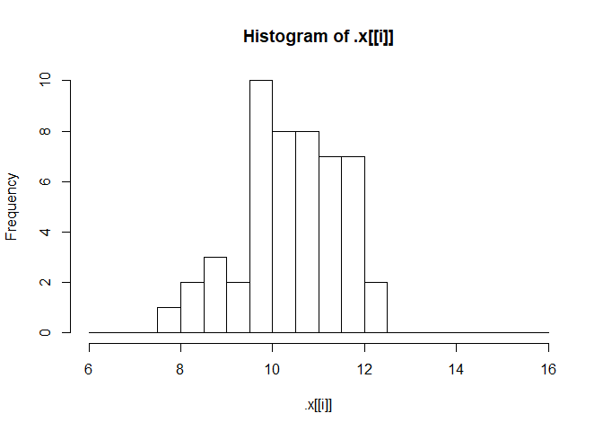
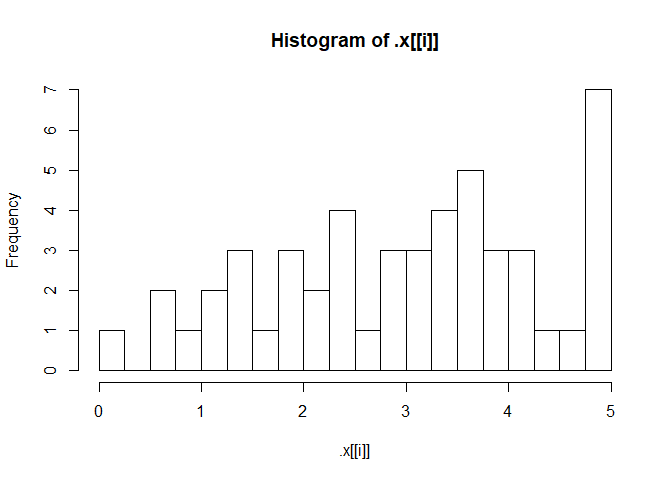
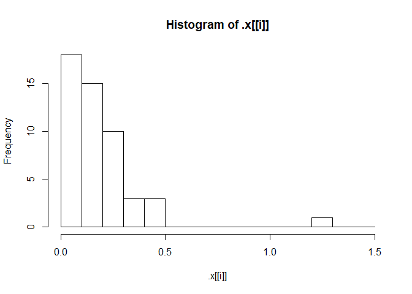

***
***
***
***
*************
#Introduction to R
*************
***
***
***
***
***

**Basic data types in R**
- Numeric (eg:4.5), Integers (eg:4), Boolean(eg: FALSE), characters(eg:"a") 

check variable type in r: class(variable_name)

If you want to check out the contents of the workspace, you can type ls() in the console.

This will give you a quick overview of the contents of a variable:summary(my_var)

## Vectors
are one-dimension arrays that can hold numeric data, character data, or logical data.In R, you create a vector with the combine function c(). You place the vector elements separated by a comma between the parentheses. For example:

numeric_vector <- c(1, 2, 3)
character_vector <- c("a", "b", "c")

You can give a name to the elements of a vector with the names() function. Have a look at this example:
some_vector <- c("John Doe", "poker player")
names(some_vector) <- c("Name", "Profession")

**sum()**

It calculates the sum of all elements of a vector. For example, to calculate the total amount of money you have lost/won with poker you do:

total_poker <- sum(poker_vector)

To select the first element of the vector, you type poker_vector[1] and so on.

Suppose you want to select the first and the fifth day of the week: use the vector c(1, 5) between the square brackets. For example, the code below selects the first and fifth element of poker_vector:

poker_vector[c(1, 5)]
c(2, 3, 4) can be abbreviated to 2:4.

Just like you did in the previous exercise with numerics, you can also use the element names to select multiple elements, for example:

poker_vector[c("Monday","Tuesday")]


## matrix 
is a collection of elements of the same data type (numeric, character, or logical) arranged into a fixed number of rows and columns. Since you are only working with rows and columns, a matrix is called two-dimensional.

You can construct a matrix in R with the matrix() function. Consider the following example:

matrix(1:9, byrow = TRUE, nrow = 3)

Similar to vectors, you can add names for the rows and the columns of a matrix

rownames(my_matrix) <- row_names_vector
colnames(my_matrix) <- col_names_vector

 rowSums() conveniently calculates the totals for each row of a matrix. This function creates a new vector:

rowSums(my_matrix)

You can add a column or multiple columns to a matrix with the cbind() function, which merges matrices and/or vectors together by column. For example:

big_matrix <- cbind(matrix1, matrix2, vector1 ...)

## factor 
To create factors in R, you make use of the function factor(). First thing that you have to do is create a vector that contains all the observations that belong to a limited number of categories. For example, sex_vector contains the sex of 5 different individuals:

sex_vector <- c("Male","Female","Female","Male","Male")
It is clear that there are two categories, or in R-terms 'factor levels', at work here: "Male" and "Female".

The function factor() will encode the vector as a factor:

factor_sex_vector <- factor(sex_vector)

temperature_vector <- c("High", "Low", "High","Low", "Medium")

factor_temperature_vector <- factor(temperature_vector, order = TRUE, levels = c("Low", "Medium", "High"))

## Data frame

You construct a data frame with the data.frame() function. As arguments, you pass the vectors from before: they will become the different columns of your data frame. Because every column has the same length, the vectors you pass should also have the same length. But don't forget that it is possible (and likely) that they contain different types of data.

name <- c("Mercury", "Venus", "Earth", "Mars", "Jupiter", "Saturn", "Uranus", "Neptune")

type <- c("Terrestrial planet", "Terrestrial planet", "Terrestrial planet", 
          "Terrestrial planet", "Gas giant", "Gas giant", "Gas giant", "Gas giant")

diameter <- c(0.382, 0.949, 1, 0.532, 11.209, 9.449, 4.007, 3.883)


** Create a data frame from the vectors**
planets_df <-data.frame(name,type,diameter)


** Select planets with diameter < 1**
subset(planets_df,subset=diameter<1)

order() is a function that gives you the ranked position of each element when it is applied on a variable, such as a vector for example:

> a <- c(100, 10, 1000)
> order(a)
[1] 2 1 3


** Sorting the data frame**

Use order() to create positions
positions <-  order(planets_df$diameter)

Use positions to sort planets_df
planets_df[positions,]


## Lists

A list in R is similar to your to-do list at work or school: the different items on that list most likely differ in length, characteristic, and type of activity that has to be done.

A list in R allows you to gather a variety of objects under one name (that is, the name of the list) in an ordered way. These objects can be matrices, vectors, data frames, even other lists, etc. It is not even required that these objects are related to each other in any way.

You could say that a list is some kind super data type: you can store practically any piece of information in it!

Construct list with these different elements:
my_list <- list(my_vector,my_matrix,my_df)


**Selecting elements from a list**

One way to select a component is using the numbered position of that component. For example, to "grab" the first component of shining_list you type

shining_list[[1]]
A quick way to check this out is typing it in the console. Important to remember: to select elements from vectors, you use single square brackets: [ ]. Don't mix them up!

You can also refer to the names of the components, with [[ ]] or with the $ sign. Both will select the data frame representing the reviews:

shining_list[["reviews"]]
shining_list$reviews
Besides selecting components, you often need to select specific elements out of these components. For example, with shining_list[[2]][1] you select from the second component, actors (shining_list[[2]]), the first element ([1]). When you type this in the console, you will see the answer is Jack Nicholson.

To conveniently add elements to lists you can use the c() function, that you also used to build vectors:

ext_list <- c(my_list , my_val)
This will simply extend the original list, my_list, with the component my_val. This component gets appended to the end of the list. If you want to give the new list item a name, you just add the name as you did before:

ext_list <- c(my_list, my_name = my_val)

***
***
***
***
*************
#Intermediate R
*************
***
***
***
***
***


## The if statement

if (condition1) {
  expr1
} else if (condition2) {
  expr2
} else if (condition3) {
  expr3
} else {
  expr4
}

## while loop and break

while (speed > 30) {
  print(paste("Your speed is", speed))
  
  # Break the while loop when speed exceeds 80
  if ( speed>80) {
    break
  }
}

## for loop over a vector

primes <- c(2, 3, 5, 7, 11, 13)

loop version 1
for (p in primes) {
  print(p)
}

loop version 2
for (i in 1:length(primes)) {
  print(primes[i])
}


## for loop over a list

primes_list <- list(2, 3, 5, 7, 11, 13)

loop version 1
for (p in primes_list) {
  print(p)
}

loop version 2
for (i in 1:length(primes_list)) {
  print(primes_list[[i]])
}


## Loop over a matrix

 The tic-tac-toe matrix ttt has already been defined for you
ttt
 define the double for loop
for (i in 1:nrow(ttt)) {
  for (j in 1:ncol(ttt)) {
    print(paste("On row", i, "and column", j, "the board contains", ttt[i,j]))
  }# Pre-defined variables


Loop over a string
rquote <- "r's internals are irrefutably intriguing"
chars <- strsplit(rquote, split = "")[[1]]

Initialize rcount
rcount <- 0

Finish the for loop

for (char in chars) {
  if(char=="r"){
    rcount<-rcount+1
      }else if (char=="u"){
break        
        }
              }
 
 print(rcount)
  
}

The break statement abandons the active loop: the remaining code in the loop is skipped and the loop is not iterated over anymore.
The next statement skips the remainder of the code in the loop, but continues the iteration.

## Functions

mean() function also has this argument, na.rm, and it does the exact same thing. By default, it is set to FALSE, as the Usage of the default S3 method shows:

mean(x, trim = 0, na.rm = FALSE, ...)

**Creating your own functions**

Create a function pow_two()
pow_two<- function(x){
  return(x*x)
}

## Packages

install.packages(), which as you can expect, installs a given package.
library() which loads packages, i.e. attaches them to the search list on your R workspace.

search(), to look at the currently attached packages and
qplot(mtcars$wt, mtcars$hp), to build a plot of two variables of the mtcars data frame.


## Apply functions

**lapply(X, FUN, ...)**

To put it generally, lapply takes a vector or list X, and applies the function FUN to each of its members. If FUN requires additional arguments, you pass them after you've specified X and FUN (...). The output of lapply() is a list, the same length as X, where each element is the result of applying FUN on the corresponding element of X.

split_low<-lapply(split_math,tolower)

** Use anonymous function inside lapply()**
lapply(list(1,2,3), function(x) { 3 * x })

** lapply with additional arguments**
multiply <- function(x, factor) {
  x * factor
}
lapply(list(1,2,3), multiply, factor = 3)


Suppose you want to display the structure of every element of a list. You could use the str() function for this, which returns NULL:

lapply(list(1, "a", TRUE), str)
This call actually returns a list, the same size as the input list, containing all NULL values. On the other hand calling

str(TRUE)
on its own prints only the structure of the logical to the console, not NULL. That's because str() uses invisible() behind the scenes, which returns an invisible copy of the return value, NULL in this case. This prevents it from being printed when the result of str() is not assigned.


**sapply()**
You can use sapply() similar to how you used lapply(). The first argument of sapply() is the list or vector X over which you want to apply a function, FUN. Potential additional arguments to this function are specified afterwards (...):

sapply(X, FUN, ...)

sapply function simplifies the output format wherever it can. else the result is same as lapply.


** vapply()**

vapply(X, FUN, FUN.VALUE, ..., USE.NAMES = TRUE)
Over the elements inside X, the function FUN is applied. The FUN.VALUE argument expects a template for the return argument of this function FUN. USE.NAMES is TRUE by default; in this case vapply() tries to generate a named array, if possible.

there are cases where the structure of the output of the function you want to apply, FUN, does not correspond to the template you specify in FUN.VALUE. In that case, vapply() will throw an error that informs you about the misalignment between expected and actual output

vapply(temp, basics, numeric(4))

As highlighted before, vapply() can be considered a more robust version of sapply(), because you explicitly restrict the output of the function you want to apply. Converting your sapply() expressions in your own R scripts to vapply() expressions is therefore a good practice (and also a breeze!).

**Convert to vapply() expression**
sapply(temp, function(x, y) { mean(x) > y }, y = 5)
vapply(temp, function(x, y) { mean(x) > y }, y = 5,logical(1))


## Utility functions

Reverse Elements
rev provides a reversed version of its argument.

seq(): Generate sequences, by specifying the from, to, and by arguments.
rep(): Replicate elements of vectors and lists.
sort(): Sort a vector in ascending order. Works on numerics, but also on character strings and logicals.
rev(): Reverse the elements in a data structures for which reversal is defined.
str(): Display the structure of any R object.
append(): Merge vectors or lists.
is.*(): Check for the class of an R object.
as.*(): Convert an R object from one class to another.
unlist(): Flatten (possibly embedded) lists to produce a vector.

eg:rep(seq(1, 7, by = 2), times = 7)
 output: 1 3 5 7 1 3 5 7 1 3 5 7 1 3 5 7 1 3 5 7 1 3 5 7 1 3 5 7


## Regular expressions

grepl & grep
In their most basic form, regular expressions can be used to see whether a pattern exists inside a character string or a vector of character strings. For this purpose, you can use:

grepl(), which returns TRUE when a pattern is found in the corresponding character string.
grep(), which returns a vector of indices of the character strings that contains the pattern.
Both functions need a pattern and an x argument, where pattern is the regular expression you want to match for, and the x argument is the character vector from which matches should be sought.

You can use the caret, ^, and the dollar sign, $ to match the content located in the start and end of a string, respectively. This could take us one step closer to a correct pattern for matching only the ".edu" email addresses from our list of emails. But there's more that can be added to make the pattern more robust:

@, because a valid email must contain an at-sign.

```r
# The emails vector has already been defined for you
emails <- c("john.doe@ivyleague.edu", "education@world.gov", "dalai.lama@peace.org",
            "invalid.edu", "quant@bigdatacollege.edu", "cookie.monster@sesame.tv")

# Use grepl() to match for .edu addresses more robustly
grepl("@.*\\.edu$",emails)
```

```
## [1]  TRUE FALSE FALSE FALSE  TRUE FALSE
```

```r
# Use grep() to match for .edu addresses more robustly, save result to hits
hits<-grep("@.*\\.edu$",emails)

# Subset emails using hits
emails[hits]
```

```
## [1] "john.doe@ivyleague.edu"   "quant@bigdatacollege.edu"
```
 
**sub & gsub**
While grep() and grepl() were used to simply check whether a regular expression could be matched with a character vector, sub() and gsub() take it one step further: you can specify a replacement argument. If inside the character vector x, the regular expression pattern is found, the matching element(s) will be replaced with replacement.sub() only replaces the first match, whereas gsub() replaces all matches.


```r
# The emails vector has already been defined for you
emails <- c("john.doe@ivyleague.edu", "education@world.gov", "global@peace.org",
            "invalid.edu", "quant@bigdatacollege.edu", "cookie.monster@sesame.tv")

# Use sub() to convert the email domains to datacamp.edu
sub("@.*\\.edu$","@datacamp.edu",emails)
```

```
## [1] "john.doe@datacamp.edu"    "education@world.gov"     
## [3] "global@peace.org"         "invalid.edu"             
## [5] "quant@datacamp.edu"       "cookie.monster@sesame.tv"
```

## Time in R

In R, dates are represented by Date objects, while times are represented by POSIXct objects. Under the hood, however, these dates and times are simple numerical values. Date objects store the number of days since the 1st of January in 1970. POSIXct objects on the other hand, store the number of seconds since the 1st of January in 1970.


```r
# Get the current date: today
today<-Sys.Date()

# See what today looks like under the hood
unclass(today)
```

```
## [1] 17944
```

```r
# Get the current time: now
now<-Sys.time()

# See what now looks like under the hood
unclass(now)
```

```
## [1] 1550472121
```

Create and format dates
To create a Date object from a simple character string in R, you can use the as.Date() function. The character string has to obey a format that can be defined using a set of symbols (the examples correspond to 13 January, 1982):

%Y: 4-digit year (1982)
%y: 2-digit year (82)
%m: 2-digit month (01)
%d: 2-digit day of the month (13)
%A: weekday (Wednesday)
%a: abbreviated weekday (Wed)
%B: month (January)
%b: abbreviated month (Jan)

 default R matches your character string to the formats "%Y-%m-%d" or "%Y/%m/%d".


```r
# Definition of character strings representing dates
str1 <- "May 23, '96"
str2 <- "2012-03-15"
str3 <- "30/January/2006"

# Convert the strings to dates: date1, date2, date3
date1 <- as.Date(str1, format = "%b %d, '%y")
date2<-as.Date(str2)
date3<-as.Date(str3,format="%d/%B/%Y")

# Convert dates to formatted strings
format(date1, "%A")
```

```
## [1] "Thursday"
```

```r
format(date2, "%d")
```

```
## [1] "15"
```

```r
format(date3, "%b %Y")
```

```
## [1] "Jan 2006"
```

Create and format times
Similar to working with dates, you can use as.POSIXct() to convert from a character string to a POSIXct object, and format() to convert from a POSIXct object to a character string. Again, you have a wide variety of symbols:

%H: hours as a decimal number (00-23)
%I: hours as a decimal number (01-12)
%M: minutes as a decimal number
%S: seconds as a decimal number
%T: shorthand notation for the typical format %H:%M:%S
%p: AM/PM indicator
For a full list of conversion symbols, consult the strptime documentation in the console:

?strptime
Again,as.POSIXct() uses a default format to match character strings. In this case, it's %Y-%m-%d %H:%M:%S. In this exercise, abstraction is made of different time zones.


```r
# Definition of character strings representing times
str1 <- "May 23, '96 hours:23 minutes:01 seconds:45"
str2 <- "2012-3-12 14:23:08"

# Convert the strings to POSIXct objects: time1, time2
time1 <- as.POSIXct(str1, format = "%B %d, '%y hours:%H minutes:%M seconds:%S")
time2<-as.POSIXct(str2)

# Convert times to formatted strings
format(time1,"%M")
```

```
## [1] "01"
```

```r
format(time2,"%I:%M %p")
```

```
## [1] "02:23 PM"
```
***
***
***
***
*************
#Tidyverse
*************
***
***
***
***
***

**Filtering**

library(dplyr)

eg: Filter for China in 2002
gapminder %>% filter(year==2002, country=="China")

**Arranging**

Sort in ascending order of lifeExp
gapminder %>% arrange(lifeExp)

  
Sort in descending order of lifeExp
gapminder %>% arrange(desc(lifeExp))


Filter for the year 1957, then arrange in descending order of population
gapminder %>% filter(year==1957) %>% arrange(desc(pop))

Use mutate to change lifeExp to be in months
gapminder %>% mutate(lifeExp=lifeExp*12)

Change this plot to put the x-axis on a log scale
ggplot(gapminder_1952, aes(x = pop, y = lifeExp)) +
  geom_point()+scale_x_log10()
  
Scatter plot comparing gdpPercap and lifeExp, with color representing continent
and size representing population, faceted by year
ggplot(gapminder,aes(x=gdpPercap,y=lifeExp,color=continent,size=pop))+geom_point()+
scale_x_log10()+facet_wrap(~year)

Summarize to find the median life expectancy
gapminder %>% summarize(medianLifeExp=median(lifeExp))

Find median life expectancy and maximum GDP per capita in each year
gapminder %>% group_by(year) %>% summarize(medianLifeExp=median(lifeExp),
maxGdpPercap=max(gdpPercap))

Be sure to add expand_limits(y = 0) to make sure the plot's y-axis includes zero.

Add a title to this graph: "Comparing GDP per capita across continents"
ggplot(gapminder_1952, aes(x = continent, y = gdpPercap)) +
  geom_boxplot() +ggtitle("Comparing GDP per capita across continents")
  scale_y_log10()
  
  
***
***
***
***
*************
# Importing data in R (part1)
*************
***
***
***
***
***

read.csv
The utils package, which is automatically loaded in your R session on startup, can import CSV files with the read.csv() function.

stringsAsFactors
With stringsAsFactors, you can tell R whether it should convert strings in the flat file to factors.

For all importing functions in the utils package, this argument is TRUE, which means that you import strings as factors. This only makes sense if the strings you import represent categorical variables in R. If you set stringsAsFactors to FALSE, the data frame columns corresponding to strings in your text file will be character.


Import swimming_pools.csv correctly: pools
pools<-read.csv("swimming_pools.csv",stringsAsFactors=FALSE)

Check the structure of pools
str(pools)

read.delim
Aside from .csv files, there are also the .txt files which are basically text files. You can import these functions with read.delim(). By default, it sets the sep argument to "\t" (fields in a record are delimited by tabs) and the header argument to TRUE (the first row contains the field names).


read.table
If you're dealing with more exotic flat file formats, you'll want to use read.table(). It's the most basic importing function; you can specify tons of different arguments in this function. Unlike read.csv() and read.delim(), the header argument defaults to FALSE and the sep argument is "" by default.

Path to the hotdogs.txt file: path
path <- file.path("data", "hotdogs.txt")

Import the hotdogs.txt file: hotdogs
hotdogs <- read.table(path, 
                      sep= "", 
                      col.names = c("type", "calories", "sodium"))

Call head() on hotdogs
head(hotdogs)


Finish the read.delim() call
hotdogs <- read.delim("hotdogs.txt", header = FALSE, col.names = c("type", "calories", "sodium"))

Select the hot dog with the least calories: lily
lily <- hotdogs[which.min(hotdogs$calories), ]

Select the observation with the most sodium: tom
tom<-hotdogs[which.max(hotdogs$sodium),]

Column classes
Next to column names, you can also specify the column types or column classes of the resulting data frame. You can do this by setting the colClasses argument to a vector of strings representing classes:

read.delim("my_file.txt", 
           colClasses = c("character",
                          "numeric",
                          "logical"))
                          
                          
read_tsv
Where you use read_csv() to easily read in CSV files, you use read_tsv() to easily read in TSV files. TSV is short for tab-separated values.

This time, the potatoes data comes in the form of a tab-separated values file; potatoes.txt is available in your workspace. In contrast to potatoes.csv, this file does not contain columns names in the first row, though.

There's a vector properties that you can use to specify these column names manually.


```r
# readr is already loaded

# Column names
properties <- c("area", "temp", "size", "storage", "method",
                "texture", "flavor", "moistness")

# Import potatoes.txt: potatoes
# potatoes<-read_tsv("potatoes.txt",col_names=properties)

# Call head() on potatoes
#head(potatoes)
```

**read_delim**
Just as read.table() was the main utils function, read_delim() is the main readr function.

read_delim() takes two mandatory arguments:

file: the file that contains the data
delim: the character that separates the values in the data file


eg:

```r
# readr is already loaded

# Column names
properties <- c("area", "temp", "size", "storage", "method",
                "texture", "flavor", "moistness")

# Import potatoes.txt using read_delim(): potatoes
#potatoes<-read_delim("potatoes.txt",delim="\t",col_names=properties)
```


skip and n_max
Through skip and n_max you can control which part of your flat file you're actually importing into R.

skip specifies the number of lines you're ignoring in the flat file before actually starting to import data.
n_max specifies the number of lines you're actually importing.
Say for example you have a CSV file with 20 lines, and set skip = 2 and n_max = 3, you're only reading in lines 3, 4 and 5 of the file.

Watch out: Once you skip some lines, you also skip the first line that can contain column names!


```r
# Import 5 observations from potatoes.txt: potatoes_fragment
#potatoes_fragment <- read_tsv("potatoes.txt", skip = 6, n_max = 5, col_names = properties)
```

col_types
You can also specify which types the columns in your imported data frame should have. You can do this with col_types. If set to NULL, the default, functions from the readr package will try to find the correct types themselves. You can manually set the types with a string, where each character denotes the class of the column: character, double, integer and logical. _ skips the column as a whole.


```r
# readr is already loaded

# Column names
properties <- c("area", "temp", "size", "storage", "method",
                "texture", "flavor", "moistness")

# Import all data, but force all columns to be character: potatoes_char
# potatoes_char <- read_tsv("potatoes.txt", col_types = "cccccccc", col_names = properties)
```

col_types with collectors
Another way of setting the types of the imported columns is using collectors. Collector functions can be passed in a list() to the col_types argument of read_ functions to tell them how to interpret values in a column.

For a complete list of collector functions, you can take a look at the collector documentation. For this exercise you will need two collector functions:

col_integer(): the column should be interpreted as an integer.
col_factor(levels, ordered = FALSE): the column should be interpreted as a factor with levels.


```r
# readr is already loaded

# The collectors you will need to import the data
# fac <- col_factor(levels = c("Beef", "Meat", "Poultry"))
# int <- col_integer()

# Edit the col_types argument to import the data correctly: hotdogs_factor
# hotdogs_factor <- read_tsv("hotdogs.txt",
#                           col_names = c("type", "calories", "sodium"),
#                           col_types = list(fac,int, int))
```
fread
You still remember how to use read.table(), right? Well, fread() is a function that does the same job with very similar arguments. It is extremely easy to use and blazingly fast!


```r
# load the data.table package
library(data.table)

# Import potatoes.csv with fread(): potatoes
# potatoes<-fread('potatoes.csv')
```
Now that you know the basics about fread(), you should know about two arguments of the function: drop and select, to drop or select variables of interest.

Suppose you have a dataset that contains 5 variables and you want to keep the first and fifth variable, named "a" and "e". The following options will all do the trick:

fread("path/to/file.txt", drop = 2:4)
fread("path/to/file.txt", select = c(1, 5))
fread("path/to/file.txt", drop = c("b", "c", "d"))
fread("path/to/file.txt", select = c("a", "e"))

# Importing excel

find out which sheets are available in the workbook. You can use the excel_sheets() function for this.


```r
# Load the readxl package
library(readxl)
```

```
## Warning: package 'readxl' was built under R version 3.5.2
```

```r
# Print the names of all worksheets
# excel_sheets("urbanpop.xlsx")
```

data <- read_excel("data.xlsx", sheet = "my_sheet")
This call simply imports the sheet with the name "my_sheet" from the "data.xlsx" file. You can also pass a number to the sheet argument; this will cause read_excel() to import the sheet with the given sheet number. sheet = 1 will import the first sheet, sheet = 2 will import the second sheet, and so on.

my_workbook <- lapply(excel_sheets("data.xlsx"),
                      read_excel,
                      path = "data.xlsx")
                      
The read_excel() function is called multiple times on the "data.xlsx" file and each sheet is loaded in one after the other. The result is a list of data frames, each data frame representing one of the sheets in data.xlsx.


```r
# The readxl package is already loaded

# Read all Excel sheets with lapply(): pop_list
# pop_list=lapply(excel_sheets("urbanpop.xlsx"),read_excel,path="urbanpop.xlsx")
```
The col_names argument
Apart from path and sheet, there are several other arguments you can specify in read_excel(). One of these arguments is called col_names.

By default it is TRUE, denoting whether the first row in the Excel sheets contains the column names. If this is not the case, you can set col_names to FALSE. In this case, R will choose column names for you. You can also choose to set col_names to a character vector with names for each column. It works exactly the same as in the readr package.


```r
# The readxl package is already loaded

# Import the first Excel sheet of urbanpop_nonames.xlsx (R gives names): pop_a
# pop_a=read_excel("urbanpop_nonames.xlsx",col_names=FALSE)

# Import the first Excel sheet of urbanpop_nonames.xlsx (specify col_names): pop_b
cols <- c("country", paste0("year_", 1960:1966))
# pop_b=read_excel("urbanpop_nonames.xlsx",col_names=cols)
```

The skip argument
Another argument that can be very useful when reading in Excel files that are less tidy, is skip. With skip, you can tell R to ignore a specified number of rows inside the Excel sheets you're trying to pull data from. Have a look at this example:

read_excel("data.xlsx", skip = 15)
In this case, the first 15 rows in the first sheet of "data.xlsx" are ignored.


```r
# The readxl package is already loaded

# Import the second sheet of urbanpop.xlsx, skipping the first 21 rows: urbanpop_sel
# urbanpop_sel<-read_excel('urbanpop.xlsx',sheet=2,col_names=FALSE, skip=21)
```


```r
# Load the gdata package
library(gdata)
```

```
## Warning: package 'gdata' was built under R version 3.5.2
```

```
## gdata: Unable to locate valid perl interpreter
## gdata: 
## gdata: read.xls() will be unable to read Excel XLS and XLSX files
## gdata: unless the 'perl=' argument is used to specify the location
## gdata: of a valid perl intrpreter.
## gdata: 
## gdata: (To avoid display of this message in the future, please
## gdata: ensure perl is installed and available on the executable
## gdata: search path.)
```

```
## gdata: Unable to load perl libaries needed by read.xls()
## gdata: to support 'XLX' (Excel 97-2004) files.
```

```
## 
```

```
## gdata: Unable to load perl libaries needed by read.xls()
## gdata: to support 'XLSX' (Excel 2007+) files.
```

```
## 
```

```
## gdata: Run the function 'installXLSXsupport()'
## gdata: to automatically download and install the perl
## gdata: libaries needed to support Excel XLS and XLSX formats.
```

```
## 
## Attaching package: 'gdata'
```

```
## The following objects are masked from 'package:data.table':
## 
##     first, last
```

```
## The following object is masked from 'package:stats':
## 
##     nobs
```

```
## The following object is masked from 'package:utils':
## 
##     object.size
```

```
## The following object is masked from 'package:base':
## 
##     startsWith
```

```r
# Import the second sheet of urbanpop.xls: urban_pop
# urban_pop=read.xls('urbanpop.xls',sheet=2)
```
Connect to a workbook
When working with XLConnect, the first step will be to load a workbook in your R session with loadWorkbook(); this function will build a "bridge" between your Excel file and your R session.


```r
# urbanpop.xlsx is available in your working directory

# Load the XLConnect package
# library(XLConnect)

# Build connection to urbanpop.xlsx: my_book
# my_book<-loadWorkbook('urbanpop.xlsx')

# Print out the class of my_book
# class(my_book)
```
Just as readxl and gdata, you can use XLConnect to import data from Excel file into R.

To list the sheets in an Excel file, use getSheets(). To actually import data from a sheet, you can use readWorksheet(). Both functions require an XLConnect workbook object as the first argument.


```r
# XLConnect is already available

# Build connection to urbanpop.xlsx
# my_book <- loadWorkbook("urbanpop.xlsx")

# List the sheets in my_book
# getSheets(my_book)

# Import the second sheet in my_book
# readWorksheet(my_book, sheet=2)

# Import columns 3, 4, and 5 from second sheet in my_book: urbanpop_sel
# urbanpop_sel <- readWorksheet(my_book, sheet = 2,startCol=3, endCol=5)

# Import first column from second sheet in my_book: countries
# countries<-readWorksheet(my_book,sheet=2, startCol=1, endCol=1)

# cbind() urbanpop_sel and countries together: selection
# selection<-cbind(countries,urbanpop_sel)
```

Add worksheet
Where readxl and gdata were only able to import Excel data, XLConnect's approach of providing an actual interface to an Excel file makes it able to edit your Excel files from inside R


```r
# Add a worksheet to my_book, named "data_summary"
# createSheet(my_book,name="data_summary")

# Use getSheets() on my_book
# getSheets(my_book)
```

Populate worksheet
The first step of creating a sheet is done; let's populate it with some data now! summ, a data frame with some summary statistics on the two Excel sheets is already coded so you can take it from there.


```r
# XLConnect is already available

# Build connection to urbanpop.xlsx
# my_book <- loadWorkbook("urbanpop.xlsx")

# Add a worksheet to my_book, named "data_summary"
# createSheet(my_book, "data_summary")

# Create data frame: summ
# sheets <- getSheets(my_book)[1:3]
# dims <- sapply(sheets, function(x) dim(readWorksheet(my_book, sheet = x)), USE.NAMES = FALSE)
# summ <- data.frame(sheets = sheets,
  #                 nrows = dims[1, ],
   #                ncols = dims[2, ])

# Add data in summ to "data_summary" sheet
# writeWorksheet(my_book,summ,sheet="data_summary")

# Save workbook as summary.xlsx
# saveWorkbook(my_book,"summary.xlsx")
```

Renaming sheets
Come to think of it, "data_summary" is not an ideal name. As the summary of these excel sheets is always data-related, you simply want to name the sheet "summary".


```r
# my_book is available

# Rename "data_summary" sheet to "summary"
# renameSheet(my_book,"data_Summary","summary")

# Print out sheets of my_book
# getSheets(my_book)

# Save workbook to "renamed.xlsx"
# saveWorkbook(my_book,"renamed.xlsx")
```
Removing sheets
After presenting the new Excel sheet to your peers, it appears not everybody is a big fan. Why summarize sheets and store the info in Excel if all the information is implicitly available? To hell with it, just remove the entire fourth sheet!


```r
# Remove the fourth sheet
# removeSheet(my_book,"summary")


# Save workbook to "clean.xlsx"
# saveWorkbook(my_book,"clean.xlsx")
```


***
***
***
***
*************
# Importing data in R (part2)
*************
***
***
***
***
***


# Importing data from databases
The first step to import data from a SQL database is creating a connection to it. 
dbConnect() creates a connection between your R session and a SQL database. The first argument has to be a DBIdriver object, that specifies how connections are made and how data is mapped between R and the database. Specifically for MySQL databases, you can build such a driver with RMySQL::MySQL().

If the MySQL database is a remote database hosted on a server, you'll also have to specify the following arguments in dbConnect(): dbname, host, port, user and password. Most of these details have already been provided.


```r
# Load the DBI package
library("DBI")
```

```
## Warning: package 'DBI' was built under R version 3.5.2
```

```r
# Edit dbConnect() call
#con <- dbConnect(RMySQL::MySQL(), 
          #       dbname = "tweater", 
           #      host = "courses.csrrinzqubik.us-east-1.rds.amazonaws.com", 
            #     port = 3306,
             #    user = "student",
              #   password = "datacamp")
```

List the database tables
After you've successfully connected to a remote MySQL database, the next step is to see what tables the database contains. You can do this with the dbListTables() function.


```r
# Build a vector of table names: tables
# tables<-dbListTables(con)
```

Import users
The database contains data on a more tasty version of Twitter, namely Tweater.  There are three tables: users, tweats, and comments that have relations among them. 
Let's start by importing the data on the users into your R session. You do this with the dbReadTable() function. Simply pass it the connection object (con), followed by the name of the table you want to import. The resulting object is a standard R data frame.


```r
# Import the users table from tweater: users
# users<-dbReadTable(con,"users")
```

Finish the lapply() function to import the users, tweats and comments tables in a single call. The result, a list of data frames, will be stored in the variable tables.


```r
# Get table names
# table_names <- dbListTables(con)

# Import all tables
# tables <- lapply(table_names, dbReadTable, conn = con)
```

 it's a good idea to send SQL queries to your database, and only import the data you actually need into R.

dbGetQuery() is what you need. As usual, you first pass the connection object to it. The second argument is an SQL query in the form of a character string. This example selects the age variable from the people dataset where gender equals "male":

dbGetQuery(con, "SELECT age FROM people WHERE gender = 'male'")
A connection to the tweater database has already been coded for you.


```r
# Import tweat_id column of comments where user_id is 1: elisabeth
# elisabeth<- dbGetQuery(con, "select tweat_id from comments where user_id=1")


# Create a data frame, short, that selects the id and name columns from the users table where the number of characters in the name is strictly less than 5.
# short<-dbGetQuery(con,"select id, name from users where char_length(name)<5")
```

*Send - Fetch - Clear*

You've used dbGetQuery() multiple times now. This is a virtual function from the DBI package, but is actually implemented by the RMySQL package. Behind the scenes, the following steps are performed:

Sending the specified query with dbSendQuery();
Fetching the result of executing the query on the database with dbFetch();
Clearing the result with dbClearResult().
Let's not use dbGetQuery() this time and implement the steps above. This is tedious to write, but it gives you the ability to fetch the query's result in chunks rather than all at once. You can do this by specifying the n argument inside dbFetch().

*Connect to the database*
library(DBI)
con <- dbConnect(RMySQL::MySQL(),
                 dbname = "tweater",
                 host = "courses.csrrinzqubik.us-east-1.rds.amazonaws.com",
                 port = 3306,
                 user = "student",
                 password = "datacamp")

*Send query to the database*
res <- dbSendQuery(con, "SELECT * FROM comments WHERE user_id > 4")

Use dbFetch() twice. In the first call, import only two records of the query result by setting the n argument to 2. In the second call, import all remaining queries (don't specify n). In both calls, simply print the resulting data frames.

*Use dbFetch() twice*
dbFetch(res,n=2)
dbFetch(res)


*Clear res with dbClearResult().*
dbClearResult(res)

Every time you connect to a database using dbConnect(), you're creating a new connection to the database you're referencing. RMySQL automatically specifies a maximum of open connections and closes some of the connections for you, but still: it's always polite to manually disconnect from the database afterwards. You do this with the dbDisconnect() function.

*Disconnect from the database*
dbDisconnect(con)


# Importing data from web


```r
# Load the readr package
library(readr)
```

```
## Warning: package 'readr' was built under R version 3.5.2
```

```r
# Import the csv file: pools
url_csv <- "http://s3.amazonaws.com/assets.datacamp.com/production/course_1478/datasets/swimming_pools.csv"


# Import the txt file: potatoes
url_delim <- "http://s3.amazonaws.com/assets.datacamp.com/production/course_1478/datasets/potatoes.txt"
# pools<-read_csv(url_csv)
# potatoes<-read_tsv(url_delim)
```

Load the readxl and gdata package
library(readxl)
library(gdata)

Specification of url: url_xls
url_xls <- "http://s3.amazonaws.com/assets.datacamp.com/production/course_1478/datasets/latitude.xls"

Import the .xls file with gdata: excel_gdata
excel_gdata<-read.xls(url_xls)

Download file behind URL, name it local_latitude.xls
download.file(url_xls,'local_latitude.xls')

Import the local .xls file with readxl: excel_readxl
excel_readxl<-read_excel('local_latitude.xls')


*Downloading other types of files*

There's more: with download.file() you can download any kind of file from the web, using HTTP and HTTPS: images, executable files, but also .RData files. An RData file is very efficient format to store R data.


```r
# https URL to the wine RData file.
url_rdata <- "https://s3.amazonaws.com/assets.datacamp.com/production/course_1478/datasets/wine.RData"

# Download the wine file to your working directory
download.file(url_rdata, "wine_local.RData")

# Load the wine data into your workspace using load()
# load("wine_local.RData")

# Print out the summary of the wine data
# summary(wine)
```

Downloading a file from the Internet means sending a GET request and receiving the file you asked for. Internally, all the previously discussed functions use a GET request to download files.

httr provides a convenient function, GET() to execute this GET request. The result is a response object, that provides easy access to the status code, content-type and, of course, the actual content.


```r
# Load the httr package
library(httr)
```

```
## Warning: package 'httr' was built under R version 3.5.2
```

```r
# Get the url, save response to resp
# url <- "http://www.example.com/"
# resp<-GET(url)

# Print resp
# resp

# Get the raw content of resp: raw_content
# raw_content<-content(resp,as="raw")

# Print the head of raw_content
# head(raw_content)
```

From JSON to R
In the simplest setting, fromJSON() can convert character strings that represent JSON data into a nicely structured R list.


```r
library(jsonlite)

# wine_json is a JSON
wine_json <- '{"name":"Chateau Migraine", "year":1997, "alcohol_pct":12.4, "color":"red", "awarded":false}'

# Convert wine_json into a list: wine
wine<-fromJSON(wine_json)
```
Change the assignment of json1 such that the R vector after conversion contains the numbers 1 up to 6, in ascending order. Next, call fromJSON() on json1.

Adapt the code for json2 such that it's converted to a named list with two elements: a, containing the numbers 1, 2 and 3 and b, containing the numbers 4, 5 and 6. Next, call fromJSON() on json2.

```r
# jsonlite is already loaded

# Challenge 1
json1 <- '[1, 2,3, 4,5, 6]'
fromJSON(json1)
```

```
## [1] 1 2 3 4 5 6
```

```r
# Challenge 2
json2 <- '{"a": [1, 2, 3],"b":[4,5,6]}'
fromJSON(json2)
```

```
## $a
## [1] 1 2 3
## 
## $b
## [1] 4 5 6
```
Remove characters from json1 to build a 2 by 2 matrix containing only 1, 2, 3 and 4. Call fromJSON() on json1.
Add characters to json2 such that the data frame in which the json is converted contains an additional observation in the last row. For this observations, a equals 5 and b equals 6. Call fromJSON() one last time, on json2.


```r
# jsonlite is already loaded

# Challenge 1
json1 <- '[[1, 2], [3, 4]]'
fromJSON(json1)
```

```
##      [,1] [,2]
## [1,]    1    2
## [2,]    3    4
```

```r
# Challenge 2
json2 <- '[{"a": 1, "b": 2}, {"a": 3, "b": 4},{"a":5,"b":6}]'
fromJSON(json2)
```

```
##   a b
## 1 1 2
## 2 3 4
## 3 5 6
```

Apart from converting JSON to R with fromJSON(), you can also use toJSON() to convert R data to a JSON format. In its most basic use, you simply pass this function an R object to convert to a JSON. The result is an R object of the class json, which is basically a character string representing that JSON.


```r
# Convert the data file according to the requirements
# water_json<-toJSON(water)
```

Minify and prettify
JSONs can come in different formats. Take these two JSONs, that are in fact exactly the same: the first one is in a minified format, the second one is in a pretty format with indentation, whitespace and new lines:

 Mini
{"a":1,"b":2,"c":{"x":5,"y":6}}

 Pretty
{
  "a": 1,
  "b": 2,
  "c": {
    "x": 5,
    "y": 6
  }
}
Unless you're a computer, you surely prefer the second version. However, the standard form that toJSON() returns, is the minified version, as it is more concise. You can adapt this behavior by setting the pretty argument inside toJSON() to TRUE. If you already have a JSON string, you can use prettify() or minify() to make the JSON pretty or as concise as possible.


```r
# jsonlite is already loaded

# Convert mtcars to a pretty JSON: pretty_json
# pretty_json<-toJSON(mtcars,pretty=TRUE)

# Print pretty_json
# pretty_json

# Minify pretty_json: mini_json
# mini_json<-minify(pretty_json)

# Print mini_json
# mini_json
```


# Importing data from statistical softwares

Import SAS data with haven
haven is an extremely easy-to-use package to import data from three software packages: SAS, STATA and SPSS. Depending on the software, you use different functions:

SAS: read_sas()
STATA: read_dta() (or read_stata(), which are identical)
SPSS: read_sav() or read_por(), depending on the file type.
All these functions take one key argument: the path to your local file. In fact, you can even pass a URL; haven will then automatically download the file for you before importing it.


```r
# Load the haven package
library(haven)
```

```
## Warning: package 'haven' was built under R version 3.5.2
```

```r
# Import sales.sas7bdat: sales
# sales<-read_sas('sales.sas7bdat')

# Display the structure of sales
# str(sales)
```

Import STATA data with haven
Next up are STATA data files; you can use read_dta() for these.

When inspecting the result of the read_dta() call, you will notice that one column will be imported as a labelled vector, an R equivalent for the common data structure in other statistical environments. In order to effectively continue working on the data in R, it's best to change this data into a standard R class. To convert a variable of the class labelled to a factor, you'll need haven's as_factor() function.


```r
# haven is already loaded

# Import the data from the URL: sugar
# sugar<-read_dta('http://assets.datacamp.com/production/course_1478/datasets/trade.dta')

# Structure of sugar
# str(sugar)

# Convert values in Date column to dates
# sugar$Date<-as.Date(as_factor(sugar$Date))
```

Import SPSS data with haven
The haven package can also import data files from SPSS. Again, importing the data is pretty straightforward. Depending on the SPSS data file you're working with, you'll need either read_sav() - for .sav files - or read_por() - for .por files.


```r
# haven is already loaded

# Import person.sav: traits
# traits<-read_sav('person.sav')

# foreign is already loaded

# Import international.sav as a data frame: demo
# demo<-read.spss('international.sav',to.data.frame=TRUE)
```
Import STATA data with foreign 

The foreign package offers a simple function to import and read STATA data: read.dta().


```r
# Load the foreign package
library(foreign)

# Import florida.dta and name the resulting data frame florida
# florida<-read.dta('florida.dta')
```

***
***
***
***
*************
# Cleaning data in R 
*************
***
***
***
***
***


Getting a feel for your data

Check the class of bmi
class(bmi)

Check the dimensions of bmi
dim(bmi)

View the column names of bmi
names(bmi)

 glimpse() 
 function from dplyr is a slightly cleaner alternative to str(). str() and glimpse() give you a preview of your data, which may reveal issues with the way columns are labelled, how variables are encoded, etc.


Check the structure of bmi
str(bmi)

Load dplyr
library(dplyr)

Check the structure of bmi, the dplyr way
glimpse(bmi)


View a summary of bmi
summary(bmi)

Visualizing your data

Histogram of BMIs from 2008
hist(bmi$Y2008)

Scatter plot comparing BMIs from 1980 to those from 2008
plot(bmi$Y1980,bmi$Y2008)


*Tidy data- tidyr*


Gathering columns into key-value pairs
The most important function in tidyr is gather(). It should be used when you have columns that are not variables and you want to collapse them into key-value pairs.

Apply the gather() function to bmi, saving the result to bmi_long. This will create two new columns:
year, containing as values what are currently column headers
bmi_val, the actual BMI values

Apply gather() to bmi and save the result as bmi_long
bmi_long <- gather(bmi, year, bmi_val, -Country)

View the first 20 rows of the result
head(bmi_long,20)


Spreading key-value pairs into columns
The opposite of gather() is spread(), which takes key-values pairs and spreads them across multiple columns. This is useful when values in a column should actually be column names (i.e. variables). It can also make data more compact and easier to read.

spread(long_df, my_key, my_val)


Separating columns
The separate() function allows you to separate one column into multiple columns. Unless you tell it otherwise, it will attempt to separate on any character that is not a letter or number. You can also specify a specific separator using the sep argument.


```r
# Apply separate() to bmi_cc
# bmi_cc_clean <- separate(bmi_cc, col = Country_ISO, into = c("Country", "ISO"), sep = "/")
```


Uniting columns
The opposite of separate() is unite(), which takes multiple columns and pastes them together. By default, the contents of the columns will be separated by underscores in the new column, but this behavior can be altered via the sep argument.

We've loaded the treatments data into your workspace again, but this time the year_mo column has been separated into year and month. The original column can be recreated by putting year and month back together:

unite(treatments, year_mo, year, month)


```r
# Apply unite() to bmi_cc_clean
# bmi_cc <- unite(bmi_cc_clean, Country_ISO, c('Country','ISO'), sep = "-")
```


*Spread the columns*


```r
## tidyr is already loaded for you

# View first 50 rows of census_long
# head(census_long,50)
# str(census_long)

# Spread the type column
# census_long2 <- spread(census_long,type,amount)

# View first 20 rows of census_long2
# head(census_long2,20)
```


*Conversion of variable types*

Make this evaluate to "character"
class(as.character(TRUE))

Make this evaluate to "numeric"
class(as.numeric("8484.00"))

Make this evaluate to "integer"
class(as.integer(99))

Make this evaluate to "factor"
class(as.factor("factor"))


*Working with dates*

Dates can be a challenge to work with in any programming language, but thanks to the lubridate package, working with dates in R isn't so bad. Since this course is about cleaning data, we only cover the most basic functions from lubridate to help us standardize the format of dates and times in our data.

As you saw in the video, these functions combine the letters y, m, d, h, m, s, which stand for year, month, day, hour, minute, and second, respectively. The order of the letters in the function should match the order of the date/time you are attempting to read in, although not all combinations are valid. 


```r
# Load the lubridate package
# library(lubridate)

# Parse as date
# dmy("17 Sep 2015")

# Parse as date and time (with no seconds!)
# mdy_hm("July 15, 2012 12:56")

# Coerce dob to a date (with no time)
# students2$dob <- ymd(students2$dob)

# Coerce nurse_visit to a date and time
# students2$nurse_visit <- ymd_hms(students2$nurse_visit)
```


*Trimming and padding strings*

One common issue that comes up when cleaning data is the need to remove leading and/or trailing white space. The str_trim() function from stringr makes it easy to do this while leaving intact the part of the string that you actually want.

 str_trim("  this is a test     ")
[1] "this is a test"
A similar issue is when you need to pad strings to make them a certain number of characters wide. One example is if you had a bunch of employee ID numbers, some of which begin with one or more zeros. When reading these data in, you find that the leading zeros have been dropped somewhere along the way (probably because the variable was thought to be numeric and in that case, leading zeros would be unnecessary.)

 str_pad("24493", width = 7, side = "left", pad = "0")
[1] "0024493"

*Upper and lower case*

In addition to trimming and padding strings, you may need to adjust their case from time to time. Making strings uppercase or lowercase is very straightforward in (base) R thanks to toupper() and tolower(). Each function takes exactly one argument: the character string (or vector/column of strings) to be converted to the desired case.

*Finding and replacing strings*

The stringr package provides two functions that are very useful for finding and/or replacing patterns in strings: str_detect() and str_replace().

Like all functions in stringr, the first argument of each is the string of interest. The second argument of each is the pattern of interest. In the case of str_detect(), this is the pattern we are searching for. In the case of str_replace(), this is the pattern we want to replace. Finally, str_replace() has a third argument, which is the string to replace with.


```r
# Detect all dates of birth (dob) in 1997
# str_detect(students3$dob,"1997")

# In the sex column, replace "F" with "Female" ...
# students3$sex <- str_replace(students3$sex,"F","Female")

# ... and "M" with "Male"
# students3$sex <- str_replace(students3$sex,"M","Male") 
```

*Finding missing values*

Call is.na() on the full social_df to spot all NAs
is.na(social_df)

Use the any() function to ask whether there are any NAs in the data
any(is.na(social_df))

View a summary() of the dataset
summary(social_df)

Call table() on the status column
table(social_df$status)

*Dealing with missing values*

The stringr package is preloaded.

Use complete.cases() to see which rows have no missing values
complete.cases(social_df)

Use na.omit() to remove all rows with any missing values
na.omit(social_df)


***
***
***
***
*************
# Importing & Cleaning data in R 
*************
***
***
***
***
***

Find the row number of the incorrect value: i
i=which(mbta6$Boat>30)


Gather columns of mbta3: mbta4
mbta4<-gather(mbta3,month,thou_riders,-mode)


Spread the contents of mbta4: mbta5
mbta5<-spread(mbta4,mode,thou_riders)


Remove all periods in state column
att5$state <- str_replace_all(att5$state,"\\.","")


***
***
***
***
*************
# Writing functions in R 
*************
***
***
***
***
***
*Scoping*

y <- 10
f <- function(x) {
  x + y
}

What will f(10) return?
20

***

f <- function(x) {
  y <- 5
  x + y
}
f(5)

Typing y will result in an error.

***

* Missing Values*


```r
typeof(NULL)
```

```
## [1] "NULL"
```

```r
length(NULL)
```

```
## [1] 0
```

```r
typeof(NA)
```

```
## [1] "logical"
```

```r
length(NA)
```

```
## [1] 1
```

```r
x<-c(1,2,3,NA,5)
x
```

```
## [1]  1  2  3 NA  5
```

```r
is.na(x)
```

```
## [1] FALSE FALSE FALSE  TRUE FALSE
```
Null is often used to indicate the absence of a vector.

N.A is used to indicate the absence of a value in a vector, a.k.a missing value.

#Subsetting lists

There are a few ways to subset a list. Throughout the course we'll mostly use double bracket ([[]]) subsetting by index and by name.

That is, my_list[[1]] extracts the first element of the list my_list, and my_list[["name"]] extracts the element in my_list that is called name.


```r
# 2nd element in tricky_list
# tricky_list
# typeof(tricky_list[[2]])

# Element called x in tricky_list
# typeof(tricky_list[["x"]])

# 2nd element inside the element called x in tricky_list
# typeof(tricky_list[["x"]][[2]])
```


*Exploring lists*


Calling names() on a list will give you names at the top level of the list and str() will give you a full description of the entire list (which can sometimes be a little overwhelming).

Use names() and str() on the model element
names(tricky_list$model)
str(tricky_list$model)

#A safer way to create the sequence
Let's take a look at the sequence component of our for loop:

i in 1:ncol(df)
Each time our for loop iterates, i takes the next value in 1:ncol(df). This is a pretty common model for a sequence: a sequence of consecutive integers designed to index over one dimension of our data.

What might surprise you is that this isn't the best way to generate such a sequence, especially when you are using for loops inside your own functions. Let's look at an example where df is an empty data frame:

df <- data.frame()
1:ncol(df)

for (i in 1:ncol(df)) {
  print(median(df[[i]]))
}
Our sequence is now the somewhat non-sensical: 1, 0. You might think you wouldn't be silly enough to use a for loop with an empty data frame, but once you start writing your own functions, there's no telling what the input will be.

A better method is to use the seq_along() function. This function generates a sequence along the index of the object passed to it, but handles the empty case much better.


 Replace the 1:ncol(df) sequence
for (i in seq_along(df)) {
  print(median(df[[i]]))
}

 Change the value of df
df<-data.frame()

 Repeat for loop to verify there is no error
for (i in seq_along(df)) {
  print(median(df[[i]]))
}


# Keeping output
Our for loop does a good job displaying the column medians, but we might want to store these medians in a vector for future use.

Before you start the loop, you must always allocate sufficient space for the output, let's say an object called output. This is very important for efficiency: if you grow the for loop at each iteration (e.g. using c()), your for loop will be very slow.


```r
# Create new double vector: output
# output<-vector(mode="double", length=ncol(df))

# Alter the loop
# for (i in seq_along(df)) {
  # Change code to store result in output
# output[i]<- median(df[[i]])
#}
```

 Define example vectors x and y
x <- c( 1, 2, NA, 3, NA)
y <- c(NA, 3, NA, 3,  4)

 Count how many elements are missing in both x and y
z<-is.na(x)&is.na(y)
sum(z)

# Return statements
One of your colleagues has noticed if you pass mean_ci() an empty vector it returns a confidence interval with missing values at both ends (try it: mean_ci(numeric(0))). In this case, they decided it would make more sense to produce a warning "x was empty" and return c(-Inf, Inf) and have edited the function to be:

mean_ci <- function(x, level = 0.95) {
  if (length(x) == 0) {
    warning("`x` was empty", call. = FALSE)
    interval <- c(-Inf, Inf)
  } else { 
    se <- sd(x) / sqrt(length(x))
    alpha <- 1 - level
    interval <- mean(x) + 
      se * qnorm(c(alpha / 2, 1 - alpha / 2))
  }
  interval
}

It is also bad practice to use cat() for anything other than a print() method (a function designed just to display output). Having an important message just print to the screen makes it very hard for other people who might be programming with your function to capture the output and handle it appropriately.

The official R way to supply simple diagnostic information is the message() function. The unnamed arguments are pasted together with no separator (and no need for a newline at the end) and by default are printed to the screen.

replace_missings <- function(x, replacement) {
  is_miss <- is.na(x)
  x[is_miss] <- replacement
  
  # Rewrite to use message()
  message(sum(is_miss),"missings replaced by the value " ,replacement,"\n")
  x
}

replace_missings(df$z,0)


#Using a function as an argument


```r
#col_summary <- function(df, fun) {
 # output <- numeric(ncol(df))
  #for (i in seq_along(df)) {
   # output[[i]] <- fun(df[[i]])
  #}
  #output
#}
```

The map functions
All the map functions in purrr take a vector, .x, as the first argument, then return .f applied to each element of .x. The type of object that is returned is determined by function suffix (the part after _):

map() returns a list or data frame
map_lgl() returns a logical vector
map_int() returns a integer vector
map_dbl() returns a double vector
map_chr() returns a character vector
Let's repeat our column summaries using a map function instead of our col_summary() function.


```r
# Load the purrr package
# library(purrr)

# Use map_dbl() to find column means
# map_dbl(df,mean)
# Use map_dbl() to column medians
# map_dbl(df,median)
# Use map_dbl() to find column standard deviations
# map_dbl(df,sd)
```
The ... argument to the map functions
The map functions use the ... ("dot dot dot") argument to pass along additional arguments to .f each time it’s called. For example, we can pass the trim argument to the mean() function:

map_dbl(df, mean, trim = 0.5)
Multiple arguments can be passed along using commas to separate them. For example, we can also pass the na.rm argument to mean():

map_dbl(df, mean, trim = 0.5, na.rm = TRUE)


If you know what type of output you expect, you are better to use the corresponding map function. That way, if you expect one thing and get another, you'll know immediately because the map function will return an error.

For example, try running:

map_lgl(df, mean)
The map functions are what we call type consistent. This means you know exactly what type of output to expect regardless of the input. map_lgl() either returns either a logical vector or an error. map_dbl() returns either a double or an error.


*Using anonymous function and shortcuts with map funcn*


```r
# Rewrite to call an anonymous function
# map(cyl, function(df) lm(mpg~wt,data=df))

#Shortcut
# map(cyl,~lm(mpg~wt, data=.))
```
Using a string
There are also some useful shortcuts that come in handy when you want to subset each element of the .x argument. If the .f argument to a map function is set equal to a string, let's say "name", then purrr extracts the "name" element from every element of .x.

This is a really common situation you find yourself in when you work with nested lists. For example, if we have a list of where every element contains an a and b element:

list_of_results <- list(
  list(a = 1, b = "A"), 
  list(a = 2, b = "C"), 
  list(a = 3, b = "D")
)
We might want to pull out the a element from every entry. We could do it with the string shortcut like this:

map(list_of_results, "a")


```r
# Save the result from the previous exercise to the variable models
# models<-map(cyl, ~ lm(mpg ~ wt, data = .))
# str(models)

# Use map and coef to get the coefficients for each model: coefs
# coefs<-map(models,coef)
# coefs

# Use string shortcut to extract the wt coefficient 
# map(coefs,2)
```

Using a numeric vector
Another useful shortcut for subsetting is to pass a numeric vector as the .f argument. This works just like passing a string but subsets by index rather than name. For example, with your previous list_of_results:

list_of_results <- list(
  list(a = 1, b = "A"), 
  list(a = 2, b = "C"), 
  list(a = 3, b = "D")
)
Another way to pull out the a element from each list, is to pull out the first element:

map(list_of_results, 1)


*Putting it together with pipes*

purrr also includes a pipe operator: %>%. The pipe operator is another shortcut that saves typing, but also increases readability. The explanation of the pipe operator is quite simple: x %>% f(y) is another way of writing f(x, y). 

mtcars %>% 
  split(mtcars$cyl) %>%
  map(~ lm(mpg ~ wt, data = .)) %>%
  map(coef) %>% 
  map_dbl("wt")
  
  
 Rewrite to be a single command using pipes 
 summaries <- map(models, summary)
 map_dbl(summaries, "r.squared")
models %>% map(summary) %>% map_dbl("r.squared")


# Advanced inputs and outputs

*Creating a safe function*

safely() takes a function as an argument and it returns a function as its output. The function that is returned is modified so it never throws an error (and never stops the rest of your computation!).

Instead, it always returns a list with two elements:

1. result is the original result. If there was an error, this will be NULL.

2. error is an error object. If the operation was successful this will be NULL.


```r
#install.packages("purrr")

#unloadNamespace("purrr")   # or lapply()-ing as you attempted with `detach`
#update.packages("purrr")
library(purrr) 
```

```
## Warning: package 'purrr' was built under R version 3.5.2
```

```
## 
## Attaching package: 'purrr'
```

```
## The following object is masked from 'package:jsonlite':
## 
##     flatten
```

```
## The following object is masked from 'package:gdata':
## 
##     keep
```

```
## The following object is masked from 'package:data.table':
## 
##     transpose
```

```r
#library(purrr)
# Create safe_readLines() by passing readLines() to safely()
safe_readLines<-safely(readLines)

?readLines
```

```
## starting httpd help server ...
```

```
##  done
```

```r
# Call safe_readLines() on "http://example.org"
safe_readLines("http://example.org")
```

```
## $result
##  [1] "<!doctype html>"                                                                                      
##  [2] "<html>"                                                                                               
##  [3] "<head>"                                                                                               
##  [4] "    <title>Example Domain</title>"                                                                    
##  [5] ""                                                                                                     
##  [6] "    <meta charset=\"utf-8\" />"                                                                       
##  [7] "    <meta http-equiv=\"Content-type\" content=\"text/html; charset=utf-8\" />"                        
##  [8] "    <meta name=\"viewport\" content=\"width=device-width, initial-scale=1\" />"                       
##  [9] "    <style type=\"text/css\">"                                                                        
## [10] "    body {"                                                                                           
## [11] "        background-color: #f0f0f2;"                                                                   
## [12] "        margin: 0;"                                                                                   
## [13] "        padding: 0;"                                                                                  
## [14] "        font-family: \"Open Sans\", \"Helvetica Neue\", Helvetica, Arial, sans-serif;"                
## [15] "        "                                                                                             
## [16] "    }"                                                                                                
## [17] "    div {"                                                                                            
## [18] "        width: 600px;"                                                                                
## [19] "        margin: 5em auto;"                                                                            
## [20] "        padding: 50px;"                                                                               
## [21] "        background-color: #fff;"                                                                      
## [22] "        border-radius: 1em;"                                                                          
## [23] "    }"                                                                                                
## [24] "    a:link, a:visited {"                                                                              
## [25] "        color: #38488f;"                                                                              
## [26] "        text-decoration: none;"                                                                       
## [27] "    }"                                                                                                
## [28] "    @media (max-width: 700px) {"                                                                      
## [29] "        body {"                                                                                       
## [30] "            background-color: #fff;"                                                                  
## [31] "        }"                                                                                            
## [32] "        div {"                                                                                        
## [33] "            width: auto;"                                                                             
## [34] "            margin: 0 auto;"                                                                          
## [35] "            border-radius: 0;"                                                                        
## [36] "            padding: 1em;"                                                                            
## [37] "        }"                                                                                            
## [38] "    }"                                                                                                
## [39] "    </style>    "                                                                                     
## [40] "</head>"                                                                                              
## [41] ""                                                                                                     
## [42] "<body>"                                                                                               
## [43] "<div>"                                                                                                
## [44] "    <h1>Example Domain</h1>"                                                                          
## [45] "    <p>This domain is established to be used for illustrative examples in documents. You may use this"
## [46] "    domain in examples without prior coordination or asking for permission.</p>"                      
## [47] "    <p><a href=\"http://www.iana.org/domains/example\">More information...</a></p>"                   
## [48] "</div>"                                                                                               
## [49] "</body>"                                                                                              
## [50] "</html>"                                                                                              
## 
## $error
## NULL
```

```r
# Call safe_readLines() on "http://asdfasdasdkfjlda"
safe_readLines("http://asdfasdasdkfjlda")
```

```
## Warning in file(con, "r"): InternetOpenUrl failed: 'The server name or
## address could not be resolved'
```

```
## $result
## NULL
## 
## $error
## <simpleError in file(con, "r"): cannot open the connection>
```

```r
urls <- list(
  example = "http://example.org",
  rproj = "http://www.r-project.org",
  asdf = "http://asdfasdasdkfjlda"
)

# Define safe_readLines()
safe_readLines <- safely(readLines)

# Use the safe_readLines() function with map(): html
html <- map(urls, safe_readLines)
```

```
## Warning in file(con, "r"): InternetOpenUrl failed: 'The server name or
## address could not be resolved'
```

```r
# Call str() on html
str(html)
```

```
## List of 3
##  $ example:List of 2
##   ..$ result: chr [1:50] "<!doctype html>" "<html>" "<head>" "    <title>Example Domain</title>" ...
##   ..$ error : NULL
##  $ rproj  :List of 2
##   ..$ result: chr [1:122] "<!DOCTYPE html>" "<html lang=\"en\">" "  <head>" "    <meta charset=\"utf-8\">" ...
##   ..$ error : NULL
##  $ asdf   :List of 2
##   ..$ result: NULL
##   ..$ error :List of 2
##   .. ..$ message: chr "cannot open the connection"
##   .. ..$ call   : language file(con, "r")
##   .. ..- attr(*, "class")= chr [1:3] "simpleError" "error" "condition"
```

```r
# Extract the result from one of the successful elements
html[["example"]][["result"]]
```

```
##  [1] "<!doctype html>"                                                                                      
##  [2] "<html>"                                                                                               
##  [3] "<head>"                                                                                               
##  [4] "    <title>Example Domain</title>"                                                                    
##  [5] ""                                                                                                     
##  [6] "    <meta charset=\"utf-8\" />"                                                                       
##  [7] "    <meta http-equiv=\"Content-type\" content=\"text/html; charset=utf-8\" />"                        
##  [8] "    <meta name=\"viewport\" content=\"width=device-width, initial-scale=1\" />"                       
##  [9] "    <style type=\"text/css\">"                                                                        
## [10] "    body {"                                                                                           
## [11] "        background-color: #f0f0f2;"                                                                   
## [12] "        margin: 0;"                                                                                   
## [13] "        padding: 0;"                                                                                  
## [14] "        font-family: \"Open Sans\", \"Helvetica Neue\", Helvetica, Arial, sans-serif;"                
## [15] "        "                                                                                             
## [16] "    }"                                                                                                
## [17] "    div {"                                                                                            
## [18] "        width: 600px;"                                                                                
## [19] "        margin: 5em auto;"                                                                            
## [20] "        padding: 50px;"                                                                               
## [21] "        background-color: #fff;"                                                                      
## [22] "        border-radius: 1em;"                                                                          
## [23] "    }"                                                                                                
## [24] "    a:link, a:visited {"                                                                              
## [25] "        color: #38488f;"                                                                              
## [26] "        text-decoration: none;"                                                                       
## [27] "    }"                                                                                                
## [28] "    @media (max-width: 700px) {"                                                                      
## [29] "        body {"                                                                                       
## [30] "            background-color: #fff;"                                                                  
## [31] "        }"                                                                                            
## [32] "        div {"                                                                                        
## [33] "            width: auto;"                                                                             
## [34] "            margin: 0 auto;"                                                                          
## [35] "            border-radius: 0;"                                                                        
## [36] "            padding: 1em;"                                                                            
## [37] "        }"                                                                                            
## [38] "    }"                                                                                                
## [39] "    </style>    "                                                                                     
## [40] "</head>"                                                                                              
## [41] ""                                                                                                     
## [42] "<body>"                                                                                               
## [43] "<div>"                                                                                                
## [44] "    <h1>Example Domain</h1>"                                                                          
## [45] "    <p>This domain is established to be used for illustrative examples in documents. You may use this"
## [46] "    domain in examples without prior coordination or asking for permission.</p>"                      
## [47] "    <p><a href=\"http://www.iana.org/domains/example\">More information...</a></p>"                   
## [48] "</div>"                                                                                               
## [49] "</body>"                                                                                              
## [50] "</html>"
```

```r
# Extract the error from the element that was unsuccessful
html[["asdf"]][["error"]]
```

```
## <simpleError in file(con, "r"): cannot open the connection>
```
purrr provides a function *transpose()* that reshapes a list so the inner-most level becomes the outer-most level. In otherwords, it turns a list-of-lists "inside-out". Consider the following list:

nested_list <- list(
   x1 = list(a = 1, b = 2),
   x2 = list(a = 3, b = 4)
)
If I need to extract the a element in x1, I could do nested_list[["x1"]][["a"]]. However, if I transpose the list first, the order of subsetting reverses. That is, to extract the same element I could also do transpose(nested_list)[["a"]][["x1"]].

This is really handy for safe output, since we can grab all the results or all the errors really easily.


```r
# Define safe_readLines() and html
safe_readLines <- safely(readLines)
html <- map(urls, safe_readLines)
```

```
## Warning in file(con, "r"): InternetOpenUrl failed: 'The server name or
## address could not be resolved'
```

```r
# Examine the structure of transpose(html)
str(transpose(html))
```

```
## List of 2
##  $ result:List of 3
##   ..$ example: chr [1:50] "<!doctype html>" "<html>" "<head>" "    <title>Example Domain</title>" ...
##   ..$ rproj  : chr [1:122] "<!DOCTYPE html>" "<html lang=\"en\">" "  <head>" "    <meta charset=\"utf-8\">" ...
##   ..$ asdf   : NULL
##  $ error :List of 3
##   ..$ example: NULL
##   ..$ rproj  : NULL
##   ..$ asdf   :List of 2
##   .. ..$ message: chr "cannot open the connection"
##   .. ..$ call   : language file(con, "r")
##   .. ..- attr(*, "class")= chr [1:3] "simpleError" "error" "condition"
```

```r
# Extract the results: res
res<-transpose(html)[["result"]]

# Extract the errors: errs
errs<-transpose(html)[["error"]]

# Create a logical vector is_ok

is_ok<-map_lgl(errs,is_null)
is_ok
```

```
## example   rproj    asdf 
##    TRUE    TRUE   FALSE
```
# Generating distributions from random number

To get started, let's imagine simulating 5 random numbers from a Normal distribution. You can do this in R with the rnorm() function. For example, to generate 5 random numbers from a Normal distribution with mean zero, we can do:

rnorm(n = 5)

Now, imagine you want to do this three times, but each time with a different sample size. You already know how! Let's use the map() function to get it done.


```r
# Create a list n containing the values: 5, 10, and 20
n=list(5,10,20)

# Call map() on n with rnorm() to simulate three samples
map(n,rnorm)
```

```
## [[1]]
## [1] -1.3417615  0.0519748 -0.1958029 -0.7300134  0.6401205
## 
## [[2]]
##  [1] -0.5707287 -0.9838935 -1.7143063  1.1627489 -1.1127000  0.6180758
##  [7] -0.9165190  0.0402821 -1.3038617 -1.0059500
## 
## [[3]]
##  [1] -1.05801289  0.92551869  0.87166927  1.47747485  1.52638013
##  [6] -0.20870940 -0.56042340  0.25612572 -2.67509088  1.14615701
## [11]  0.97985629 -1.48752641  1.10168719  1.44138267 -0.75138766
## [16] -1.95791365 -0.61421668 -0.84531317  0.08746406 -0.59846786
```


Mapping over two arguments
Ok, but now imagine we don't just want to vary the sample size, we also want to vary the mean. The mean can be specified in rnorm() by the argument mean. Now there are two arguments to rnorm() we want to vary: n and mean.

The map2() function is designed exactly for this purpose; it allows iteration over two objects. The first two arguments to map2() are the objects to iterate over and the third argument .f is the function to apply.

Let's use map2() to simulate three samples with different sample sizes and different means.


```r
# Initialize n
n <- list(5, 10, 20)

# Create a list mu containing the values: 1, 5, and 10
mu<-list(1,5,10)

# Edit to call map2() on n and mu with rnorm() to simulate three samples
map2(n,mu, rnorm)
```

```
## [[1]]
## [1]  1.3744482  1.8271114  2.1689307  0.5284518 -0.5893583
## 
## [[2]]
##  [1] 4.737223 6.247949 3.921540 4.288046 5.082928 4.816445 4.898979
##  [8] 5.193287 4.304484 4.428485
## 
## [[3]]
##  [1]  8.670663  9.982479  9.980055 12.339468 10.597024 10.250345 11.242660
##  [8]  9.718108 11.269327  9.737402 11.744926  8.758713  8.516799 10.226860
## [15] 11.184310 10.635861 10.280362  9.046797  9.890405  9.764491
```

*Mapping over more than two arguments*

But wait, there's another argument to rnorm() we might want to vary: sd, the standard deviation of the Normal distribution. You might think there is a map3() function, but there isn't. Instead purrr provides a pmap() function that iterates over 2 or more arguments.

First, let's take a look at pmap() for the situation we just solved: iterating over two arguments. Instead of providing each item to iterate over as arguments, pmap() takes a list of arguments as its input. For example, we could replicate our previous example, iterating over both n and mu with the following:

n <- list(5, 10, 20)
mu <- list(1, 5, 10)

pmap(list(n, mu), rnorm)
Notice how we had to put our two items to iterate over (n and mu) into a list.

Let's expand this code to iterate over varying standard deviations too.


```r
# Initialize n and mu
n <- list(5, 10, 20)
mu <- list(1, 5, 10)

# Create a sd list with the values: 0.1, 1 and 0.1
sd<-list(0.1,1,0.1)

# Edit this call to pmap() to iterate over the sd list as well
pmap(list(n, mu,sd), rnorm)
```

```
## [[1]]
## [1] 1.0921935 0.9872207 1.1402555 1.1255533 0.9907698
## 
## [[2]]
##  [1] 5.253527 5.248850 5.740677 5.931844 5.873190 6.608200 3.843704
##  [8] 4.729233 5.555029 4.306336
## 
## [[3]]
##  [1]  9.966626 10.096638 10.029827  9.889566  9.958556 10.077126 10.055494
##  [8] 10.034069 10.111019 10.057380 10.022176 10.085324 10.020038 10.152987
## [15]  9.828527 10.094534  9.945544 10.091763  9.949760 10.005610
```

```r
# Name the elements of the argument list to avoid unintended argument matching by R
pmap(list(mean=mu, n=n,sd= sd), rnorm)
```

```
## [[1]]
## [1] 0.9739431 0.9077373 1.1124901 1.0523422 1.0099651
## 
## [[2]]
##  [1] 6.055198 5.239026 5.917405 4.917266 5.321663 5.473891 4.042628
##  [8] 5.284445 4.929436 5.910254
## 
## [[3]]
##  [1]  9.849407 10.047202 10.081700 10.016428  9.864099  9.948780  9.821699
##  [8]  9.952303 10.011058  9.961023  9.825675  9.800133  9.982778  9.939992
## [15] 10.004868 10.053300 10.085598  9.957487 10.060283  9.921180
```

*Mapping over functions and their arguments*

Sometimes it's not the arguments to a function you want to iterate over, but a set of functions themselves. Imagine that instead of varying the parameters to rnorm() we want to simulate from different distributions, say, using rnorm(), runif(), and rexp(). How do we iterate over calling these functions?

In purrr, this is handled by the invoke_map() function. The first argument is a list of functions. In our example, something like:

funs <- list("rnorm", "runif", "rexp")
The second argument specifies the arguments to the functions. In the simplest case, all the functions take the same argument, and we can specify it directly, relying on ... to pass it to each function. In this case, call each function with the argument n = 5:

invoke_map(funs, n = 5)
In more complicated cases, the functions may take different arguments, or we may want to pass different values to each function. In this case, we need to supply invoke_map() with a list, where each element specifies the arguments to the corresponding function.

Let's use this approach to simulate three samples from the following three distributions: Normal(10, 1), Uniform(0, 5), and Exponential(5).


```r
# Define list of functions
f <- list("rnorm", "runif", "rexp")

# Parameter list for rnorm()
rnorm_params <- list(mean = 10)

# Add a min element with value 0 and max element with value 5
runif_params <- list(min=0,max=5)

# Add a rate element with value 5
rexp_params <- list(rate=5)

# Define params for each function
params <- list(
  rnorm_params,
  runif_params,
  rexp_params
)

# Call invoke_map() on f supplying params as the second argument
invoke_map(f,params, n = 5)
```

```
## [[1]]
## [1]  9.841433 10.026573 11.322116  9.160825  9.242927
## 
## [[2]]
## [1] 2.550724 4.899223 2.711561 2.247953 1.222930
## 
## [[3]]
## [1] 0.4409812 0.2377184 0.0391427 0.1913878 0.1952179
```

*Walk*

walk() operates just like map() except it's designed for functions that don't return anything. You use walk() for functions with side effects like printing, plotting or saving.

Let's check that our simulated samples are in fact what we think they are by plotting a histogram for each one.


```r
# Define list of functions
f <- list(Normal = "rnorm", Uniform = "runif", Exp = "rexp")

# Define params
params <- list(
  Normal = list(mean = 10),
  Uniform = list(min = 0, max = 5),
  Exp = list(rate = 5)
)

# Assign the simulated samples to sims
sims<-invoke_map(f, params, n = 50)

# Use walk() to make a histogram of each element in sims
walk(sims,hist)
```

<!-- --><!-- --><!-- -->
Walking over two or more arguments

Those histograms were pretty good, but they really needed better breaks for the bins on the x-axis. That means we need to vary two arguments to hist(): x and breaks. Remember map2()? That allowed us to iterate over two arguments. Guess what? There is a walk2(), too!

Let's use walk2() to improve those histograms with better breaks.


```r
# Replace "Sturges" with reasonable breaks for each sample
breaks_list <- list(
  Normal = seq(6,16,0.5),
  Uniform = seq(0,5,0.25),
  Exp = seq(0,1.5,0.1)
)

# Use walk2() to make histograms with the right breaks
walk2(sims,breaks_list,hist)
```

<!-- --><!-- --><!-- -->
Let's start by writing our own function find_breaks(), which copies the default breaks in the ggplot2 package: break the range of the data in 30 bins.

How do we start? Simple, of course! Here's a snippet of code that works for the first sample:

rng <- range(sims[[1]], na.rm = TRUE)
seq(rng[1], rng[2], length.out = 30)

Turn this snippet into find_breaks()
find_breaks<-function(x){
  rng <- range(x, na.rm = TRUE)
 return( seq(rng[1], rng[2], length.out = 30))
  
}

Call find_breaks() on sims[[1]]
find_breaks(sims[[1]])

Now that we have find_breaks(), we can find nice breaks for all the samples using map(). Then, pass the result into walk2() to get nice (but custom breaks) for our samples.

Use map() to iterate find_breaks() over sims: nice_breaks
nice_breaks<-map(sims,find_breaks)

Use nice_breaks as the second argument to walk2()
walk2(sims,nice_breaks,hist)


> Increase sample size to 1000
sims <- invoke_map(f, params, n = 1000)

> Compute nice_breaks (don't change this)
nice_breaks <- map(sims, find_breaks)

> Create a vector nice_titles
nice_titles=c('Normal(10, 1)','Uniform(0, 5)','Exp(5)')

> Use pwalk() instead of walk2()
pwalk(list(x=sims,breaks=nice_breaks,main=nice_titles),hist,xlab="")


