The below code is inspired from kernel: https://www.kaggle.com/hiteshp/head-start-for-data-scientist
It walks through the Feature selection/ Engineering and Different ML Algorithm implementation to solve the Titanic Prediction problem.


```r
# This code imports a lot of libraries 

# Import Libraries

# data wrangling

#install.packages("tidyverse")

library(tidyverse)
```

```
## -- Attaching packages --------------------------------------------------------------------------------- tidyverse 1.2.1 --
```

```
## v ggplot2 3.0.0     v purrr   0.2.5
## v tibble  1.4.2     v dplyr   0.7.6
## v tidyr   0.8.1     v stringr 1.3.1
## v readr   1.1.1     v forcats 0.3.0
```

```
## -- Conflicts ------------------------------------------------------------------------------------ tidyverse_conflicts() --
## x dplyr::filter() masks stats::filter()
## x dplyr::lag()    masks stats::lag()
```

```r
library(forcats)

library(stringr)

library(caTools)


# data assessment/visualizations
#install.packages("DT")
library(DT)
#install.packages("data.table")
library(data.table)
```

```
## 
## Attaching package: 'data.table'
```

```
## The following objects are masked from 'package:dplyr':
## 
##     between, first, last
```

```
## The following object is masked from 'package:purrr':
## 
##     transpose
```

```r
#install.packages("pander")
library(pander)

library(ggplot2)

library(scales)
```

```
## 
## Attaching package: 'scales'
```

```
## The following object is masked from 'package:purrr':
## 
##     discard
```

```
## The following object is masked from 'package:readr':
## 
##     col_factor
```

```r
library(grid)
#install.packages("gridExtra")
library(gridExtra)
```

```
## 
## Attaching package: 'gridExtra'
```

```
## The following object is masked from 'package:dplyr':
## 
##     combine
```

```r
#install.packages("corrplot")
library(corrplot)
```

```
## corrplot 0.84 loaded
```

```r
#install.packages("VIM")
library(VIM) 
```

```
## Loading required package: colorspace
```

```
## VIM is ready to use. 
##  Since version 4.0.0 the GUI is in its own package VIMGUI.
## 
##           Please use the package to use the new (and old) GUI.
```

```
## Suggestions and bug-reports can be submitted at: https://github.com/alexkowa/VIM/issues
```

```
## 
## Attaching package: 'VIM'
```

```
## The following object is masked from 'package:datasets':
## 
##     sleep
```

```r
library(knitr)

library(vcd)
#install.packages("caret")
library(caret)
```

```
## Loading required package: lattice
```

```
## 
## Attaching package: 'caret'
```

```
## The following object is masked from 'package:purrr':
## 
##     lift
```

```r
# model
#install.packages("xgboost")
library(xgboost)
```

```
## 
## Attaching package: 'xgboost'
```

```
## The following object is masked from 'package:dplyr':
## 
##     slice
```

```r
#install.packages("MLmetrics")
library(MLmetrics)
```

```
## 
## Attaching package: 'MLmetrics'
```

```
## The following objects are masked from 'package:caret':
## 
##     MAE, RMSE
```

```
## The following object is masked from 'package:base':
## 
##     Recall
```

```r
library('randomForest') 
```

```
## randomForest 4.6-14
```

```
## Type rfNews() to see new features/changes/bug fixes.
```

```
## 
## Attaching package: 'randomForest'
```

```
## The following object is masked from 'package:gridExtra':
## 
##     combine
```

```
## The following object is masked from 'package:dplyr':
## 
##     combine
```

```
## The following object is masked from 'package:ggplot2':
## 
##     margin
```

```r
library('rpart')
#install.packages("rpart.plot")
library('rpart.plot')

library('car')
```

```
## Loading required package: carData
```

```
## 
## Attaching package: 'car'
```

```
## The following object is masked from 'package:dplyr':
## 
##     recode
```

```
## The following object is masked from 'package:purrr':
## 
##     some
```

```r
library('e1071')

library(vcd)

library(ROCR)
```

```
## Loading required package: gplots
```

```
## 
## Attaching package: 'gplots'
```

```
## The following object is masked from 'package:stats':
## 
##     lowess
```

```r
#install.packages("pROC")
library(pROC)
```

```
## Type 'citation("pROC")' for a citation.
```

```
## 
## Attaching package: 'pROC'
```

```
## The following object is masked from 'package:colorspace':
## 
##     coords
```

```
## The following objects are masked from 'package:stats':
## 
##     cov, smooth, var
```

```r
library(VIM)
#install.packages("glmnet")
library(glmnet)
```

```
## Loading required package: Matrix
```

```
## 
## Attaching package: 'Matrix'
```

```
## The following object is masked from 'package:tidyr':
## 
##     expand
```

```
## Loading required package: foreach
```

```
## 
## Attaching package: 'foreach'
```

```
## The following objects are masked from 'package:purrr':
## 
##     accumulate, when
```

```
## Loaded glmnet 2.0-16
```

```
## 
## Attaching package: 'glmnet'
```

```
## The following object is masked from 'package:pROC':
## 
##     auc
```

```r
train <- read_csv('Titanic_train.csv')
```

```
## Parsed with column specification:
## cols(
##   PassengerId = col_integer(),
##   Survived = col_integer(),
##   Pclass = col_integer(),
##   Name = col_character(),
##   Sex = col_character(),
##   Age = col_double(),
##   SibSp = col_integer(),
##   Parch = col_integer(),
##   Ticket = col_character(),
##   Fare = col_double(),
##   Cabin = col_character(),
##   Embarked = col_character()
## )
```

```r
test  <- read_csv('Titanic_test.csv')
```

```
## Parsed with column specification:
## cols(
##   PassengerId = col_integer(),
##   Pclass = col_integer(),
##   Name = col_character(),
##   Sex = col_character(),
##   Age = col_double(),
##   SibSp = col_integer(),
##   Parch = col_integer(),
##   Ticket = col_character(),
##   Fare = col_double(),
##   Cabin = col_character(),
##   Embarked = col_character()
## )
```

```r
train$set <- "train"

test$set  <- "test"

test$Survived <- NA

full <- rbind(train, test)
```

```r
# check data

str(full)
```

```
## Classes 'tbl_df', 'tbl' and 'data.frame':	1309 obs. of  13 variables:
##  $ PassengerId: int  1 2 3 4 5 6 7 8 9 10 ...
##  $ Survived   : int  0 1 1 1 0 0 0 0 1 1 ...
##  $ Pclass     : int  3 1 3 1 3 3 1 3 3 2 ...
##  $ Name       : chr  "Braund, Mr. Owen Harris" "Cumings, Mrs. John Bradley (Florence Briggs Thayer)" "Heikkinen, Miss. Laina" "Futrelle, Mrs. Jacques Heath (Lily May Peel)" ...
##  $ Sex        : chr  "male" "female" "female" "female" ...
##  $ Age        : num  22 38 26 35 35 NA 54 2 27 14 ...
##  $ SibSp      : int  1 1 0 1 0 0 0 3 0 1 ...
##  $ Parch      : int  0 0 0 0 0 0 0 1 2 0 ...
##  $ Ticket     : chr  "A/5 21171" "PC 17599" "STON/O2. 3101282" "113803" ...
##  $ Fare       : num  7.25 71.28 7.92 53.1 8.05 ...
##  $ Cabin      : chr  NA "C85" NA "C123" ...
##  $ Embarked   : chr  "S" "C" "S" "S" ...
##  $ set        : chr  "train" "train" "train" "train" ...
##  - attr(*, "spec")=List of 2
##   ..$ cols   :List of 12
##   .. ..$ PassengerId: list()
##   .. .. ..- attr(*, "class")= chr  "collector_integer" "collector"
##   .. ..$ Survived   : list()
##   .. .. ..- attr(*, "class")= chr  "collector_integer" "collector"
##   .. ..$ Pclass     : list()
##   .. .. ..- attr(*, "class")= chr  "collector_integer" "collector"
##   .. ..$ Name       : list()
##   .. .. ..- attr(*, "class")= chr  "collector_character" "collector"
##   .. ..$ Sex        : list()
##   .. .. ..- attr(*, "class")= chr  "collector_character" "collector"
##   .. ..$ Age        : list()
##   .. .. ..- attr(*, "class")= chr  "collector_double" "collector"
##   .. ..$ SibSp      : list()
##   .. .. ..- attr(*, "class")= chr  "collector_integer" "collector"
##   .. ..$ Parch      : list()
##   .. .. ..- attr(*, "class")= chr  "collector_integer" "collector"
##   .. ..$ Ticket     : list()
##   .. .. ..- attr(*, "class")= chr  "collector_character" "collector"
##   .. ..$ Fare       : list()
##   .. .. ..- attr(*, "class")= chr  "collector_double" "collector"
##   .. ..$ Cabin      : list()
##   .. .. ..- attr(*, "class")= chr  "collector_character" "collector"
##   .. ..$ Embarked   : list()
##   .. .. ..- attr(*, "class")= chr  "collector_character" "collector"
##   ..$ default: list()
##   .. ..- attr(*, "class")= chr  "collector_guess" "collector"
##   ..- attr(*, "class")= chr "col_spec"
```

```r
# dataset dimensions

dim(full)
```

```
## [1] 1309   13
```

```r
# Unique values per column

lapply(full, function(x) length(unique(x))) 
```

```
## $PassengerId
## [1] 1309
## 
## $Survived
## [1] 3
## 
## $Pclass
## [1] 3
## 
## $Name
## [1] 1307
## 
## $Sex
## [1] 2
## 
## $Age
## [1] 99
## 
## $SibSp
## [1] 7
## 
## $Parch
## [1] 8
## 
## $Ticket
## [1] 929
## 
## $Fare
## [1] 282
## 
## $Cabin
## [1] 187
## 
## $Embarked
## [1] 4
## 
## $set
## [1] 2
```

```r
#Check for Missing values

head(full)
```

```
## # A tibble: 6 x 13
##   PassengerId Survived Pclass Name  Sex     Age SibSp Parch Ticket  Fare
##         <int>    <int>  <int> <chr> <chr> <dbl> <int> <int> <chr>  <dbl>
## 1           1        0      3 Brau~ male     22     1     0 A/5 2~  7.25
## 2           2        1      1 Cumi~ fema~    38     1     0 PC 17~ 71.3 
## 3           3        1      3 Heik~ fema~    26     0     0 STON/~  7.92
## 4           4        1      1 Futr~ fema~    35     1     0 113803 53.1 
## 5           5        0      3 Alle~ male     35     0     0 373450  8.05
## 6           6        0      3 Mora~ male     NA     0     0 330877  8.46
## # ... with 3 more variables: Cabin <chr>, Embarked <chr>, set <chr>
```

```r
missing_values <- full %>% summarize_all(funs(sum(is.na(.))/n()))
missing_values
```

```
## # A tibble: 1 x 13
##   PassengerId Survived Pclass  Name   Sex   Age SibSp Parch Ticket    Fare
##         <dbl>    <dbl>  <dbl> <dbl> <dbl> <dbl> <dbl> <dbl>  <dbl>   <dbl>
## 1           0    0.319      0     0     0 0.201     0     0      0 7.64e-4
## # ... with 3 more variables: Cabin <dbl>, Embarked <dbl>, set <dbl>
```

```r
missing_values <- gather(missing_values, key="feature", value="missing_pct")

missing_values
```

```
## # A tibble: 13 x 2
##    feature     missing_pct
##    <chr>             <dbl>
##  1 PassengerId    0       
##  2 Survived       0.319   
##  3 Pclass         0       
##  4 Name           0       
##  5 Sex            0       
##  6 Age            0.201   
##  7 SibSp          0       
##  8 Parch          0       
##  9 Ticket         0       
## 10 Fare           0.000764
## 11 Cabin          0.775   
## 12 Embarked       0.00153 
## 13 set            0
```

```r
missing_values %>% 
ggplot(aes(x=reorder(feature,-missing_pct),y=missing_pct)) +geom_bar(stat="identity",fill="red")+
coord_flip()+
  theme_bw()
```

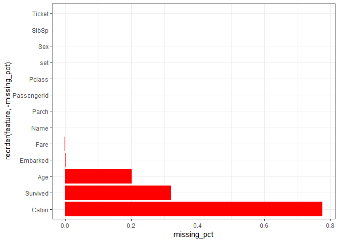<!-- -->

```r
#Useful data quality function for missing values


checkColumn = function(df,colname){
  testData = df[[colname]]

  numMissing = max(sum(is.na(testData)|is.nan(testData)|testData==''),0)

  if (class(testData) == 'numeric' | class(testData) == 'Date' | class(testData) == 'difftime' | class(testData) == 'integer'){

    list('col' = colname,'class' = class(testData), 'num' = length(testData) - numMissing, 'numMissing' = numMissing, 'numInfinite' = sum(is.infinite(testData)), 'avgVal' = mean(testData,na.rm=TRUE), 'minVal' = round(min(testData,na.rm = TRUE)), 'maxVal' = round(max(testData,na.rm = TRUE)))

  } else{

    list('col' = colname,'class' = class(testData), 'num' = length(testData) - numMissing, 'numMissing' = numMissing, 'numInfinite' = NA,  'avgVal' = NA, 'minVal' = NA, 'maxVal' = NA)

  }
}

checkAllCols = function(df){

  resDF = data.frame()

  for (colName in names(df)){

    resDF = rbind(resDF,as.data.frame(checkColumn(df=df,colname=colName)))

  }

  resDF

}

datatable(checkAllCols(full), style="bootstrap", class="table-condensed", options = list(dom = 'tp',scrollX = TRUE))
```

<!--html_preserve--><div id="htmlwidget-b4e2b324e6fa98033a68" style="width:100%;height:auto;" class="datatables html-widget"></div>
<script type="application/json" data-for="htmlwidget-b4e2b324e6fa98033a68">{"x":{"style":"bootstrap","filter":"none","data":[["1","2","3","4","5","6","7","8","9","10","11","12","13"],["PassengerId","Survived","Pclass","Name","Sex","Age","SibSp","Parch","Ticket","Fare","Cabin","Embarked","set"],["integer","integer","integer","character","character","numeric","integer","integer","character","numeric","character","character","character"],[1309,891,1309,1309,1309,1046,1309,1309,1309,1308,295,1307,1309],[0,418,0,0,0,263,0,0,0,1,1014,2,0],[0,0,0,null,null,0,0,0,null,0,null,null,null],[655,0.383838383838384,2.29488158899924,null,null,29.881137667304,0.498854087089381,0.385026737967914,null,33.2954792813456,null,null,null],[1,0,1,null,null,0,0,0,null,0,null,null,null],[1309,1,3,null,null,80,8,9,null,512,null,null,null]],"container":"<table class=\"table table-condensed\">\n  <thead>\n    <tr>\n      <th> <\/th>\n      <th>col<\/th>\n      <th>class<\/th>\n      <th>num<\/th>\n      <th>numMissing<\/th>\n      <th>numInfinite<\/th>\n      <th>avgVal<\/th>\n      <th>minVal<\/th>\n      <th>maxVal<\/th>\n    <\/tr>\n  <\/thead>\n<\/table>","options":{"dom":"tp","scrollX":true,"columnDefs":[{"className":"dt-right","targets":[3,4,5,6,7,8]},{"orderable":false,"targets":0}],"order":[],"autoWidth":false,"orderClasses":false}},"evals":[],"jsHooks":[]}</script><!--/html_preserve-->


```r
miss_pct <- map_dbl(full, function(x) { round((sum(is.na(x)) / length(x)) * 100, 1) })


miss_pct <- miss_pct[miss_pct > 0]


data.frame(miss=miss_pct, var=names(miss_pct), row.names=NULL) %>%

  
    ggplot(aes(x=reorder(var, -miss), y=miss)) + 

    geom_bar(stat='identity', fill='red') +

    labs(x='', y='% missing', title='Percent missing data by feature') +

    theme(axis.text.x=element_text(angle=90, hjust=1))
```

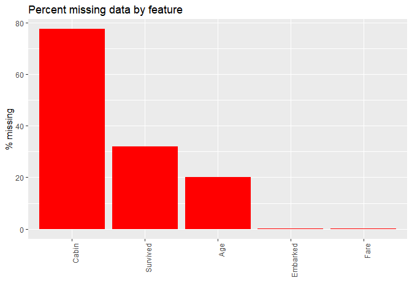<!-- -->

Replace missing Age cells with the mean Age of all passengers on the Titanic.


```r
full <- full %>%

    mutate(

      Age = ifelse(is.na(Age), mean(full$Age, na.rm=TRUE), Age),

      `Age Group` = case_when(Age < 13 ~ "Age.0012", 

                                 Age >= 13 & Age < 18 ~ "Age.1317",

                                 Age >= 18 & Age < 60 ~ "Age.1859",

                                 Age >= 60 ~ "Age.60Ov"))
head(full$`Age Group`)
```

```
## [1] "Age.1859" "Age.1859" "Age.1859" "Age.1859" "Age.1859" "Age.1859"
```
Use the most common code to replace NAs in the Embarked feature.


```r
ggplot(full,aes(x=Embarked))+geom_histogram(stat = "count")
```

```
## Warning: Ignoring unknown parameters: binwidth, bins, pad
```

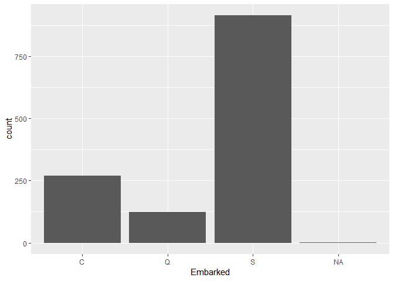<!-- -->

```r
#ggplot(full,aes(x=Embarked))+geom_bar(stat = "count")


full$Embarked <- replace(full$Embarked, which(is.na(full$Embarked)), 'S')
```


```r
names <- full$Name
head(names)
```

```
## [1] "Braund, Mr. Owen Harris"                            
## [2] "Cumings, Mrs. John Bradley (Florence Briggs Thayer)"
## [3] "Heikkinen, Miss. Laina"                             
## [4] "Futrelle, Mrs. Jacques Heath (Lily May Peel)"       
## [5] "Allen, Mr. William Henry"                           
## [6] "Moran, Mr. James"
```

```r
title <-  gsub("^.*, (.*?)\\..*$", "\\1", names)
head(title)
```

```
## [1] "Mr"   "Mrs"  "Miss" "Mrs"  "Mr"   "Mr"
```

```r
full$title <- title

table(title)
```

```
## title
##         Capt          Col          Don         Dona           Dr 
##            1            4            1            1            8 
##     Jonkheer         Lady        Major       Master         Miss 
##            1            1            2           61          260 
##         Mlle          Mme           Mr          Mrs           Ms 
##            2            1          757          197            2 
##          Rev          Sir the Countess 
##            8            1            1
```


```r
###MISS, Mrs, Master and Mr are taking more numbers


###Better to group Other titles into bigger basket by checking gender and survival rate to aviod any overfitting


full$title[full$title == 'Mlle']        <- 'Miss' 

full$title[full$title == 'Ms']          <- 'Miss'

full$title[full$title == 'Mme']         <- 'Mrs' 

full$title[full$title == 'Lady']          <- 'Miss'

full$title[full$title == 'Dona']          <- 'Miss'


## I am afraid creating a new varible with small data can causes a overfit

## However, My thinking is that combining below feauter into original variable may loss some predictive power as they are all army folks, doctor and nobel peoples 


full$title[full$title == 'Capt']        <- 'Officer' 

full$title[full$title == 'Col']        <- 'Officer' 

full$title[full$title == 'Major']   <- 'Officer'

full$title[full$title == 'Dr']   <- 'Officer'

full$title[full$title == 'Rev']   <- 'Officer'

full$title[full$title == 'Don']   <- 'Officer'

full$title[full$title == 'Sir']   <- 'Officer'

full$title[full$title == 'the Countess']   <- 'Officer'

full$title[full$title == 'Jonkheer']   <- 'Officer'  
```
Families are binned into a discretized feature based on family member count.


```r
full$FamilySize <-full$SibSp + full$Parch + 1 

full$FamilySized[full$FamilySize == 1] <- 'Single' 
```

```
## Warning: Unknown or uninitialised column: 'FamilySized'.
```

```r
full$FamilySized[full$FamilySize < 5 & full$FamilySize >= 2] <- 'Small' 

full$FamilySized[full$FamilySize >= 5] <- 'Big' 

full$FamilySized=as.factor(full$FamilySized)

table(full$FamilySized)
```

```
## 
##    Big Single  Small 
##     82    790    437
```

Engineer features based on all the passengers with the same ticket.

```r
##Engineer features based on all the passengers with the same ticket

ticket.unique <- rep(0, nrow(full))

tickets <- unique(full$Ticket)


for (i in 1:length(tickets)) {

  current.ticket <- tickets[i]

  party.indexes <- which(full$Ticket == current.ticket)

  

  

  for (k in 1:length(party.indexes)) {

    ticket.unique[party.indexes[k]] <- length(party.indexes)

  }

}


full$ticket.unique <- ticket.unique


full$ticket.size[full$ticket.unique == 1]   <- 'Single'
```

```
## Warning: Unknown or uninitialised column: 'ticket.size'.
```

```r
full$ticket.size[full$ticket.unique < 5 & full$ticket.unique>= 2]   <- 'Small'

full$ticket.size[full$ticket.unique >= 5]   <- 'Big'


table(full$ticket.size)
```

```
## 
##    Big Single  Small 
##    121    713    475
```


```r
full <- full %>%

  mutate(Survived = case_when(Survived==1 ~ "Yes", 

                              Survived==0 ~ "No"))


crude_summary <- full %>%

  filter(set=="train") %>%

  select(PassengerId, Survived) %>%

  group_by(Survived) %>%

  summarise(n = n()) %>%

  mutate(freq = n / sum(n))


crude_survrate <- crude_summary$freq[crude_summary$Survived=="Yes"]

crude_survrate
```

```
## [1] 0.3838384
```

```r
kable(crude_summary, caption="2x2 Contingency Table on Survival.", format="markdown")
```


|Survived |   n|      freq|
|:--------|---:|---------:|
|No       | 549| 0.6161616|
|Yes      | 342| 0.3838384|

```r
full %>% filter(set=="train") %>%
ggplot( aes(x=Survived))+geom_histogram(stat="count")
```

```
## Warning: Ignoring unknown parameters: binwidth, bins, pad
```

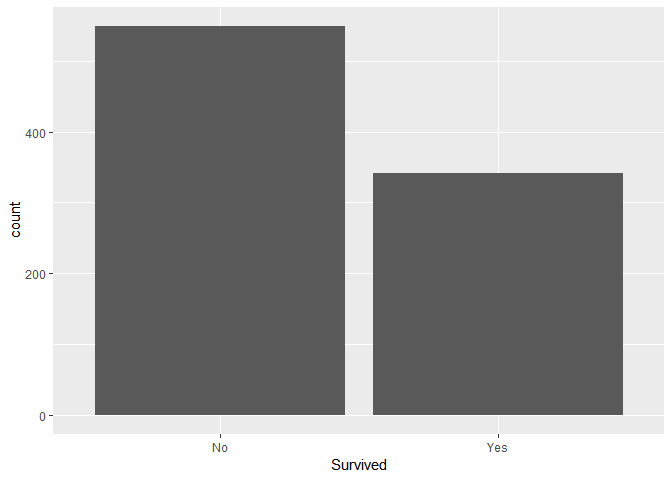<!-- -->

```r
table(full$Survived)
```

```
## 
##  No Yes 
## 549 342
```
Relationship Between Dependent and Independent Variables


```r
# Relationship with Pclass
ggplot(full %>% filter(set=="train"), aes(Pclass, fill=Survived)) +

  geom_bar(position = "fill") +

  scale_fill_brewer(palette="Set1") +

  scale_y_continuous(labels=percent) +

  ylab("Survival Rate") +

  geom_hline(yintercept=crude_survrate, col="white", lty=2, size=2) +

  ggtitle("Survival Rate by Class") + 

  theme_minimal()
```

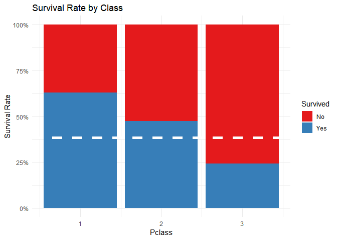<!-- -->

```r
# Relationship with Sex

ggplot(full %>% filter(set=="train"), aes(x=Sex, fill=Survived))+
  geom_bar(position = "fill")+
  scale_fill_brewer(palette="Set1") +
  ylab("Survival Rate")+
  scale_y_continuous(labels=percent)+
  geom_hline(yintercept=crude_survrate, col="white", lty=2, size=2)+
  ggtitle("Survival Rate by Sex")+
  theme_minimal()
```

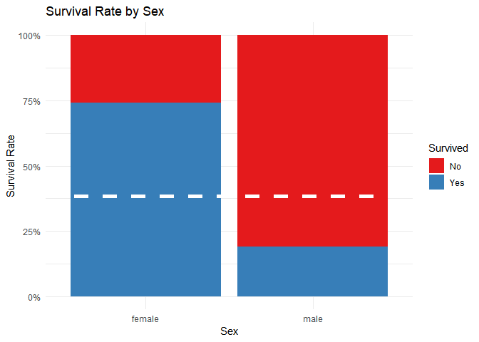<!-- -->

```r
# Relationship with age

tbl_age <- full %>% filter(set=="train") %>% select(Survived, Age) %>% group_by(Survived) %>%
 summarise(mean.age=mean(Age,na.rm=TRUE))  


ggplot(full %>% filter(set=="train"), aes(Age, fill=Survived)) +

  geom_histogram(aes(y=..density..), alpha=0.5) +

  geom_density(alpha=.2, aes(colour=Survived)) +

  geom_vline(data=tbl_age, aes(xintercept=mean.age, colour=Survived), lty=2, size=1) +

  scale_fill_brewer(palette="Set1") +

  scale_colour_brewer(palette="Set1") +

  scale_y_continuous(labels=percent) +

  ylab("Density") +

  ggtitle("Survival Rate by Age") + 

  theme_minimal()
```

```
## `stat_bin()` using `bins = 30`. Pick better value with `binwidth`.
```

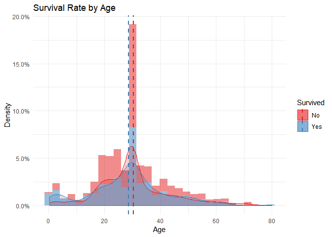<!-- -->

```r
# Relationship with Age Group

ggplot(full %>% filter(set=="train" & !is.na(Age)), aes(`Age Group`, fill=Survived)) +

  geom_bar(position = "fill") +

  scale_fill_brewer(palette="Set1") +

  scale_y_continuous(labels=percent) +

  ylab("Survival Rate") +

  geom_hline(yintercept=crude_survrate, col="white", lty=2, size=2) +

  ggtitle("Survival Rate by Age Group") + 

  theme_minimal()
```

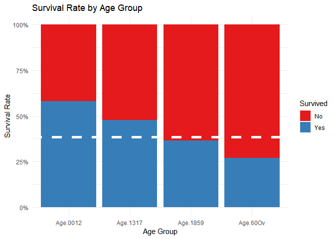<!-- -->

```r
# Relationship with Sibling information

ggplot(full %>% filter(set=="train"), aes(SibSp, fill=Survived)) +

  geom_bar(position = "fill") +

  scale_fill_brewer(palette="Set1") +

  scale_y_continuous(labels=percent) +

  ylab("Survival Rate") +

  geom_hline(yintercept=crude_survrate, col="white", lty=2, size=2) +

  ggtitle("Survival Rate by SibSp") + 

  theme_minimal()
```

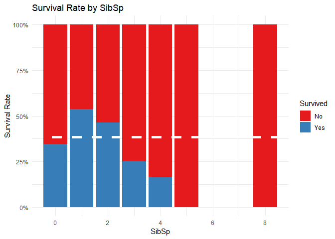<!-- -->

```r
# Relationship with Parent- Child information

ggplot(full %>% filter(set=="train"), aes(Parch, fill=Survived)) +

  geom_bar(position = "fill") +

  scale_fill_brewer(palette="Set1") +

  scale_y_continuous(labels=percent) +

  ylab("Survival Rate") +

  geom_hline(yintercept=crude_survrate, col="white", lty=2, size=2) +

  ggtitle("Survival Rate by Parch") + 

  theme_minimal()
```

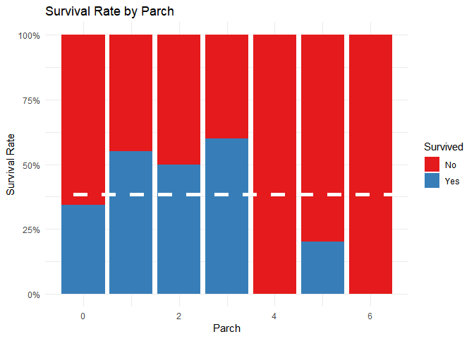<!-- -->

```r
# Realtionship with Embarked

ggplot(full %>% filter(set=="train"), aes(Embarked, fill=Survived)) +

  geom_bar(position = "fill") +

  scale_fill_brewer(palette="Set1") +

  scale_y_continuous(labels=percent) +

  ylab("Survival Rate") +

  geom_hline(yintercept=crude_survrate, col="white", lty=2, size=2) +

  ggtitle("Survival Rate by Embarked") + 

  theme_minimal()
```

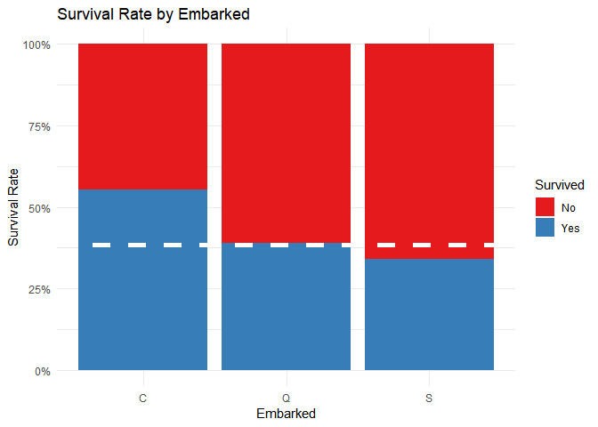<!-- -->

```r
# Relationship with Title

ggplot(full %>% filter(set=="train") %>% na.omit, aes(x=title,fill=Survived))+geom_bar(position="fill")+
  scale_fill_brewer(palette="Set1")+
  scale_y_continuous(labels=percent)+
  ylab("Survival rate")+
  geom_hline(yintercept=crude_survrate,col="white",lty=2,size=2)+
  ggtitle("Survival Rate by Title")+
  theme_minimal()+
  theme(axis.text.x=element_text(angle=90,hjust=1))
```

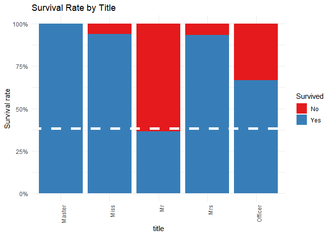<!-- -->

```r
# Relationship with Family

ggplot(full %>% filter(set=="train") %>% na.omit, aes(x=FamilySize,fill=Survived))+
  geom_bar(position="fill")+
  scale_fill_brewer(palette = "Set1")+
  scale_y_continuous(labels=percent)+
  ylab("Survival rate")+
  geom_hline(yintercept=crude_survrate,col="white",lty=2,size=2)+
  ggtitle("Survival rate by Family group")+
  theme_minimal()+
  theme(axis.text.x = element_text(angle = 90, hjust = 1))
```

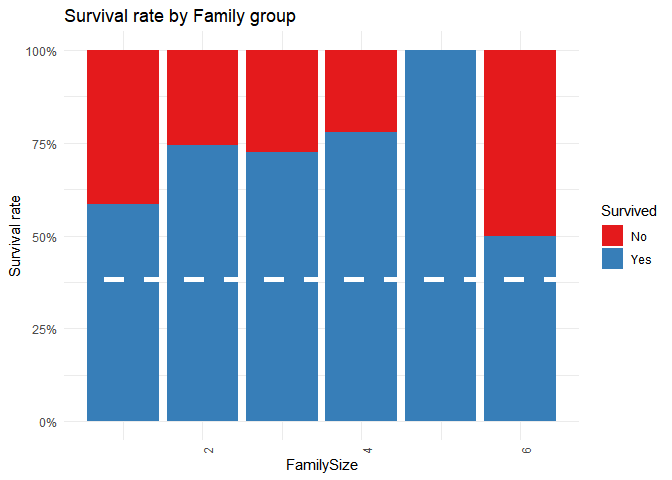<!-- -->

Next, we will find the relationship to frequency

```r
# Relationship with Pclass

ggplot(full %>% filter(set=="train") %>% na.omit, aes(x=Pclass,fill=Survived))+
  geom_bar(position = "stack")+
  scale_fill_brewer(palette = "Set1")+
  scale_y_continuous(labels=comma)+
  ylab("Passengers")+
  ggtitle("Survival by Pclass")+
  theme_minimal()
```

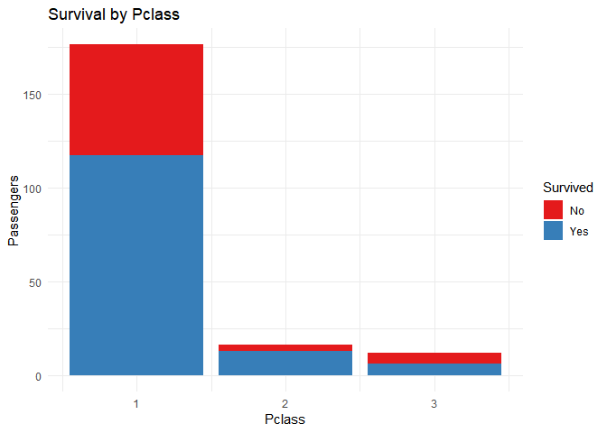<!-- -->

```r
# Relationship with Sex

ggplot(full %>% filter(set=="train"), aes(Sex, fill=Survived)) +
  geom_bar(position="stack") +
  scale_fill_brewer(palette="Set1") +
  scale_y_continuous(labels=comma) +
  ylab("Passengers") +
  ggtitle("Survived by Sex") + 
  theme_minimal()
```

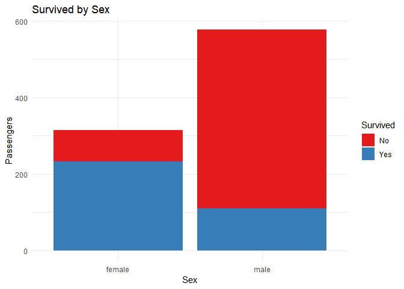<!-- -->

```r
# Relationship with Age

ggplot(full %>% filter(set=="train"), aes(Age, fill=Survived)) +

    geom_histogram(aes(y=..count..), alpha=0.5) +

  geom_vline(data=tbl_age, aes(xintercept=mean.age, colour=Survived), lty=2, size=1) +

  scale_fill_brewer(palette="Set1") +

  scale_colour_brewer(palette="Set1") +

  scale_y_continuous(labels=comma) +

  ylab("Density") +

  ggtitle("Survived by Age") + 

  theme_minimal()
```

```
## `stat_bin()` using `bins = 30`. Pick better value with `binwidth`.
```

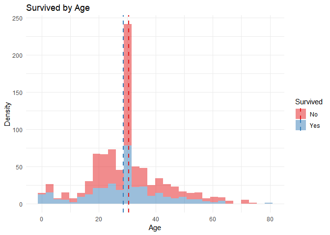<!-- -->

```r
# Relationship with Age group

ggplot(full %>% filter(set=="train") %>% na.omit, aes(`Age Group`, fill=Survived)) +

  geom_bar(position="stack") +

  scale_fill_brewer(palette="Set1") +

  scale_y_continuous(labels=comma) +

  ylab("Passengers") +

  ggtitle("Survived by Age Group") + 

  theme_minimal()
```

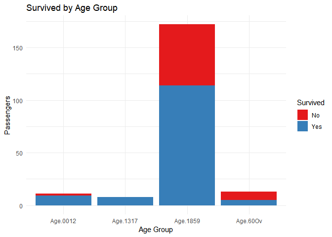<!-- -->

```r
# Relationship with Siblings
ggplot(full %>% filter(set=="train"), aes(SibSp, fill=Survived)) +

  geom_bar(position="stack") +

  scale_fill_brewer(palette="Set1") +

  scale_y_continuous(labels=percent) +

  scale_y_continuous(labels=comma) +

  ylab("Passengers") +

  ggtitle("Survived by SibSp") + 

  theme_minimal()
```

```
## Scale for 'y' is already present. Adding another scale for 'y', which
## will replace the existing scale.
```

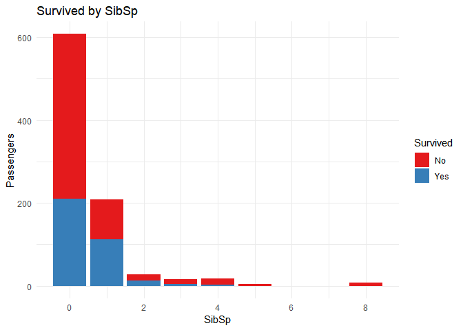<!-- -->

```r
# Relationship with Parent Child
ggplot(full %>% filter(set=="train"), aes(Parch, fill=Survived)) +

  geom_bar(position="stack") +

  scale_fill_brewer(palette="Set1") +

  scale_y_continuous(labels=comma) +

  ylab("Passengers") +

  ggtitle("Survived by Parch") + 

  theme_minimal()
```

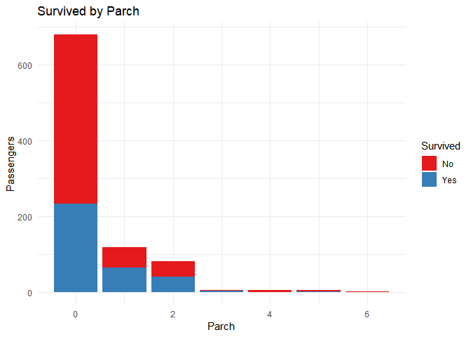<!-- -->

```r
# Relationship with Embarked

ggplot(full %>% filter(set=="train"), aes(Embarked, fill=Survived)) +

  geom_bar(position="stack") +

  scale_fill_brewer(palette="Set1") +

  scale_y_continuous(labels=comma) +

  ylab("Passengers") +

  ggtitle("Survived by Embarked") + 

  theme_minimal()
```

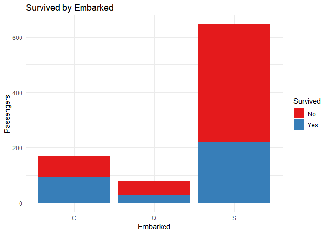<!-- -->

```r
# Relationship with Title

ggplot(full %>% filter(set=="train") %>% na.omit, aes(title, fill=Survived)) +

  geom_bar(position="stack") +

  scale_fill_brewer(palette="Set1") +

  scale_y_continuous(labels=comma) +

  ylab("Passengers") +

  ggtitle("Survived by Title") + 

  theme_minimal() +

  theme(axis.text.x = element_text(angle = 90, hjust = 1))
```

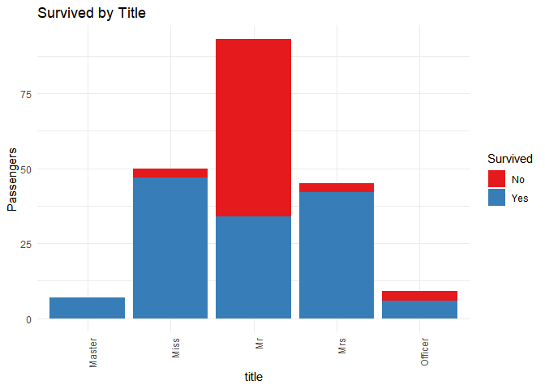<!-- -->

```r
# Relationship with Family

ggplot(full %>% filter(set=="train") %>% na.omit, aes(`FamilySize`, fill=Survived)) +

  geom_bar(position="stack") +

  scale_fill_brewer(palette="Set1") +

  scale_y_continuous(labels=comma) +

  ylab("Passengers") +

  ggtitle("Survived by Family Group") + 

  theme_minimal() +

  theme(axis.text.x = element_text(angle = 90, hjust = 1))
```

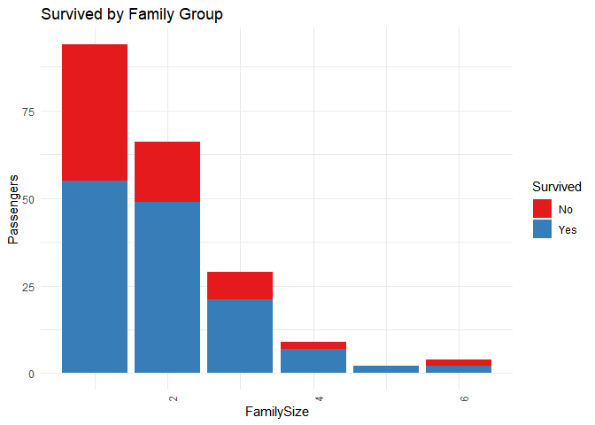<!-- -->

```r
tbl_corr <- full %>%

  filter(set=="train") %>%

  select(-PassengerId, -SibSp, -Parch) %>%

  select_if(is.numeric) %>%

  cor(use="complete.obs") %>%

  corrplot.mixed(tl.cex=0.9)
```

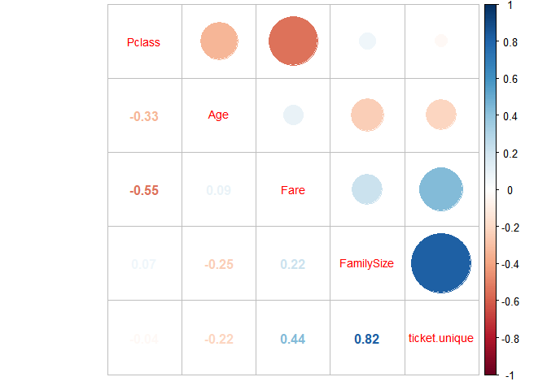<!-- -->

```r
#tl.cex controls text size within matrix
#use="complete.obs" implies that correlation will not be computed if values are missing/incomplete.
```


```r
  feauter1<-full[1:891, c("Pclass", "title","Sex","Embarked","FamilySized","ticket.size")]

response <- as.factor(train$Survived)

feauter1$Survived=as.factor(train$Survived)


test_orig<-full[892:1309, c("Pclass", "title","Sex","Embarked","FamilySized","ticket.size","Survived")]

response <- as.factor(test_orig$Survived)

test_orig$Survived=as.factor(test_orig$Survived)


###For Cross validation purpose will keep 20% of data aside from my orginal train set

##This is just to check how well my data works for unseen data

set.seed(500)
ind=createDataPartition(feauter1$Survived,times=1,p=0.8,list=FALSE)
train_val=feauter1[ind,]
test_val=feauter1[-ind,]

####check the proprtion of Survival rate in orginal training data, current traing and testing data
round(prop.table(table(train$Survived)),digits = 1)
```

```
## 
##   0   1 
## 0.6 0.4
```

```r
# In this step, we will run different models and check the performance of each.
#---------------------------------------------------------------------------------
# Decision Tree Model


set.seed(1234)
Model_DT=rpart(Survived~.,data=train_val,method="class")

rpart.plot(Model_DT,extra=3,fallen.leaves = T)
```

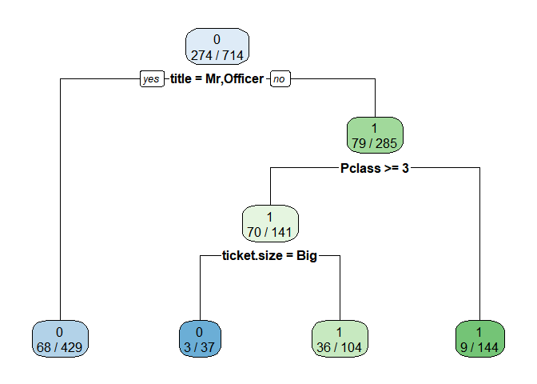<!-- -->

```r
PRE_TDT=predict(Model_DT,data=train_val,type ="class")
confusionMatrix(PRE_TDT,train_val$Survived)
```

```
## Confusion Matrix and Statistics
## 
##           Reference
## Prediction   0   1
##          0 395  71
##          1  45 203
##                                           
##                Accuracy : 0.8375          
##                  95% CI : (0.8084, 0.8639)
##     No Information Rate : 0.6162          
##     P-Value [Acc > NIR] : < 2e-16         
##                                           
##                   Kappa : 0.6502          
##  Mcnemar's Test P-Value : 0.02028         
##                                           
##             Sensitivity : 0.8977          
##             Specificity : 0.7409          
##          Pos Pred Value : 0.8476          
##          Neg Pred Value : 0.8185          
##              Prevalence : 0.6162          
##          Detection Rate : 0.5532          
##    Detection Prevalence : 0.6527          
##       Balanced Accuracy : 0.8193          
##                                           
##        'Positive' Class : 0               
## 
```

```r
test.probs.dt <- predict(Model_DT, newdata=test_orig)
# Save the solution to a dataframe with two columns: PassengerId and Survived (prediction)
solution <- data.frame(PassengerID = test$PassengerId, Survived = test.probs.dt)

# Write the solution to file
write.csv(solution, file = 'dt_Solution_krnl2.csv', row.names = F)
```


```r
#---------------------------------------------------------------------------------
# Random forest Model


train_val$Survived<- as.factor(train_val$Survived)
train_val$Pclass<- as.factor(train_val$Pclass)
train_val$title<- as.factor(train_val$title)
train_val$Sex<- as.factor(train_val$Sex)
train_val$Embarked<- as.factor(train_val$Embarked)
train_val$FamilySized<- as.factor(train_val$FamilySized)
train_val$ticket.size<- as.factor(train_val$ticket.size)

test_val$Survived<- as.factor(test_val$Survived)
test_val$Pclass<- as.factor(test_val$Pclass)
test_val$title<- as.factor(test_val$title)
test_val$Sex<- as.factor(test_val$Sex)
test_val$Embarked<- as.factor(test_val$Embarked)
test_val$FamilySized<- as.factor(test_val$FamilySized)
test_val$ticket.size<- as.factor(test_val$ticket.size)

test_orig$Survived<- as.factor(test_orig$Survived)
test_orig$Pclass<- as.factor(test_orig$Pclass)
test_orig$title<- as.factor(test_orig$title)
test_orig$Sex<- as.factor(test_orig$Sex)
test_orig$Embarked<- as.factor(test_orig$Embarked)
test_orig$FamilySized<- as.factor(test_orig$FamilySized)
test_orig$ticket.size<- as.factor(test_orig$ticket.size)

str(train_val)
```

```
## Classes 'tbl_df', 'tbl' and 'data.frame':	714 obs. of  7 variables:
##  $ Pclass     : Factor w/ 3 levels "1","2","3": 3 1 3 1 3 3 1 3 3 2 ...
##  $ title      : Factor w/ 5 levels "Master","Miss",..: 3 4 2 4 3 3 3 1 4 4 ...
##  $ Sex        : Factor w/ 2 levels "female","male": 2 1 1 1 2 2 2 2 1 1 ...
##  $ Embarked   : Factor w/ 3 levels "C","Q","S": 3 1 3 3 3 2 3 3 3 1 ...
##  $ FamilySized: Factor w/ 3 levels "Big","Single",..: 3 3 2 3 2 2 2 1 3 3 ...
##  $ ticket.size: Factor w/ 3 levels "Big","Single",..: 2 3 2 3 2 2 3 1 3 3 ...
##  $ Survived   : Factor w/ 2 levels "0","1": 1 2 2 2 1 1 1 1 2 2 ...
```

```r
summary(train_val)
```

```
##  Pclass      title         Sex      Embarked FamilySized  ticket.size 
##  1:176   Master : 36   female:251   C:135    Big   : 51   Big   : 72  
##  2:144   Miss   :148   male  :463   Q: 60    Single:428   Single:379  
##  3:394   Mr     :413                S:519    Small :235   Small :263  
##          Mrs    :101                                                  
##          Officer: 16                                                  
##  Survived
##  0:440   
##  1:274   
##          
##          
## 
```

```r
set.seed(1234)
rf.1<- randomForest(factor(Survived)~.,data=train_val,importance=TRUE,ntree=1000)

#rf.1 <- randomForest(x = train_val[,-7],y=train_val[,7], importance = TRUE, ntree = 1000)
rf.1
```

```
## 
## Call:
##  randomForest(formula = factor(Survived) ~ ., data = train_val,      importance = TRUE, ntree = 1000) 
##                Type of random forest: classification
##                      Number of trees: 1000
## No. of variables tried at each split: 2
## 
##         OOB estimate of  error rate: 17.51%
## Confusion matrix:
##     0   1 class.error
## 0 395  45   0.1022727
## 1  80 194   0.2919708
```

```r
varImpPlot(rf.1)
```

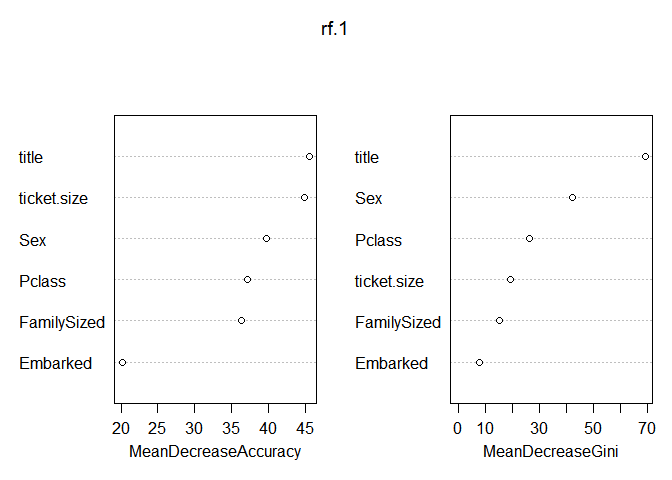<!-- -->

```r
####Lets remove 2 redaundant varibles and do the modeling again

train_val1=train_val[,-4:-5]

test_val1=test_val[,-4:-5]

set.seed(1234)

rf.2 <- randomForest(Survived ~.,data=train_val1, importance = TRUE, ntree = 1000)

rf.2
```

```
## 
## Call:
##  randomForest(formula = Survived ~ ., data = train_val1, importance = TRUE,      ntree = 1000) 
##                Type of random forest: classification
##                      Number of trees: 1000
## No. of variables tried at each split: 2
## 
##         OOB estimate of  error rate: 15.97%
## Confusion matrix:
##     0   1 class.error
## 0 395  45   0.1022727
## 1  69 205   0.2518248
```

```r
varImpPlot(rf.2)
```

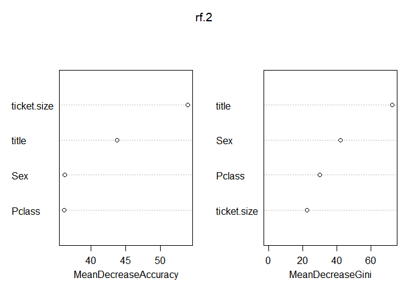<!-- -->

```r
test.probs.rf <- predict(rf.2, newdata=test_orig)
# Save the solution to a dataframe with two columns: PassengerId and Survived (prediction)
solution <- data.frame(PassengerID = test$PassengerId, Survived = test.probs.rf)

# Write the solution to file
write.csv(solution, file = 'rf_Solution_krnl2.csv', row.names = F)
```


```r
#---------------------------------------------------------------------------------
# Logistic Regression Model

log.mod<- glm(Survived~.,family = binomial(link = "logit"),data=train_val1)
summary(log.mod)
```

```
## 
## Call:
## glm(formula = Survived ~ ., family = binomial(link = "logit"), 
##     data = train_val1)
## 
## Deviance Residuals: 
##     Min       1Q   Median       3Q      Max  
## -2.4187  -0.5944  -0.3937   0.5805   3.0414  
## 
## Coefficients:
##                   Estimate Std. Error z value Pr(>|z|)    
## (Intercept)        16.8752   624.0921   0.027 0.978428    
## Pclass2            -1.1968     0.3129  -3.824 0.000131 ***
## Pclass3            -2.1324     0.2721  -7.838 4.58e-15 ***
## titleMiss         -16.1021   624.0921  -0.026 0.979416    
## titleMr            -3.7422     0.5216  -7.175 7.24e-13 ***
## titleMrs          -16.0186   624.0921  -0.026 0.979523    
## titleOfficer       -4.3752     0.8595  -5.090 3.58e-07 ***
## Sexmale           -15.6157   624.0919  -0.025 0.980038    
## ticket.sizeSingle   2.0968     0.4082   5.137 2.79e-07 ***
## ticket.sizeSmall    2.0356     0.3870   5.260 1.44e-07 ***
## ---
## Signif. codes:  0 '***' 0.001 '**' 0.01 '*' 0.05 '.' 0.1 ' ' 1
## 
## (Dispersion parameter for binomial family taken to be 1)
## 
##     Null deviance: 950.86  on 713  degrees of freedom
## Residual deviance: 589.82  on 704  degrees of freedom
## AIC: 609.82
## 
## Number of Fisher Scoring iterations: 13
```

```r
train.probs=predict(log.mod,data=train_val1,type="response")
table(train_val1$Survived,train.probs>0.5)
```

```
##    
##     FALSE TRUE
##   0   395   45
##   1    70  204
```

```r
(395+204)/(395+45+70+204)  
```

```
## [1] 0.8389356
```

```r
str(test_orig)
```

```
## Classes 'tbl_df', 'tbl' and 'data.frame':	418 obs. of  7 variables:
##  $ Pclass     : Factor w/ 3 levels "1","2","3": 3 3 2 3 3 3 3 2 3 3 ...
##  $ title      : Factor w/ 5 levels "Master","Miss",..: 3 4 3 3 4 3 2 3 4 3 ...
##  $ Sex        : Factor w/ 2 levels "female","male": 2 1 2 2 1 2 1 2 1 2 ...
##  $ Embarked   : Factor w/ 3 levels "C","Q","S": 2 3 2 3 3 3 2 3 1 3 ...
##  $ FamilySized: Factor w/ 3 levels "Big","Single",..: 2 3 2 2 3 2 2 3 2 3 ...
##  $ ticket.size: Factor w/ 3 levels "Big","Single",..: 2 2 2 2 3 2 2 3 2 3 ...
##  $ Survived   : Factor w/ 0 levels: NA NA NA NA NA NA NA NA NA NA ...
```

```r
test.probs.logistic <- predict(log.mod, newdata=test_orig,type =  "response")

table(test_orig$Survived,test.probs.logistic>0.5)
```

```
## < table of extent 0 x 2 >
```

```r
str(test.probs.logistic)  
```

```
##  Named num [1:418] 0.0746 0.6944 0.1704 0.0746 0.6813 ...
##  - attr(*, "names")= chr [1:418] "1" "2" "3" "4" ...
```

```r
str(test$PassengerId)
```

```
##  int [1:418] 892 893 894 895 896 897 898 899 900 901 ...
```

```r
str(test.probs.logistic)
```

```
##  Named num [1:418] 0.0746 0.6944 0.1704 0.0746 0.6813 ...
##  - attr(*, "names")= chr [1:418] "1" "2" "3" "4" ...
```

```r
str(test_orig)
```

```
## Classes 'tbl_df', 'tbl' and 'data.frame':	418 obs. of  7 variables:
##  $ Pclass     : Factor w/ 3 levels "1","2","3": 3 3 2 3 3 3 3 2 3 3 ...
##  $ title      : Factor w/ 5 levels "Master","Miss",..: 3 4 3 3 4 3 2 3 4 3 ...
##  $ Sex        : Factor w/ 2 levels "female","male": 2 1 2 2 1 2 1 2 1 2 ...
##  $ Embarked   : Factor w/ 3 levels "C","Q","S": 2 3 2 3 3 3 2 3 1 3 ...
##  $ FamilySized: Factor w/ 3 levels "Big","Single",..: 2 3 2 2 3 2 2 3 2 3 ...
##  $ ticket.size: Factor w/ 3 levels "Big","Single",..: 2 2 2 2 3 2 2 3 2 3 ...
##  $ Survived   : Factor w/ 0 levels: NA NA NA NA NA NA NA NA NA NA ...
```

```r
test.probs.logistic <- predict(log.mod, newdata=test_orig,type =  "response")
# Save the solution to a dataframe with two columns: PassengerId and Survived (prediction)
solution <- data.frame(PassengerID = test$PassengerId, Survived = as.numeric(test.probs.logistic>0.5))

# Write the solution to file
write.csv(solution, file = 'logistic_Solution_krnl2.csv', row.names = F)
```


