```r
library(ggplot2)
library(ggthemes)
library(scales)
library(dplyr)
```

```
## 
## Attaching package: 'dplyr'
```

```
## The following objects are masked from 'package:stats':
## 
##     filter, lag
```

```
## The following objects are masked from 'package:base':
## 
##     intersect, setdiff, setequal, union
```

```r
library(mice)
```

```
## Loading required package: lattice
```

```
## 
## Attaching package: 'mice'
```

```
## The following objects are masked from 'package:base':
## 
##     cbind, rbind
```

```r
library(randomForest)
```

```
## randomForest 4.6-14
```

```
## Type rfNews() to see new features/changes/bug fixes.
```

```
## 
## Attaching package: 'randomForest'
```

```
## The following object is masked from 'package:dplyr':
## 
##     combine
```

```
## The following object is masked from 'package:ggplot2':
## 
##     margin
```

```r
library(purrr)
```

```
## 
## Attaching package: 'purrr'
```

```
## The following object is masked from 'package:scales':
## 
##     discard
```

```r
train=read.csv('Titanic_train.csv',stringsAsFactors=FALSE)
test=read.csv('Titanic_test.csv',,stringsAsFactors=FALSE)

full<- bind_rows(train,test)
# check the data structure
str(train)
```

```
## 'data.frame':	891 obs. of  12 variables:
##  $ PassengerId: int  1 2 3 4 5 6 7 8 9 10 ...
##  $ Survived   : int  0 1 1 1 0 0 0 0 1 1 ...
##  $ Pclass     : int  3 1 3 1 3 3 1 3 3 2 ...
##  $ Name       : chr  "Braund, Mr. Owen Harris" "Cumings, Mrs. John Bradley (Florence Briggs Thayer)" "Heikkinen, Miss. Laina" "Futrelle, Mrs. Jacques Heath (Lily May Peel)" ...
##  $ Sex        : chr  "male" "female" "female" "female" ...
##  $ Age        : num  22 38 26 35 35 NA 54 2 27 14 ...
##  $ SibSp      : int  1 1 0 1 0 0 0 3 0 1 ...
##  $ Parch      : int  0 0 0 0 0 0 0 1 2 0 ...
##  $ Ticket     : chr  "A/5 21171" "PC 17599" "STON/O2. 3101282" "113803" ...
##  $ Fare       : num  7.25 71.28 7.92 53.1 8.05 ...
##  $ Cabin      : chr  "" "C85" "" "C123" ...
##  $ Embarked   : chr  "S" "C" "S" "S" ...
```

```r
str(test)
```

```
## 'data.frame':	418 obs. of  11 variables:
##  $ PassengerId: int  892 893 894 895 896 897 898 899 900 901 ...
##  $ Pclass     : int  3 3 2 3 3 3 3 2 3 3 ...
##  $ Name       : chr  "Kelly, Mr. James" "Wilkes, Mrs. James (Ellen Needs)" "Myles, Mr. Thomas Francis" "Wirz, Mr. Albert" ...
##  $ Sex        : chr  "male" "female" "male" "male" ...
##  $ Age        : num  34.5 47 62 27 22 14 30 26 18 21 ...
##  $ SibSp      : int  0 1 0 0 1 0 0 1 0 2 ...
##  $ Parch      : int  0 0 0 0 1 0 0 1 0 0 ...
##  $ Ticket     : chr  "330911" "363272" "240276" "315154" ...
##  $ Fare       : num  7.83 7 9.69 8.66 12.29 ...
##  $ Cabin      : chr  "" "" "" "" ...
##  $ Embarked   : chr  "Q" "S" "Q" "S" ...
```

```r
str(full)
```

```
## 'data.frame':	1309 obs. of  12 variables:
##  $ PassengerId: int  1 2 3 4 5 6 7 8 9 10 ...
##  $ Survived   : int  0 1 1 1 0 0 0 0 1 1 ...
##  $ Pclass     : int  3 1 3 1 3 3 1 3 3 2 ...
##  $ Name       : chr  "Braund, Mr. Owen Harris" "Cumings, Mrs. John Bradley (Florence Briggs Thayer)" "Heikkinen, Miss. Laina" "Futrelle, Mrs. Jacques Heath (Lily May Peel)" ...
##  $ Sex        : chr  "male" "female" "female" "female" ...
##  $ Age        : num  22 38 26 35 35 NA 54 2 27 14 ...
##  $ SibSp      : int  1 1 0 1 0 0 0 3 0 1 ...
##  $ Parch      : int  0 0 0 0 0 0 0 1 2 0 ...
##  $ Ticket     : chr  "A/5 21171" "PC 17599" "STON/O2. 3101282" "113803" ...
##  $ Fare       : num  7.25 71.28 7.92 53.1 8.05 ...
##  $ Cabin      : chr  "" "C85" "" "C123" ...
##  $ Embarked   : chr  "S" "C" "S" "S" ...
```


```r
# Next steps to be completed
# Grab title from passenger names using gsub and regular expressions knowledge
# Create a table of title with Sex and combine title with very low cell counts to combined "rare" level
# Reassign any misspellings and check the table again


full$Title=gsub('(.*, )|(\\..*)', '', full$Name)

head(full)
```

```
##   PassengerId Survived Pclass
## 1           1        0      3
## 2           2        1      1
## 3           3        1      3
## 4           4        1      1
## 5           5        0      3
## 6           6        0      3
##                                                  Name    Sex Age SibSp
## 1                             Braund, Mr. Owen Harris   male  22     1
## 2 Cumings, Mrs. John Bradley (Florence Briggs Thayer) female  38     1
## 3                              Heikkinen, Miss. Laina female  26     0
## 4        Futrelle, Mrs. Jacques Heath (Lily May Peel) female  35     1
## 5                            Allen, Mr. William Henry   male  35     0
## 6                                    Moran, Mr. James   male  NA     0
##   Parch           Ticket    Fare Cabin Embarked Title
## 1     0        A/5 21171  7.2500              S    Mr
## 2     0         PC 17599 71.2833   C85        C   Mrs
## 3     0 STON/O2. 3101282  7.9250              S  Miss
## 4     0           113803 53.1000  C123        S   Mrs
## 5     0           373450  8.0500              S    Mr
## 6     0           330877  8.4583              Q    Mr
```

```r
table(full$Sex, full$Title)
```

```
##         
##          Capt Col Don Dona  Dr Jonkheer Lady Major Master Miss Mlle Mme
##   female    0   0   0    1   1        0    1     0      0  260    2   1
##   male      1   4   1    0   7        1    0     2     61    0    0   0
##         
##           Mr Mrs  Ms Rev Sir the Countess
##   female   0 197   2   0   0            1
##   male   757   0   0   8   1            0
```

```r
# Titles with very low cell counts to be combined to "rare" level
rare_title <- c('Dona', 'Lady', 'the Countess','Capt', 'Col', 'Don', 
                'Dr', 'Major', 'Rev', 'Sir', 'Jonkheer')

# Also reassign mlle, ms, and mme accordingly
full$Title[full$Title == 'Mlle']        <- 'Miss' 
full$Title[full$Title == 'Ms']          <- 'Miss'
full$Title[full$Title == 'Mme']         <- 'Mrs' 
full$Title[full$Title %in% rare_title]  <- 'Rare Title'

# Show title counts by sex again
table(full$Sex, full$Title)
```

```
##         
##          Master Miss  Mr Mrs Rare Title
##   female      0  264   0 198          4
##   male       61    0 757   0         25
```


```r
# Finally, grab surname from passenger name
full$Surname <- sapply(full$Name,  
                      function(x) strsplit(x, split = '[,.]')[[1]][1])
cat(paste('We have <b>', nlevels(factor(full$Surname)), '</b> unique surnames. I would be interested to infer ethnicity based on surname --- another time.'))
```

```
## We have <b> 875 </b> unique surnames. I would be interested to infer ethnicity based on surname --- another time.
```

```r
# Create a family size variable including the passenger themselves
full$Fsize <- full$SibSp + full$Parch + 1

# Create a family variable 
full$Family <- paste(full$Surname, full$Fsize, sep='_')
head(full)
```

```
##   PassengerId Survived Pclass
## 1           1        0      3
## 2           2        1      1
## 3           3        1      3
## 4           4        1      1
## 5           5        0      3
## 6           6        0      3
##                                                  Name    Sex Age SibSp
## 1                             Braund, Mr. Owen Harris   male  22     1
## 2 Cumings, Mrs. John Bradley (Florence Briggs Thayer) female  38     1
## 3                              Heikkinen, Miss. Laina female  26     0
## 4        Futrelle, Mrs. Jacques Heath (Lily May Peel) female  35     1
## 5                            Allen, Mr. William Henry   male  35     0
## 6                                    Moran, Mr. James   male  NA     0
##   Parch           Ticket    Fare Cabin Embarked Title   Surname Fsize
## 1     0        A/5 21171  7.2500              S    Mr    Braund     2
## 2     0         PC 17599 71.2833   C85        C   Mrs   Cumings     2
## 3     0 STON/O2. 3101282  7.9250              S  Miss Heikkinen     1
## 4     0           113803 53.1000  C123        S   Mrs  Futrelle     2
## 5     0           373450  8.0500              S    Mr     Allen     1
## 6     0           330877  8.4583              Q    Mr     Moran     1
##        Family
## 1    Braund_2
## 2   Cumings_2
## 3 Heikkinen_1
## 4  Futrelle_2
## 5     Allen_1
## 6     Moran_1
```

```r
summary(as.factor(full$Fsize))
```

```
##   1   2   3   4   5   6   7   8  11 
## 790 235 159  43  22  25  16   8  11
```

```r
# Using 1:891 in below code because we only want to visualize on training dataset and not on test dataset

# Use ggplot2 to visualize the relationship between family size & survival
ggplot(full[1:891,], aes(x = Fsize, fill = factor(Survived))) +
  geom_bar(stat='count',position="dodge") +
  scale_x_continuous(breaks=c(1:11)) +
  labs(x = 'Family Size') +
  theme_few()
```

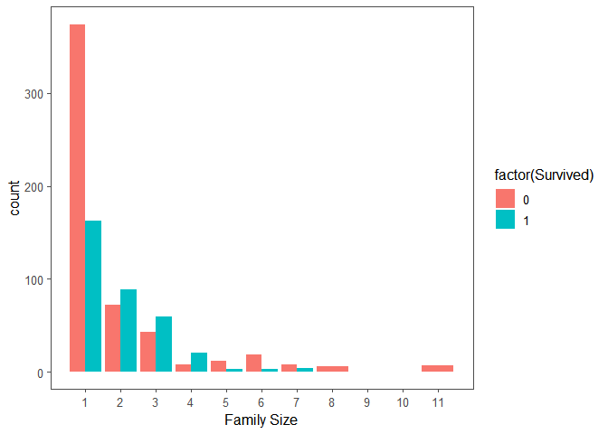<!-- -->

```r
# Discretize family size
full$FsizeD[full$Fsize == 1] <- 'singleton'
full$FsizeD[full$Fsize < 5 & full$Fsize > 1] <- 'small'
full$FsizeD[full$Fsize > 4] <- 'large'

# Show family size by survival using a mosaic plot
mosaicplot(table(full$FsizeD, full$Survived), main='Family Size by Survival',shade = TRUE)
```

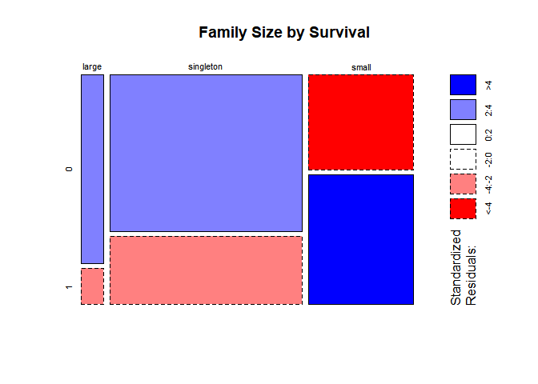<!-- -->

```r
# Create deck variable from Cabin variable
full$Deck=factor(sapply(full$Cabin,function(x) {strsplit(x,NULL)[[1]][1]}))
head(full)
```

```
##   PassengerId Survived Pclass
## 1           1        0      3
## 2           2        1      1
## 3           3        1      3
## 4           4        1      1
## 5           5        0      3
## 6           6        0      3
##                                                  Name    Sex Age SibSp
## 1                             Braund, Mr. Owen Harris   male  22     1
## 2 Cumings, Mrs. John Bradley (Florence Briggs Thayer) female  38     1
## 3                              Heikkinen, Miss. Laina female  26     0
## 4        Futrelle, Mrs. Jacques Heath (Lily May Peel) female  35     1
## 5                            Allen, Mr. William Henry   male  35     0
## 6                                    Moran, Mr. James   male  NA     0
##   Parch           Ticket    Fare Cabin Embarked Title   Surname Fsize
## 1     0        A/5 21171  7.2500              S    Mr    Braund     2
## 2     0         PC 17599 71.2833   C85        C   Mrs   Cumings     2
## 3     0 STON/O2. 3101282  7.9250              S  Miss Heikkinen     1
## 4     0           113803 53.1000  C123        S   Mrs  Futrelle     2
## 5     0           373450  8.0500              S    Mr     Allen     1
## 6     0           330877  8.4583              Q    Mr     Moran     1
##        Family    FsizeD Deck
## 1    Braund_2     small <NA>
## 2   Cumings_2     small    C
## 3 Heikkinen_1 singleton <NA>
## 4  Futrelle_2     small    C
## 5     Allen_1 singleton <NA>
## 6     Moran_1 singleton <NA>
```

```r
# Next step is to perform missing imputations as required.

# Perform missing imputations for Embarked variable
summary(as.factor(full$Embarked))
```

```
##       C   Q   S 
##   2 270 123 914
```

```r
# from the above summary we can see that two observations don't have Embarked value populated.

full %>% filter(Embarked=='') %>% select(PassengerId,Fare,Pclass)
```

```
##   PassengerId Fare Pclass
## 1          62   80      1
## 2         830   80      1
```

```r
# So it is the Passenger ID 62 & 830 for which Embarked value is missing
```

```r
 embark_fare <- full %>%
  filter(PassengerId != 62 & PassengerId != 830)

 # Use ggplot2 to visualize embarkment, passenger class, & median fare
ggplot(embark_fare, aes(x = Embarked, y = Fare, fill = factor(Pclass))) +
  geom_boxplot() +
  geom_hline(aes(yintercept=80), 
    colour='red', linetype='dashed', lwd=2) +
  scale_y_continuous(labels=dollar_format()) +
  theme_few()
```

```
## Warning: Removed 1 rows containing non-finite values (stat_boxplot).
```

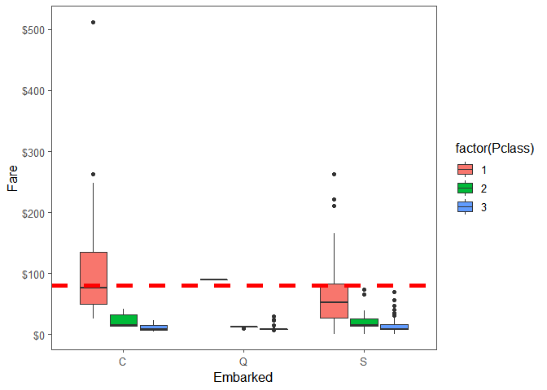<!-- -->

```r
# Since their fare was $80 for 1st class, they most likely embarked from 'C'
full$Embarked[c(62, 830)] <- 'C'
```

```r
# Perform missing imputations for Fare variable
summary(full$Fare)
```

```
##    Min. 1st Qu.  Median    Mean 3rd Qu.    Max.    NA's 
##   0.000   7.896  14.454  33.295  31.275 512.329       1
```

```r
# from the above summary we can see that 1 observations doesn't have Fare value populated.

full %>% filter(is.na(Fare)) 
```

```
##   PassengerId Survived Pclass               Name  Sex  Age SibSp Parch
## 1        1044       NA      3 Storey, Mr. Thomas male 60.5     0     0
##   Ticket Fare Cabin Embarked Title Surname Fsize   Family    FsizeD Deck
## 1   3701   NA              S    Mr  Storey     1 Storey_1 singleton <NA>
```

```r
# So it is the Passenger ID 1044 for which Fare value is missing
```
This is a third class passenger who departed from Southampton (‘S’). Let’s visualize Fares among all others sharing their class and embarkment (n = 494).

```r
ggplot(full[full$Pclass == '3' & full$Embarked == 'S', ], 
  aes(x = Fare)) +
  geom_density(fill = '#99d6ff', alpha=0.4) + 
  geom_vline(aes(xintercept=median(Fare, na.rm=T)),
    colour='red', linetype='dashed', lwd=1) +
  scale_x_continuous(labels=dollar_format()) +
  theme_few()
```

```
## Warning: Removed 1 rows containing non-finite values (stat_density).
```

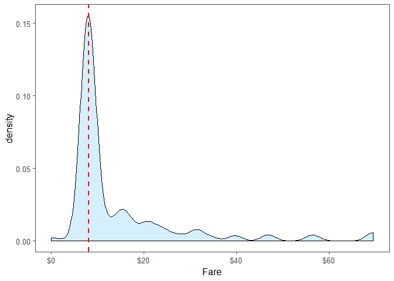<!-- -->

```r
# Replace missing fare value with median fare for class/embarkment
full$Fare[1044] <- median(full[full$Pclass == '3' & full$Embarked == 'S', ]$Fare, na.rm = TRUE)
```


```r
# Perform missing imputation for age variable using MICE package
summary(full$Age)
```

```
##    Min. 1st Qu.  Median    Mean 3rd Qu.    Max.    NA's 
##    0.17   21.00   28.00   29.88   39.00   80.00     263
```

```r
# So there are 263 observations where age variable is missing in the data
#str(full)

# Make variables factors into factors
factor_vars <- c('PassengerId','Pclass','Sex','Embarked',
                 'Title','Surname','Family','FsizeD')

full[factor_vars] <- lapply(full[factor_vars], function(x) as.factor(x))
# Please note that because we are converting to factors we are using lapply, if we use sapply it will not be converted to factor
str(full)
```

```
## 'data.frame':	1309 obs. of  18 variables:
##  $ PassengerId: Factor w/ 1309 levels "1","2","3","4",..: 1 2 3 4 5 6 7 8 9 10 ...
##  $ Survived   : int  0 1 1 1 0 0 0 0 1 1 ...
##  $ Pclass     : Factor w/ 3 levels "1","2","3": 3 1 3 1 3 3 1 3 3 2 ...
##  $ Name       : chr  "Braund, Mr. Owen Harris" "Cumings, Mrs. John Bradley (Florence Briggs Thayer)" "Heikkinen, Miss. Laina" "Futrelle, Mrs. Jacques Heath (Lily May Peel)" ...
##  $ Sex        : Factor w/ 2 levels "female","male": 2 1 1 1 2 2 2 2 1 1 ...
##  $ Age        : num  22 38 26 35 35 NA 54 2 27 14 ...
##  $ SibSp      : int  1 1 0 1 0 0 0 3 0 1 ...
##  $ Parch      : int  0 0 0 0 0 0 0 1 2 0 ...
##  $ Ticket     : chr  "A/5 21171" "PC 17599" "STON/O2. 3101282" "113803" ...
##  $ Fare       : num  7.25 71.28 7.92 53.1 8.05 ...
##  $ Cabin      : chr  "" "C85" "" "C123" ...
##  $ Embarked   : Factor w/ 3 levels "C","Q","S": 3 1 3 3 3 2 3 3 3 1 ...
##  $ Title      : Factor w/ 5 levels "Master","Miss",..: 3 4 2 4 3 3 3 1 4 4 ...
##  $ Surname    : Factor w/ 875 levels "Abbing","Abbott",..: 101 183 335 273 16 544 506 614 388 565 ...
##  $ Fsize      : num  2 2 1 2 1 1 1 5 3 2 ...
##  $ Family     : Factor w/ 928 levels "Abbing_1","Abbott_3",..: 106 191 358 287 16 579 539 654 419 602 ...
##  $ FsizeD     : Factor w/ 3 levels "large","singleton",..: 3 3 2 3 2 2 2 1 3 3 ...
##  $ Deck       : Factor w/ 8 levels "A","B","C","D",..: NA 3 NA 3 NA NA 5 NA NA NA ...
```

```r
# Set a random seed
set.seed(129)


# Columns used Pclass,Sex,Age,SibSp,Parch,Fare,Embarked,Title,Fsize,FsizeD,Deck 

# Perform mice imputation, excluding certain less-than-useful variables:
mice_mod <- mice(full[, !names(full) %in% c('PassengerId','Name','Ticket','Cabin','Family','Surname','Survived')], method='rf')
```

```
## 
##  iter imp variable
##   1   1  Age  Deck
##   1   2  Age  Deck
##   1   3  Age  Deck
##   1   4  Age  Deck
##   1   5  Age  Deck
##   2   1  Age  Deck
##   2   2  Age  Deck
##   2   3  Age  Deck
##   2   4  Age  Deck
##   2   5  Age  Deck
##   3   1  Age  Deck
##   3   2  Age  Deck
##   3   3  Age  Deck
##   3   4  Age  Deck
##   3   5  Age  Deck
##   4   1  Age  Deck
##   4   2  Age  Deck
##   4   3  Age  Deck
##   4   4  Age  Deck
##   4   5  Age  Deck
##   5   1  Age  Deck
##   5   2  Age  Deck
##   5   3  Age  Deck
##   5   4  Age  Deck
##   5   5  Age  Deck
```

```
## Warning: Number of logged events: 50
```

```r
# Save the complete output 
mice_output <- complete(mice_mod)

# Plot age distributions
par(mfrow=c(1,2))
hist(full$Age, freq=F, main='Age: Original Data', 
  col='darkgreen', ylim=c(0,0.04))
hist(mice_output$Age, freq=F, main='Age: MICE Output', 
  col='lightgreen', ylim=c(0,0.04))
```

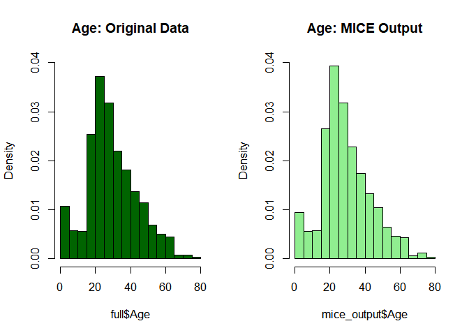<!-- -->

```r
# Replace Age variable from the mice model.
full$Age <- mice_output$Age

# Show new number of missing Age values
sum(is.na(full$Age))
```

```
## [1] 0
```


```r
# Feature engineering-  new age-dependent variables: Child and Mother. A child will simply be someone under 18 years of age and a mother is a passenger who is 1) female, 2) is over 18, 3) has more than 0 children (no kidding!), and 4) does not have the title ‘Miss’.


# First we'll look at the relationship between age & survival
ggplot(full[1:891,], aes(Age, fill = factor(Survived))) + 
  geom_histogram() + 
  # I include Sex since we know (a priori) it's a significant predictor
  facet_grid(.~Sex) + 
  theme_few()
```

```
## `stat_bin()` using `bins = 30`. Pick better value with `binwidth`.
```

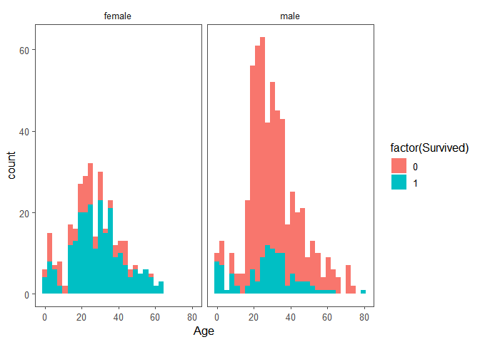<!-- -->

```r
# Create the column child, and indicate whether child or adult
full$Child[full$Age < 18] <- 'Child'
full$Child[full$Age >= 18] <- 'Adult'

# Show counts
table(full$Child, full$Survived)
```

```
##        
##           0   1
##   Adult 481 272
##   Child  68  70
```

```r
# Adding Mother variable
full$Mother <- 'Not Mother'
full$Mother[full$Sex == 'female' & full$Parch > 0 & full$Age > 18 & full$Title != 'Miss'] <- 'Mother'

# Show counts
table(full$Mother, full$Survived)
```

```
##             
##                0   1
##   Mother      16  39
##   Not Mother 533 303
```

```r
# Finish by factorizing our two new factor variables
full$Child  <- factor(full$Child)
full$Mother <- factor(full$Mother)


# md.pattern is part of MICE package and displays missing data patterns
md.pattern(full)
```

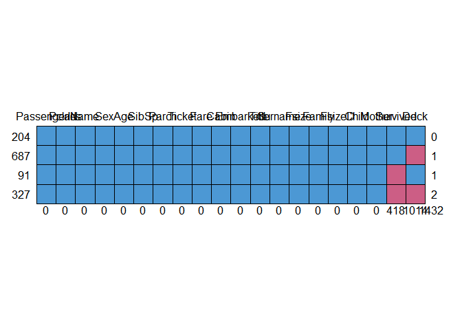<!-- -->

```
##     PassengerId Pclass Name Sex Age SibSp Parch Ticket Fare Cabin Embarked
## 204           1      1    1   1   1     1     1      1    1     1        1
## 687           1      1    1   1   1     1     1      1    1     1        1
## 91            1      1    1   1   1     1     1      1    1     1        1
## 327           1      1    1   1   1     1     1      1    1     1        1
##               0      0    0   0   0     0     0      0    0     0        0
##     Title Surname Fsize Family FsizeD Child Mother Survived Deck     
## 204     1       1     1      1      1     1      1        1    1    0
## 687     1       1     1      1      1     1      1        1    0    1
## 91      1       1     1      1      1     1      1        0    1    1
## 327     1       1     1      1      1     1      1        0    0    2
##         0       0     0      0      0     0      0      418 1014 1432
```


```r
# Model Development and Prediction

# Split the data back into a train set and a test set
train <- full[1:891,]
test <- full[892:1309,]

str(train)
```

```
## 'data.frame':	891 obs. of  20 variables:
##  $ PassengerId: Factor w/ 1309 levels "1","2","3","4",..: 1 2 3 4 5 6 7 8 9 10 ...
##  $ Survived   : int  0 1 1 1 0 0 0 0 1 1 ...
##  $ Pclass     : Factor w/ 3 levels "1","2","3": 3 1 3 1 3 3 1 3 3 2 ...
##  $ Name       : chr  "Braund, Mr. Owen Harris" "Cumings, Mrs. John Bradley (Florence Briggs Thayer)" "Heikkinen, Miss. Laina" "Futrelle, Mrs. Jacques Heath (Lily May Peel)" ...
##  $ Sex        : Factor w/ 2 levels "female","male": 2 1 1 1 2 2 2 2 1 1 ...
##  $ Age        : num  22 38 26 35 35 24 54 2 27 14 ...
##  $ SibSp      : int  1 1 0 1 0 0 0 3 0 1 ...
##  $ Parch      : int  0 0 0 0 0 0 0 1 2 0 ...
##  $ Ticket     : chr  "A/5 21171" "PC 17599" "STON/O2. 3101282" "113803" ...
##  $ Fare       : num  7.25 71.28 7.92 53.1 8.05 ...
##  $ Cabin      : chr  "" "C85" "" "C123" ...
##  $ Embarked   : Factor w/ 3 levels "C","Q","S": 3 1 3 3 3 2 3 3 3 1 ...
##  $ Title      : Factor w/ 5 levels "Master","Miss",..: 3 4 2 4 3 3 3 1 4 4 ...
##  $ Surname    : Factor w/ 875 levels "Abbing","Abbott",..: 101 183 335 273 16 544 506 614 388 565 ...
##  $ Fsize      : num  2 2 1 2 1 1 1 5 3 2 ...
##  $ Family     : Factor w/ 928 levels "Abbing_1","Abbott_3",..: 106 191 358 287 16 579 539 654 419 602 ...
##  $ FsizeD     : Factor w/ 3 levels "large","singleton",..: 3 3 2 3 2 2 2 1 3 3 ...
##  $ Deck       : Factor w/ 8 levels "A","B","C","D",..: NA 3 NA 3 NA NA 5 NA NA NA ...
##  $ Child      : Factor w/ 2 levels "Adult","Child": 1 1 1 1 1 1 1 2 1 2 ...
##  $ Mother     : Factor w/ 2 levels "Mother","Not Mother": 2 2 2 2 2 2 2 2 1 2 ...
```

```r
# Build the model (note: not all possible variables are used)
rf_model <- randomForest(factor(Survived) ~ Pclass + Sex + Age + SibSp + Parch + 
                                            Fare + Embarked + Title + 
                                            FsizeD+Child ,
                                            data = train)
# Show model error
plot(rf_model, ylim=c(0,0.36))
legend('topright', colnames(rf_model$err.rate), col=1:3, fill=1:3)
```

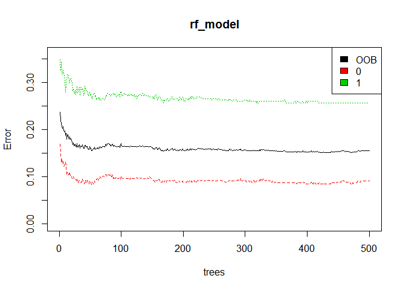<!-- -->

The black line shows the overall error rate which falls below 20%. The red and green lines show the error rate for ‘died’ and ‘survived’ respectively. 

Let’s look at relative variable importance by plotting the mean decrease in Gini calculated across all trees.


```r
# Get importance
importance    <- importance(rf_model)
importance
```

```
##          MeanDecreaseGini
## Pclass          30.815942
## Sex             59.894826
## Age             53.308104
## SibSp           13.002013
## Parch            8.557084
## Fare            63.686725
## Embarked        10.603251
## Title           69.321817
## FsizeD          18.267173
## Child            3.928422
```

```r
varImportance <- data.frame(Variables = row.names(importance), 
                            Importance = round(importance[ ,'MeanDecreaseGini'],2))
varImportance
```

```
##          Variables Importance
## Pclass      Pclass      30.82
## Sex            Sex      59.89
## Age            Age      53.31
## SibSp        SibSp      13.00
## Parch        Parch       8.56
## Fare          Fare      63.69
## Embarked  Embarked      10.60
## Title        Title      69.32
## FsizeD      FsizeD      18.27
## Child        Child       3.93
```

```r
# Create a rank variable based on importance
rankImportance <- varImportance %>%
  mutate(Rank = paste0('#',dense_rank(desc(Importance))))
rankImportance
```

```
##    Variables Importance Rank
## 1     Pclass      30.82   #5
## 2        Sex      59.89   #3
## 3        Age      53.31   #4
## 4      SibSp      13.00   #7
## 5      Parch       8.56   #9
## 6       Fare      63.69   #2
## 7   Embarked      10.60   #8
## 8      Title      69.32   #1
## 9     FsizeD      18.27   #6
## 10     Child       3.93  #10
```

```r
# Use ggplot2 to visualize the relative importance of variables
ggplot(rankImportance, aes(x = reorder(Variables, Importance), 
    y = Importance, fill = Importance)) +
  geom_bar(stat='identity') + 
  geom_text(aes(x = Variables, y = 0.5, label = Rank),
    hjust=0, vjust=0.55, size = 4, colour = 'red') +
  labs(x = 'Variables') +
  coord_flip() + 
  theme_few()
```

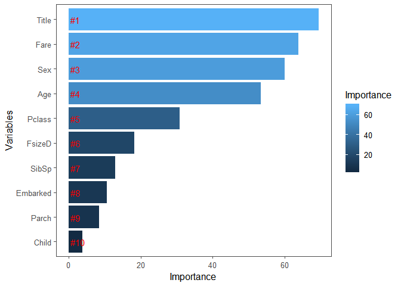<!-- -->


```r
# Predict using the test set
prediction <- predict(rf_model, test)

# Save the solution to a dataframe with two columns: PassengerId and Survived (prediction)
solution <- data.frame(PassengerID = test$PassengerId, Survived = prediction)

# Write the solution to file
write.csv(solution, file = 'rf_mod_Solution.csv', row.names = F)
```

That was it where the Kernel leaded us. Now let us try to use more of our intuition to improve on this score.

Let's try to remove Mother variable as it has the least importance in our variable and see if the score improves.


```r
# Build the model (note: not all possible variables are used)
rf_model <- randomForest(factor(Survived) ~ Pclass + Sex + Age + SibSp + Parch + 
                                            Fare + Embarked + Title + 
                                            FsizeD+Child ,
                                            data = train)
# Show model error
plot(rf_model, ylim=c(0,0.36))
legend('topright', colnames(rf_model$err.rate), col=1:3, fill=1:3)
```

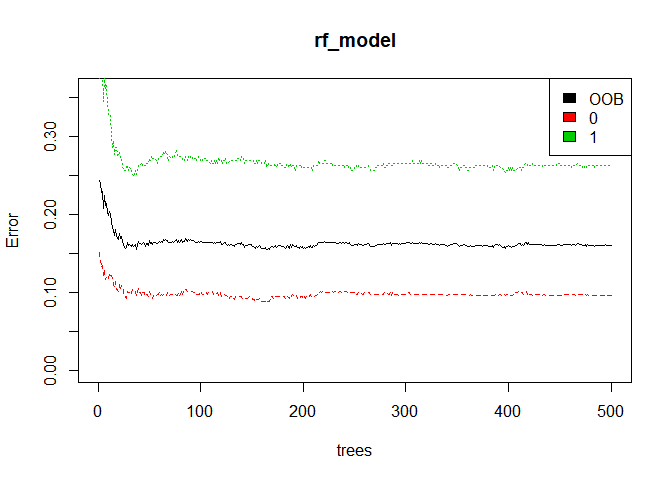<!-- -->

```r
# Get importance
importance    <- importance(rf_model)
importance
```

```
##          MeanDecreaseGini
## Pclass          32.543611
## Sex             50.273179
## Age             52.762135
## SibSp           12.669942
## Parch            8.646894
## Fare            62.933429
## Embarked        10.314444
## Title           77.094697
## FsizeD          18.127270
## Child            4.272368
```

```r
varImportance <- data.frame(Variables = row.names(importance), 
                            Importance = round(importance[ ,'MeanDecreaseGini'],2))
varImportance
```

```
##          Variables Importance
## Pclass      Pclass      32.54
## Sex            Sex      50.27
## Age            Age      52.76
## SibSp        SibSp      12.67
## Parch        Parch       8.65
## Fare          Fare      62.93
## Embarked  Embarked      10.31
## Title        Title      77.09
## FsizeD      FsizeD      18.13
## Child        Child       4.27
```

```r
# Create a rank variable based on importance
rankImportance <- varImportance %>%
  mutate(Rank = paste0('#',dense_rank(desc(Importance))))
rankImportance
```

```
##    Variables Importance Rank
## 1     Pclass      32.54   #5
## 2        Sex      50.27   #4
## 3        Age      52.76   #3
## 4      SibSp      12.67   #7
## 5      Parch       8.65   #9
## 6       Fare      62.93   #2
## 7   Embarked      10.31   #8
## 8      Title      77.09   #1
## 9     FsizeD      18.13   #6
## 10     Child       4.27  #10
```

```r
# Use ggplot2 to visualize the relative importance of variables
ggplot(rankImportance, aes(x = reorder(Variables, Importance), 
    y = Importance, fill = Importance)) +
  geom_bar(stat='identity') + 
  geom_text(aes(x = Variables, y = 0.5, label = Rank),
    hjust=0, vjust=0.55, size = 4, colour = 'red') +
  labs(x = 'Variables') +
  coord_flip() + 
  theme_few()
```

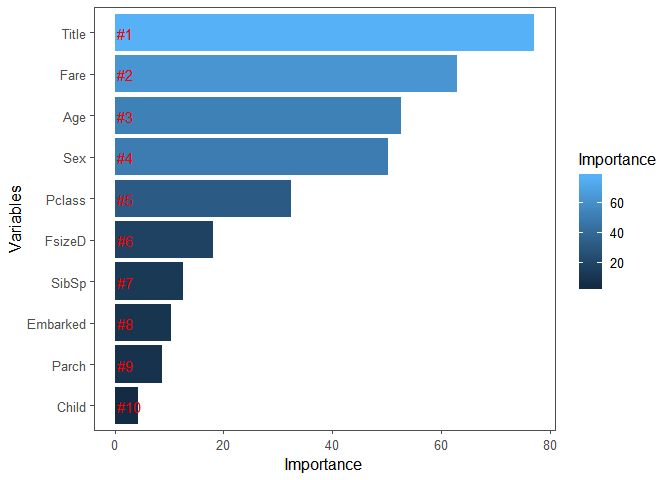<!-- -->

```r
# Predict using the test set
prediction <- predict(rf_model, test)

# Save the solution to a dataframe with two columns: PassengerId and Survived (prediction)
solution <- data.frame(PassengerID = test$PassengerId, Survived = prediction)

# Write the solution to file
write.csv(solution, file = 'rf_mod_Solution.csv', row.names = F)
```


The above code is inspired from kernel:
https://www.kaggle.com/mrisdal/exploring-survival-on-the-titanic

