The below code is inspired from kernel:
https://www.kaggle.com/philippsp/exploratory-analysis-zillow


```r
#install.packages("data.table")
library(data.table)
#install.packages("dplyr")
library(dplyr)
```

```
## 
## Attaching package: 'dplyr'
```

```
## The following objects are masked from 'package:data.table':
## 
##     between, first, last
```

```
## The following objects are masked from 'package:stats':
## 
##     filter, lag
```

```
## The following objects are masked from 'package:base':
## 
##     intersect, setdiff, setequal, union
```

```r
#install.packages("ggplot2")
library(ggplot2)
#install.packages("stringr")
library(stringr)
#install.packages("DT")
library(DT)
#install.packages("tidyr")
library(tidyr)
#install.packages("corrplot")
library(corrplot)
```

```
## corrplot 0.84 loaded
```

```r
#install.packages("leaflet")
library(leaflet)
#install.packages("lubridate")
library(lubridate)
```

```
## 
## Attaching package: 'lubridate'
```

```
## The following objects are masked from 'package:data.table':
## 
##     hour, isoweek, mday, minute, month, quarter, second, wday,
##     week, yday, year
```

```
## The following object is masked from 'package:base':
## 
##     date
```

```r
properties <- fread('properties_2016.csv')
```

```
## Warning in require_bit64(): Some columns are type 'integer64' but
## package bit64 is not installed. Those columns will print as strange
## looking floating point data. There is no need to reload the data. Simply
## install.packages('bit64') to obtain the integer64 print method and print
## the data again.
```

```r
transactions <- fread('train_2016_v2.csv')
sample_submission <- fread('sample_submission.csv')
```

```r
properties <- properties %>% rename(
  id_parcel = parcelid,
  build_year = yearbuilt,
  area_basement = basementsqft,
  area_patio = yardbuildingsqft17,
  area_shed = yardbuildingsqft26, 
  area_pool = poolsizesum,  
  area_lot = lotsizesquarefeet, 
  area_garage = garagetotalsqft,
  area_firstfloor_finished = finishedfloor1squarefeet,
  area_total_calc = calculatedfinishedsquarefeet,
  area_base = finishedsquarefeet6,
  area_live_finished = finishedsquarefeet12,
  area_liveperi_finished = finishedsquarefeet13,
  area_total_finished = finishedsquarefeet15,  
  area_unknown = finishedsquarefeet50,
  num_unit = unitcnt, 
  num_story = numberofstories,  
  num_room = roomcnt,
  num_bathroom = bathroomcnt,
  num_bedroom = bedroomcnt,
  num_bathroom_calc = calculatedbathnbr,
  num_bath = fullbathcnt,  
  num_75_bath = threequarterbathnbr, 
  num_fireplace = fireplacecnt,
  num_pool = poolcnt,  
  num_garage = garagecarcnt,  
  region_county = regionidcounty,
  region_city = regionidcity,
  region_zip = regionidzip,
  region_neighbor = regionidneighborhood,  
  tax_total = taxvaluedollarcnt,
  tax_building = structuretaxvaluedollarcnt,
  tax_land = landtaxvaluedollarcnt,
  tax_property = taxamount,
  tax_year = assessmentyear,
  tax_delinquency = taxdelinquencyflag,
  tax_delinquency_year = taxdelinquencyyear,
  zoning_property = propertyzoningdesc,
  zoning_landuse = propertylandusetypeid,
  zoning_landuse_county = propertycountylandusecode,
  flag_fireplace = fireplaceflag, 
  flag_tub = hashottuborspa,
  quality = buildingqualitytypeid,
  framing = buildingclasstypeid,
  material = typeconstructiontypeid,
  deck = decktypeid,
  story = storytypeid,
  heating = heatingorsystemtypeid,
  aircon = airconditioningtypeid,
  architectural_style= architecturalstyletypeid
)
transactions <- transactions %>% rename(
  id_parcel = parcelid,
  date = transactiondate
)

properties <- properties %>% 
  mutate(tax_delinquency = ifelse(tax_delinquency=="Y",1,0),
         flag_fireplace = ifelse(flag_fireplace=="Y",1,0),
         flag_tub = ifelse(flag_tub=="Y",1,0))
```
 
 

```r
tmp<- transactions %>% mutate(year_month=make_date(year=year(date),month=month(date)))

tmp %>% group_by(year_month) %>% count() %>%
  ggplot(aes(x=year_month,y=n)) + geom_bar(stat="identity", fill="red")+
  geom_vline(aes(xintercept=as.numeric(as.Date("2016-10-01"))),size=2)
```

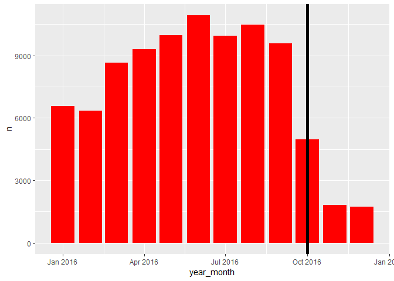<!-- -->
  

```r
transactions %>% ggplot(aes(x=logerror))+ 
  geom_histogram(bins=400,fill="red")+
  theme_bw()+theme(axis.title= element_text(size=16),axis.text= element_text(size=14))+
  ylab("Count")+
  coord_cartesian(x=c(-0.5,0.5))
```

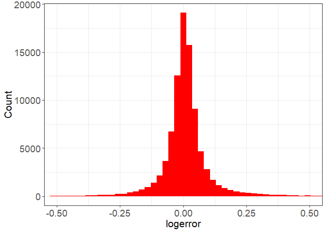<!-- -->

```r
transactions <- transactions %>% mutate(abs_logerror=abs(logerror))

transactions %>% ggplot(aes(x=abs_logerror))+geom_histogram(bins=400, fill="red")+
  theme_bw()+theme(axis.title = element_text(size=16), axis.text=element_text(size=14))+ ylab("Count")+coord_cartesian(x=c(0,0.5))
```

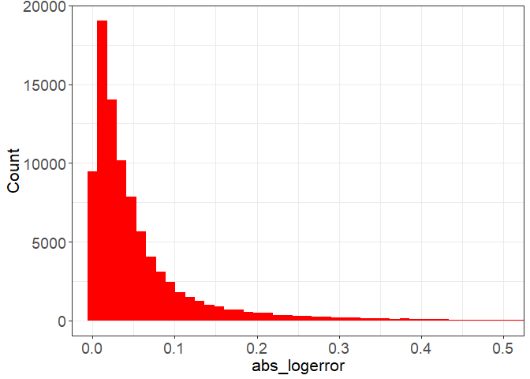<!-- -->

```r
transactions %>% mutate(year_month=make_date(year=year(date),month=month(date))) %>% group_by(year_month) %>% summarize(mean_logerror=mean(logerror)) %>%
  ggplot(aes(x=year_month,y=mean_logerror))+
    geom_line(color="red",size=1.5)+ geom_point(color="red",size=5)+theme_bw()
```

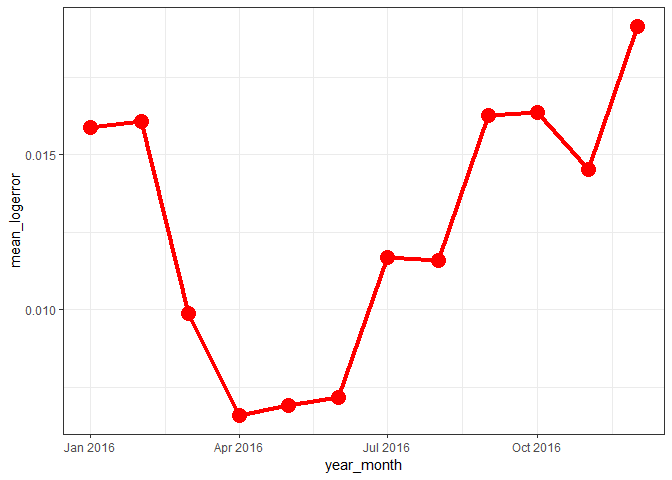<!-- -->

Summarizing the missing information


```r
missing_values<- properties %>% summarise_all(funs(sum(is.na(.))/n()))
#missing_values

missing_values <- missing_values%>% gather(key="feature",value="missing_pct")
missing_values
```

```
##                     feature  missing_pct
## 1                 id_parcel 0.000000e+00
## 2                    aircon 7.281541e-01
## 3       architectural_style 9.979697e-01
## 4             area_basement 9.994546e-01
## 5              num_bathroom 3.839587e-03
## 6               num_bedroom 3.835567e-03
## 7                   framing 9.957695e-01
## 8                   quality 3.506375e-01
## 9         num_bathroom_calc 4.318346e-02
## 10                     deck 9.942731e-01
## 11 area_firstfloor_finished 9.320930e-01
## 12          area_total_calc 1.861339e-02
## 13       area_live_finished 9.246664e-02
## 14   area_liveperi_finished 9.974300e-01
## 15      area_total_finished 9.360857e-01
## 16             area_unknown 9.320930e-01
## 17                area_base 9.926300e-01
## 18                     fips 3.831212e-03
## 19            num_fireplace 8.952716e-01
## 20                 num_bath 4.318346e-02
## 21               num_garage 7.041197e-01
## 22              area_garage 7.041197e-01
## 23                 flag_tub 9.768814e-01
## 24                  heating 3.948845e-01
## 25                 latitude 3.831212e-03
## 26                longitude 3.831212e-03
## 27                 area_lot 9.248875e-02
## 28                 num_pool 8.266344e-01
## 29                area_pool 9.906338e-01
## 30             pooltypeid10 9.876260e-01
## 31              pooltypeid2 9.892554e-01
## 32              pooltypeid7 8.373790e-01
## 33    zoning_landuse_county 0.000000e+00
## 34           zoning_landuse 3.831212e-03
## 35          zoning_property 0.000000e+00
## 36   rawcensustractandblock 3.831212e-03
## 37              region_city 2.105207e-02
## 38            region_county 3.831212e-03
## 39          region_neighbor 6.126238e-01
## 40               region_zip 4.683077e-03
## 41                 num_room 3.843942e-03
## 42                    story 9.994560e-01
## 43              num_75_bath 8.956086e-01
## 44                 material 9.977399e-01
## 45                 num_unit 3.375724e-01
## 46               area_patio 9.730824e-01
## 47                area_shed 9.991133e-01
## 48               build_year 2.007492e-02
## 49                num_story 7.715178e-01
## 50           flag_fireplace 9.982705e-01
## 51             tax_building 1.841809e-02
## 52                tax_total 1.425357e-02
## 53                 tax_year 3.831882e-03
## 54                 tax_land 2.268947e-02
## 55             tax_property 1.046825e-02
## 56          tax_delinquency 0.000000e+00
## 57     tax_delinquency_year 9.810855e-01
## 58      censustractandblock 1.004952e-06
```

```r
missing_values %>% 
  ggplot(aes(x=reorder(feature,-missing_pct),y=missing_pct)) +
  geom_bar(stat="identity",fill="red")+
  coord_flip()+theme_bw()
```

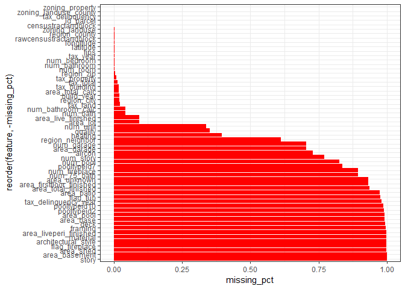<!-- -->

```r
good_features<- filter(missing_values, missing_pct<0.75)
```
 
 
  Correlation with absolute logerror
  
  
  num_ features:

```r
vars <- good_features$feature[str_detect(good_features$feature,'num_')]

cor_tmp<- transactions %>% left_join(properties, by="id_parcel")

tmp<- cor_tmp %>% select(one_of(c(vars,"abs_logerror")))
corrplot(cor(tmp,use="complete.obs"),type="lower")
```

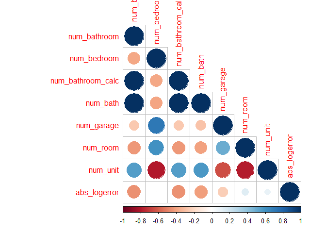<!-- -->

```r
vars<- good_features$feature[str_detect(good_features$feature,"area_")]
vars
```

```
## [1] "area_total_calc"    "area_live_finished" "area_garage"       
## [4] "area_lot"
```

```r
cor_tmp<- transactions %>% left_join(properties,by="id_parcel")
tmp<- cor_tmp %>% select(one_of(c(vars,"abs_logerror")))

corrplot(cor(tmp,use="complete.obs"),type="lower")
```

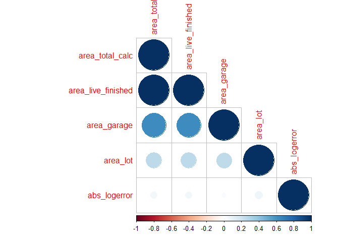<!-- -->
  
  

```r
vars<- setdiff(good_features$feature[str_detect(good_features$feature,"tax_")],c("tax_delinquency","tax_year"))

cor_tmp<- transactions %>% left_join(properties, by="id_parcel")

tmp <- cor_tmp %>% select(one_of(c(vars, "absolute_logerror")))
```

```
## Warning: Unknown columns: `absolute_logerror`
```

```r
corrplot(cor(tmp,use="complete.obs"), type="lower")
```

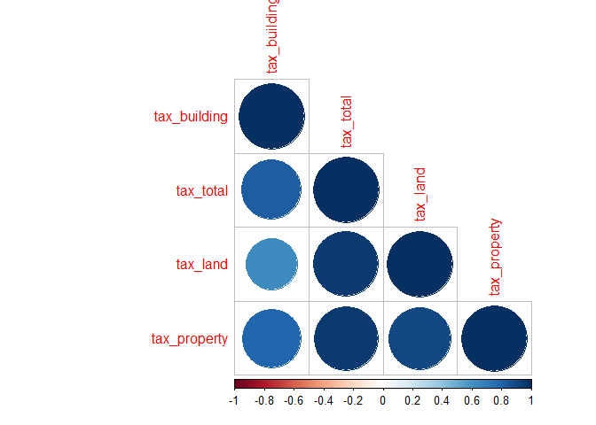<!-- -->

```r
vars <- good_features$feature[str_detect(good_features$feature,'num_')]

cor_tmp <- transactions %>% left_join(properties, by="id_parcel") 
tmp <- cor_tmp %>% select(one_of(c(vars,"logerror")))

corrplot(cor(tmp, use="complete.obs"),type="lower")
```

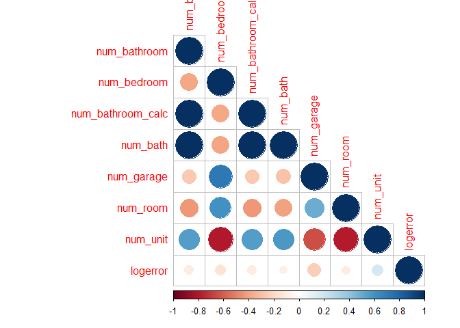<!-- -->
  

```r
vars <- good_features$feature[str_detect(good_features$feature,'area_')]

tmp <- cor_tmp %>%  select(one_of(c(vars,"logerror")))

corrplot(cor(tmp, use="complete.obs"), type="lower")
```

<!-- -->

```r
vars <- setdiff(good_features$feature[str_detect(good_features$feature,'tax_')],c("tax_delinquency","tax_year"))

tmp <- cor_tmp %>%  select(one_of(c(vars,"logerror")))

corrplot(cor(tmp, use="complete.obs"), type="lower")
```

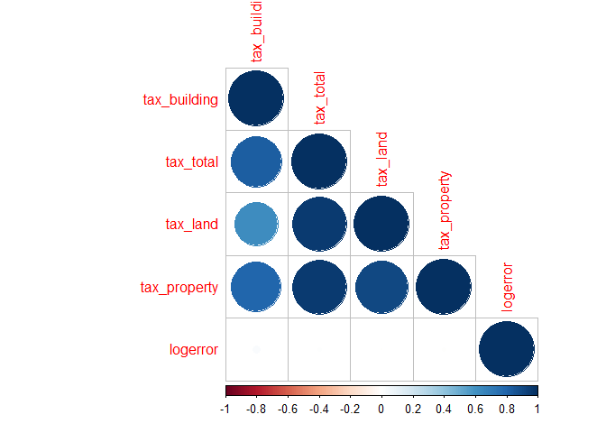<!-- -->
When were the houses built?


```r
#str(cor_tmp)
cor_tmp %>% ggplot(aes(x=build_year)) +geom_line(stat="density",color="red", size=1.2)+theme_bw()
```

```
## Warning: Removed 756 rows containing non-finite values (stat_density).
```

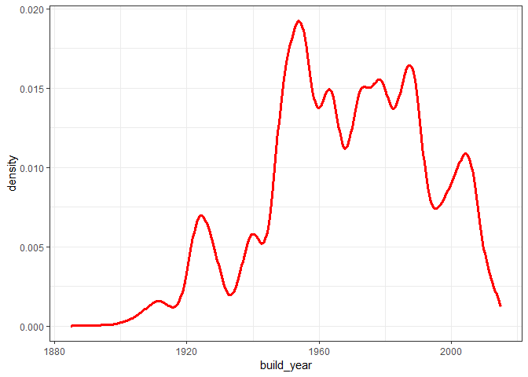<!-- -->


How does the absolute logerror change with build_year?


```r
cor_tmp %>% group_by(build_year) %>% summarise(mean_abslogerror=mean(abs_logerror)) %>% ggplot(aes(x=build_year, y= mean_abslogerror))+geom_smooth(color="grey40")+
  geom_point(color="red")+coord_cartesian(ylim=c(0,0.25))+theme_bw()
```

```
## `geom_smooth()` using method = 'loess' and formula 'y ~ x'
```

```
## Warning: Removed 1 rows containing non-finite values (stat_smooth).
```

```
## Warning: Removed 1 rows containing missing values (geom_point).
```

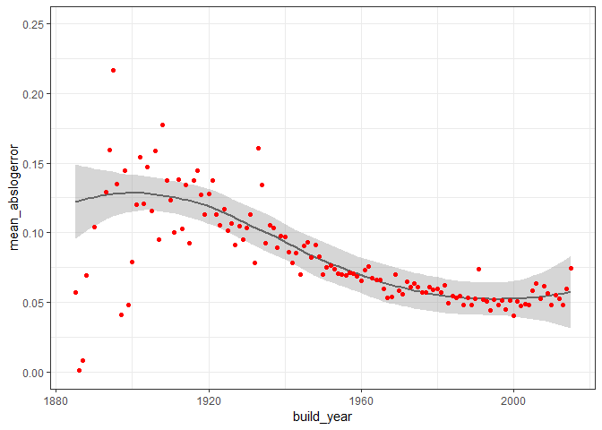<!-- -->

How does the logerror change with build_year?


```r
cor_tmp %>% 
  group_by(build_year) %>% 
  summarize(mean_logerror = mean(logerror)) %>% 
  ggplot(aes(x=build_year,y=mean_logerror))+
  geom_smooth(color="grey40")+
  geom_point(color="red")+coord_cartesian(ylim=c(0,0.075))+theme_bw()
```

```
## `geom_smooth()` using method = 'loess' and formula 'y ~ x'
```

```
## Warning: Removed 1 rows containing non-finite values (stat_smooth).
```

```
## Warning: Removed 1 rows containing missing values (geom_point).
```

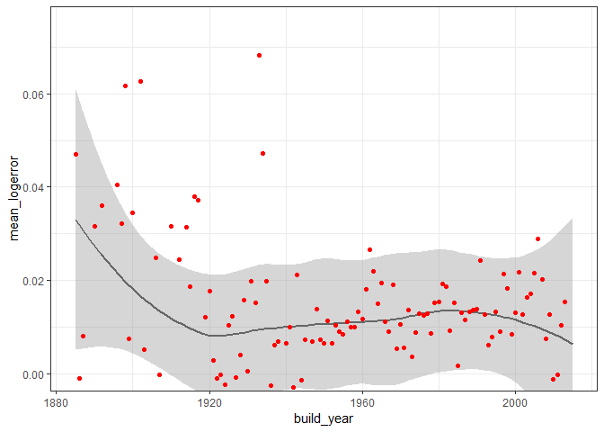<!-- -->

  Where does Zestimate predict well?
  
  To get a quick feel where zestimate predicts well, we can group our absolute logerror into different percentiles, e.g. the percentile with best predictions (top 10%), worst predictions (worst 10%) and typical predictions (50% around the median).
  

```r
transactions <- transactions %>% mutate(percentiles=cut(abs_logerror,quantile(abs_logerror,c(0,0.1,0.25,0.75,0.9,1),names=FALSE),include.lowest = TRUE, labels=FALSE))

head(transactions)
```

```
##   id_parcel logerror       date abs_logerror percentiles
## 1  11016594   0.0276 2016-01-01       0.0276           3
## 2  14366692  -0.1684 2016-01-01       0.1684           5
## 3  12098116  -0.0040 2016-01-01       0.0040           1
## 4  12643413   0.0218 2016-01-02       0.0218           3
## 5  14432541  -0.0050 2016-01-02       0.0050           1
## 6  11509835  -0.2705 2016-01-02       0.2705           5
```
  

```r
tmp1<- transactions %>% filter(percentiles==1) %>% sample_n(5000) %>% left_join(properties,by="id_parcel")

tmp3<- transactions %>% filter(percentiles==3) %>% sample_n(5000) %>% left_join(properties,by="id_parcel")

tmp5<- transactions %>% filter(percentiles==5) %>% sample_n(5000) %>% left_join(properties,by="id_parcel")

tmp1<- tmp1 %>% mutate(type="best_fit")
tmp3<- tmp3 %>% mutate(type="typical_fit")
tmp5<- tmp5 %>% mutate(type="worst_fit")

tmp<-rbind(tmp1,tmp3,tmp5)

tmp<- tmp %>% mutate(type=factor(type, levels=c("worst_fit", "typical_fit","best_fit")))


col_pal<-"Set1"

tmp %>% ggplot(aes(x=latitude,fill=type,color=type))+geom_line(stat="density",size=1.2)+scale_fill_brewer(palette = col_pal)+scale_color_brewer(palette = col_pal) +theme_bw()
```

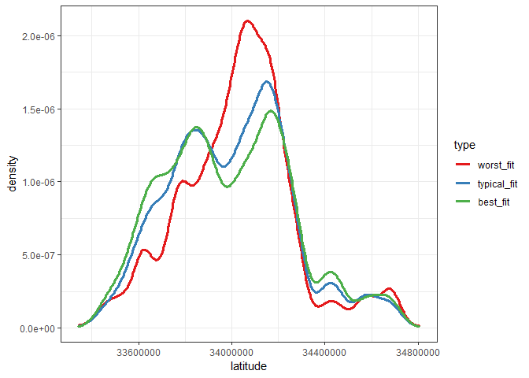<!-- -->

```r
tmp_trans<- transactions %>% left_join(properties,by="id_parcel")
str(transactions)
```

```
## 'data.frame':	90275 obs. of  5 variables:
##  $ id_parcel   : int  11016594 14366692 12098116 12643413 14432541 11509835 12286022 17177301 14739064 14677559 ...
##  $ logerror    : num  0.0276 -0.1684 -0.004 0.0218 -0.005 ...
##  $ date        : chr  "2016-01-01" "2016-01-01" "2016-01-01" "2016-01-02" ...
##  $ abs_logerror: num  0.0276 0.1684 0.004 0.0218 0.005 ...
##  $ percentiles : int  3 5 1 3 1 5 3 5 1 4 ...
```

```r
tmp_trans %>% ggplot(aes(x=latitude,y=abs_logerror))+geom_smooth(color="red")+theme_bw()
```

```
## `geom_smooth()` using method = 'gam' and formula 'y ~ s(x, bs = "cs")'
```

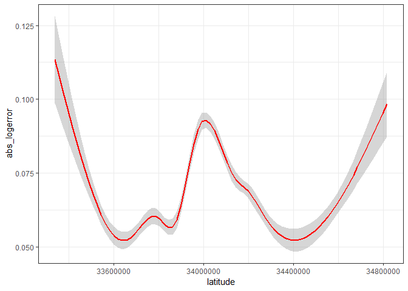<!-- -->

```r
tmp<- transactions %>% mutate(percentiles=cut(transactions$abs_logerror,c(0,0.1,0.25,0.75,0.9,1),labels=FALSE,include.lowest = TRUE),names=FALSE)
cortmp<- tmp %>% left_join(properties,by="id_parcel")

tmp1<- cortmp %>% filter(percentiles==1) %>% mutate(type="best fit")
tmp3<- cortmp %>% filter(percentiles==3) %>% mutate(type="typical fit")
tmp5<- cortmp %>% filter(percentiles==5) %>% mutate(type="worst fit")

tmp<- rbind(tmp1, tmp3, tmp5)

tmp %>% ggplot(aes(x=longitude, y=abs_logerror))+geom_smooth(color="red")+theme_bw()
```

```
## `geom_smooth()` using method = 'gam' and formula 'y ~ s(x, bs = "cs")'
```

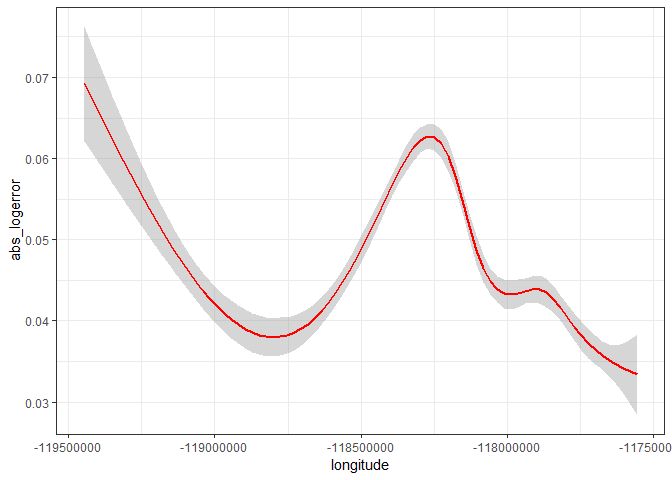<!-- -->

```r
tmp %>% ggplot(aes(x=longitude,fill=type,color=type))+ geom_line(stat="density",size=1.2)+scale_fill_brewer(palette = col_pal)+scale_color_brewer(palette = col_pal)+theme_bw()
```

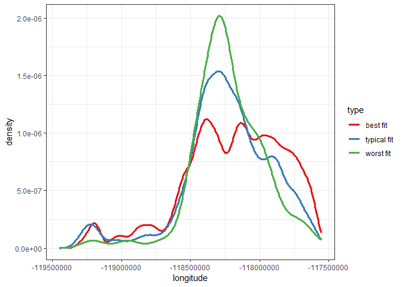<!-- -->

 Where does Zestimate over or underpredict?
A high absolute logerror tells us predictions are not that good. But this could either be driven by underpredicting or overpredicting sale price.


```r
tmp<- tmp %>% mutate(overunder=ifelse(logerror<0,"under","over"))

tmp %>% ggplot(aes(x=latitude,y=abs_logerror,fill=overunder,color=overunder))+geom_smooth(size=1.2)+theme_bw()+scale_fill_brewer(palette=col_pal)+scale_color_brewer(palette = col_pal)
```

```
## `geom_smooth()` using method = 'gam' and formula 'y ~ s(x, bs = "cs")'
```

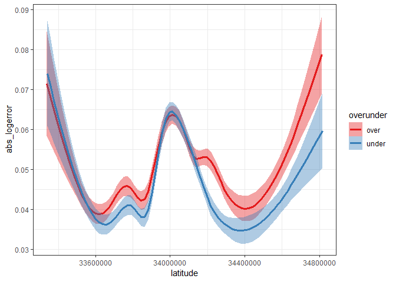<!-- -->

```r
leaflet() %>% addTiles() %>% fitBounds(-118.5,33.8,-118.25,34.15) %>%  addRectangles(-118.5,33.8,-118.25,34.15) %>% 
  addMiniMap()
```

<!--html_preserve--><div id="htmlwidget-91fb62248f7cd4bd7d90" style="width:672px;height:480px;" class="leaflet html-widget"></div>
<script type="application/json" data-for="htmlwidget-91fb62248f7cd4bd7d90">{"x":{"options":{"crs":{"crsClass":"L.CRS.EPSG3857","code":null,"proj4def":null,"projectedBounds":null,"options":{}}},"calls":[{"method":"addTiles","args":["//{s}.tile.openstreetmap.org/{z}/{x}/{y}.png",null,null,{"minZoom":0,"maxZoom":18,"tileSize":256,"subdomains":"abc","errorTileUrl":"","tms":false,"noWrap":false,"zoomOffset":0,"zoomReverse":false,"opacity":1,"zIndex":1,"detectRetina":false,"attribution":"&copy; <a href=\"http://openstreetmap.org\">OpenStreetMap<\/a> contributors, <a href=\"http://creativecommons.org/licenses/by-sa/2.0/\">CC-BY-SA<\/a>"}]},{"method":"addRectangles","args":[33.8,-118.5,34.15,-118.25,null,null,{"interactive":true,"className":"","stroke":true,"color":"#03F","weight":5,"opacity":0.5,"fill":true,"fillColor":"#03F","fillOpacity":0.2,"smoothFactor":1,"noClip":false},null,null,null,{"interactive":false,"permanent":false,"direction":"auto","opacity":1,"offset":[0,0],"textsize":"10px","textOnly":false,"className":"","sticky":true},null]},{"method":"addMiniMap","args":[null,null,"bottomright",150,150,19,19,-5,false,false,false,false,false,false,{"color":"#ff7800","weight":1,"clickable":false},{"color":"#000000","weight":1,"clickable":false,"opacity":0,"fillOpacity":0},{"hideText":"Hide MiniMap","showText":"Show MiniMap"},[]]}],"fitBounds":[33.8,-118.5,34.15,-118.25,[]],"limits":{"lat":[33.8,34.15],"lng":[-118.5,-118.25]}},"evals":[],"jsHooks":[]}</script><!--/html_preserve-->

```r
tmp %>% ggplot(aes(x=num_room, y= abs_logerror, fill=overunder, color=overunder))+geom_smooth()+theme_bw()
```

```
## `geom_smooth()` using method = 'gam' and formula 'y ~ s(x, bs = "cs")'
```

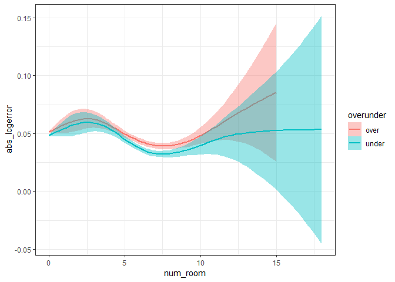<!-- -->

```r
lat <- range(properties$latitude/1e06, na.rm=TRUE)
lon <- range(properties$longitude/1e06, na.rm=TRUE)

tmp<- properties %>% sample_n(2000) %>%
  select(id_parcel, latitude, longitude) %>% 
  mutate(lon=longitude/1e06, lat=latitude/1e06) %>%
  select(id_parcel,lon,lat) %>%
  left_join(transactions, by="id_parcel")

leaflet(tmp) %>%
  addTiles() %>% 
  fitBounds(lon[1],lat[1],lon[2],lat[2]) %>%
  addCircleMarkers(stroke=FALSE) %>%
  addMiniMap()
```

```
## Assuming "lon" and "lat" are longitude and latitude, respectively
```

```
## Warning in validateCoords(lng, lat, funcName): Data contains 9 rows with
## either missing or invalid lat/lon values and will be ignored
```

<!--html_preserve--><div id="htmlwidget-6b144412e6692be36b90" style="width:672px;height:480px;" class="leaflet html-widget"></div>
<script type="application/json" data-for="htmlwidget-6b144412e6692be36b90">{"x":{"options":{"crs":{"crsClass":"L.CRS.EPSG3857","code":null,"proj4def":null,"projectedBounds":null,"options":{}}},"calls":[{"method":"addTiles","args":["//{s}.tile.openstreetmap.org/{z}/{x}/{y}.png",null,null,{"minZoom":0,"maxZoom":18,"tileSize":256,"subdomains":"abc","errorTileUrl":"","tms":false,"noWrap":false,"zoomOffset":0,"zoomReverse":false,"opacity":1,"zIndex":1,"detectRetina":false,"attribution":"&copy; <a href=\"http://openstreetmap.org\">OpenStreetMap<\/a> contributors, <a href=\"http://creativecommons.org/licenses/by-sa/2.0/\">CC-BY-SA<\/a>"}]},{"method":"addCircleMarkers","args":[[34.271175,34.0829,33.4878,34.076493,33.490586,33.949478,33.642,34.079653,34.059798,33.707904,33.977227,34.1287,33.662064,33.889054,33.907274,33.609689,34.1737,33.988136,34.178007,34.024843,33.833995,34.017518,34.095528,33.887706,33.41054,34.066219,34.281413,33.8033,33.916825,34.16853,33.806609,33.7626,34.1254,33.726134,33.834763,34.15273,33.972295,34.004223,34.564875,34.017878,34.070415,34.392786,34.138702,33.901543,34.0592,34.093799,34.15052,33.75011,34.274906,33.459611,33.85442,34.284838,33.738961,33.56834,34.103836,34.182144,34.271023,34.1224,34.242019,34.259837,33.611781,33.746051,33.770312,34.197119,34.285281,34.104097,33.899064,33.924377,33.6197,33.579465,33.789352,34.018543,34.079162,33.970437,33.874614,34.120419,33.613939,33.8321,34.203975,33.907075,33.742034,33.868274,33.733121,34.091636,33.686313,34.1206,33.837623,34.134706,34.00883,33.616782,33.932087,34.565051,33.799363,33.851641,34.050044,34.089896,34.116229,33.66833,34.4879,33.679728,34.5722,33.891429,34.1016,33.630847,34.191669,34.0959,34.046113,34.235301,33.7867,34.560899,33.610717,34.668986,33.812325,34.02641,34.094494,34.002411,34.046076,33.8282,34.08591,33.88948,34.230705,34.003511,33.970794,34.394036,34.090168,34.167946,34.260902,34.054161,33.929046,34.244013,34.2537,34.033486,33.838733,34.129376,33.869713,33.785177,34.125216,34.051291,33.593804,33.6457,34.190864,33.9668,33.840107,34.046839,34.015293,33.7441,34.231857,33.806174,33.988834,33.858921,33.861336,34.045091,33.8247,34.072406,33.694098,34.281688,34.061366,34.059,33.875379,33.742863,34.230779,34.015124,34.048455,33.852413,33.8717,33.923335,33.881574,34.038425,34.169754,33.643133,33.904329,34.063712,34.254342,34.151397,34.513205,33.816,33.855946,34.2337,33.79397,33.993864,34.154751,33.634131,34.139749,34.209704,34.113246,33.991415,34.105272,33.974964,34.194707,33.828124,33.642094,34.176859,33.7895,33.653468,33.824912,34.590828,34.4879,34.038434,33.922228,34.287353,33.72917,34.055232,33.8954,33.617946,33.724321,34.129028,33.782597,33.656552,34.002387,33.626581,34.422603,34.042804,34.032304,34.1553,33.916935,34.098438,34.239335,33.477279,34.088886,33.444649,33.733774,34.1905,33.748664,34.179984,33.981137,34.035277,33.762962,34.121996,33.534541,34.07166,34.286478,34.545265,34.165633,33.579362,34.261855,34.052355,34.07423,33.75458,33.933593,34.248511,34.033618,33.806339,34.250893,34.377385,33.998465,34.155752,33.740014,33.844585,33.782402,34.076065,34.220667,34.006944,33.849128,34.371722,33.572009,33.8431,33.66329,34.162471,33.974197,34.267425,34.435771,33.829397,33.745351,34.04541,34.249287,33.961035,34.0942,34.161613,33.845226,33.828372,33.607961,33.796065,34.376469,34.212008,33.824857,33.623885,34.034225,33.845481,34.61905,34.1778,33.584257,34.098369,34.299697,34.008754,34.208135,34.123978,33.811472,33.941551,34.019057,34.675506,34.466052,34.44158,33.6127,34.23471,34.1862,34.131786,34.182499,33.866961,34.046695,34.166094,33.849383,33.738828,34.159588,34.105124,34.167919,33.956757,34.100988,34.262131,33.655426,33.991804,33.71435,34.42585,33.828458,33.898547,34.173386,33.820117,33.804219,33.916521,34.108662,34.419444,34.055931,34.094438,33.653421,33.604646,34.469876,33.87919,34.185276,33.676061,33.84965,33.829867,34.078324,34.15784,34.165938,34.166545,33.736692,33.649384,34.015765,33.867947,33.846225,34.045478,34.212851,34.0086,34.175375,34.299449,34.115066,33.897126,33.700261,33.8515,33.922835,33.90913,34.192621,34.114875,34.153014,33.915735,34.4282,33.924644,34.283777,33.912489,34.70734,34.178295,34.295167,34.1765,34.201271,33.7085,34.083009,33.978696,34.062714,33.983932,33.898001,34.178261,33.768251,33.703868,33.852448,33.73985,34.1068,33.758658,34.406574,34.107895,33.900988,34.247967,34.130287,33.636893,33.919518,34.156793,33.877623,34.007,33.810756,33.82325,34.003819,33.4937,33.871544,33.851303,34.263992,33.741286,34.587109,33.937405,34.056924,33.87608,34.1372,34.272886,34.230634,34.325846,33.929153,33.959039,33.739473,34.182473,34.223357,33.735956,34.19609,34.160708,33.53896,34.037575,34.159274,33.729083,34.238564,34.561081,34.101332,34.0634,34.238378,34.258654,33.929554,34.234976,33.913725,33.827593,33.627987,33.697836,34.176587,34.194235,33.984522,34.015532,33.574352,33.573643,34.176843,33.719232,33.707005,33.843729,34.238072,34.510111,33.9582,34.202437,34.186126,34.182014,34.229856,33.745141,33.775808,34.108621,33.821159,34.044664,34.073386,33.728249,33.799121,33.867865,33.936354,33.935947,34.07921,33.532993,33.757167,33.7913,34.170881,34.111758,33.9885,34.588631,33.868149,33.657086,33.560834,34.079327,33.8043,34.102628,34.427991,33.636133,33.836714,33.832777,34.080366,33.88613,34.262858,33.90213,34.4551,33.776182,34.164893,33.797176,34.407055,34.412709,34.124361,34.210824,33.652741,33.773225,33.899531,34.209239,33.632026,34.067361,33.707101,34.0945,34.061619,33.663712,34.196607,33.6974,34.261445,33.970506,34.558488,33.83936,33.868776,34.086789,33.496398,34.189466,34.06853,34.175541,33.91291,33.988254,33.7958,33.4938,34.147664,33.9323,33.776885,34.114031,33.888584,33.89693,34.046017,34.268606,34.446561,33.984442,34.174794,34.056967,33.912073,34.3898,34.052502,33.644486,34.275043,33.832289,33.825776,34.243642,33.649714,33.98609,33.979977,34.693916,33.898875,33.839475,34.119817,34.198907,33.560767,34.080561,33.841268,34.238428,33.735472,33.810099,34.130548,33.800045,33.9553,34.162391,34.28395,33.737359,34.20132,34.337589,33.775673,34.158846,34.27231,34.023899,34.244378,34.069591,34.001474,34.196599,34.443883,33.84081,34.077028,34.040493,33.6765,33.507555,34.058907,33.855108,34.262841,33.816963,34.266326,34.036674,33.570718,33.985598,34.218,34.033046,34.177453,34.1679,34.041816,33.652127,34.1549,33.917617,33.614325,33.813598,33.651382,34.275574,34.0725,34.66223,33.724556,33.771786,34.108072,34.050402,34.071883,34.444292,34.091584,33.802456,33.9874,34.390293,33.816336,33.967762,34.302499,34.102134,33.76639,33.853,34.067295,33.838921,33.66575,33.697832,33.807156,34.205388,34.679012,33.647807,34.678376,34.020705,34.059307,34.0747,34.278442,34.0974,34.0567,34.102675,33.656678,34.12599,33.468711,34.253815,33.866765,34.173069,34.260782,34.1944,33.96079,33.690596,34.204585,34.0457,34.235479,34.143794,34.259135,33.967531,34.397598,34.421043,34.1587,33.97009,33.777921,33.940483,33.915666,33.619388,33.967064,33.898144,33.964464,34.461779,34.301135,33.969177,34.189252,34.004346,34.221217,33.627626,33.947688,33.973594,34.137293,33.89993,34.268801,34.255591,33.752691,33.926924,34.231336,33.457284,33.970956,33.7473,34.171108,33.884857,33.819766,34.182691,33.918928,34.163849,33.717769,33.90111,33.802389,34.164968,33.824442,33.838115,34.038782,34.034375,33.692897,34.458211,34.1704,34.21969,34.03399,33.649187,34.0567,33.713693,33.915861,34.067103,33.982285,33.754262,34.205298,34.593201,33.943455,33.855114,34.093294,33.7347,34.077887,34.119751,33.8591,33.92953,34.278763,33.738956,33.943146,33.726983,34.385579,33.671445,33.909671,33.917955,33.951494,33.708486,33.920447,33.901361,34.156949,33.850999,33.9741,33.913067,34.140098,33.853096,34.263029,33.876008,34.267988,34.186071,34.187664,34.019431,33.863685,34.042489,34.00733,34.158045,34.223155,34.238856,34.1383,34.11763,33.642725,33.791136,34.158113,33.9633,33.906157,34.265125,33.7565,33.7895,34.750625,34.034728,33.971928,34.551495,34.1699,34.396886,34.167767,33.791191,33.94025,33.673851,34.143971,33.515476,34.2256,34.033351,34.156857,33.9732,33.960093,34.042609,33.8323,33.906502,34.102155,34.098583,34.444,34.142529,34.2197,33.826774,33.880576,33.76613,33.916581,34.137434,33.6553,33.843638,33.6124,34.106003,33.7589,34.040164,34.23399,33.975247,33.973263,34.0008,33.917495,33.570676,33.88806,34.160242,34.115721,33.774473,34.16968,33.67527,33.782455,34.27166,34.118233,33.484257,33.968421,34.235361,33.99281,34.178591,33.764468,33.8451,34.373507,34.488062,34.451246,33.792945,33.954082,34.4226,33.878616,34.664083,33.759279,33.932458,34.0933,34.272303,34.0729,34.269027,33.833824,33.911083,34.6841,33.581459,33.961161,34.019947,33.760715,34.04448,33.912781,33.855769,34.638824,34.053274,34.583011,34.171925,34.275137,33.9296,34.09109,33.720962,33.857416,34.258295,33.849291,33.763573,33.68727,33.849379,34.0553,33.78369,33.98018,34.170819,34.122721,33.490229,34.00154,33.971264,33.444716,33.870937,34.551033,34.133648,34.033823,34.241415,34.226657,33.579443,33.796677,34.140915,33.833021,33.882375,34.031239,34.381272,33.700168,33.537546,34.424396,34.305527,33.768675,33.767215,33.8405,33.879304,34.100959,34.066163,34.647156,34.050431,33.725131,33.813244,33.812749,33.87185,34.0777,33.831611,33.662774,34.401631,33.998936,34.083596,34.551727,34.255243,33.884578,34.071947,34.266476,34.060647,34.024168,33.798094,33.954121,34.106139,33.680479,34.11729,33.853513,34.151879,34.131341,34.093445,null,33.977309,33.752994,34.39058,33.9582,34.075794,33.980413,33.844301,34.161421,33.656531,34.180732,33.930308,33.818,34.032203,33.881267,33.704585,34.260387,33.820757,33.874218,34.1391,33.555952,34.022017,33.558668,34.2773,34.1378,33.924084,null,34.394492,34.172851,33.877131,34.296532,33.902409,33.800504,34.292997,33.874049,34.0719,33.970533,33.9694,33.783729,34.183935,34.252258,34.281517,34.199789,34.116354,33.820216,33.989927,34.1504,33.849626,33.991393,33.947533,33.984321,33.784187,33.886555,33.835005,33.706182,34.042774,34.24007,34.054282,34.013989,34.049818,34.016941,34.1432,34.207283,33.910507,34.21787,34.2843,33.859213,34.1768,33.761416,33.916301,34.271239,33.840156,33.878596,34.1061,34.1462,33.712662,33.557646,34.232689,34.690298,34.158835,34.074255,34.465097,34.122599,33.668745,33.788443,33.938092,34.218749,34.081189,33.927906,34.007247,33.95724,33.963166,33.7718,34.074671,33.78968,33.935022,34.663671,33.592902,34.01677,33.99154,null,34.142436,34.033168,34.411445,33.836227,34.025848,33.933154,34.180376,34.0868,33.684865,34.221357,34.197043,34.084473,34.066,33.74044,34.024692,34.173086,33.792,34.373964,34.042712,33.626089,33.710683,33.997737,33.991203,34.201959,34.145316,33.7184,33.667541,33.790673,34.005538,33.634368,34.284184,33.934057,34.14544,34.265499,34.383467,33.535411,33.88883,33.829311,33.951675,33.574367,33.802164,34.15925,33.8824,34.144294,33.818113,34.215786,33.8736,33.835187,34.052634,34.109076,33.599327,34.153062,34.684927,34.162729,34.118835,33.7858,33.56686,33.645747,33.657522,34.252108,34.105511,34.195083,33.967239,33.881127,33.912106,33.781365,33.980639,33.867656,34.089323,33.776376,33.572382,34.009616,33.882482,34.080842,34.130316,33.929279,34.4205,33.840982,34.625843,34.220859,33.688115,34.170057,34.1546,33.981516,34.652578,34.232118,33.640053,34.075172,34.219274,33.656169,33.8674,33.76058,34.154926,34.038605,34.102684,33.901592,34.075895,34.034687,33.970669,34.117103,33.721013,34.007789,34.04625,33.96844,33.686081,34.153719,34.3101,33.940346,34.065893,33.684348,33.672936,33.846621,33.593972,34.146891,34.685982,34.243724,34.004366,33.849086,34.026998,34.157719,34.437753,34.076754,34.027487,34.1893,34.278586,33.891376,33.798744,33.749832,33.550377,34.17424,34.14371,33.896716,33.56828,33.549699,34.498984,33.822424,33.809956,34.097354,34.50333,34.071469,33.930063,33.929417,34.263336,33.610785,33.826497,34.680553,33.740396,34.0434,34.394265,33.660287,34.174005,33.892734,33.786852,34.584417,34.618459,34.374384,34.017286,34.13515,33.889803,34.057266,34.11088,33.90863,34.447464,33.777523,34.381601,33.867819,33.799195,34.267534,34.050696,34.119829,34.155736,34.171025,33.819514,33.604738,34.455171,33.993247,34.139327,34.4879,33.986595,33.79318,34.281251,33.845,34.0859,34.452333,34.387645,34.073496,33.685573,33.728906,33.914174,34.558443,34.685128,34.169069,34.0882,33.98591,34.090907,33.8203,33.9846,33.805813,33.923561,33.576189,33.554306,34.003696,34.209719,33.860293,33.942101,34.097774,33.583893,34.166544,34.240174,34.138939,34.083036,33.499525,34.09774,33.811901,33.719158,33.618604,34.06923,34.212982,34.117457,34.099774,33.5073,34.32283,34.033785,33.927058,34.28526,34.2006,33.396157,34.203116,34.087522,34.680492,33.90332,33.781366,33.858005,34.249556,34.1434,33.703013,33.633792,33.7478,34.393589,33.535149,33.75279,33.998146,33.836033,33.428335,34.026864,33.868385,33.91983,33.86072,33.89942,34.103699,34.464384,34.026472,34.2349,33.636698,34.207707,33.722531,33.97428,34.159274,33.995757,33.978318,34.703928,34.2373,33.7008,34.279276,33.96898,34.064755,33.888415,34.233211,33.6999,33.8547,33.899618,34.065446,34.092321,33.733513,34.442624,34.01294,34.14873,33.54559,33.691728,33.942287,34.538752,33.52781,34.073515,33.612729,33.896279,33.782096,34.128267,33.740427,34.161841,34.093034,33.839813,34.081092,33.826286,34.242933,34.096629,33.724661,33.98702,33.771771,33.815524,34.168258,33.964719,34.228604,34.115263,34.072973,33.820416,33.897976,34.0924,33.673278,33.780899,34.05835,33.646074,34.403426,34.011786,34.016151,34.234713,33.95464,34.193856,33.89674,34.005302,34.073622,34.170483,33.681,33.795728,34.1659,33.422581,34.1906,33.683216,34.083859,34.05199,33.698147,34.073536,33.924796,34.3089,34.195564,34.158888,33.8789,34.199499,34.118304,33.853158,34.049453,34.157115,34.192807,34.141112,33.908387,33.659557,33.939974,33.837918,33.667148,33.902755,33.752726,33.946234,33.761954,34.018794,34.01361,33.671919,34.206331,33.894153,33.816653,33.489075,34.210875,33.81577,34.0504,34.052112,33.833465,33.844062,33.520654,33.842012,33.78508,33.652124,34.077375,34.1182,33.459286,34.2256,34.005302,33.895585,33.902413,33.9822,33.694017,34.158321,34.290538,34.043178,33.772577,33.529527,34.2781,34.009356,34.697828,34.0084,34.260686,33.850833,33.629233,33.646255,33.732724,33.881823,34.113253,34.062967,34.442989,34.051603,33.93678,34.033507,34.184534,33.871765,33.892549,34.054163,34.076898,34.178105,33.945302,33.786535,34.19707,33.9564,33.973624,34.165036,34.067423,33.915189,33.940814,34.637868,33.900775,33.809217,33.592609,34.65373,33.60389,33.824807,33.705021,34.154901,33.899786,33.746194,34.085819,33.781777,34.001145,33.983064,34.702763,34.690161,33.896558,34.053467,34.259881,33.546393,34.268349,33.783868,33.893769,33.978219,33.99079,34.03532,33.89282,33.994028,33.791024,34.023497,34.190855,33.613201,34.27888,34.064557,34.178009,34.098721,33.860688,33.887746,33.78248,33.623616,34.115978,34.209822,34.038605,34.076336,34.268981,33.690872,33.752802,33.507871,34.199249,33.850348,33.856109,33.839148,34.117875,33.857859,33.66711,33.733329,33.835947,33.719542,33.697577,34.261929,34.230854,34.053274,33.826794,null,34.090533,34.388447,34.281812,33.8278,33.770485,33.920313,34.169,33.936099,33.930265,33.905385,33.816555,33.947028,33.883516,34.322143,34.031193,33.840587,33.815072,33.837789,34.086168,33.833738,33.894352,33.870184,34.166808,33.856961,33.671923,34.233716,34.404707,34.152873,34.146372,34.145,33.729301,34.099812,34.211295,34.1499,33.688948,34.078961,34.043205,33.895252,34.007661,34.268856,33.862495,34.145234,34.209536,33.549548,34.041713,34.125405,33.834895,33.975125,33.839054,33.877119,33.625547,34.085637,33.89268,33.571902,33.440657,33.980358,34.100427,33.571519,33.698313,34.23787,33.926723,34.083927,33.939465,33.962533,33.793715,34.054818,34.225495,33.681159,33.755429,33.612933,34.04894,34.246894,34.166772,33.540511,33.537562,34.713232,33.66082,null,33.863025,33.874,34.184869,33.996054,33.787558,33.5815,33.8428,34.033779,34.064329,33.786768,33.689211,34.147323,33.749612,34.44709,33.72723,34.234278,34.043583,33.640949,34.0166,34.034239,34.1421,33.965202,34.196821,33.834726,34.211602,34.187145,33.775057,34.201361,33.761658,34.155357,34.212447,33.989422,34.452468,34.241824,34.41561,33.746086,33.580737,33.89376,34.208023,34.277074,33.802823,33.973014,34.281442,33.792851,34.193266,34.082062,34.245434,34.0451,34.176068,34.062699,33.887201,33.881549,33.931642,34.12903,34.07893,33.9064,34.113601,33.852673,34.203,34.457696,33.900413,34.156731,33.774855,33.8134,33.950231,34.044074,34.216166,34.213897,33.818627,33.7504,34.283492,34.136049,33.861255,34.1965,33.98125,33.875881,34.1559,34.205511,33.987137,33.915186,33.98718,34.251691,33.940766,33.787033,34.111257,34.024504,33.786982,33.93214,34.0564,33.62541,34.189473,34.293216,34.210094,33.917515,33.715718,34.008881,34.18912,33.999542,34.004144,34.2175,34.672184,33.923266,33.914,33.809435,34.064902,33.801377,33.774432,34.242946,34.078737,33.742084,34.013425,33.958304,33.881127,33.911102,34.130996,33.502444,33.726465,34.245573,34.010433,33.979971,34.289573,33.6062,33.793963,34.07787,33.904741,33.87461,34.045061,34.205521,33.9943,34.1021,33.816068,33.95226,33.814575,33.526126,34.024753,33.993154,34.169024,34.355792,33.70488,34.167944,33.609932,34.094985,34.178333,33.996495,33.685985,34.232124,34.1487,34.1571,33.565412,33.992956,34.037202,34.1028,34.471854,34.110188,33.925533,34.03475,34.173604,34.142857,34.027582,34.008724,33.661703,33.905884,34.046642,34.074195,33.8986,33.969074,34.114209,33.907575,34.109104,34.200699,34.040626,34.164742,34.010722,33.991906,34.026573,33.561002,34.204004,33.794279,33.997383,null,34.038656,33.736175,34.122539,33.664835,33.748536,34.401921,33.833193,34.110825,33.83545,null,34.172476,33.865241,34.279906,34.164766,34.145619,33.729265,33.861736,33.6249,34.60544,34.190667,34.091576,33.860026,34.20673,34.43523,34.04928,33.973354,33.789707,33.86019,33.643909,33.737469,33.973,34.214119,34.1583,34.024182,34.182402,34.0304,33.451537,33.719665,33.9749,34.02684,34.053168,34.0919,33.498987,34.275899,33.943615,34.04002,33.884183,34.140351,33.634565,33.851476,null,34.1571,33.84979,34.085145,null,34.267663,33.598782,33.937483,34.00487,34.102561,33.763819,33.8479,34.415115,34.711678,33.8979,33.834511,34.13498,34.003725,34.085938,34.0901,34.1751,33.674344,34.263912,34.084722,34.632625,34.1683,33.844204,34.170653,34.692829,33.894563,33.857546,33.969365,34.117891,34.198724,34.163475,33.818512,34.56674,33.636442,34.1417,33.769169,33.899794,34.116842,34.653485,34.164598,34.0507,33.77843,34.255447,33.844877,33.863448,33.743902,34.168554,33.793929,34.081112,33.883866,33.8282,34.026759,34.16095,33.890174,33.838202,33.643085,33.742729,34.035768,34.223793,33.936545,34.156637,33.90109,34.101985,33.798034,34.115403,33.94921,33.823735,34.158781,33.86897,34.2589,34.188358,34.035767,33.778577,33.855053,33.917839,33.7392,34.034991,34.014099,34.077868,33.973396,33.897841,33.796579,34.279347,33.773,34.13473,33.645633,34.228455,34.146184,34.216527,33.917572,33.842401,34.263398,33.911295,33.746737,34.121626,33.756782,34.061879,34.692389,34.232957,33.7385,33.74928,33.939672,33.740587,33.893638,34.252507,34.192001,34.117716,33.862943,34.100772,33.679862,34.398326,34.242855,33.84591,34.372207,33.73616,34.02216,33.60633,33.7528,34.405051,33.791713,33.751506,34.051939,33.680905,33.94199,34.430282,33.9879,34.214886,33.552796,34.158332,33.833909,34.039559,34.36915,34.316857,33.638116,34.586012,34.201688,33.865467,34.298234,34.113598,34.19738,33.870375,33.694396,33.772725,33.902137,33.995995,34.099908,33.94987,33.734489,34.041669,33.844836,33.470281,34.051863,34.046488,33.794875,34.15774,33.973686,34.168,34.089041,33.863887,34.096363,34.175715,33.42417,34.065643,34.117603,33.828026,33.86307,34.620462,33.693005,34.4202,33.833237,33.9843,34.144506,33.6611,33.832429,34.200713,33.878763,34.190567,33.444499,33.489223,33.851893,34.052096,33.894091,33.705287,33.833009,33.797079,34.451325,33.929167,33.69304,34.096429,33.832609,34.455751,34.515016,34.343306,34.2744,34.148446,33.748276,34.1835,34.008476,34.016996,33.825283,33.886157,34.304132,33.939355,34.222097,33.780668,33.831434,34.275665,33.980463,34.241501,34.5863],[-118.506316,-118.332,-117.67,-117.980363,-117.725216,-118.267639,-117.937,-118.34738,-118.170233,-117.63044,-117.969212,-118.066,-117.982639,-118.260814,-117.857874,-117.881849,-118.431,-118.08172,-118.906036,-118.386689,-117.847706,-117.974122,-118.209204,-117.806313,-117.592214,-118.648764,-118.471201,-118.004,-117.946874,-119.164283,-117.952784,-118.142,-118.068587,-117.923501,-118.154962,-118.542621,-117.903768,-118.483381,-118.050783,-118.082388,-117.876032,-118.477466,-117.773451,-117.850451,-118.132,-118.422916,-118.15847,-117.972899,-119.157222,-117.631323,-118.034558,-118.522136,-117.889557,-117.730272,-118.052013,-118.520573,-118.456119,-118.058,-118.521227,-118.746963,-117.92473,-117.986883,-118.3398,-118.621797,-118.456573,-118.153375,-118.006557,-117.860294,-117.716,-117.644995,-117.77238,-117.817285,-118.029116,-118.159722,-118.04912,-118.019442,-117.674226,-118.014,-118.208978,-118.10556,-118.101535,-118.372771,-117.781946,-118.169507,-117.673777,-118.066883,-117.976165,-118.589634,-118.30614,-117.73754,-117.918637,-118.075583,-118.156871,-118.12744,-118.12992,-118.599778,-118.276092,-117.798208,-118.172,-118.028044,-118.053,-118.339491,-117.848,-117.868104,-118.310796,-118.342,-117.766014,-118.983987,-118.074,-118.068534,-117.835048,-118.071869,-118.038766,-117.896979,-117.828198,-118.245281,-118.472582,-117.896683,-118.152559,-117.775294,-118.418605,-118.437846,-117.901629,-118.520702,-117.962041,-118.986589,-118.289538,-118.195386,-118.148827,-118.880384,-118.53,-117.837032,-117.850707,-117.984728,-118.383997,-117.907493,-118.235519,-117.786363,-117.626548,-117.598692,-118.527934,-118.456,-117.992358,-118.097828,-118.391234,-117.984,-118.50016,-118.131573,-118.050791,-118.135274,-117.971213,-118.334942,-118.333,-117.784171,-117.78665,-119.263193,-117.741752,-118.468,-118.169651,-117.946373,-118.389463,-118.267802,-118.149415,-117.984962,-118.084574,-118.145343,-118.356034,-117.987463,-118.34263,-117.672409,-117.875102,-118.277879,-119.169312,-118.097055,-118.227008,-117.997,-117.94694,-118.454,-118.312981,-118.297633,-118.554006,-117.629414,-118.207558,-118.556753,-117.829859,-118.323478,-117.736903,-117.864981,-119.242163,-117.893965,-117.895572,-118.624592,-118.161,-117.634264,-118.035703,-118.179326,-118.172,-118.529163,-117.976415,-118.49619,-117.75499,-118.126236,-118.239,-117.614707,-117.859758,-118.661502,-118.076321,-117.98918,-118.346413,-117.704506,-118.49062,-118.291247,-117.734507,-118.395,-117.999514,-117.851417,-118.428351,-117.65807,-117.980564,-117.595842,-117.957117,-118.484,-117.909218,-118.792498,-117.955346,-118.509168,-117.879231,-117.799862,-117.765886,-117.829495,-118.619547,-118.072852,-119.162861,-117.703009,-118.428288,-118.175569,-117.99442,-117.94389,-118.213246,-118.876686,-118.372272,-118.294085,-118.344216,-118.523121,-118.28887,-118.572469,-117.804023,-117.925518,-117.966119,-118.10654,-118.510743,-118.307194,-117.826344,-118.558041,-117.70723,-118.291,-117.961234,-118.278087,-118.194715,-118.492921,-119.279786,-118.051165,-117.938428,-117.913407,-118.438208,-118.366403,-117.725,-118.481946,-118.01953,-118.053049,-117.898291,-118.185963,-118.50924,-118.355842,-118.372483,-117.858893,-117.746046,-117.83391,-117.823301,-118.531,-117.652578,-117.865929,-118.858925,-118.473696,-118.656102,-118.188118,-118.209423,-118.117124,-118.39414,-118.241005,-118.490507,-118.556861,-117.742,-119.01875,-118.304,-117.873238,-118.339952,-117.798369,-117.96841,-118.415795,-118.37473,-117.97547,-118.098017,-118.038933,-118.275192,-118.42222,-117.88407,-118.307232,-117.895441,-118.314338,-118.016432,-119.290407,-118.073141,-118.178119,-118.842946,-118.092679,-117.942564,-117.918036,-118.083809,-118.462595,-118.373742,-118.376964,-117.922647,-117.889514,-118.563663,-118.066702,-118.648743,-117.997911,-118.064358,-117.766644,-118.060129,-118.610206,-118.596853,-119.174473,-117.809805,-117.685451,-118.300805,-118.306857,-118.149429,-118.105264,-118.518047,-117.816,-118.442012,-118.455381,-118.31621,-117.982088,-117.957065,-117.909,-118.270815,-117.988931,-118.132891,-118.013271,-118.668874,-118.204476,-118.562,-118.211833,-118.725297,-118.078892,-118.118477,-118.333637,-118.428743,-118.538,-118.919812,-117.756,-118.333982,-117.86276,-118.4324,-118.376493,-117.857204,-118.433926,-117.879775,-117.950654,-117.755137,-118.392178,-118.322,-118.310625,-118.561537,-118.299476,-117.993965,-118.543218,-117.879046,-117.627847,-118.251843,-118.697857,-118.179962,-118.473,-118.030092,-118.221949,-118.453659,-117.656,-118.387605,-118.354302,-119.226089,-117.874811,-118.177175,-118.025796,-118.390142,-117.932053,-118.131,-119.179633,-119.032303,-118.429892,-118.419928,-118.204045,-117.900834,-118.142438,-118.595537,-117.870507,-118.862153,-118.430835,-117.770663,-118.454561,-118.340946,-118.061249,-119.060993,-118.026595,-118.172251,-118.433,-118.457584,-118.785327,-118.263926,-118.422364,-118.090086,-117.840211,-117.656894,-117.76743,-118.398092,-118.635073,-118.118817,-118.405082,-117.721883,-117.720635,-118.463735,-118.288578,-117.772151,-118.011072,-118.248883,-118.183912,-118.436,-118.317223,-118.117516,-118.40247,-118.972991,-118.310069,-118.365307,-118.284007,-117.809259,-118.265269,-118.351596,-117.76076,-118.385109,-118.221492,-118.023622,-118.317639,-117.721006,-117.684821,-118.040351,-117.897,-118.610067,-118.419316,-118.456,-118.160549,-117.779482,-117.912583,-117.640496,-117.972095,-117.89,-118.06324,-119.29064,-117.594464,-117.990698,-118.182136,-117.846536,-117.730686,-118.592422,-117.779612,-118.511,-117.799565,-118.757929,-118.013647,-118.581471,-118.581365,-118.32257,-118.624682,-117.952463,-118.147673,-117.996256,-118.198542,-117.910055,-117.746606,-117.768144,-118.188,-118.054036,-117.61462,-118.91588,-117.902,-118.592604,-117.906886,-118.142742,-118.049153,-118.292579,-118.219796,-117.706206,-118.498473,-118.152139,-118.379304,-118.357577,-118.058537,-118.167,-117.667,-118.023415,-118.162,-117.793392,-117.782191,-118.066641,-118.071723,-118.157469,-119.202927,-118.555566,-118.201169,-118.427185,-118.187964,-118.330921,-118.579,-118.207039,-117.877098,-118.755786,-118.192183,-118.314257,-118.562135,-117.646708,-117.880996,-118.265024,-118.127087,-117.952143,-118.325073,-117.917872,-118.317172,-117.736548,-118.185837,-117.978026,-118.660015,-117.877888,-117.968752,-117.915174,-118.293567,-118.436,-118.459703,-118.420516,-117.963591,-118.842313,-119.080228,-118.271281,-118.445277,-118.756517,-118.402028,-118.353956,-118.477543,-118.46508,-118.40612,-119.245441,-118.285978,-117.882755,-118.492295,-117.848,-117.666361,-118.047847,-118.178847,-118.748365,-118.288302,-118.747721,-118.861937,-117.707973,-118.376458,-118.242,-118.207712,-118.983627,-118.527,-118.617006,-117.704009,-118.431,-118.285184,-117.672323,-118.011037,-117.703931,-118.760769,-118.164,-118.169088,-118.055466,-117.923345,-117.769678,-117.846466,-117.725981,-118.544055,-117.958819,-118.348704,-117.908,-118.581845,-118.28551,-118.390537,-118.441691,-118.141887,-118.143573,-118.096988,-118.106043,-118.013948,-117.798401,-117.969828,-118.196381,-118.559372,-118.107251,-117.758071,-118.179575,-118.487681,-117.930492,-118.389,-119.193538,-118.187,-118.316562,-117.759472,-117.611762,-118.177036,-117.655367,-119.170032,-118.078576,-119.171319,-118.665107,-118.42,-118.430316,-117.78775,-118.639244,-118.198,-118.243826,-118.223164,-118.99999,-118.318332,-118.543162,-118.441199,-118.405,-118.278787,-117.953958,-118.093724,-118.289928,-117.652765,-117.892778,-118.092778,-117.849019,-118.562516,-118.456533,-118.144756,-118.162993,-118.389444,-118.887111,-117.657977,-118.03129,-118.076365,-118.11804,-117.98989,-118.449392,-118.593594,-117.85799,-117.979489,-119.067774,-117.60559,-118.040766,-117.803827,-118.841948,-118.397123,-117.925241,-118.105973,-117.956496,-118.315347,-117.97392,-118.213705,-118.268634,-118.834247,-118.378704,-118.152921,-118.380168,-117.917443,-117.961263,-118.494952,-118.599,-118.628824,-118.328313,-117.593937,-118.412,-117.763825,-117.913589,-118.451017,-118.323317,-118.122232,-118.480846,-118.16833,-118.296825,-118.13009,-117.842005,-118.3,-118.312922,-118.425241,-118.37,-117.977418,-119.237072,-117.891129,-118.25874,-117.902426,-118.576684,-117.812454,-117.984125,-118.160662,-118.007734,-118.013423,-118.284241,-118.241045,-118.962701,-118.056364,-118.427,-118.012389,-117.898076,-118.245209,-118.486325,-117.855279,-118.44843,-118.642704,-119.192027,-118.395842,-117.938506,-118.560599,-118.346586,-118.560258,-118.585135,-118.499706,-118.23,-118.265021,-117.633195,-118.028079,-118.52009,-118.361,-118.152893,-119.231489,-117.842,-118.161,-118.273895,-118.406015,-118.387078,-118.029432,-118.379,-118.483119,-118.074961,-118.305534,-118.216038,-117.803677,-117.888834,-117.665184,-118.365,-117.797503,-119.149683,-118.361,-118.196885,-118.35905,-117.761307,-118.144451,-118.206125,-117.776005,-119.262,-118.377276,-118.835442,-117.772878,-118.390093,-118.301912,-118.116625,-118.236712,-117.913,-117.858905,-117.737,-118.285714,-118.13,-118.355225,-119.014771,-117.864854,-118.05393,-118.356,-118.107575,-117.709281,-118.19786,-118.939741,-118.229963,-118.142463,-118.959024,-117.978318,-118.305367,-118.409105,-118.313708,-117.676544,-118.323569,-118.509491,-118.357388,-119.228088,-117.89942,-118.068,-118.554412,-118.621357,-118.508368,-118.256216,-117.992289,-118.451,-117.858248,-118.204271,-118.321606,-118.287412,-118.138,-119.175619,-118.383,-119.236819,-117.760921,-118.255187,-118.182501,-117.714527,-118.089213,-118.112397,-117.815077,-118.469684,-118.232292,-118.169276,-118.240636,-118.139114,-118.082576,-119.192422,-118.480164,-118.004,-118.065606,-117.97413,-117.944976,-118.736317,-117.798072,-118.155821,-117.925154,-118.190365,-118.445,-118.356405,-118.380429,-118.118983,-118.050143,-117.727497,-118.34219,-118.076058,-117.649763,-118.40026,-118.067648,-118.070303,-117.917958,-119.012632,-119.171043,-117.649136,-118.212292,-118.416288,-118.357151,-118.170256,-118.101347,-118.558818,-117.947107,-117.724307,-119.291088,-118.440184,-117.904135,-118.145758,-118.101893,-118.328102,-118.043761,-118.277087,-118.221185,-117.845017,-118.073573,-117.960288,-118.191127,-118.106641,-117.993,-117.924178,-117.995442,-118.420194,-118.278255,-118.093069,-118.07959,-118.605568,-118.110493,-118.489939,-118.31944,-118.023937,-118.32538,-118.323741,-118.252013,-117.760498,-117.912549,-117.729292,-118.045562,-117.908579,-117.90368,-117.727895,null,-118.254074,-118.037928,-118.540843,-118.385,-118.264024,-117.827272,-118.051453,-118.808317,-117.933436,-118.520823,-118.274854,-118.32,-117.745732,-117.782465,-117.893525,-118.417657,-117.891165,-118.404033,-117.892,-117.690013,-118.417707,-117.694442,-119.164,-118.256,-118.19399,null,-118.536487,-118.276588,-118.306946,-118.845814,-118.202308,-118.400565,-119.152859,-118.088621,-118.379,-118.362554,-118.428,-117.912532,-119.226642,-118.885107,-118.510272,-118.485271,-117.896616,-118.312784,-118.28242,-118.123,-118.190325,-118.337184,-118.366394,-118.365362,-118.143045,-118.198324,-118.017993,-117.780114,-118.033643,-118.467832,-117.733629,-118.436478,-118.385904,-117.896015,-117.922,-118.678631,-118.346281,-118.233756,-118.47,-118.340884,-118.534,-118.032724,-118.155547,-118.551142,-117.968501,-117.934276,-118.32,-119.196,-118.013351,-117.728402,-118.459801,-118.125672,-118.001054,-118.01509,-118.174724,-118.164137,-117.994744,-118.177293,-118.026813,-118.999919,-118.105412,-118.362623,-118.085262,-118.118437,-118.075824,-118.03,-118.400143,-118.134784,-118.209353,-118.401859,-117.862348,-118.110592,-118.42566,null,-118.471753,-118.368654,-118.569246,-118.08649,-118.382428,-117.889583,-119.219838,-118.372,-117.623145,-118.423712,-118.541934,-118.026862,-118.394,-117.996134,-118.329911,-119.230687,-117.885,-118.559862,-118.209056,-117.824824,-117.87759,-118.251756,-117.892272,-118.436663,-117.995457,-117.887,-117.817958,-118.201812,-118.48395,-117.873722,-118.432114,-118.133436,-117.900685,-118.435892,-118.54063,-117.778126,-118.078538,-118.039025,-118.269434,-117.680183,-118.12261,-118.451208,-118.176,-118.197578,-117.988917,-119.189944,-117.892,-118.24138,-118.02889,-117.909078,-117.731819,-118.473912,-118.149182,-118.333345,-117.698804,-117.761,-117.663901,-117.758162,-117.897943,-118.296481,-118.088698,-118.502193,-118.18931,-117.96051,-118.260226,-118.302347,-118.286508,-118.165345,-118.269603,-118.164265,-117.722113,-118.068973,-117.934832,-117.848156,-118.382033,-118.313617,-118.452,-118.122596,-117.837512,-118.446009,-117.628285,-118.31645,-118.439,-118.278733,-118.225402,-118.528025,-117.569235,-118.158192,-118.852033,-117.656814,-118.005,-118.134012,-118.232377,-117.932259,-118.382707,-118.077765,-118.231896,-118.009171,-118.139258,-117.804598,-118.053799,-118.126501,-118.050807,-118.026731,-117.795053,-118.514239,-118.436,-118.232278,-117.79195,-117.902329,-117.948721,-117.922461,-117.6389,-118.823269,-118.192621,-119.173992,-118.333834,-117.983204,-118.187367,-119.161665,-118.535214,-118.173764,-117.806436,-118.548,-118.438129,-118.101121,-118.106532,-117.962942,-117.63543,-118.132442,-117.911024,-118.019192,-117.583732,-117.642583,-118.167311,-117.949558,-118.29629,-117.803347,-117.907675,-117.953476,-118.204633,-118.257873,-118.583798,-117.669218,-117.776038,-118.087153,-117.80572,-118.47,-118.552395,-117.972191,-118.336915,-117.811949,-117.842067,-118.090272,-118.200213,-118.555978,-118.124346,-118.475567,-117.937304,-118.481839,-117.791135,-118.359331,-119.236034,-118.043986,-118.560901,-118.302924,-118.305502,-118.757407,-118.495143,-118.153261,-119.162661,-118.409097,-118.060593,-117.905707,-118.520977,-117.844933,-118.079438,-118.172,-117.964708,-118.272465,-119.226652,-117.869564,-118.128,-119.279317,-118.550083,-117.93099,-118.007949,-117.791892,-118.062955,-118.076431,-118.079803,-118.321402,-118.118,-117.948779,-117.850292,-118.318,-118.445,-118.324303,-118.071268,-117.736695,-117.630875,-117.813795,-118.333747,-118.363136,-118.36587,-118.087941,-117.720746,-118.606794,-118.457268,-117.826452,-118.204137,-117.639707,-118.049578,-118.20117,-118.020767,-117.613726,-118.454597,-118.604437,-117.771929,-117.795602,-117.744898,-118.422993,-118.201561,-117.974408,-118.692734,-118.472,-117.595664,-118.184863,-117.944481,-118.150544,-118.025198,-118.354882,-118.388855,-118.820553,-118.127,-117.767053,-117.670538,-117.934,-118.584785,-117.638173,-117.799391,-118.0898,-118.270434,-117.5956,-117.736216,-118.375867,-118.079033,-118.135922,-117.982147,-117.860886,-118.556917,-118.106815,-118.472,-117.802433,-118.236991,-118.054048,-118.362212,-118.625485,-117.959208,-118.298441,-118.100551,-118.446,-117.882,-118.424386,-118.220194,-118.173684,-118.211921,-118.859751,-117.882,-118.393,-118.214818,-117.964978,-117.895111,-117.793153,-119.24029,-118.101426,-118.235446,-117.795398,-117.972618,-118.091311,-117.977065,-117.70291,-118.050494,-117.843766,-117.85653,-117.797003,-117.921366,-117.997037,-118.026813,-118.137781,-118.046499,-117.750868,-118.36436,-118.28457,-117.805846,-118.072459,-118.069219,-117.836318,-117.944759,-118.520735,-118.11702,-119.0887,-118.327638,-117.927238,-118.039579,-118.157917,-118.342,-117.934048,-117.820808,-117.799133,-117.59113,-118.479607,-118.046123,-118.125294,-119.016564,-118.086738,-118.327429,-118.016497,-118.391002,-118.136529,-118.069563,-117.994,-118.325663,-118.696,-117.615931,-118.546,-117.977944,-117.837506,-117.980401,-117.891941,-118.039328,-117.870535,-118.438,-118.483366,-117.985027,-118.136,-118.163839,-117.77247,-118.040665,-118.420626,-118.252207,-118.496542,-118.61759,-118.019827,-117.972087,-118.207859,-117.989376,-117.80399,-117.871248,-118.118605,-118.265203,-118.299377,-117.905233,-117.809394,-117.997958,-118.476521,-117.791439,-118.195302,-117.669741,-119.200125,-118.35285,-118.386898,-118.485099,-118.121987,-117.980623,-117.719799,-117.942676,-118.032179,-117.955399,-117.982706,-118.336,-117.642153,-118.365,-118.158876,-118.402815,-118.010151,-118.206159,-117.902839,-118.764091,-118.541507,-118.18291,-118.401966,-117.654026,-118.719,-118.111726,-118.183796,-118.396,-118.606098,-117.748478,-117.635116,-117.961009,-117.967995,-117.984984,-118.248784,-117.995706,-118.553287,-118.142469,-118.308499,-118.356801,-119.201631,-118.054606,-117.813516,-117.734516,-118.558377,-118.506925,-117.917681,-118.037902,-118.646564,-118.354,-118.18345,-118.306207,-118.429496,-118.359159,-118.039434,-118.207363,-118.076856,-118.380093,-117.662165,-118.377975,-117.671269,-118.120276,-117.781746,-118.544236,-118.39744,-117.784906,-117.938802,-118.159915,-118.326866,-118.27156,-118.11891,-118.195242,-118.066141,-118.022256,-118.754096,-117.709003,-118.300437,-117.845443,-118.180455,-117.871775,-118.421692,-118.411833,-117.966575,-118.430619,-117.936441,-118.804654,-118.229241,-117.888206,-118.534831,-117.789849,-119.155151,-117.88508,-118.065854,-118.255349,-118.390769,-117.65633,-118.442507,-118.350167,-118.345355,-118.562632,-118.860283,-117.665955,-117.982092,-117.665544,-118.564284,-118.262956,-118.390617,-118.296802,-118.231839,-117.760977,-117.85152,-118.303309,-118.268506,-117.750651,-117.715829,-118.491246,-119.162207,-118.027131,-118.375576,null,-117.979038,-118.549162,-118.585405,-118.339,-118.021314,-118.14851,-118.527,-118.229292,-118.006285,-117.809409,-117.976398,-117.97644,-117.963428,-118.449349,-118.352084,-118.024478,-118.375095,-118.301643,-118.353055,-118.221467,-118.378922,-118.337072,-118.237913,-118.191373,-117.797549,-118.264275,-118.545648,-118.451828,-118.590945,-118.161,-117.757434,-118.146601,-119.027964,-118.429,-117.747734,-118.56388,-118.18912,-117.82721,-118.466544,-118.540662,-118.33384,-118.23727,-119.173404,-117.788044,-118.641545,-118.048551,-118.082731,-118.320452,-117.852486,-118.379433,-117.635311,-118.128811,-118.161083,-117.639363,-117.590094,-118.306343,-117.933095,-117.657452,-117.949566,-119.055754,-118.271773,-118.19,-118.350032,-118.194834,-118.078743,-117.806897,-119.063063,-118.005626,-117.934631,-117.665958,-118.133262,-118.560685,-118.634725,-117.721771,-117.723668,-118.148065,-117.906087,null,-118.174737,-118.37,-118.287807,-117.794366,-118.388512,-117.65612,-118.39,-117.875903,-118.036439,-118.085619,-117.649753,-117.995881,-117.766543,-118.475303,-118.295442,-118.532624,-118.10652,-117.584489,-118.131345,-118.2101,-117.698278,-118.092053,-118.398339,-118.081818,-118.55341,-118.547623,-118.370938,-118.885362,-118.153021,-118.508501,-118.403558,-118.446939,-119.243017,-118.431513,-119.290967,-117.782707,-117.741575,-117.765462,-119.021586,-118.713852,-117.928789,-117.907323,-118.500831,-118.207714,-118.146136,-118.186056,-118.540592,-118.261,-118.785349,-118.144154,-117.810334,-118.257873,-118.154568,-118.136987,-118.078724,-117.879,-118.253739,-118.362717,-118.446,-118.500011,-117.825385,-118.835909,-118.395829,-117.93,-118.138701,-117.913602,-118.618255,-118.437416,-118.049631,-117.884,-118.757317,-117.773389,-117.740053,-118.457,-118.266212,-117.940739,-118.761,-119.172493,-117.877058,-117.972224,-118.079548,-118.519649,-118.064643,-118.022261,-118.083117,-118.184967,-118.270961,-118.314392,-118.252,-117.846151,-118.366442,-119.294524,-119.023684,-118.233608,-117.820924,-118.288137,-119.238606,-118.109633,-118.294217,-118.243,-118.107305,-118.016341,-118.376,-118.364491,-118.152251,-118.043339,-117.833549,-118.929155,-118.41494,-117.938175,-118.476349,-118.029736,-117.96051,-118.322293,-117.915608,-117.724783,-118.046085,-119.076141,-118.39721,-117.914719,-119.20104,-117.746,-117.938446,-117.918358,-118.222945,-117.992391,-117.732672,-118.380641,-118.475,-118.347,-118.066523,-118.259053,-117.959322,-117.697778,-117.915266,-117.940216,-118.859658,-119.07117,-117.742213,-118.319211,-117.863774,-118.180902,-119.204327,-118.468224,-117.799943,-118.41908,-118.237,-118.446,-117.591763,-118.092241,-118.173437,-118.349,-118.553079,-118.219663,-118.17239,-117.736179,-118.428938,-118.075687,-118.166616,-117.966759,-117.905734,-118.035094,-118.006047,-117.727422,-117.984,-118.283985,-117.742368,-118.166326,-117.806572,-118.576421,-118.372276,-118.654652,-118.79782,-118.372538,-117.776081,-117.693655,-118.606691,-118.144529,-117.941878,null,-117.958114,-118.021842,-118.082744,-117.821674,-118.022482,-119.291023,-118.083314,-118.302268,-118.086906,null,-119.230605,-118.395551,-119.211754,-118.571498,-118.428898,-118.035127,-118.172106,-117.933,-118.187161,-118.133008,-117.977962,-118.338707,-118.335196,-118.381786,-118.003157,-118.299191,-118.269452,-118.060384,-117.707236,-117.802531,-118.426,-118.863532,-118.143,-118.418919,-118.377357,-118.3549,-117.625989,-117.775227,-118.354,-118.258546,-118.504709,-118.132,-117.705639,-118.792856,-118.153182,-117.734741,-118.140593,-118.202124,-117.645628,-118.15238,null,-118.259,-117.949295,-118.303373,null,-118.883527,-117.864618,-117.946929,-118.245017,-118.360471,-117.809911,-118.362,-118.56973,-118.064043,-118.375,-118.293785,-118.136287,-117.805799,-117.897058,-118.353,-118.539,-117.956789,-118.325948,-118.378557,-118.232353,-118.466,-118.381186,-119.167182,-118.09117,-117.813288,-118.045725,-118.269368,-118.316756,-118.982754,-118.759347,-118.289008,-118.129747,-117.704887,-118.123,-118.142636,-118.079188,-117.890119,-118.183069,-119.149554,-118.472,-118.048304,-118.757239,-118.37967,-117.732737,-117.830124,-118.628722,-117.944737,-117.970448,-118.407303,-118.337,-118.352259,-118.455403,-118.255912,-118.111946,-117.625167,-117.88719,-118.206425,-119.074491,-118.244099,-118.752351,-118.250676,-118.175346,-118.125234,-117.764012,-118.040543,-117.999006,-118.778187,-118.318909,-118.489054,-118.381731,-118.28248,-118.042565,-118.397551,-118.251427,-117.923,-118.345321,-118.400126,-118.023705,-118.316472,-118.23583,-117.960296,-118.399572,-117.913,-118.003217,-117.903423,-118.38903,-117.762109,-119.050284,-118.16092,-117.745558,-118.909459,-118.233805,-117.952445,-118.167735,-117.84409,-118.396329,-118.11636,-118.978268,-117.905,-117.930625,-118.101652,-117.883487,-117.960164,-118.417561,-118.519423,-118.129332,-118.142442,-118.133064,-118.026042,-118.556024,-118.916505,-117.736126,-118.529943,-117.87789,-118.474064,-117.65054,-117.919,-118.472548,-118.094378,-117.933384,-117.974443,-118.014922,-118.090983,-119.279813,-118.442,-118.845065,-117.808351,-118.108328,-117.886709,-118.032614,-119.305334,-118.401876,-117.690734,-118.072161,-118.607015,-118.37553,-118.759969,-118.055232,-118.332315,-118.155805,-117.754634,-117.975669,-118.372735,-118.090117,-117.916552,-118.274686,-118.309723,-118.293952,-118.032047,-117.635383,-117.947713,-118.270861,-117.853097,-118.436035,-117.895499,-118.283,-117.884444,-117.778325,-117.872699,-118.240731,-117.61564,-118.176881,-118.19331,-117.953343,-118.145019,-118.203282,-117.905542,-118.453,-118.03255,-118.454,-117.87043,-117.99,-117.851529,-118.657797,-118.084516,-118.39105,-117.645819,-117.724875,-118.255787,-118.131169,-118.109008,-117.79984,-118.336522,-118.314256,-118.622265,-118.131207,-117.774816,-118.143678,-118.128259,-118.392671,-118.335835,-119.075762,-118.41,-118.116558,-117.916304,-118.596,-118.326041,-118.305059,-118.268563,-118.233524,-119.291765,-118.031547,-119.047645,-117.898913,-117.926197,-118.794563,-117.905584,-119.011287,-118.123439],10,null,null,{"interactive":true,"className":"","stroke":false,"color":"#03F","weight":5,"opacity":0.5,"fill":true,"fillColor":"#03F","fillOpacity":0.2},null,null,null,null,null,{"interactive":false,"permanent":false,"direction":"auto","opacity":1,"offset":[0,0],"textsize":"10px","textOnly":false,"className":"","sticky":true},null]},{"method":"addMiniMap","args":[null,null,"bottomright",150,150,19,19,-5,false,false,false,false,false,false,{"color":"#ff7800","weight":1,"clickable":false},{"color":"#000000","weight":1,"clickable":false,"opacity":0,"fillOpacity":0},{"hideText":"Hide MiniMap","showText":"Show MiniMap"},[]]}],"fitBounds":[33.324388,-119.47578,34.81965,-117.554316,[]],"limits":{"lat":[33.396157,34.750625],"lng":[-119.305334,-117.569235]}},"evals":[],"jsHooks":[]}</script><!--/html_preserve-->


Map absolute logerror
Show the absolute logerror on map. Red = higher.


```r
tmp <- transactions %>% 
  sample_n(2000) %>% 
  left_join(properties,by="id_parcel") %>% 
  select(id_parcel,longitude,latitude, abs_logerror) %>% 
  mutate(lon=longitude/1e6,lat=latitude/1e6) %>% 
  select(id_parcel,lat,lon, abs_logerror)

qpal <- colorQuantile("YlOrRd", tmp$abs_logerror, n = 7)

leaflet(tmp) %>% 
  addTiles() %>% 
  fitBounds(lon[1],lat[1],lon[2],lat[2]) %>% 
  addCircleMarkers(stroke=FALSE, color=~qpal(abs_logerror),fillOpacity = 1) %>% 
  addLegend("bottomright", pal = qpal, values = ~abs_logerror,title = "Absolute logerror",opacity = 1) %>% 
    addMiniMap()
```

```
## Assuming "lon" and "lat" are longitude and latitude, respectively
```

<!--html_preserve--><div id="htmlwidget-fe232a12b38a6f5e1e14" style="width:672px;height:480px;" class="leaflet html-widget"></div>
<script type="application/json" data-for="htmlwidget-fe232a12b38a6f5e1e14">{"x":{"options":{"crs":{"crsClass":"L.CRS.EPSG3857","code":null,"proj4def":null,"projectedBounds":null,"options":{}}},"calls":[{"method":"addTiles","args":["//{s}.tile.openstreetmap.org/{z}/{x}/{y}.png",null,null,{"minZoom":0,"maxZoom":18,"tileSize":256,"subdomains":"abc","errorTileUrl":"","tms":false,"noWrap":false,"zoomOffset":0,"zoomReverse":false,"opacity":1,"zIndex":1,"detectRetina":false,"attribution":"&copy; <a href=\"http://openstreetmap.org\">OpenStreetMap<\/a> contributors, <a href=\"http://creativecommons.org/licenses/by-sa/2.0/\">CC-BY-SA<\/a>"}]},{"method":"addCircleMarkers","args":[[34.287662,33.527789,33.771811,34.665831,34.551117,33.563373,33.881127,34.08931,34.106929,33.936166,34.25733,33.680068,33.997746,34.076626,33.786687,33.572683,34.046793,34.043926,34.170093,34.135688,34.572778,34.1969,34.106607,33.822629,33.755999,33.867196,34.1309,33.665651,34.170744,33.916919,33.7575,34.441039,33.727985,34.169865,33.605822,33.667537,34.01715,33.868361,33.925552,33.786787,33.889232,33.920337,34.065162,34.161979,34.236864,33.843395,34.059692,34.252326,34.06,34.208,33.755219,34.193408,34.284973,34.042497,33.825648,34.1666,33.499148,33.925943,33.795312,33.9829,34.1125,34.244933,34.168932,33.91179,33.800216,33.945303,33.566656,33.701523,33.700483,33.984474,33.578937,33.670361,33.772619,34.013967,33.532132,33.900656,33.843814,33.96721,33.628007,34.007007,34.170528,33.758396,34.154079,33.9018,34.185791,34.013808,34.555191,33.935739,33.89977,33.650179,33.763715,33.644642,34.444902,33.84781,33.493958,34.153131,34.256413,33.874845,34.137899,34.281507,34.009459,33.598125,34.392905,33.8066,34.295335,33.755019,33.847683,34.450571,33.452059,34.131998,34.147924,34.143917,34.415701,34.137,33.762016,34.019686,34.116987,33.896748,33.7735,33.834558,34.151513,34.431728,33.741698,34.134442,33.682387,34.101391,34.183186,34.163644,33.829726,33.960521,34.177311,34.175351,34.1697,33.842994,33.54263,34.036527,33.7689,33.59592,33.7716,34.113699,33.950563,33.885755,33.95166,33.830231,33.811347,33.830928,34.040882,34.567288,34.132883,34.037208,34.064937,34.254449,33.837822,34.24085,34.234909,33.983976,33.9758,33.869175,33.941546,33.8452,33.81679,34.047644,33.771223,34.265985,34.152172,33.840018,34.418196,34.058351,34.053178,34.0415,33.585585,33.554858,34.161479,33.915378,33.917968,33.7764,33.6539,34.13933,33.83872,34.554209,33.760821,34.266775,33.840418,33.822057,34.444117,33.834205,34.161121,33.987658,33.7675,34.310868,33.742091,33.7437,33.817881,34.1417,34.111734,33.696097,34.042041,34.098443,33.796222,34.679358,34.175578,34.262787,34.141584,33.871949,33.8206,34.450139,34.6609,33.990585,33.8038,34.003964,33.650191,33.698438,34.204,34.321979,34.143594,34.078522,33.867747,33.583158,34.287563,33.604587,34.121283,34.143234,34.237899,34.04732,34.008921,34.1431,33.822548,34.162605,34.05877,34.272901,33.542753,33.842877,33.825332,34.2003,33.9696,34.484745,34.283195,33.8391,33.645622,34.1607,34.700799,34.322373,33.951609,34.0622,34.041979,34.088732,33.558411,34.122204,33.655998,34.066987,33.839887,34.403475,34.122549,34.282385,34.398402,34.046514,34.138895,33.640421,34.1843,34.056038,34.119101,33.765042,33.836726,33.986419,33.713874,34.101406,33.896866,34.011872,33.539217,34.098451,33.7694,33.792699,34.574162,34.470433,33.7384,34.279858,33.995405,33.837802,34.039935,34.220853,34.209641,33.93453,33.512401,33.861775,34.180776,33.874974,34.223176,33.787375,33.886972,34.125138,34.0624,34.103673,33.93671,34.177063,34.609691,33.938097,34.140442,33.905837,33.792894,33.917776,34.297699,34.077807,34.567456,33.751151,34.256948,34.323719,33.8096,34.163703,33.856019,33.578836,34.137729,34.262863,34.154266,34.039502,34.162282,33.625743,34.112576,33.67467,33.917762,34.663794,33.764422,34.380494,34.145599,33.671608,34.068229,34.150855,33.743401,34.0417,33.886162,34.037251,34.250729,34.104489,34.274228,33.79329,33.827647,34.597525,33.655585,33.861721,33.787074,33.932236,33.7706,34.056833,34.677218,33.662076,33.828806,33.827436,34.030542,34.180878,33.89176,33.518552,33.843947,33.971428,34.110656,33.657761,33.907899,33.752112,33.698145,33.902622,33.958077,34.0444,34.179392,34.1044,34.445097,33.816598,33.955488,34.3772,33.875451,34.69059,34.00209,34.0634,34.276359,34.069924,34.270875,34.067566,34.151799,34.139603,33.669049,33.712602,33.659213,33.843541,34.157308,34.099471,34.468272,33.832879,33.658413,34.182826,34.127297,33.820807,33.613389,34.41818,34.0303,33.892412,34.0567,34.152591,33.639937,33.592145,33.912125,33.676843,34.033962,33.793331,34.204001,33.803884,33.844148,33.64625,33.613086,33.561293,33.666961,34.077077,34.1877,34.06986,34.257956,33.685594,34.167098,33.915711,33.950122,34.11019,34.404,33.895492,33.727423,34.1703,33.827066,34.186858,33.890987,33.9371,33.717936,34.11424,33.631476,33.710464,33.857373,34.240852,34.449421,33.815795,34.450601,34.188466,33.605784,34.246136,33.769943,33.9846,34.295966,33.926814,33.874842,34.122057,34.093774,34.682671,34.260288,33.733728,34.28152,34.1588,33.98811,33.89336,33.400155,34.1649,33.836453,34.034206,34.184373,33.801471,34.683535,33.655332,33.997118,33.92969,33.936229,33.985624,34.431805,34.137769,34.222805,34.0417,33.597031,34.063843,33.90313,34.140071,34.009648,33.890776,33.56023,34.150773,34.138622,33.476191,34.398402,34.300684,33.767161,33.7654,34.2367,34.199139,33.924439,34.0557,33.898877,33.545849,33.991335,33.97872,33.694083,34.21519,33.691456,34.2656,34.05939,33.937115,33.915317,33.707789,33.95967,33.766123,33.831265,33.925255,34.113635,33.943606,34.055686,33.610934,33.908686,34.277849,33.628532,33.952703,34.282819,33.951551,34.403,34.250287,33.838064,34.686812,33.940351,33.811918,34.297275,34.0596,34.1512,33.54335,34.2773,34.6698,34.119462,34.0777,34.3781,34.011671,33.846011,34.282347,34.194704,33.950289,34.254813,33.897063,33.644278,34.0724,33.993157,33.986505,33.758006,34.063163,34.0968,34.1417,34.4297,33.735177,34.05,33.607273,33.936397,34.195611,33.849369,34.566982,34.1052,33.783515,34.437027,33.860011,34.149513,33.691794,34.084385,33.980645,34.585091,33.897,33.886337,33.728017,33.652564,33.723741,34.061712,34.206853,33.682039,33.8644,33.946541,33.79272,33.587181,33.644662,33.851055,34.14743,34.166138,33.837605,33.892142,34.584042,33.730287,34.585976,34.1271,33.877536,33.633401,33.929446,34.129972,33.791171,34.081224,34.123561,34.4274,33.933578,33.530979,33.881726,34.4022,34.196068,33.871152,34.098474,33.964626,33.612138,33.854909,33.903904,33.851961,33.879828,33.9553,33.667622,34.076585,34.460313,33.92838,33.770305,34.048613,33.878096,33.571547,33.651266,33.830486,33.53521,34.0265,33.795673,33.8174,34.168635,34.056628,34.209669,34.435966,34.007139,34.233989,33.474193,33.754359,33.7912,34.1577,33.92883,34.013977,33.944856,34.417153,34.429,33.751148,33.90413,33.7834,33.839782,34.075509,34.066968,33.622882,33.813368,34.233277,33.912757,34.622407,33.671887,33.772687,33.824342,33.792825,33.790942,34.54968,34.305842,34.114677,33.834071,33.877643,33.875004,34.1181,33.884333,33.894271,33.993566,34.007398,34.292613,34.073555,33.627546,34.1707,33.882106,34.185961,34.0811,33.882063,33.826107,34.266749,33.872876,33.624196,34.026,33.618885,33.853514,33.876896,33.721056,34.14786,34.17267,34.007896,34.052981,33.919885,33.822497,34.207044,33.881127,34.267948,33.818751,33.937205,33.534318,34.129304,33.649463,33.834511,34.24528,33.791646,34.424332,33.533596,34.147768,33.547506,34.181036,33.727874,33.892976,34.66994,34.153493,33.435456,34.081055,34.1599,34.1294,34.162721,34.59419,34.274912,34.206932,34.2337,33.83436,33.8212,33.871784,34.103087,33.496159,33.7713,33.937677,34.187117,34.144503,34.241506,34.203674,33.821438,34.279862,33.605214,34.677777,34.070596,33.901,33.953212,34.041561,34.09783,34.087442,34.274089,34.123365,34.277486,34.165731,34.16331,34.1764,34.388,33.796716,34.1067,34.22915,33.863082,34.389499,34.679858,34.127333,34.075336,34.258623,34.0623,33.412063,34.1043,33.409931,34.706121,34.300172,34.197887,33.81751,34.295848,34.224552,34.151143,34.0531,34.090082,33.953265,33.845307,33.88533,34.039234,33.592638,33.6141,33.632056,33.813485,33.459438,33.766682,34.1559,34.304493,34.196442,33.836607,33.638431,34.2264,33.844818,34.202842,34.287584,34.120812,34.095691,33.946018,34.139231,34.0417,34.461531,33.875245,34.171066,33.9554,33.659665,34.126472,34.382792,33.600212,33.566451,34.016848,34.560652,33.777621,34.160292,34.158178,33.866048,34.42297,34.584343,34.144779,34.022391,34.1646,34.184216,33.785462,34.10314,33.664156,33.779976,33.740847,34.694652,33.606659,34.183946,34.158272,33.78978,34.082335,34.0958,34.284987,33.909668,33.542886,33.550395,33.903957,34.223843,33.884902,34.073089,34.710214,34.208512,34.391549,33.571424,33.5148,33.9064,34.022166,33.817053,33.869596,34.183614,34.443929,33.923216,33.778275,34.144303,33.671981,33.685061,33.844687,34.151468,34.073642,34.1533,34.254132,34.447992,34.496892,34.197115,33.784355,33.648386,33.85496,34.0077,33.8736,34.347149,34.180037,34.260696,34.039313,33.780647,33.554713,33.77682,33.894912,33.741868,34.1725,33.814298,33.855488,34.409192,33.641353,33.9052,33.7086,33.878775,34.228836,34.181149,33.566905,34.0019,34.1483,34.148857,34.123877,34.213258,34.237896,33.928797,33.60192,33.901603,33.787103,34.043663,33.991748,34.091241,34.117834,33.811761,34.138622,33.809349,34.0903,34.630153,33.760826,34.087913,34.2569,34.039825,33.994385,34.23246,33.9528,33.7275,34.106277,33.788,33.909365,34.2292,34.0507,33.957657,34.044884,34.122363,33.763672,34.087758,34.067212,34.134822,33.9547,33.598668,34.086167,34.497782,33.961302,34.179893,34.5821,34.089954,34.125446,34.052847,33.900766,33.727482,33.788069,34.212892,33.951713,33.900997,34.616972,33.7744,33.77036,34.232383,33.871637,33.65876,33.987116,34.255892,34.0084,33.993307,33.936926,33.689506,33.619,34.216777,33.969096,33.700815,34.106567,34.198717,34.210977,33.598165,34.101964,34.1319,33.842079,34.008921,34.163822,33.645719,34.104374,33.646623,34.072235,34.157344,33.6185,33.887259,33.758424,34.139105,34.179656,34.217576,33.603197,33.761331,34.048424,34.183438,34.204155,34.012229,33.719698,33.653826,33.89431,33.960606,33.780721,34.3884,34.148033,33.627221,33.8096,34.264261,34.561072,33.568709,33.8574,33.82891,34.092176,34.048321,33.801158,33.757299,34.118588,34.237703,34.325946,33.765362,34.151029,34.432445,34.1565,33.903657,34.2055,33.698145,33.904222,34.162294,33.852643,34.120391,33.945145,34.261626,33.924004,34.144705,33.7725,34.117326,33.799789,33.7437,33.78785,34.684884,34.203,34.12547,34.209907,34.1677,33.887663,34.119456,34.017233,33.654446,33.969977,33.890823,34.1704,34.689168,33.905858,34.298077,34.123416,33.772174,34.44415,34.097688,34.502327,34.028815,33.81755,34.137045,33.937069,33.913333,34.018494,33.481,34.01083,34.0411,34.711135,34.177668,34.101677,33.900099,33.7994,33.900311,33.95534,34.112662,34.08413,34.08026,34.026511,33.961092,34.59952,33.677557,33.599237,34.282617,33.4936,34.1718,34.0867,34.165237,34.033459,33.630218,34.202438,33.958546,33.888114,33.7086,34.163242,34.20908,33.545232,33.693541,33.728177,33.83754,33.503218,34.656392,33.903325,33.723897,34.266339,34.033927,33.578836,33.686313,33.899388,33.772712,34.672076,33.9217,34.056663,34.146664,33.628879,33.9113,34.285195,34.072723,34.214811,33.908142,33.901855,33.7824,34.182877,34.084214,34.169283,33.708631,33.763993,34.17558,33.574023,33.896405,34.088004,34.251909,34.141134,34.239669,34.060447,34.073942,33.9657,33.742446,34.084453,33.547906,34.2003,34.239907,34.599578,34.158173,33.634107,34.446673,33.863936,34.56455,34.273429,33.994745,34.270663,33.795695,33.897323,34.028486,34.682891,34.1706,33.972854,33.931935,33.792724,33.863133,34.161102,33.969528,34.094983,34.036103,34.065315,34.264572,34.185556,33.9989,34.3877,33.983033,33.809373,33.851601,34.003518,34.09,34.257867,34.112893,33.6421,34.096484,34.471987,34.669522,34.062637,33.879736,33.724793,33.633175,33.8174,34.266415,34.067231,34.186886,34.500028,34.236919,33.81169,34.054704,34.126197,33.68989,33.766519,34.425868,33.836002,33.443949,34.031709,33.980303,33.821502,33.864644,34.27659,33.804013,34.120748,33.837409,33.967327,34.041134,33.93778,33.699191,34.227054,34.1308,33.736853,33.722386,34.097988,34.154126,33.881531,34.199373,34.04857,33.627442,34.199145,33.970214,33.92198,33.649191,33.916,34.1486,34.24303,34.189522,33.460259,33.684131,33.844212,33.77116,34.134348,33.668135,33.752673,34.142857,33.463093,33.897477,34.492595,34.597166,34.556474,33.866832,33.731025,33.823674,33.7726,33.802634,33.926401,33.884233,34.084518,34.021369,34.273603,34.019508,33.643923,34.050194,34.084266,34.628204,34.143735,33.73388,34.221612,34.1423,33.974889,33.781397,34.023065,33.586576,33.603,33.815868,34.065601,33.844907,34.021191,33.827073,34.202636,34.109471,34.110622,34.686934,33.988045,34.193316,33.874222,34.58974,34.12746,33.643889,33.841487,33.9447,34.115092,34.048969,33.768514,33.826103,33.85199,34.120083,33.860299,33.909436,33.832681,33.917249,33.902404,34.096752,33.643827,34.179083,33.778351,34.136476,34.189088,33.866872,34.0567,33.905291,34.071138,33.8278,34.411331,33.730425,34.675297,33.735096,34.0534,34.0667,34.14777,33.7819,33.846522,34.0321,34.1996,34.448263,33.683537,34.074879,33.6245,34.102199,34.136163,34.142042,33.837609,34.439078,34.036451,33.599611,33.552687,33.997951,33.981613,34.040767,34.26899,33.731557,33.954472,33.49968,33.569023,33.852061,34.190745,33.899756,34.1037,33.773334,33.905026,33.544847,34.036144,33.995318,34.128063,34.065989,33.9826,34.022114,34.087325,34.0866,33.862878,33.886388,33.527481,34.470578,34.063102,33.923301,33.979058,34.016298,33.532731,34.146144,33.461337,34.1658,34.156207,34.208013,33.995155,33.990393,34.072389,34.368579,34.226822,33.507835,34.105164,33.909863,34.685576,33.837533,33.887076,34.109431,33.643064,33.978639,34.041827,33.795596,33.8904,34.173789,33.757253,34.003489,34.0869,34.295374,33.516544,34.029683,33.76925,34.003299,33.7644,34.251331,33.867016,33.601258,34.269752,33.921163,34.08479,34.442969,33.81532,33.872579,34.049872,34.146932,33.78444,34.263628,33.698145,33.671865,34.223969,33.542374,33.592792,34.046574,34.163075,33.848102,33.865375,34.577,33.580824,34.661259,33.881452,33.820454,33.801506,34.039919,34.1907,34.090782,33.909798,33.859706,34.55037,34.160846,33.9742,34.018799,33.864333,33.62275,34.054504,33.622033,33.75728,34.15,33.910454,33.769189,33.852666,34.0533,33.646074,34.506658,33.7001,33.3542,34.180762,33.994879,33.885975,34.016042,33.754301,33.905964,34.194614,34.07081,34.1491,33.488997,33.83429,33.845694,34.570422,33.802245,34.076648,34.573904,33.864509,34.144409,33.74846,33.853695,33.8307,34.260995,33.858557,34.045485,34.008921,34.119575,33.9731,34.391014,33.877914,34.551105,34.387178,33.901187,34.110217,33.916213,34.15529,33.634014,34.0622,33.767576,33.564176,34.0916,34.157976,34.042125,34.072087,34.423636,33.94301,33.754052,33.8864,33.852124,34.083276,33.6195,34.18018,34.057576,34.03723,33.559749,34.134609,34.0471,33.9587,34.026286,34.130315,34.063445,33.789073,34.452677,33.460527,34.010797,34.473856,33.7835,34.139054,33.682052,34.183498,33.704693,33.876199,34.05169,33.727277,33.9824,33.534141,33.844305,33.711417,34.14126,33.82686,33.839663,34.095044,33.799993,33.851502,34.030885,33.553666,33.892766,33.489075,34.040637,34.280152,34.164558,34.186859,33.660574,33.645747,33.927761,34.044229,34.127449,34.584897,33.876437,34.185027,34.209608,33.937092,34.665785,33.979186,33.8941,34.566566,34.217886,34.120388,34.068832,33.932787,34.4017,33.701598,34.09125,34.002,34.19816,34.185335,34.054205,34.291422,34.024424,34.173611,33.885951,34.16238,33.900658,33.7831,34.224118,33.879457,34.2289,34.028844,33.852155,34.154955,34.275089,33.982627,33.611482,34.1373,33.604917,34.1458,33.816755,33.8159,33.990804,34.003264,33.732772,33.995609,33.671579,33.881732,33.9306,33.946758,33.86462,34.247,34.779471,33.858811,33.604697,33.969402,33.9743,34.035587,33.747997,33.868347,34.202903,33.654438,34.391375,33.705265,34.280367,34.597736,34.188,34.216351,33.41055,34.0985,33.951837,33.881693,34.237263,33.53292,33.894932,33.66711,34.140948,33.47913,34.281228,33.766061,33.683738,34.1449,33.972855,34.292165,33.895659,34.267123,34.231617,34.630503,34.065874,33.7815,34.0938,34.189197,34.159032,34.686841,33.786301,34.087428,34.114892,34.282549,33.428167,34.629192,34.03808,34.006888,33.91274,33.63804,34.103257,34.4137,34.069387,34.041129,33.644852,34.17425,33.795916,33.592689,33.660934,34.203783,33.922619,34.268336,34.560633,34.053907,34.182829,34.080443,33.7349,33.851311,34.211876,34.097497,33.821837,34.179111,33.99621,33.653137,34.0646,34.179628,33.891979,33.577242,34.007516,34.40124,33.839082,34.0534,34.12082,34.659048,34.569801,33.746202,34.197515,34.134411,33.564353,34.0953,34.108908,33.927883,33.736711,33.917405,34.049195,34.695188,33.949405,34.101122,34.4136,34.459351,34.0961,33.70896,33.900361,33.740326,34.175296,34.029554,33.651459,33.610315,33.503174,34.197695,33.569525,33.585936,34.168906,33.817578,33.864464,34.210609,34.159627,34.0595,33.9535,34.2028,33.9937,33.986772,33.883914,33.874985,33.992097,33.673745,34.698428,33.595471,34.0435,33.663387,34.203399,34.131018,33.947213,34.043482,33.95851,34.283578,33.734453,34.143147,34.422,34.02222,34.041143,33.983284,33.883068,34.220901,34.202,33.691484,34.040598,33.770442,34.375662,33.911614,33.907,34.0917,33.7732,34.461695,34.149368,33.605013,34.137861,33.621575,34.291336,34.180437,34.093986,34.10741,34.435347,34.065689,34.262739,34.225756,33.869121,34.1363,33.6421,34.1453,33.7402,33.881686,33.725,33.887634,34.212506,34.083076,33.895109,33.835966,34.060876,33.897196,34.030169,33.917903,33.817411,33.831717,34.133444,33.89723,34.093329,34.282553,34.220833,33.82959,34.119431,34.104416,34.013131,34.175134,34.1723,34.207044,33.535576,34.053643,34.577165,33.638978,34.296709,34.560558,33.7853,33.9085,34.055227,33.963008,34.014839,34.656395,34.049259,33.655962,34.129963,34.165288,33.919496,34.158448,33.718986,34.235955,33.86723,34.188343,34.035744,34.129718,34.174,34.109745,34.017455,34.4628,34.272528,33.740694,33.95918,33.641479,34.168224,34.1514,33.509144,33.962766,33.860308,34.026112,34.194454,33.793509,34.0519,34.0648,33.779003,34.164825,34.166494,34.241797,34.039636,34.03551,33.699675,34.1678,33.799442,33.919674,33.987828,33.626028,34.199947,33.839148,33.620721,33.662314,34.00877,34.176028,33.770162,34.142754,33.992454,33.583931,33.829927,33.697653,33.884253,34.13214,33.962841,33.549857,33.495405,33.980741,34.0085,34.171094,34.035472,34.093028,33.831301,34.0951,34.181937,34.188069,34.008904,34.291815,33.845732,34.266961,33.782723,34.078376,33.655962,33.821216,33.64341,33.544847,34.490206,34.169865,33.9115,33.620272,33.955175,33.836661,33.561935,34.066962,34.226246,34.044664,33.833624,33.604269,34.241225,34.148719,33.677084,33.671919,34.027635,34.107426,33.97283,33.755361,33.888729,33.59154,33.851268,33.897239,34.166061,34.398402,33.62848,34.178635,33.463148,34.182877,33.785179,34.079759,34.690075,33.773588,34.1372,33.925405,33.861543,33.930663,34.042588,33.7926,33.827728,34.06,33.872664,34.1414,33.769708,33.909138,34.692289,34.214139,33.67086,34.0921,34.337947,33.909559,34.0912,33.86532,33.697658,34.219095,33.8684,33.796871,33.622537,34.125962,34.054,34.0485,33.882621,33.881219,33.585328,33.9903,34.453485,34.2544,33.738642,33.482672,34.701981,34.267754,33.7519,33.987448,33.745035,33.878595,34.625561,34.142845,34.062528,34.4652,34.09631,33.51308,34.227,34.235165,34.091966,33.881645,33.839234,34.162952,33.802783,33.854896,34.305188,34.084037,33.875155,33.601062,33.788337,34.409353,33.748755,33.475538,34.2749,33.885724,33.5759,33.893714,34.037728,33.686953,34.1671,33.796822,33.573563,34.067774,34.050391,34.050673,34.296913,34.400697,34.0615,34.440699,33.965753,34.176211,33.8574,34.208017,33.752691,34.210195,33.970601,33.456933,34.172628,33.601985,33.538903,34.1477,34.240117,33.892246,34.158804,34.434889,33.761233,33.648629,33.831481,33.6524,34.101247,33.888103,34.121975,33.599749,34.085436,34.200297,33.734066,34.267517,34.468155,33.879279,33.705196,33.527035,34.114743,33.985597,33.466549,33.640019,34.283974],[-118.674432,-117.622167,-117.788398,-118.23758,-118.06043,-117.741308,-117.96051,-118.177107,-118.150572,-117.917,-118.305287,-117.782078,-117.96443,-118.057322,-117.911615,-117.711,-117.940594,-117.870644,-118.100013,-117.79068,-118.055857,-118.328,-118.104329,-117.905925,-117.764568,-118.340841,-118.049,-117.850088,-118.620754,-117.906263,-117.825,-118.55568,-117.879182,-118.565245,-117.805592,-117.779692,-117.941881,-118.189813,-117.856361,-118.298584,-117.975013,-118.120401,-118.316652,-118.244289,-118.401052,-118.359768,-118.437775,-118.520222,-118.325,-118.225,-117.999051,-118.12924,-118.445593,-118.315852,-118.276748,-118.522,-117.681476,-118.141988,-117.951361,-118.39,-118.286,-119.062881,-118.253883,-118.224082,-117.959583,-118.247984,-117.70239,-117.74692,-117.9571,-117.921308,-117.706373,-117.818207,-117.855904,-117.903961,-117.671043,-118.136756,-118.172953,-118.384116,-117.610641,-118.417524,-118.424141,-117.765411,-119.193068,-118.048,-118.656857,-118.263443,-118.071625,-118.293482,-118.355185,-117.592068,-117.936547,-117.689099,-118.560075,-117.72859,-117.720456,-118.539849,-119.269194,-117.815454,-117.873191,-119.175665,-118.129184,-117.866103,-118.589163,-118.324,-118.459946,-117.970695,-118.129579,-118.553278,-117.616765,-118.223514,-119.192232,-118.203908,-118.936435,-118.16,-118.373414,-117.981603,-118.042851,-118.193176,-118.201,-117.857008,-118.220179,-118.545038,-118.021789,-118.456144,-117.790093,-118.054398,-118.388722,-118.382099,-118.361942,-118.436591,-118.55281,-118.273628,-118.527,-118.387046,-117.776492,-118.864148,-118.186,-117.6961,-117.979,-117.796348,-118.01688,-117.962855,-118.23342,-118.13263,-118.048577,-117.953872,-117.916785,-118.122357,-117.977031,-118.089756,-118.088849,-118.315875,-118.011381,-119.044462,-118.433759,-118.26807,-118.223,-118.199292,-118.363276,-118.391,-118.004003,-118.51628,-117.882015,-119.170642,-118.76766,-117.926842,-118.466031,-118.492409,-118.129745,-118.095,-117.69102,-117.692439,-118.736689,-117.918143,-118.27445,-117.915,-117.944,-118.111225,-118.380304,-118.094694,-117.813578,-118.528615,-118.369945,-117.929541,-118.474478,-118.173161,-118.5913,-118.182541,-118.18,-118.503367,-117.863676,-117.994,-118.104576,-118.101,-118.279157,-117.947124,-118.208259,-117.917883,-117.963652,-118.238628,-118.130784,-118.887235,-119.189546,-117.840124,-117.882182,-118.553349,-118.158,-118.348526,-118.161,-118.467779,-117.57765,-117.719007,-118.609205,-118.41612,-118.435517,-118.35469,-118.124731,-117.62681,-118.456682,-117.702221,-117.992409,-119.191171,-119.010066,-118.470108,-118.389078,-118.263,-117.88755,-118.236954,-118.360769,-118.418592,-117.642001,-118.064026,-117.917473,-118.46,-118.425,-118.637725,-118.722064,-118.182,-117.685012,-118.447,-118.131295,-118.418205,-118.100339,-118.151,-117.997379,-118.263637,-117.689043,-117.877208,-117.990786,-117.960662,-117.809511,-118.476018,-117.987619,-119.296387,-118.490982,-118.22291,-118.493116,-117.695917,-118.298,-118.328774,-117.901302,-118.303326,-118.065754,-118.03102,-118.030099,-118.02963,-118.105088,-117.879283,-117.643638,-118.124752,-118.158,-118.029883,-118.018788,-118.618319,-117.927,-118.571344,-118.406083,-118.123763,-118.178292,-118.503329,-118.417077,-118.271543,-117.705085,-118.075037,-118.356369,-118.375064,-118.608614,-118.174098,-117.876797,-118.443128,-118.297,-118.274458,-118.236291,-118.271599,-117.814921,-118.250526,-118.070154,-118.091917,-118.024,-117.87771,-118.871841,-118.506689,-118.062017,-117.900555,-118.57346,-118.406356,-117.943,-118.385158,-117.966453,-117.727356,-118.47166,-118.90619,-118.265349,-118.399906,-118.484515,-117.604766,-118.464435,-117.846978,-117.999262,-118.15775,-117.93838,-119.067419,-118.477652,-117.893813,-118.476613,-118.353216,-117.885736,-118.263,-118.346286,-118.002715,-119.17047,-118.271949,-118.347897,-117.903739,-118.242917,-118.153528,-117.640111,-118.088235,-117.905988,-118.162493,-118.115,-118.364991,-118.086812,-117.97516,-117.889106,-118.175759,-118.033143,-118.909318,-117.784616,-117.688541,-118.040899,-118.258115,-118.173058,-117.691798,-118.059859,-117.936972,-117.767052,-118.123545,-118.238447,-118.245,-119.202009,-118.660297,-118.478928,-118.060993,-118.244497,-118.549,-117.86493,-118.139596,-118.455546,-118.431,-118.67615,-118.170679,-118.67353,-118.413326,-119.191524,-118.737486,-117.796177,-117.818129,-117.674734,-117.944057,-118.80795,-118.205767,-118.637423,-118.023859,-117.685134,-118.897138,-117.874617,-117.948602,-117.920658,-118.469629,-117.791,-118.225907,-118.412,-118.741121,-117.706075,-117.708448,-118.200242,-117.809304,-118.33701,-118.12529,-118.608544,-118.370296,-117.835168,-117.700479,-117.688584,-117.721803,-118.010325,-117.863467,-118.369,-118.561054,-118.781046,-117.818568,-118.452523,-118.359027,-118.031831,-118.207813,-118.563,-118.41587,-117.769204,-118.598,-118.2202,-118.562747,-117.865047,-118.149,-118.033888,-118.423333,-117.649972,-117.902894,-117.949998,-118.510038,-118.659274,-117.774865,-118.681504,-118.607852,-117.821635,-119.066328,-118.035778,-118.445,-119.151636,-118.087002,-117.722685,-117.914649,-118.135267,-118.149225,-118.743535,-118.312178,-118.522796,-118.701,-118.450027,-118.322881,-117.59254,-118.261,-118.273828,-117.760952,-119.170992,-118.048326,-118.179741,-117.664598,-118.293585,-117.959581,-118.362267,-118.218639,-118.538319,-117.867485,-118.632395,-118.263,-117.578654,-117.761342,-118.056293,-118.663555,-118.43974,-118.260891,-117.659614,-118.737632,-118.598345,-117.656199,-118.490982,-118.433234,-117.871843,-118.166,-118.463,-118.520348,-117.96101,-118.363,-118.356145,-117.700144,-117.896759,-117.905629,-117.771765,-118.52298,-117.742131,-118.662,-117.960283,-118.243918,-117.96062,-117.746978,-118.197098,-118.302506,-118.023603,-118.010045,-118.389396,-118.31918,-118.116758,-117.835776,-117.760654,-118.378288,-117.898378,-118.024275,-118.700836,-118.304039,-118.553,-118.569948,-118.174443,-118.127294,-118.164583,-118.356155,-118.858781,-118.439,-118.12,-117.646021,-118.88,-118.187,-117.87664,-118.363,-118.511,-118.446446,-118.126942,-118.536492,-118.621208,-118.235061,-118.48693,-117.889171,-117.962066,-118.021,-118.431591,-118.338509,-117.983297,-117.901808,-118.186,-118.101,-118.55,-117.932282,-118.47,-117.897995,-118.019785,-119.205727,-118.168741,-118.028312,-118.132,-117.847684,-118.544181,-118.357965,-118.762261,-117.80138,-118.353663,-118.201018,-118.159982,-118.375,-117.918262,-117.923521,-117.657547,-118.296184,-118.335196,-118.569269,-117.779744,-117.937839,-118.016879,-118.07487,-117.655125,-117.650158,-118.146593,-118.400235,-119.174371,-118.041591,-117.777018,-118.080298,-117.776358,-118.090907,-118.159,-118.041785,-117.648643,-118.130564,-118.417216,-118.085374,-118.011699,-117.710935,-118.546,-118.332516,-117.682162,-118.300217,-118.467,-118.537303,-118.317652,-118.22504,-118.411329,-117.859791,-117.953263,-118.336122,-118.088458,-118.076748,-118.436,-117.986457,-117.885918,-118.503683,-118.35633,-118.185084,-118.361516,-118.302424,-117.580264,-117.613091,-118.080612,-117.703415,-118.395,-118.208327,-118.216,-118.26318,-118.314199,-118.378469,-119.153602,-118.343118,-119.016597,-117.625218,-118.037415,-118.189,-118.262,-118.04297,-118.311912,-118.283687,-118.466228,-118.549,-117.900949,-117.853043,-118.136,-117.852403,-117.87792,-118.431377,-117.606101,-118.076521,-118.911017,-118.236025,-118.194884,-117.772779,-118.376841,-117.990168,-118.212021,-118.104449,-118.049931,-118.887031,-118.201453,-117.775931,-118.293019,-117.9385,-118.464,-117.903279,-118.017119,-118.390255,-118.794448,-119.291686,-118.280451,-117.667745,-118.601,-117.967069,-118.424977,-118.343,-118.359621,-117.954253,-118.750438,-117.722877,-117.840961,-118.488,-117.85583,-118.148741,-117.727471,-117.768908,-118.408797,-118.969831,-118.130157,-117.734353,-118.301492,-117.993941,-118.647027,-117.96051,-118.595828,-117.781513,-118.028276,-117.669906,-118.327442,-117.584239,-118.293785,-119.172826,-117.816461,-118.469852,-117.634114,-118.235999,-117.646763,-118.854057,-117.899491,-118.407072,-118.216602,-117.996523,-117.612586,-118.265415,-118.445,-118.144,-117.899215,-117.842564,-118.714297,-118.56458,-118.454,-117.759985,-118.188,-118.195847,-117.757981,-117.710149,-118.201,-118.178814,-119.217307,-117.891199,-118.541264,-118.873883,-118.211251,-119.28791,-117.699902,-118.091822,-118.271941,-118.004844,-118.111723,-117.951616,-118.086938,-118.458291,-119.210753,-117.713112,-118.354207,-118.350084,-118.219158,-118.539,-118.577,-117.930385,-118.19,-118.418894,-118.058855,-118.59069,-118.140229,-117.811141,-118.033095,-118.303644,-118.327,-117.603902,-118.347,-117.593861,-118.157139,-118.470978,-118.331836,-118.26616,-119.29167,-119.071888,-118.521783,-118.266,-117.881206,-117.975293,-118.12604,-117.963215,-118.360298,-117.711712,-117.749,-117.695845,-117.777458,-117.595558,-117.878891,-118.761,-119.293821,-118.626498,-117.987399,-117.644367,-118.464,-117.972274,-118.57139,-118.54571,-118.028591,-118.213482,-118.109161,-118.136106,-118.458,-118.556725,-117.956474,-118.25458,-118.438,-117.887239,-118.159286,-118.576723,-117.71732,-117.630362,-118.356347,-118.040688,-117.896831,-118.962855,-118.005282,-118.070441,-118.460325,-118.084901,-118.267358,-118.135304,-118.317591,-118.138109,-118.158217,-117.739816,-117.949543,-118.274238,-117.984615,-118.109766,-117.697158,-118.334077,-118.11543,-117.908962,-117.836947,-118.366,-118.447195,-118.232138,-117.709506,-117.632039,-117.784497,-119.071465,-118.380095,-117.757018,-118.120166,-118.839543,-118.55969,-117.638924,-117.752,-117.879,-117.987161,-118.189414,-117.86464,-118.755571,-119.217146,-118.095477,-118.387004,-117.939276,-117.900002,-117.786472,-118.006217,-118.772776,-118.061611,-118.241,-118.460751,-118.481784,-118.617739,-118.554296,-118.313455,-117.581578,-118.180779,-117.815,-117.892,-119.089716,-119.197912,-119.220282,-117.777124,-118.079784,-117.77318,-118.036734,-117.956451,-118.387785,-118.6,-118.050874,-118.040051,-118.91847,-117.907258,-118.151,-117.873,-118.315766,-118.419325,-118.521741,-117.720217,-118.435,-118.387,-118.755416,-117.730509,-118.881718,-118.22681,-118.404783,-117.58497,-118.397314,-118.067977,-118.479557,-117.875786,-118.225803,-118.32503,-118.356155,-118.112384,-117.791635,-118.377,-118.171435,-117.912446,-118.169615,-118.521,-117.918653,-118.078989,-118.223633,-118.333369,-117.816,-118.018056,-118.135,-117.894072,-118.394852,-118.468,-118.174615,-118.107776,-117.82935,-117.876857,-117.929912,-117.894865,-117.760949,-118.35,-117.69942,-117.842565,-118.617044,-118.275822,-118.101242,-118.087,-118.263114,-118.007385,-118.494604,-118.256832,-118.037323,-117.93268,-118.469332,-118.271809,-117.786073,-117.83345,-118.153,-117.817767,-118.985409,-118.171528,-117.830561,-118.448826,-118.746474,-118.396,-118.331949,-118.305325,-118.000637,-117.721,-119.159997,-118.258635,-117.751851,-118.205251,-118.553403,-118.344559,-117.726356,-117.963398,-118.06,-117.89364,-118.389078,-118.096634,-117.937157,-117.895266,-117.928792,-118.109547,-118.980934,-117.715,-117.918231,-118.036534,-118.391136,-118.941303,-119.165369,-117.642768,-118.304889,-118.294143,-118.863928,-119.18725,-118.394082,-118.013941,-117.581835,-118.00837,-118.112157,-117.962895,-118.576,-118.785409,-117.686161,-117.943,-118.40274,-118.119205,-117.65226,-118.163,-118.175759,-118.266627,-117.903992,-117.965588,-117.815297,-118.273283,-118.251109,-118.426763,-118.077657,-118.434166,-118.529649,-118.456,-118.338288,-118.44,-117.767052,-118.105425,-118.482216,-117.932007,-118.34456,-118.21899,-119.207688,-118.265179,-117.910047,-118.188,-118.371521,-118.128211,-117.994,-118.167503,-118.139483,-118.446,-118.507628,-118.158676,-118.519,-117.99848,-118.178196,-118.442463,-117.96347,-118.389972,-117.866426,-118.599,-118.185318,-117.904158,-118.523334,-118.064543,-117.885144,-118.475734,-118.229149,-118.617415,-118.364719,-117.837352,-118.450242,-118.030515,-117.91414,-118.299936,-117.579904,-117.882814,-118.234,-118.149258,-118.980561,-118.39229,-117.87021,-118.173,-117.919434,-118.272647,-117.808697,-118.170451,-118.380645,-118.155369,-118.22428,-118.164734,-117.900941,-117.700218,-118.387975,-117.655,-118.456,-118.374,-118.093794,-118.514803,-117.707599,-118.981284,-118.206757,-118.126963,-117.904,-118.624586,-119.019264,-117.783407,-117.815762,-117.827662,-118.158115,-117.742686,-118.253943,-117.783349,-117.766035,-119.193469,-118.344287,-117.727356,-117.673777,-118.287123,-117.946925,-118.21062,-117.9,-117.961326,-118.588468,-117.658762,-117.981,-118.488112,-118.202598,-118.353392,-118.232731,-118.22188,-117.876,-119.199602,-117.893085,-118.360957,-117.770933,-117.823796,-118.080576,-117.681355,-118.33718,-118.592774,-118.571688,-117.904094,-118.98298,-117.91043,-117.92892,-118.205,-118.016681,-118.33357,-117.645437,-118.612,-119.022916,-117.824776,-117.988023,-117.666937,-118.389315,-118.171855,-118.090587,-119.226619,-118.332719,-118.444327,-118.401408,-118.286908,-118.309712,-118.20305,-118.526,-118.173925,-118.109555,-118.119679,-118.078529,-118.004899,-118.253405,-118.268484,-117.963199,-118.24473,-119.192437,-118.227018,-118.44,-118.576,-118.276726,-117.960781,-117.937924,-117.844647,-118.382,-119.194312,-117.88955,-117.68,-118.366122,-118.642732,-118.17749,-118.468515,-117.974436,-117.813581,-117.789453,-118.216,-118.299148,-118.046357,-118.540924,-118.630047,-118.486616,-117.999089,-117.939182,-118.385528,-117.984503,-118.077486,-118.451522,-118.069949,-117.592543,-118.293023,-118.353133,-118.299359,-117.925416,-118.536216,-118.118929,-117.726722,-118.136564,-118.225064,-118.336339,-118.197733,-117.761244,-119.002658,-118.051,-118.099259,-117.906696,-117.922118,-118.232445,-118.197089,-118.145864,-118.103637,-117.705332,-118.977605,-118.269296,-118.401322,-117.649937,-118.375,-118.363,-119.16981,-118.875147,-117.595571,-117.958164,-118.291537,-118.411418,-118.186006,-117.986866,-117.801829,-117.962425,-117.642646,-117.982235,-118.163568,-118.154689,-118.035428,-118.137185,-117.894342,-118.315691,-118.185,-118.38544,-118.2147,-117.874647,-118.259595,-117.81451,-119.175453,-118.190607,-117.696818,-118.208019,-118.094624,-117.837404,-117.911001,-117.762081,-118.996335,-118.16,-118.05958,-118.037231,-118.789645,-117.661271,-117.734,-118.325779,-117.933839,-118.159452,-118.452174,-118.219846,-118.551798,-118.074797,-118.022701,-118.240992,-117.939098,-118.646415,-118.305418,-118.126298,-118.21465,-117.894987,-118.18724,-118.219992,-118.385249,-118.551002,-117.824167,-118.027723,-118.108531,-118.011758,-118.106268,-117.915221,-118.100555,-117.876366,-118.13575,-118.036603,-117.585017,-119.231954,-118.313166,-118.388216,-118.510292,-117.813009,-118.395,-118.332829,-117.818333,-118.297,-118.433148,-117.77185,-118.116558,-117.789308,-118.282,-117.997,-118.436662,-118.155,-118.324387,-118.47,-118.612,-118.469435,-117.673674,-117.910893,-117.934,-118.371212,-118.827325,-117.904088,-118.103093,-118.39119,-118.131305,-117.742193,-117.7031,-118.398926,-117.958182,-117.964815,-118.495442,-117.821951,-118.11078,-117.706018,-117.584037,-117.738967,-118.405146,-117.8666,-118.2,-117.921597,-117.980488,-117.643714,-118.349844,-118.306404,-118.078794,-118.058945,-117.831,-118.297962,-117.954517,-118.386,-118.12005,-117.868522,-117.682179,-118.562526,-117.902359,-118.420563,-118.071771,-118.415931,-117.766459,-118.012275,-117.650152,-118.463,-119.174789,-118.471227,-118.400925,-117.903679,-118.363075,-119.065789,-118.248043,-117.745742,-118.042653,-117.956957,-118.169544,-118.338831,-118.373812,-118.336975,-117.569651,-117.894978,-118.355286,-117.790642,-117.871,-118.341323,-117.827379,-118.053451,-117.948,-118.836503,-117.682598,-117.941642,-117.979186,-118.054799,-118.171,-118.768677,-118.312443,-117.745539,-118.29928,-117.949084,-117.711621,-118.554116,-118.076004,-117.945219,-118.129574,-118.162952,-117.850585,-118.54178,-117.767052,-117.800471,-118.512817,-117.642116,-117.582061,-118.32556,-118.948175,-118.014395,-117.779534,-118.095519,-117.586896,-118.193675,-118.064462,-118.217277,-118.143732,-118.497257,-118.885,-118.201998,-118.089305,-117.719172,-118.07499,-118.048496,-118.462,-117.947569,-118.072323,-117.708332,-118.415369,-117.706644,-117.976548,-118.42,-118.03454,-117.761721,-117.745963,-118.443,-117.59113,-118.631851,-117.992,-118.331,-118.355378,-117.821391,-117.852162,-118.293699,-117.840348,-118.227077,-118.654902,-117.784089,-118.423,-117.724574,-117.999691,-118.188705,-118.17429,-118.139881,-118.304671,-118.016253,-118.188589,-118.096201,-118.007561,-117.999283,-117.985,-119.221608,-117.750223,-118.470339,-118.389078,-118.129234,-118.349,-118.555234,-118.201599,-118.068882,-118.578839,-118.076859,-117.772073,-118.13905,-118.026577,-117.897148,-118.38,-117.886331,-117.729616,-118.378,-118.446458,-118.210303,-118.125973,-118.49038,-117.939901,-117.990285,-118.152,-118.094424,-118.024275,-117.722,-118.302727,-118.315927,-117.937833,-117.644633,-118.194707,-118.462,-118.348,-118.114185,-118.668606,-118.388039,-117.793587,-118.540392,-117.586192,-118.388257,-117.839667,-117.873,-117.842594,-117.784125,-118.277252,-118.022028,-117.755553,-118.398741,-118.305015,-118.389,-117.66149,-118.381239,-118.047009,-117.905714,-118.130293,-117.989204,-118.212454,-118.14374,-118.362486,-118.02351,-117.631881,-118.327343,-117.669183,-118.385944,-118.385899,-118.499754,-118.339881,-117.778682,-117.758162,-118.030858,-118.195817,-118.157849,-118.159637,-118.055949,-118.661484,-118.213455,-118.249303,-118.188526,-117.91608,-118.237906,-118.044468,-118.443089,-118.194198,-118.283765,-118.301631,-118.453,-117.748886,-118.002642,-117.822,-118.637315,-118.544327,-118.130779,-118.574062,-118.434861,-118.513029,-117.910345,-118.806135,-118.403703,-118.15,-118.368827,-118.128485,-118.497,-118.480617,-117.739519,-118.838025,-118.399817,-118.245287,-117.913106,-118.137,-117.875182,-118.388,-118.036815,-117.957,-118.243927,-118.084487,-117.960462,-117.96069,-117.812839,-118.073708,-118.296,-117.924234,-118.317612,-118.449,-118.575286,-117.735944,-117.738898,-118.120513,-118.356,-117.768543,-118.304361,-117.884796,-118.496577,-117.928189,-118.518554,-117.790036,-118.675017,-117.83627,-118.425194,-118.836321,-117.605983,-118.185,-118.237907,-118.144958,-118.902746,-117.633431,-118.132029,-117.85152,-118.673938,-117.605931,-118.486476,-118.150769,-117.827282,-118.743,-118.253539,-118.962768,-118.324199,-118.910859,-118.529182,-117.846224,-117.911185,-118.149,-118.144,-118.145916,-118.123814,-118.073175,-117.781443,-117.8588,-118.777581,-118.550452,-117.600965,-117.809235,-118.121666,-118.433948,-118.018235,-117.595597,-117.727409,-118.549,-118.339537,-118.363485,-117.581862,-118.655972,-118.015508,-117.86029,-117.811911,-118.19457,-118.418265,-118.663942,-118.0522,-117.890934,-118.757207,-118.117015,-117.789,-118.04335,-118.845329,-117.80228,-118.179451,-118.955366,-118.292217,-117.634301,-118.431,-118.3314,-118.329321,-117.579729,-118.460973,-118.907747,-118.065213,-118.311,-118.347182,-118.226966,-118.081354,-118.105753,-118.616284,-118.022403,-117.740571,-118.365,-118.383905,-117.963189,-118.333528,-118.118214,-118.420464,-118.184505,-118.129517,-118.379452,-118.467,-118.498918,-118.363,-117.943076,-117.895366,-117.807042,-118.280521,-118.762963,-117.777388,-117.645811,-117.726114,-118.456683,-117.730686,-117.721152,-118.066934,-117.848699,-117.796971,-118.618328,-119.173317,-118.048,-118.439,-118.572,-118.389,-118.462512,-117.917521,-118.380774,-118.091952,-117.893957,-118.184785,-117.640142,-118.464,-117.802834,-119.155358,-117.992292,-118.140914,-118.281479,-118.282619,-118.383405,-118.315269,-118.811335,-118.451,-118.358579,-118.260923,-117.878586,-118.085979,-118.854494,-118.463,-117.776503,-118.358089,-117.871607,-118.588803,-118.264741,-117.993,-118.374,-118.198,-118.491057,-118.831038,-117.903656,-118.384393,-117.739899,-118.762333,-119.233516,-118.256822,-118.194283,-118.55848,-117.765521,-119.221284,-118.212008,-118.254083,-118.13,-117.68,-118.742,-117.777,-117.930389,-117.919,-118.405261,-118.650147,-118.065868,-118.198837,-118.221266,-118.543676,-118.416761,-118.183804,-118.002582,-118.290872,-118.170494,-118.019956,-117.845898,-117.963774,-118.483884,-118.866003,-117.905388,-117.895023,-117.805595,-118.071006,-118.50606,-118.598,-118.847504,-117.723668,-118.347609,-118.082148,-117.634869,-118.85067,-118.103297,-118.301,-117.992,-118.417518,-117.983467,-117.897061,-118.255921,-118.153984,-117.613286,-118.381491,-118.42196,-118.416578,-118.632358,-117.904073,-118.26572,-117.781286,-118.4721,-117.768581,-118.050306,-118.6,-118.318979,-117.803073,-118.534,-118.47726,-118.095536,-118.44637,-117.63741,-118.765281,-118.462,-117.645855,-118.044217,-118.291086,-117.764101,-119.206065,-117.967018,-118.465,-118.295,-118.020998,-118.320536,-118.680008,-119.159266,-118.388027,-118.396842,-117.75278,-118.261,-117.814184,-117.974521,-118.428453,-117.916713,-118.497237,-118.296256,-117.669764,-117.66299,-118.308846,-118.627962,-117.977384,-117.895624,-117.872275,-117.660412,-118.361393,-117.867593,-118.369209,-118.197434,-117.953117,-117.640248,-117.621693,-118.084218,-117.817,-118.105908,-117.93253,-118.069965,-118.169182,-118.074,-118.906237,-118.651547,-118.091898,-118.722571,-117.970597,-118.898899,-118.099153,-117.774718,-117.613286,-117.83965,-117.64566,-117.643714,-118.313215,-118.109096,-117.98,-117.60867,-118.42808,-118.306463,-117.732139,-117.951356,-119.045039,-118.265269,-118.04827,-117.909056,-118.271248,-118.424705,-117.809524,-117.997434,-118.308811,-118.228174,-118.09528,-117.975044,-118.380215,-117.72051,-118.081523,-117.981787,-118.25327,-118.490982,-117.830194,-118.521781,-117.652985,-119.199602,-118.154931,-118.03034,-118.152647,-118.378036,-117.896,-117.844595,-118.178896,-118.289185,-118.108408,-117.792,-117.907708,-118.325,-118.03265,-118.152,-118.123496,-117.832532,-117.977146,-118.880678,-117.92657,-118.373,-119.091772,-118.253186,-118.132,-117.795469,-117.978588,-118.850309,-118.3,-118.010666,-117.670808,-117.902126,-118.423,-118.418,-117.86769,-118.353756,-117.719088,-117.936,-118.407946,-118.809,-118.31405,-117.690273,-118.081822,-118.28769,-117.865,-117.872091,-118.313862,-117.750077,-118.223722,-118.621609,-118.404404,-118.535,-118.372106,-117.659854,-118.6,-118.992897,-118.195844,-118.310164,-117.976647,-118.219662,-118.139549,-118.12779,-119.293615,-118.012312,-118.395896,-117.648708,-117.952571,-118.482063,-118.091821,-117.713721,-118.55,-118.355701,-117.650829,-117.87016,-118.396055,-117.624711,-118.261,-118.320079,-117.708381,-117.909597,-117.988813,-118.53542,-118.758681,-118.55592,-118.326,-118.539862,-118.404302,-118.336778,-118.163,-118.365821,-117.959879,-119.166583,-118.313268,-117.608592,-118.612779,-117.721019,-117.71776,-118.422,-118.494546,-117.830994,-119.218542,-118.556834,-117.806504,-117.596461,-117.857618,-117.921,-118.756874,-117.918189,-117.707477,-117.744563,-118.132773,-118.19674,-117.956595,-119.267892,-118.559531,-118.320724,-117.891675,-117.694049,-118.433615,-118.339137,-117.592119,-117.598537,-118.583756],10,null,null,{"interactive":true,"className":"","stroke":false,"color":["#FFFFB2","#FEB24C","#FD8D3C","#FFFFB2","#FEB24C","#FC4E2A","#FFFFB2","#B10026","#E31A1C","#E31A1C","#FC4E2A","#E31A1C","#FC4E2A","#B10026","#FED976","#E31A1C","#B10026","#B10026","#E31A1C","#FD8D3C","#FD8D3C","#FEB24C","#FC4E2A","#FED976","#FFFFB2","#FD8D3C","#FEB24C","#E31A1C","#FED976","#FED976","#FD8D3C","#FFFFB2","#FED976","#FEB24C","#FD8D3C","#FFFFB2","#FD8D3C","#B10026","#FC4E2A","#FFFFB2","#FD8D3C","#E31A1C","#FED976","#FED976","#FD8D3C","#FEB24C","#FED976","#FC4E2A","#FEB24C","#FC4E2A","#B10026","#FEB24C","#B10026","#B10026","#B10026","#FFFFB2","#B10026","#E31A1C","#FED976","#B10026","#FC4E2A","#FC4E2A","#B10026","#B10026","#E31A1C","#B10026","#FD8D3C","#FC4E2A","#FED976","#E31A1C","#FD8D3C","#FEB24C","#FC4E2A","#FFFFB2","#FEB24C","#FFFFB2","#FEB24C","#E31A1C","#FED976","#B10026","#FD8D3C","#FED976","#FEB24C","#FC4E2A","#B10026","#FC4E2A","#B10026","#B10026","#B10026","#FEB24C","#FD8D3C","#FED976","#FFFFB2","#FEB24C","#FC4E2A","#FC4E2A","#FFFFB2","#FFFFB2","#FFFFB2","#FD8D3C","#B10026","#E31A1C","#FFFFB2","#B10026","#FD8D3C","#FED976","#FFFFB2","#FD8D3C","#FC4E2A","#E31A1C","#FED976","#FFFFB2","#E31A1C","#B10026","#FC4E2A","#E31A1C","#FD8D3C","#FEB24C","#FD8D3C","#FEB24C","#E31A1C","#FED976","#E31A1C","#FED976","#B10026","#B10026","#FD8D3C","#B10026","#FED976","#B10026","#FED976","#B10026","#FC4E2A","#FC4E2A","#FD8D3C","#B10026","#FEB24C","#FD8D3C","#FEB24C","#FEB24C","#FD8D3C","#E31A1C","#B10026","#FED976","#FFFFB2","#B10026","#FED976","#B10026","#FEB24C","#FC4E2A","#E31A1C","#FD8D3C","#FFFFB2","#B10026","#FFFFB2","#B10026","#FD8D3C","#FFFFB2","#E31A1C","#B10026","#B10026","#FD8D3C","#B10026","#FED976","#E31A1C","#B10026","#FD8D3C","#B10026","#B10026","#FFFFB2","#FFFFB2","#FEB24C","#FC4E2A","#FED976","#B10026","#FEB24C","#B10026","#FFFFB2","#FC4E2A","#FEB24C","#FFFFB2","#FFFFB2","#E31A1C","#FFFFB2","#FED976","#FD8D3C","#B10026","#E31A1C","#FD8D3C","#FD8D3C","#B10026","#E31A1C","#FFFFB2","#FED976","#FFFFB2","#FEB24C","#FFFFB2","#FEB24C","#FED976","#FFFFB2","#E31A1C","#B10026","#FED976","#FFFFB2","#FEB24C","#FFFFB2","#B10026","#FD8D3C","#FD8D3C","#E31A1C","#FFFFB2","#FC4E2A","#FC4E2A","#FFFFB2","#FED976","#E31A1C","#FED976","#FED976","#FD8D3C","#E31A1C","#FD8D3C","#FD8D3C","#FED976","#FD8D3C","#FED976","#FD8D3C","#FED976","#FC4E2A","#FC4E2A","#B10026","#FEB24C","#FFFFB2","#E31A1C","#E31A1C","#FED976","#FED976","#FD8D3C","#FED976","#FC4E2A","#FEB24C","#B10026","#FEB24C","#FED976","#E31A1C","#FC4E2A","#FFFFB2","#FFFFB2","#FD8D3C","#FED976","#B10026","#FC4E2A","#B10026","#FD8D3C","#B10026","#FFFFB2","#FED976","#FEB24C","#E31A1C","#E31A1C","#FEB24C","#FC4E2A","#FFFFB2","#FFFFB2","#FC4E2A","#FED976","#FC4E2A","#E31A1C","#FED976","#E31A1C","#E31A1C","#FEB24C","#FFFFB2","#FFFFB2","#FFFFB2","#FEB24C","#FD8D3C","#B10026","#FEB24C","#B10026","#E31A1C","#E31A1C","#B10026","#FEB24C","#FD8D3C","#FFFFB2","#FD8D3C","#FED976","#FC4E2A","#FFFFB2","#FD8D3C","#FD8D3C","#B10026","#FFFFB2","#FC4E2A","#B10026","#B10026","#B10026","#FEB24C","#FFFFB2","#E31A1C","#FED976","#FC4E2A","#FFFFB2","#FFFFB2","#B10026","#FD8D3C","#B10026","#FFFFB2","#FEB24C","#FED976","#FD8D3C","#FD8D3C","#FD8D3C","#FFFFB2","#B10026","#FED976","#FD8D3C","#FEB24C","#FD8D3C","#FED976","#E31A1C","#FC4E2A","#FD8D3C","#FED976","#FC4E2A","#FED976","#E31A1C","#E31A1C","#FEB24C","#FC4E2A","#FED976","#FEB24C","#B10026","#FC4E2A","#FFFFB2","#FFFFB2","#FD8D3C","#FC4E2A","#FEB24C","#FC4E2A","#FD8D3C","#B10026","#FEB24C","#FD8D3C","#FD8D3C","#FD8D3C","#B10026","#FC4E2A","#B10026","#FD8D3C","#FC4E2A","#FC4E2A","#E31A1C","#FC4E2A","#FED976","#FD8D3C","#FD8D3C","#FC4E2A","#FC4E2A","#FC4E2A","#FED976","#B10026","#FC4E2A","#FFFFB2","#FC4E2A","#FED976","#B10026","#B10026","#FED976","#FD8D3C","#FC4E2A","#B10026","#FEB24C","#E31A1C","#FFFFB2","#E31A1C","#E31A1C","#FC4E2A","#FC4E2A","#FFFFB2","#FD8D3C","#FEB24C","#FFFFB2","#FD8D3C","#FFFFB2","#FC4E2A","#FFFFB2","#B10026","#FC4E2A","#FED976","#FEB24C","#FC4E2A","#FFFFB2","#B10026","#FC4E2A","#FD8D3C","#FD8D3C","#FC4E2A","#FED976","#FEB24C","#FFFFB2","#B10026","#FED976","#FEB24C","#FFFFB2","#FFFFB2","#E31A1C","#FED976","#FED976","#FD8D3C","#FC4E2A","#FED976","#FED976","#FD8D3C","#FD8D3C","#FED976","#FD8D3C","#E31A1C","#FD8D3C","#E31A1C","#E31A1C","#FC4E2A","#FED976","#FFFFB2","#FC4E2A","#FC4E2A","#E31A1C","#FFFFB2","#FEB24C","#FC4E2A","#FEB24C","#FEB24C","#FC4E2A","#FC4E2A","#E31A1C","#FD8D3C","#FED976","#E31A1C","#FEB24C","#FD8D3C","#FED976","#B10026","#FFFFB2","#FFFFB2","#FC4E2A","#FEB24C","#B10026","#FFFFB2","#E31A1C","#FFFFB2","#E31A1C","#E31A1C","#FD8D3C","#FED976","#FEB24C","#FED976","#E31A1C","#FFFFB2","#B10026","#FEB24C","#FEB24C","#FD8D3C","#FD8D3C","#E31A1C","#FC4E2A","#FC4E2A","#FEB24C","#FC4E2A","#FEB24C","#FC4E2A","#FEB24C","#FEB24C","#FED976","#B10026","#B10026","#E31A1C","#E31A1C","#FEB24C","#FFFFB2","#E31A1C","#FEB24C","#FED976","#FFFFB2","#FED976","#FFFFB2","#FFFFB2","#FC4E2A","#B10026","#B10026","#FFFFB2","#FED976","#FED976","#FED976","#B10026","#FD8D3C","#FFFFB2","#FD8D3C","#FD8D3C","#FC4E2A","#FEB24C","#FFFFB2","#FED976","#FED976","#FFFFB2","#B10026","#FD8D3C","#FFFFB2","#E31A1C","#FED976","#E31A1C","#FEB24C","#FC4E2A","#FED976","#FFFFB2","#FD8D3C","#FED976","#FED976","#E31A1C","#FC4E2A","#FEB24C","#FEB24C","#E31A1C","#FC4E2A","#FFFFB2","#FED976","#B10026","#FFFFB2","#FC4E2A","#FD8D3C","#E31A1C","#FFFFB2","#FED976","#FEB24C","#FEB24C","#B10026","#B10026","#FC4E2A","#FC4E2A","#FED976","#B10026","#FFFFB2","#FD8D3C","#FC4E2A","#FD8D3C","#FED976","#FD8D3C","#E31A1C","#FED976","#FEB24C","#B10026","#FC4E2A","#FFFFB2","#B10026","#FEB24C","#B10026","#FFFFB2","#FC4E2A","#FEB24C","#FD8D3C","#FFFFB2","#FED976","#B10026","#FC4E2A","#FED976","#FD8D3C","#FFFFB2","#B10026","#B10026","#FFFFB2","#E31A1C","#B10026","#B10026","#E31A1C","#E31A1C","#FED976","#FD8D3C","#FED976","#FC4E2A","#FED976","#FEB24C","#E31A1C","#FED976","#FED976","#B10026","#B10026","#FEB24C","#FED976","#FED976","#FEB24C","#E31A1C","#FC4E2A","#FED976","#FFFFB2","#FC4E2A","#E31A1C","#B10026","#E31A1C","#FC4E2A","#B10026","#B10026","#FED976","#B10026","#FED976","#FD8D3C","#E31A1C","#E31A1C","#FED976","#E31A1C","#FFFFB2","#FEB24C","#E31A1C","#FED976","#FC4E2A","#FED976","#FED976","#B10026","#FEB24C","#B10026","#FC4E2A","#FC4E2A","#FFFFB2","#FEB24C","#B10026","#FC4E2A","#FD8D3C","#FD8D3C","#FEB24C","#E31A1C","#FC4E2A","#FED976","#FEB24C","#FFFFB2","#FFFFB2","#FED976","#FD8D3C","#FED976","#FEB24C","#FFFFB2","#FC4E2A","#FD8D3C","#E31A1C","#FC4E2A","#FD8D3C","#FFFFB2","#B10026","#FFFFB2","#E31A1C","#E31A1C","#FC4E2A","#FFFFB2","#FEB24C","#FD8D3C","#E31A1C","#FC4E2A","#B10026","#FFFFB2","#B10026","#FFFFB2","#FFFFB2","#FD8D3C","#FED976","#FED976","#FC4E2A","#FED976","#FC4E2A","#FEB24C","#FD8D3C","#FD8D3C","#FC4E2A","#E31A1C","#E31A1C","#FFFFB2","#FFFFB2","#FC4E2A","#FEB24C","#E31A1C","#B10026","#B10026","#FFFFB2","#FC4E2A","#FFFFB2","#FC4E2A","#FC4E2A","#FED976","#FD8D3C","#FFFFB2","#FEB24C","#E31A1C","#E31A1C","#FED976","#FFFFB2","#FEB24C","#FC4E2A","#E31A1C","#FED976","#FC4E2A","#B10026","#E31A1C","#FC4E2A","#B10026","#FED976","#B10026","#FEB24C","#FD8D3C","#FED976","#FFFFB2","#B10026","#FEB24C","#E31A1C","#B10026","#FED976","#FFFFB2","#FD8D3C","#FEB24C","#FD8D3C","#FD8D3C","#FED976","#FEB24C","#FD8D3C","#B10026","#FEB24C","#FC4E2A","#FFFFB2","#FC4E2A","#B10026","#FD8D3C","#FD8D3C","#FC4E2A","#FD8D3C","#FEB24C","#FC4E2A","#FED976","#FED976","#B10026","#E31A1C","#FC4E2A","#FEB24C","#FED976","#E31A1C","#FC4E2A","#B10026","#FD8D3C","#FED976","#B10026","#B10026","#FD8D3C","#E31A1C","#FED976","#FFFFB2","#B10026","#FED976","#FD8D3C","#FFFFB2","#FC4E2A","#B10026","#FED976","#E31A1C","#FFFFB2","#B10026","#FEB24C","#FEB24C","#FD8D3C","#FEB24C","#FED976","#B10026","#FD8D3C","#FD8D3C","#FD8D3C","#FED976","#FED976","#FC4E2A","#FFFFB2","#FED976","#E31A1C","#FC4E2A","#FC4E2A","#FED976","#FEB24C","#FEB24C","#FC4E2A","#FFFFB2","#E31A1C","#FD8D3C","#FED976","#FED976","#B10026","#FED976","#FEB24C","#FED976","#FEB24C","#FED976","#FEB24C","#FC4E2A","#FED976","#FFFFB2","#FD8D3C","#E31A1C","#E31A1C","#FD8D3C","#FEB24C","#B10026","#FC4E2A","#B10026","#FC4E2A","#FD8D3C","#B10026","#FED976","#B10026","#FFFFB2","#E31A1C","#FD8D3C","#B10026","#E31A1C","#FFFFB2","#FEB24C","#E31A1C","#FD8D3C","#FC4E2A","#FEB24C","#FC4E2A","#FC4E2A","#E31A1C","#FD8D3C","#B10026","#E31A1C","#FEB24C","#FD8D3C","#E31A1C","#FC4E2A","#FED976","#FED976","#FEB24C","#FEB24C","#FD8D3C","#E31A1C","#FC4E2A","#E31A1C","#FED976","#FED976","#FFFFB2","#FC4E2A","#FFFFB2","#FEB24C","#FEB24C","#FEB24C","#FED976","#E31A1C","#FFFFB2","#FED976","#FED976","#E31A1C","#FD8D3C","#FFFFB2","#E31A1C","#FEB24C","#FFFFB2","#FEB24C","#FD8D3C","#FC4E2A","#FED976","#FFFFB2","#E31A1C","#FFFFB2","#FC4E2A","#E31A1C","#FEB24C","#B10026","#E31A1C","#FFFFB2","#FED976","#E31A1C","#FED976","#FC4E2A","#E31A1C","#FFFFB2","#E31A1C","#FED976","#E31A1C","#E31A1C","#FFFFB2","#FFFFB2","#B10026","#FEB24C","#E31A1C","#FC4E2A","#FEB24C","#B10026","#FC4E2A","#B10026","#FD8D3C","#FED976","#FEB24C","#FFFFB2","#B10026","#FC4E2A","#FC4E2A","#FEB24C","#B10026","#FD8D3C","#FD8D3C","#E31A1C","#FD8D3C","#FD8D3C","#FFFFB2","#FD8D3C","#FEB24C","#FD8D3C","#FFFFB2","#E31A1C","#FED976","#FD8D3C","#FED976","#FC4E2A","#E31A1C","#FC4E2A","#FD8D3C","#B10026","#FD8D3C","#FED976","#FEB24C","#E31A1C","#FFFFB2","#FED976","#FC4E2A","#B10026","#FD8D3C","#B10026","#FFFFB2","#E31A1C","#FED976","#FEB24C","#FED976","#FEB24C","#FEB24C","#FD8D3C","#FEB24C","#E31A1C","#FC4E2A","#E31A1C","#B10026","#E31A1C","#FED976","#FED976","#FC4E2A","#FEB24C","#FD8D3C","#FFFFB2","#FC4E2A","#FC4E2A","#B10026","#FFFFB2","#FC4E2A","#E31A1C","#FD8D3C","#E31A1C","#B10026","#FC4E2A","#FEB24C","#FED976","#FED976","#FFFFB2","#E31A1C","#FEB24C","#FFFFB2","#B10026","#FED976","#B10026","#FEB24C","#FED976","#FC4E2A","#FD8D3C","#FD8D3C","#E31A1C","#E31A1C","#FEB24C","#FEB24C","#FC4E2A","#FEB24C","#FED976","#FD8D3C","#FEB24C","#FC4E2A","#FFFFB2","#FD8D3C","#FC4E2A","#FED976","#FFFFB2","#FED976","#FEB24C","#E31A1C","#FED976","#FD8D3C","#FD8D3C","#FED976","#FD8D3C","#FFFFB2","#FFFFB2","#E31A1C","#FD8D3C","#B10026","#FEB24C","#E31A1C","#FC4E2A","#FEB24C","#B10026","#FD8D3C","#FFFFB2","#B10026","#FED976","#FEB24C","#E31A1C","#B10026","#FD8D3C","#FC4E2A","#FEB24C","#E31A1C","#FED976","#FFFFB2","#E31A1C","#FD8D3C","#FFFFB2","#FED976","#FD8D3C","#FFFFB2","#FFFFB2","#FEB24C","#FD8D3C","#FED976","#FED976","#FD8D3C","#FED976","#B10026","#B10026","#B10026","#FFFFB2","#FC4E2A","#FEB24C","#FD8D3C","#FC4E2A","#E31A1C","#E31A1C","#FEB24C","#FD8D3C","#FED976","#FEB24C","#E31A1C","#B10026","#FEB24C","#FC4E2A","#E31A1C","#FD8D3C","#E31A1C","#FEB24C","#FEB24C","#FFFFB2","#FC4E2A","#FED976","#FC4E2A","#E31A1C","#E31A1C","#FC4E2A","#FED976","#FD8D3C","#FEB24C","#FEB24C","#FED976","#E31A1C","#FEB24C","#B10026","#FD8D3C","#FC4E2A","#FC4E2A","#FEB24C","#FED976","#FEB24C","#FD8D3C","#FED976","#FEB24C","#FED976","#FD8D3C","#FC4E2A","#FC4E2A","#FEB24C","#B10026","#FEB24C","#FEB24C","#FC4E2A","#FFFFB2","#FD8D3C","#B10026","#B10026","#B10026","#B10026","#FEB24C","#FFFFB2","#FFFFB2","#B10026","#FED976","#FEB24C","#FC4E2A","#FFFFB2","#FED976","#B10026","#FD8D3C","#FD8D3C","#FEB24C","#FC4E2A","#E31A1C","#FD8D3C","#FC4E2A","#FD8D3C","#FED976","#B10026","#FFFFB2","#FFFFB2","#FC4E2A","#FC4E2A","#FD8D3C","#FEB24C","#FC4E2A","#FD8D3C","#FC4E2A","#E31A1C","#FFFFB2","#FFFFB2","#E31A1C","#FD8D3C","#FEB24C","#E31A1C","#FD8D3C","#FC4E2A","#B10026","#FFFFB2","#B10026","#FD8D3C","#FED976","#FC4E2A","#FC4E2A","#E31A1C","#FFFFB2","#FED976","#FED976","#B10026","#FFFFB2","#FED976","#FEB24C","#E31A1C","#B10026","#FD8D3C","#FED976","#FC4E2A","#FED976","#FD8D3C","#FEB24C","#FED976","#E31A1C","#FED976","#FD8D3C","#E31A1C","#FD8D3C","#FD8D3C","#FEB24C","#FEB24C","#E31A1C","#B10026","#FD8D3C","#FC4E2A","#FD8D3C","#FED976","#FEB24C","#FD8D3C","#B10026","#FED976","#FD8D3C","#E31A1C","#FED976","#FD8D3C","#FD8D3C","#FEB24C","#FEB24C","#FED976","#FFFFB2","#FD8D3C","#B10026","#E31A1C","#B10026","#B10026","#B10026","#FC4E2A","#FFFFB2","#FED976","#E31A1C","#FED976","#B10026","#B10026","#FED976","#FEB24C","#B10026","#FFFFB2","#B10026","#B10026","#FED976","#FD8D3C","#FFFFB2","#B10026","#FEB24C","#FC4E2A","#FED976","#B10026","#FEB24C","#B10026","#FEB24C","#FC4E2A","#FFFFB2","#FED976","#FC4E2A","#E31A1C","#FFFFB2","#FFFFB2","#FEB24C","#FD8D3C","#E31A1C","#FEB24C","#E31A1C","#FD8D3C","#E31A1C","#FC4E2A","#FC4E2A","#FED976","#FEB24C","#FED976","#E31A1C","#B10026","#FEB24C","#B10026","#FD8D3C","#FD8D3C","#FEB24C","#FEB24C","#B10026","#FED976","#FED976","#FED976","#FEB24C","#B10026","#FD8D3C","#B10026","#E31A1C","#FFFFB2","#FEB24C","#B10026","#B10026","#E31A1C","#B10026","#E31A1C","#FEB24C","#FEB24C","#FC4E2A","#FFFFB2","#B10026","#E31A1C","#E31A1C","#FED976","#B10026","#FFFFB2","#FED976","#FFFFB2","#E31A1C","#FED976","#B10026","#FEB24C","#E31A1C","#FC4E2A","#FEB24C","#FEB24C","#FEB24C","#E31A1C","#FED976","#FC4E2A","#FD8D3C","#FED976","#FC4E2A","#FEB24C","#FEB24C","#FC4E2A","#B10026","#B10026","#FC4E2A","#E31A1C","#FC4E2A","#FC4E2A","#FD8D3C","#B10026","#FFFFB2","#FFFFB2","#E31A1C","#FEB24C","#B10026","#FFFFB2","#E31A1C","#FC4E2A","#FD8D3C","#B10026","#FFFFB2","#FEB24C","#E31A1C","#E31A1C","#FFFFB2","#FEB24C","#B10026","#FEB24C","#B10026","#FED976","#FEB24C","#FEB24C","#FC4E2A","#FC4E2A","#B10026","#FFFFB2","#B10026","#B10026","#B10026","#FD8D3C","#E31A1C","#FC4E2A","#FED976","#FEB24C","#E31A1C","#FC4E2A","#B10026","#E31A1C","#FED976","#FFFFB2","#FFFFB2","#FEB24C","#E31A1C","#FC4E2A","#FED976","#E31A1C","#FC4E2A","#FD8D3C","#FFFFB2","#B10026","#FC4E2A","#FEB24C","#E31A1C","#FC4E2A","#B10026","#FD8D3C","#FC4E2A","#B10026","#FEB24C","#FC4E2A","#FFFFB2","#FFFFB2","#FED976","#FFFFB2","#E31A1C","#FED976","#B10026","#FC4E2A","#FC4E2A","#B10026","#E31A1C","#FED976","#B10026","#FED976","#FC4E2A","#FC4E2A","#FED976","#FFFFB2","#B10026","#B10026","#FC4E2A","#FD8D3C","#FED976","#E31A1C","#FEB24C","#FED976","#FFFFB2","#E31A1C","#FD8D3C","#FED976","#FEB24C","#FED976","#E31A1C","#FD8D3C","#B10026","#FEB24C","#FEB24C","#FD8D3C","#B10026","#FC4E2A","#E31A1C","#FEB24C","#FC4E2A","#B10026","#E31A1C","#E31A1C","#FED976","#FD8D3C","#FC4E2A","#FFFFB2","#FED976","#B10026","#FEB24C","#FD8D3C","#FEB24C","#FFFFB2","#E31A1C","#FFFFB2","#FED976","#FED976","#FC4E2A","#FEB24C","#FFFFB2","#FED976","#B10026","#FC4E2A","#FFFFB2","#B10026","#E31A1C","#B10026","#B10026","#FED976","#FFFFB2","#FC4E2A","#FD8D3C","#FEB24C","#FED976","#FC4E2A","#FC4E2A","#FD8D3C","#FEB24C","#FEB24C","#FD8D3C","#E31A1C","#FC4E2A","#E31A1C","#FD8D3C","#FFFFB2","#FEB24C","#FD8D3C","#FD8D3C","#E31A1C","#FD8D3C","#FED976","#FEB24C","#E31A1C","#E31A1C","#B10026","#FED976","#FED976","#B10026","#FFFFB2","#E31A1C","#FC4E2A","#E31A1C","#FC4E2A","#B10026","#FFFFB2","#FED976","#FC4E2A","#FEB24C","#FD8D3C","#FFFFB2","#B10026","#FEB24C","#E31A1C","#E31A1C","#FED976","#B10026","#FEB24C","#FFFFB2","#FEB24C","#B10026","#FC4E2A","#FD8D3C","#FED976","#E31A1C","#FFFFB2","#FC4E2A","#E31A1C","#FFFFB2","#FC4E2A","#E31A1C","#E31A1C","#B10026","#E31A1C","#B10026","#FEB24C","#E31A1C","#FED976","#FFFFB2","#B10026","#FFFFB2","#E31A1C","#FED976","#FD8D3C","#FEB24C","#E31A1C","#B10026","#FC4E2A","#FC4E2A","#FEB24C","#FED976","#FED976","#FED976","#FFFFB2","#E31A1C","#E31A1C","#FED976","#E31A1C","#FED976","#FC4E2A","#FEB24C","#FD8D3C","#E31A1C","#FFFFB2","#FED976","#FC4E2A","#E31A1C","#FEB24C","#FED976","#FD8D3C","#FD8D3C","#FD8D3C","#FED976","#FC4E2A","#FED976","#FEB24C","#B10026","#FFFFB2","#FD8D3C","#E31A1C","#FEB24C","#FC4E2A","#FC4E2A","#B10026","#FC4E2A","#B10026","#FED976","#FC4E2A","#FEB24C","#E31A1C","#FC4E2A","#FD8D3C","#FEB24C","#FED976","#FED976","#FED976","#E31A1C","#E31A1C","#FC4E2A","#FFFFB2","#E31A1C","#FEB24C","#B10026","#B10026","#E31A1C","#E31A1C","#FEB24C","#FD8D3C","#FED976","#FFFFB2","#E31A1C","#FEB24C","#FD8D3C","#FC4E2A","#B10026","#FC4E2A","#FD8D3C","#FFFFB2","#FC4E2A","#FD8D3C","#FD8D3C","#FFFFB2","#FFFFB2","#FC4E2A","#B10026","#FFFFB2","#E31A1C","#FFFFB2","#FD8D3C","#FEB24C","#E31A1C","#FEB24C","#FC4E2A","#FED976","#B10026","#FD8D3C","#FFFFB2","#B10026","#FEB24C","#FFFFB2","#B10026","#FED976","#FFFFB2","#E31A1C","#FEB24C","#B10026","#FC4E2A","#FED976","#B10026","#FD8D3C","#B10026","#FED976","#FFFFB2","#FD8D3C","#E31A1C","#FC4E2A","#B10026","#FFFFB2","#FED976","#FEB24C","#E31A1C","#B10026","#FD8D3C","#FC4E2A","#FEB24C","#FFFFB2","#E31A1C","#E31A1C","#B10026","#FEB24C","#FED976","#FED976","#FEB24C","#FEB24C","#E31A1C","#E31A1C","#FEB24C","#FED976","#FED976","#FFFFB2","#FEB24C","#FD8D3C","#FC4E2A","#E31A1C","#FC4E2A","#FD8D3C","#FEB24C","#E31A1C","#FC4E2A","#FD8D3C","#B10026","#FFFFB2","#E31A1C","#B10026","#FD8D3C","#E31A1C","#E31A1C","#E31A1C","#FC4E2A","#FFFFB2","#FED976","#FED976","#E31A1C","#FED976","#FED976","#B10026","#FFFFB2","#FED976","#E31A1C","#FD8D3C","#FEB24C","#FEB24C","#FEB24C","#B10026","#FFFFB2","#FC4E2A","#E31A1C","#FC4E2A","#FED976","#FD8D3C","#FD8D3C","#E31A1C","#B10026","#E31A1C","#FC4E2A","#B10026","#B10026","#FC4E2A","#FFFFB2","#FEB24C","#E31A1C","#FD8D3C","#FED976","#B10026","#FD8D3C","#FD8D3C","#FEB24C","#B10026","#FC4E2A","#B10026","#FEB24C","#E31A1C","#B10026","#FED976","#FC4E2A","#FEB24C","#FC4E2A","#FED976","#FD8D3C","#E31A1C","#FED976","#FEB24C","#FD8D3C","#FED976","#FC4E2A","#FED976","#FD8D3C","#FD8D3C","#FED976","#FEB24C","#E31A1C","#FED976","#B10026","#FED976","#FC4E2A","#FEB24C","#FEB24C","#FEB24C","#FD8D3C","#B10026","#FFFFB2","#E31A1C","#FEB24C","#FEB24C","#FED976","#FEB24C","#E31A1C","#FFFFB2","#FC4E2A","#FED976","#FD8D3C","#B10026","#B10026","#FED976","#FD8D3C","#FC4E2A","#B10026","#B10026","#FC4E2A","#FEB24C","#FD8D3C","#FFFFB2","#FD8D3C","#FED976","#FEB24C","#FD8D3C","#FEB24C","#FD8D3C","#FEB24C","#B10026","#FED976","#FC4E2A","#FFFFB2","#FFFFB2","#FED976","#E31A1C","#B10026","#E31A1C","#FEB24C","#FED976","#B10026","#B10026","#FC4E2A","#FED976","#FD8D3C","#E31A1C","#E31A1C","#FD8D3C","#FC4E2A","#FEB24C","#FC4E2A","#FED976","#FD8D3C","#FC4E2A","#FEB24C","#FED976","#E31A1C","#FD8D3C","#FC4E2A","#FC4E2A","#E31A1C","#FED976","#FEB24C","#E31A1C","#B10026","#FFFFB2","#FD8D3C","#B10026","#FD8D3C","#E31A1C","#FC4E2A","#FEB24C","#FED976","#FEB24C","#FFFFB2","#FED976","#FEB24C","#FEB24C","#FED976","#B10026","#FD8D3C","#FD8D3C","#FD8D3C","#FC4E2A","#FEB24C","#FD8D3C","#B10026","#B10026","#B10026","#FD8D3C","#FEB24C","#FD8D3C","#B10026","#B10026","#E31A1C","#B10026","#B10026","#FC4E2A","#FEB24C","#E31A1C","#E31A1C","#E31A1C","#B10026","#FED976","#B10026","#FC4E2A","#FFFFB2","#FC4E2A","#FFFFB2","#FD8D3C","#FD8D3C","#B10026","#FFFFB2","#FFFFB2","#E31A1C","#FEB24C","#E31A1C","#E31A1C","#FFFFB2","#FC4E2A","#FFFFB2","#FEB24C","#FFFFB2","#FFFFB2","#FD8D3C","#FFFFB2","#FFFFB2","#B10026","#FD8D3C","#E31A1C","#FEB24C","#B10026","#FED976","#FED976","#FEB24C","#E31A1C","#FC4E2A","#FC4E2A","#FED976","#B10026","#B10026","#FED976","#FC4E2A","#FC4E2A","#FD8D3C","#FED976","#E31A1C","#FEB24C","#FC4E2A","#E31A1C","#FC4E2A","#E31A1C","#FFFFB2","#FFFFB2","#FED976","#B10026","#FC4E2A","#E31A1C","#E31A1C","#FED976","#FC4E2A","#FED976","#FED976","#FEB24C","#E31A1C","#FEB24C","#FEB24C","#FFFFB2","#E31A1C","#FED976","#FD8D3C","#FED976","#FD8D3C","#FC4E2A","#FFFFB2","#B10026","#FD8D3C","#FEB24C","#FEB24C","#FEB24C","#FD8D3C","#FC4E2A","#E31A1C","#FD8D3C","#FC4E2A","#FC4E2A","#FD8D3C","#FD8D3C","#FD8D3C","#FC4E2A","#B10026","#FC4E2A","#FFFFB2","#E31A1C","#FFFFB2","#FEB24C","#E31A1C","#FED976","#FFFFB2","#E31A1C","#E31A1C","#FD8D3C","#E31A1C","#FC4E2A","#B10026","#FC4E2A","#FEB24C","#FED976","#FD8D3C","#E31A1C","#FED976","#E31A1C","#FEB24C","#E31A1C","#FEB24C","#B10026","#E31A1C","#FED976","#FFFFB2","#FFFFB2","#FFFFB2","#FEB24C","#E31A1C","#FEB24C","#FC4E2A","#FFFFB2","#FEB24C","#FD8D3C","#FFFFB2","#E31A1C","#FFFFB2","#FFFFB2","#FD8D3C","#E31A1C","#FED976","#FD8D3C","#FC4E2A","#FFFFB2","#FC4E2A","#FFFFB2","#FD8D3C","#FEB24C","#FD8D3C","#FEB24C","#FC4E2A","#FC4E2A","#E31A1C","#FFFFB2","#FD8D3C","#E31A1C","#FD8D3C","#FED976","#FEB24C","#FEB24C","#FEB24C","#E31A1C","#E31A1C","#FD8D3C","#FC4E2A","#FEB24C","#FC4E2A","#FC4E2A","#FC4E2A","#B10026","#FEB24C","#FEB24C","#FED976","#FEB24C","#FEB24C","#FED976","#FD8D3C","#E31A1C","#FFFFB2","#FFFFB2","#B10026"],"weight":5,"opacity":0.5,"fill":true,"fillColor":["#FFFFB2","#FEB24C","#FD8D3C","#FFFFB2","#FEB24C","#FC4E2A","#FFFFB2","#B10026","#E31A1C","#E31A1C","#FC4E2A","#E31A1C","#FC4E2A","#B10026","#FED976","#E31A1C","#B10026","#B10026","#E31A1C","#FD8D3C","#FD8D3C","#FEB24C","#FC4E2A","#FED976","#FFFFB2","#FD8D3C","#FEB24C","#E31A1C","#FED976","#FED976","#FD8D3C","#FFFFB2","#FED976","#FEB24C","#FD8D3C","#FFFFB2","#FD8D3C","#B10026","#FC4E2A","#FFFFB2","#FD8D3C","#E31A1C","#FED976","#FED976","#FD8D3C","#FEB24C","#FED976","#FC4E2A","#FEB24C","#FC4E2A","#B10026","#FEB24C","#B10026","#B10026","#B10026","#FFFFB2","#B10026","#E31A1C","#FED976","#B10026","#FC4E2A","#FC4E2A","#B10026","#B10026","#E31A1C","#B10026","#FD8D3C","#FC4E2A","#FED976","#E31A1C","#FD8D3C","#FEB24C","#FC4E2A","#FFFFB2","#FEB24C","#FFFFB2","#FEB24C","#E31A1C","#FED976","#B10026","#FD8D3C","#FED976","#FEB24C","#FC4E2A","#B10026","#FC4E2A","#B10026","#B10026","#B10026","#FEB24C","#FD8D3C","#FED976","#FFFFB2","#FEB24C","#FC4E2A","#FC4E2A","#FFFFB2","#FFFFB2","#FFFFB2","#FD8D3C","#B10026","#E31A1C","#FFFFB2","#B10026","#FD8D3C","#FED976","#FFFFB2","#FD8D3C","#FC4E2A","#E31A1C","#FED976","#FFFFB2","#E31A1C","#B10026","#FC4E2A","#E31A1C","#FD8D3C","#FEB24C","#FD8D3C","#FEB24C","#E31A1C","#FED976","#E31A1C","#FED976","#B10026","#B10026","#FD8D3C","#B10026","#FED976","#B10026","#FED976","#B10026","#FC4E2A","#FC4E2A","#FD8D3C","#B10026","#FEB24C","#FD8D3C","#FEB24C","#FEB24C","#FD8D3C","#E31A1C","#B10026","#FED976","#FFFFB2","#B10026","#FED976","#B10026","#FEB24C","#FC4E2A","#E31A1C","#FD8D3C","#FFFFB2","#B10026","#FFFFB2","#B10026","#FD8D3C","#FFFFB2","#E31A1C","#B10026","#B10026","#FD8D3C","#B10026","#FED976","#E31A1C","#B10026","#FD8D3C","#B10026","#B10026","#FFFFB2","#FFFFB2","#FEB24C","#FC4E2A","#FED976","#B10026","#FEB24C","#B10026","#FFFFB2","#FC4E2A","#FEB24C","#FFFFB2","#FFFFB2","#E31A1C","#FFFFB2","#FED976","#FD8D3C","#B10026","#E31A1C","#FD8D3C","#FD8D3C","#B10026","#E31A1C","#FFFFB2","#FED976","#FFFFB2","#FEB24C","#FFFFB2","#FEB24C","#FED976","#FFFFB2","#E31A1C","#B10026","#FED976","#FFFFB2","#FEB24C","#FFFFB2","#B10026","#FD8D3C","#FD8D3C","#E31A1C","#FFFFB2","#FC4E2A","#FC4E2A","#FFFFB2","#FED976","#E31A1C","#FED976","#FED976","#FD8D3C","#E31A1C","#FD8D3C","#FD8D3C","#FED976","#FD8D3C","#FED976","#FD8D3C","#FED976","#FC4E2A","#FC4E2A","#B10026","#FEB24C","#FFFFB2","#E31A1C","#E31A1C","#FED976","#FED976","#FD8D3C","#FED976","#FC4E2A","#FEB24C","#B10026","#FEB24C","#FED976","#E31A1C","#FC4E2A","#FFFFB2","#FFFFB2","#FD8D3C","#FED976","#B10026","#FC4E2A","#B10026","#FD8D3C","#B10026","#FFFFB2","#FED976","#FEB24C","#E31A1C","#E31A1C","#FEB24C","#FC4E2A","#FFFFB2","#FFFFB2","#FC4E2A","#FED976","#FC4E2A","#E31A1C","#FED976","#E31A1C","#E31A1C","#FEB24C","#FFFFB2","#FFFFB2","#FFFFB2","#FEB24C","#FD8D3C","#B10026","#FEB24C","#B10026","#E31A1C","#E31A1C","#B10026","#FEB24C","#FD8D3C","#FFFFB2","#FD8D3C","#FED976","#FC4E2A","#FFFFB2","#FD8D3C","#FD8D3C","#B10026","#FFFFB2","#FC4E2A","#B10026","#B10026","#B10026","#FEB24C","#FFFFB2","#E31A1C","#FED976","#FC4E2A","#FFFFB2","#FFFFB2","#B10026","#FD8D3C","#B10026","#FFFFB2","#FEB24C","#FED976","#FD8D3C","#FD8D3C","#FD8D3C","#FFFFB2","#B10026","#FED976","#FD8D3C","#FEB24C","#FD8D3C","#FED976","#E31A1C","#FC4E2A","#FD8D3C","#FED976","#FC4E2A","#FED976","#E31A1C","#E31A1C","#FEB24C","#FC4E2A","#FED976","#FEB24C","#B10026","#FC4E2A","#FFFFB2","#FFFFB2","#FD8D3C","#FC4E2A","#FEB24C","#FC4E2A","#FD8D3C","#B10026","#FEB24C","#FD8D3C","#FD8D3C","#FD8D3C","#B10026","#FC4E2A","#B10026","#FD8D3C","#FC4E2A","#FC4E2A","#E31A1C","#FC4E2A","#FED976","#FD8D3C","#FD8D3C","#FC4E2A","#FC4E2A","#FC4E2A","#FED976","#B10026","#FC4E2A","#FFFFB2","#FC4E2A","#FED976","#B10026","#B10026","#FED976","#FD8D3C","#FC4E2A","#B10026","#FEB24C","#E31A1C","#FFFFB2","#E31A1C","#E31A1C","#FC4E2A","#FC4E2A","#FFFFB2","#FD8D3C","#FEB24C","#FFFFB2","#FD8D3C","#FFFFB2","#FC4E2A","#FFFFB2","#B10026","#FC4E2A","#FED976","#FEB24C","#FC4E2A","#FFFFB2","#B10026","#FC4E2A","#FD8D3C","#FD8D3C","#FC4E2A","#FED976","#FEB24C","#FFFFB2","#B10026","#FED976","#FEB24C","#FFFFB2","#FFFFB2","#E31A1C","#FED976","#FED976","#FD8D3C","#FC4E2A","#FED976","#FED976","#FD8D3C","#FD8D3C","#FED976","#FD8D3C","#E31A1C","#FD8D3C","#E31A1C","#E31A1C","#FC4E2A","#FED976","#FFFFB2","#FC4E2A","#FC4E2A","#E31A1C","#FFFFB2","#FEB24C","#FC4E2A","#FEB24C","#FEB24C","#FC4E2A","#FC4E2A","#E31A1C","#FD8D3C","#FED976","#E31A1C","#FEB24C","#FD8D3C","#FED976","#B10026","#FFFFB2","#FFFFB2","#FC4E2A","#FEB24C","#B10026","#FFFFB2","#E31A1C","#FFFFB2","#E31A1C","#E31A1C","#FD8D3C","#FED976","#FEB24C","#FED976","#E31A1C","#FFFFB2","#B10026","#FEB24C","#FEB24C","#FD8D3C","#FD8D3C","#E31A1C","#FC4E2A","#FC4E2A","#FEB24C","#FC4E2A","#FEB24C","#FC4E2A","#FEB24C","#FEB24C","#FED976","#B10026","#B10026","#E31A1C","#E31A1C","#FEB24C","#FFFFB2","#E31A1C","#FEB24C","#FED976","#FFFFB2","#FED976","#FFFFB2","#FFFFB2","#FC4E2A","#B10026","#B10026","#FFFFB2","#FED976","#FED976","#FED976","#B10026","#FD8D3C","#FFFFB2","#FD8D3C","#FD8D3C","#FC4E2A","#FEB24C","#FFFFB2","#FED976","#FED976","#FFFFB2","#B10026","#FD8D3C","#FFFFB2","#E31A1C","#FED976","#E31A1C","#FEB24C","#FC4E2A","#FED976","#FFFFB2","#FD8D3C","#FED976","#FED976","#E31A1C","#FC4E2A","#FEB24C","#FEB24C","#E31A1C","#FC4E2A","#FFFFB2","#FED976","#B10026","#FFFFB2","#FC4E2A","#FD8D3C","#E31A1C","#FFFFB2","#FED976","#FEB24C","#FEB24C","#B10026","#B10026","#FC4E2A","#FC4E2A","#FED976","#B10026","#FFFFB2","#FD8D3C","#FC4E2A","#FD8D3C","#FED976","#FD8D3C","#E31A1C","#FED976","#FEB24C","#B10026","#FC4E2A","#FFFFB2","#B10026","#FEB24C","#B10026","#FFFFB2","#FC4E2A","#FEB24C","#FD8D3C","#FFFFB2","#FED976","#B10026","#FC4E2A","#FED976","#FD8D3C","#FFFFB2","#B10026","#B10026","#FFFFB2","#E31A1C","#B10026","#B10026","#E31A1C","#E31A1C","#FED976","#FD8D3C","#FED976","#FC4E2A","#FED976","#FEB24C","#E31A1C","#FED976","#FED976","#B10026","#B10026","#FEB24C","#FED976","#FED976","#FEB24C","#E31A1C","#FC4E2A","#FED976","#FFFFB2","#FC4E2A","#E31A1C","#B10026","#E31A1C","#FC4E2A","#B10026","#B10026","#FED976","#B10026","#FED976","#FD8D3C","#E31A1C","#E31A1C","#FED976","#E31A1C","#FFFFB2","#FEB24C","#E31A1C","#FED976","#FC4E2A","#FED976","#FED976","#B10026","#FEB24C","#B10026","#FC4E2A","#FC4E2A","#FFFFB2","#FEB24C","#B10026","#FC4E2A","#FD8D3C","#FD8D3C","#FEB24C","#E31A1C","#FC4E2A","#FED976","#FEB24C","#FFFFB2","#FFFFB2","#FED976","#FD8D3C","#FED976","#FEB24C","#FFFFB2","#FC4E2A","#FD8D3C","#E31A1C","#FC4E2A","#FD8D3C","#FFFFB2","#B10026","#FFFFB2","#E31A1C","#E31A1C","#FC4E2A","#FFFFB2","#FEB24C","#FD8D3C","#E31A1C","#FC4E2A","#B10026","#FFFFB2","#B10026","#FFFFB2","#FFFFB2","#FD8D3C","#FED976","#FED976","#FC4E2A","#FED976","#FC4E2A","#FEB24C","#FD8D3C","#FD8D3C","#FC4E2A","#E31A1C","#E31A1C","#FFFFB2","#FFFFB2","#FC4E2A","#FEB24C","#E31A1C","#B10026","#B10026","#FFFFB2","#FC4E2A","#FFFFB2","#FC4E2A","#FC4E2A","#FED976","#FD8D3C","#FFFFB2","#FEB24C","#E31A1C","#E31A1C","#FED976","#FFFFB2","#FEB24C","#FC4E2A","#E31A1C","#FED976","#FC4E2A","#B10026","#E31A1C","#FC4E2A","#B10026","#FED976","#B10026","#FEB24C","#FD8D3C","#FED976","#FFFFB2","#B10026","#FEB24C","#E31A1C","#B10026","#FED976","#FFFFB2","#FD8D3C","#FEB24C","#FD8D3C","#FD8D3C","#FED976","#FEB24C","#FD8D3C","#B10026","#FEB24C","#FC4E2A","#FFFFB2","#FC4E2A","#B10026","#FD8D3C","#FD8D3C","#FC4E2A","#FD8D3C","#FEB24C","#FC4E2A","#FED976","#FED976","#B10026","#E31A1C","#FC4E2A","#FEB24C","#FED976","#E31A1C","#FC4E2A","#B10026","#FD8D3C","#FED976","#B10026","#B10026","#FD8D3C","#E31A1C","#FED976","#FFFFB2","#B10026","#FED976","#FD8D3C","#FFFFB2","#FC4E2A","#B10026","#FED976","#E31A1C","#FFFFB2","#B10026","#FEB24C","#FEB24C","#FD8D3C","#FEB24C","#FED976","#B10026","#FD8D3C","#FD8D3C","#FD8D3C","#FED976","#FED976","#FC4E2A","#FFFFB2","#FED976","#E31A1C","#FC4E2A","#FC4E2A","#FED976","#FEB24C","#FEB24C","#FC4E2A","#FFFFB2","#E31A1C","#FD8D3C","#FED976","#FED976","#B10026","#FED976","#FEB24C","#FED976","#FEB24C","#FED976","#FEB24C","#FC4E2A","#FED976","#FFFFB2","#FD8D3C","#E31A1C","#E31A1C","#FD8D3C","#FEB24C","#B10026","#FC4E2A","#B10026","#FC4E2A","#FD8D3C","#B10026","#FED976","#B10026","#FFFFB2","#E31A1C","#FD8D3C","#B10026","#E31A1C","#FFFFB2","#FEB24C","#E31A1C","#FD8D3C","#FC4E2A","#FEB24C","#FC4E2A","#FC4E2A","#E31A1C","#FD8D3C","#B10026","#E31A1C","#FEB24C","#FD8D3C","#E31A1C","#FC4E2A","#FED976","#FED976","#FEB24C","#FEB24C","#FD8D3C","#E31A1C","#FC4E2A","#E31A1C","#FED976","#FED976","#FFFFB2","#FC4E2A","#FFFFB2","#FEB24C","#FEB24C","#FEB24C","#FED976","#E31A1C","#FFFFB2","#FED976","#FED976","#E31A1C","#FD8D3C","#FFFFB2","#E31A1C","#FEB24C","#FFFFB2","#FEB24C","#FD8D3C","#FC4E2A","#FED976","#FFFFB2","#E31A1C","#FFFFB2","#FC4E2A","#E31A1C","#FEB24C","#B10026","#E31A1C","#FFFFB2","#FED976","#E31A1C","#FED976","#FC4E2A","#E31A1C","#FFFFB2","#E31A1C","#FED976","#E31A1C","#E31A1C","#FFFFB2","#FFFFB2","#B10026","#FEB24C","#E31A1C","#FC4E2A","#FEB24C","#B10026","#FC4E2A","#B10026","#FD8D3C","#FED976","#FEB24C","#FFFFB2","#B10026","#FC4E2A","#FC4E2A","#FEB24C","#B10026","#FD8D3C","#FD8D3C","#E31A1C","#FD8D3C","#FD8D3C","#FFFFB2","#FD8D3C","#FEB24C","#FD8D3C","#FFFFB2","#E31A1C","#FED976","#FD8D3C","#FED976","#FC4E2A","#E31A1C","#FC4E2A","#FD8D3C","#B10026","#FD8D3C","#FED976","#FEB24C","#E31A1C","#FFFFB2","#FED976","#FC4E2A","#B10026","#FD8D3C","#B10026","#FFFFB2","#E31A1C","#FED976","#FEB24C","#FED976","#FEB24C","#FEB24C","#FD8D3C","#FEB24C","#E31A1C","#FC4E2A","#E31A1C","#B10026","#E31A1C","#FED976","#FED976","#FC4E2A","#FEB24C","#FD8D3C","#FFFFB2","#FC4E2A","#FC4E2A","#B10026","#FFFFB2","#FC4E2A","#E31A1C","#FD8D3C","#E31A1C","#B10026","#FC4E2A","#FEB24C","#FED976","#FED976","#FFFFB2","#E31A1C","#FEB24C","#FFFFB2","#B10026","#FED976","#B10026","#FEB24C","#FED976","#FC4E2A","#FD8D3C","#FD8D3C","#E31A1C","#E31A1C","#FEB24C","#FEB24C","#FC4E2A","#FEB24C","#FED976","#FD8D3C","#FEB24C","#FC4E2A","#FFFFB2","#FD8D3C","#FC4E2A","#FED976","#FFFFB2","#FED976","#FEB24C","#E31A1C","#FED976","#FD8D3C","#FD8D3C","#FED976","#FD8D3C","#FFFFB2","#FFFFB2","#E31A1C","#FD8D3C","#B10026","#FEB24C","#E31A1C","#FC4E2A","#FEB24C","#B10026","#FD8D3C","#FFFFB2","#B10026","#FED976","#FEB24C","#E31A1C","#B10026","#FD8D3C","#FC4E2A","#FEB24C","#E31A1C","#FED976","#FFFFB2","#E31A1C","#FD8D3C","#FFFFB2","#FED976","#FD8D3C","#FFFFB2","#FFFFB2","#FEB24C","#FD8D3C","#FED976","#FED976","#FD8D3C","#FED976","#B10026","#B10026","#B10026","#FFFFB2","#FC4E2A","#FEB24C","#FD8D3C","#FC4E2A","#E31A1C","#E31A1C","#FEB24C","#FD8D3C","#FED976","#FEB24C","#E31A1C","#B10026","#FEB24C","#FC4E2A","#E31A1C","#FD8D3C","#E31A1C","#FEB24C","#FEB24C","#FFFFB2","#FC4E2A","#FED976","#FC4E2A","#E31A1C","#E31A1C","#FC4E2A","#FED976","#FD8D3C","#FEB24C","#FEB24C","#FED976","#E31A1C","#FEB24C","#B10026","#FD8D3C","#FC4E2A","#FC4E2A","#FEB24C","#FED976","#FEB24C","#FD8D3C","#FED976","#FEB24C","#FED976","#FD8D3C","#FC4E2A","#FC4E2A","#FEB24C","#B10026","#FEB24C","#FEB24C","#FC4E2A","#FFFFB2","#FD8D3C","#B10026","#B10026","#B10026","#B10026","#FEB24C","#FFFFB2","#FFFFB2","#B10026","#FED976","#FEB24C","#FC4E2A","#FFFFB2","#FED976","#B10026","#FD8D3C","#FD8D3C","#FEB24C","#FC4E2A","#E31A1C","#FD8D3C","#FC4E2A","#FD8D3C","#FED976","#B10026","#FFFFB2","#FFFFB2","#FC4E2A","#FC4E2A","#FD8D3C","#FEB24C","#FC4E2A","#FD8D3C","#FC4E2A","#E31A1C","#FFFFB2","#FFFFB2","#E31A1C","#FD8D3C","#FEB24C","#E31A1C","#FD8D3C","#FC4E2A","#B10026","#FFFFB2","#B10026","#FD8D3C","#FED976","#FC4E2A","#FC4E2A","#E31A1C","#FFFFB2","#FED976","#FED976","#B10026","#FFFFB2","#FED976","#FEB24C","#E31A1C","#B10026","#FD8D3C","#FED976","#FC4E2A","#FED976","#FD8D3C","#FEB24C","#FED976","#E31A1C","#FED976","#FD8D3C","#E31A1C","#FD8D3C","#FD8D3C","#FEB24C","#FEB24C","#E31A1C","#B10026","#FD8D3C","#FC4E2A","#FD8D3C","#FED976","#FEB24C","#FD8D3C","#B10026","#FED976","#FD8D3C","#E31A1C","#FED976","#FD8D3C","#FD8D3C","#FEB24C","#FEB24C","#FED976","#FFFFB2","#FD8D3C","#B10026","#E31A1C","#B10026","#B10026","#B10026","#FC4E2A","#FFFFB2","#FED976","#E31A1C","#FED976","#B10026","#B10026","#FED976","#FEB24C","#B10026","#FFFFB2","#B10026","#B10026","#FED976","#FD8D3C","#FFFFB2","#B10026","#FEB24C","#FC4E2A","#FED976","#B10026","#FEB24C","#B10026","#FEB24C","#FC4E2A","#FFFFB2","#FED976","#FC4E2A","#E31A1C","#FFFFB2","#FFFFB2","#FEB24C","#FD8D3C","#E31A1C","#FEB24C","#E31A1C","#FD8D3C","#E31A1C","#FC4E2A","#FC4E2A","#FED976","#FEB24C","#FED976","#E31A1C","#B10026","#FEB24C","#B10026","#FD8D3C","#FD8D3C","#FEB24C","#FEB24C","#B10026","#FED976","#FED976","#FED976","#FEB24C","#B10026","#FD8D3C","#B10026","#E31A1C","#FFFFB2","#FEB24C","#B10026","#B10026","#E31A1C","#B10026","#E31A1C","#FEB24C","#FEB24C","#FC4E2A","#FFFFB2","#B10026","#E31A1C","#E31A1C","#FED976","#B10026","#FFFFB2","#FED976","#FFFFB2","#E31A1C","#FED976","#B10026","#FEB24C","#E31A1C","#FC4E2A","#FEB24C","#FEB24C","#FEB24C","#E31A1C","#FED976","#FC4E2A","#FD8D3C","#FED976","#FC4E2A","#FEB24C","#FEB24C","#FC4E2A","#B10026","#B10026","#FC4E2A","#E31A1C","#FC4E2A","#FC4E2A","#FD8D3C","#B10026","#FFFFB2","#FFFFB2","#E31A1C","#FEB24C","#B10026","#FFFFB2","#E31A1C","#FC4E2A","#FD8D3C","#B10026","#FFFFB2","#FEB24C","#E31A1C","#E31A1C","#FFFFB2","#FEB24C","#B10026","#FEB24C","#B10026","#FED976","#FEB24C","#FEB24C","#FC4E2A","#FC4E2A","#B10026","#FFFFB2","#B10026","#B10026","#B10026","#FD8D3C","#E31A1C","#FC4E2A","#FED976","#FEB24C","#E31A1C","#FC4E2A","#B10026","#E31A1C","#FED976","#FFFFB2","#FFFFB2","#FEB24C","#E31A1C","#FC4E2A","#FED976","#E31A1C","#FC4E2A","#FD8D3C","#FFFFB2","#B10026","#FC4E2A","#FEB24C","#E31A1C","#FC4E2A","#B10026","#FD8D3C","#FC4E2A","#B10026","#FEB24C","#FC4E2A","#FFFFB2","#FFFFB2","#FED976","#FFFFB2","#E31A1C","#FED976","#B10026","#FC4E2A","#FC4E2A","#B10026","#E31A1C","#FED976","#B10026","#FED976","#FC4E2A","#FC4E2A","#FED976","#FFFFB2","#B10026","#B10026","#FC4E2A","#FD8D3C","#FED976","#E31A1C","#FEB24C","#FED976","#FFFFB2","#E31A1C","#FD8D3C","#FED976","#FEB24C","#FED976","#E31A1C","#FD8D3C","#B10026","#FEB24C","#FEB24C","#FD8D3C","#B10026","#FC4E2A","#E31A1C","#FEB24C","#FC4E2A","#B10026","#E31A1C","#E31A1C","#FED976","#FD8D3C","#FC4E2A","#FFFFB2","#FED976","#B10026","#FEB24C","#FD8D3C","#FEB24C","#FFFFB2","#E31A1C","#FFFFB2","#FED976","#FED976","#FC4E2A","#FEB24C","#FFFFB2","#FED976","#B10026","#FC4E2A","#FFFFB2","#B10026","#E31A1C","#B10026","#B10026","#FED976","#FFFFB2","#FC4E2A","#FD8D3C","#FEB24C","#FED976","#FC4E2A","#FC4E2A","#FD8D3C","#FEB24C","#FEB24C","#FD8D3C","#E31A1C","#FC4E2A","#E31A1C","#FD8D3C","#FFFFB2","#FEB24C","#FD8D3C","#FD8D3C","#E31A1C","#FD8D3C","#FED976","#FEB24C","#E31A1C","#E31A1C","#B10026","#FED976","#FED976","#B10026","#FFFFB2","#E31A1C","#FC4E2A","#E31A1C","#FC4E2A","#B10026","#FFFFB2","#FED976","#FC4E2A","#FEB24C","#FD8D3C","#FFFFB2","#B10026","#FEB24C","#E31A1C","#E31A1C","#FED976","#B10026","#FEB24C","#FFFFB2","#FEB24C","#B10026","#FC4E2A","#FD8D3C","#FED976","#E31A1C","#FFFFB2","#FC4E2A","#E31A1C","#FFFFB2","#FC4E2A","#E31A1C","#E31A1C","#B10026","#E31A1C","#B10026","#FEB24C","#E31A1C","#FED976","#FFFFB2","#B10026","#FFFFB2","#E31A1C","#FED976","#FD8D3C","#FEB24C","#E31A1C","#B10026","#FC4E2A","#FC4E2A","#FEB24C","#FED976","#FED976","#FED976","#FFFFB2","#E31A1C","#E31A1C","#FED976","#E31A1C","#FED976","#FC4E2A","#FEB24C","#FD8D3C","#E31A1C","#FFFFB2","#FED976","#FC4E2A","#E31A1C","#FEB24C","#FED976","#FD8D3C","#FD8D3C","#FD8D3C","#FED976","#FC4E2A","#FED976","#FEB24C","#B10026","#FFFFB2","#FD8D3C","#E31A1C","#FEB24C","#FC4E2A","#FC4E2A","#B10026","#FC4E2A","#B10026","#FED976","#FC4E2A","#FEB24C","#E31A1C","#FC4E2A","#FD8D3C","#FEB24C","#FED976","#FED976","#FED976","#E31A1C","#E31A1C","#FC4E2A","#FFFFB2","#E31A1C","#FEB24C","#B10026","#B10026","#E31A1C","#E31A1C","#FEB24C","#FD8D3C","#FED976","#FFFFB2","#E31A1C","#FEB24C","#FD8D3C","#FC4E2A","#B10026","#FC4E2A","#FD8D3C","#FFFFB2","#FC4E2A","#FD8D3C","#FD8D3C","#FFFFB2","#FFFFB2","#FC4E2A","#B10026","#FFFFB2","#E31A1C","#FFFFB2","#FD8D3C","#FEB24C","#E31A1C","#FEB24C","#FC4E2A","#FED976","#B10026","#FD8D3C","#FFFFB2","#B10026","#FEB24C","#FFFFB2","#B10026","#FED976","#FFFFB2","#E31A1C","#FEB24C","#B10026","#FC4E2A","#FED976","#B10026","#FD8D3C","#B10026","#FED976","#FFFFB2","#FD8D3C","#E31A1C","#FC4E2A","#B10026","#FFFFB2","#FED976","#FEB24C","#E31A1C","#B10026","#FD8D3C","#FC4E2A","#FEB24C","#FFFFB2","#E31A1C","#E31A1C","#B10026","#FEB24C","#FED976","#FED976","#FEB24C","#FEB24C","#E31A1C","#E31A1C","#FEB24C","#FED976","#FED976","#FFFFB2","#FEB24C","#FD8D3C","#FC4E2A","#E31A1C","#FC4E2A","#FD8D3C","#FEB24C","#E31A1C","#FC4E2A","#FD8D3C","#B10026","#FFFFB2","#E31A1C","#B10026","#FD8D3C","#E31A1C","#E31A1C","#E31A1C","#FC4E2A","#FFFFB2","#FED976","#FED976","#E31A1C","#FED976","#FED976","#B10026","#FFFFB2","#FED976","#E31A1C","#FD8D3C","#FEB24C","#FEB24C","#FEB24C","#B10026","#FFFFB2","#FC4E2A","#E31A1C","#FC4E2A","#FED976","#FD8D3C","#FD8D3C","#E31A1C","#B10026","#E31A1C","#FC4E2A","#B10026","#B10026","#FC4E2A","#FFFFB2","#FEB24C","#E31A1C","#FD8D3C","#FED976","#B10026","#FD8D3C","#FD8D3C","#FEB24C","#B10026","#FC4E2A","#B10026","#FEB24C","#E31A1C","#B10026","#FED976","#FC4E2A","#FEB24C","#FC4E2A","#FED976","#FD8D3C","#E31A1C","#FED976","#FEB24C","#FD8D3C","#FED976","#FC4E2A","#FED976","#FD8D3C","#FD8D3C","#FED976","#FEB24C","#E31A1C","#FED976","#B10026","#FED976","#FC4E2A","#FEB24C","#FEB24C","#FEB24C","#FD8D3C","#B10026","#FFFFB2","#E31A1C","#FEB24C","#FEB24C","#FED976","#FEB24C","#E31A1C","#FFFFB2","#FC4E2A","#FED976","#FD8D3C","#B10026","#B10026","#FED976","#FD8D3C","#FC4E2A","#B10026","#B10026","#FC4E2A","#FEB24C","#FD8D3C","#FFFFB2","#FD8D3C","#FED976","#FEB24C","#FD8D3C","#FEB24C","#FD8D3C","#FEB24C","#B10026","#FED976","#FC4E2A","#FFFFB2","#FFFFB2","#FED976","#E31A1C","#B10026","#E31A1C","#FEB24C","#FED976","#B10026","#B10026","#FC4E2A","#FED976","#FD8D3C","#E31A1C","#E31A1C","#FD8D3C","#FC4E2A","#FEB24C","#FC4E2A","#FED976","#FD8D3C","#FC4E2A","#FEB24C","#FED976","#E31A1C","#FD8D3C","#FC4E2A","#FC4E2A","#E31A1C","#FED976","#FEB24C","#E31A1C","#B10026","#FFFFB2","#FD8D3C","#B10026","#FD8D3C","#E31A1C","#FC4E2A","#FEB24C","#FED976","#FEB24C","#FFFFB2","#FED976","#FEB24C","#FEB24C","#FED976","#B10026","#FD8D3C","#FD8D3C","#FD8D3C","#FC4E2A","#FEB24C","#FD8D3C","#B10026","#B10026","#B10026","#FD8D3C","#FEB24C","#FD8D3C","#B10026","#B10026","#E31A1C","#B10026","#B10026","#FC4E2A","#FEB24C","#E31A1C","#E31A1C","#E31A1C","#B10026","#FED976","#B10026","#FC4E2A","#FFFFB2","#FC4E2A","#FFFFB2","#FD8D3C","#FD8D3C","#B10026","#FFFFB2","#FFFFB2","#E31A1C","#FEB24C","#E31A1C","#E31A1C","#FFFFB2","#FC4E2A","#FFFFB2","#FEB24C","#FFFFB2","#FFFFB2","#FD8D3C","#FFFFB2","#FFFFB2","#B10026","#FD8D3C","#E31A1C","#FEB24C","#B10026","#FED976","#FED976","#FEB24C","#E31A1C","#FC4E2A","#FC4E2A","#FED976","#B10026","#B10026","#FED976","#FC4E2A","#FC4E2A","#FD8D3C","#FED976","#E31A1C","#FEB24C","#FC4E2A","#E31A1C","#FC4E2A","#E31A1C","#FFFFB2","#FFFFB2","#FED976","#B10026","#FC4E2A","#E31A1C","#E31A1C","#FED976","#FC4E2A","#FED976","#FED976","#FEB24C","#E31A1C","#FEB24C","#FEB24C","#FFFFB2","#E31A1C","#FED976","#FD8D3C","#FED976","#FD8D3C","#FC4E2A","#FFFFB2","#B10026","#FD8D3C","#FEB24C","#FEB24C","#FEB24C","#FD8D3C","#FC4E2A","#E31A1C","#FD8D3C","#FC4E2A","#FC4E2A","#FD8D3C","#FD8D3C","#FD8D3C","#FC4E2A","#B10026","#FC4E2A","#FFFFB2","#E31A1C","#FFFFB2","#FEB24C","#E31A1C","#FED976","#FFFFB2","#E31A1C","#E31A1C","#FD8D3C","#E31A1C","#FC4E2A","#B10026","#FC4E2A","#FEB24C","#FED976","#FD8D3C","#E31A1C","#FED976","#E31A1C","#FEB24C","#E31A1C","#FEB24C","#B10026","#E31A1C","#FED976","#FFFFB2","#FFFFB2","#FFFFB2","#FEB24C","#E31A1C","#FEB24C","#FC4E2A","#FFFFB2","#FEB24C","#FD8D3C","#FFFFB2","#E31A1C","#FFFFB2","#FFFFB2","#FD8D3C","#E31A1C","#FED976","#FD8D3C","#FC4E2A","#FFFFB2","#FC4E2A","#FFFFB2","#FD8D3C","#FEB24C","#FD8D3C","#FEB24C","#FC4E2A","#FC4E2A","#E31A1C","#FFFFB2","#FD8D3C","#E31A1C","#FD8D3C","#FED976","#FEB24C","#FEB24C","#FEB24C","#E31A1C","#E31A1C","#FD8D3C","#FC4E2A","#FEB24C","#FC4E2A","#FC4E2A","#FC4E2A","#B10026","#FEB24C","#FEB24C","#FED976","#FEB24C","#FEB24C","#FED976","#FD8D3C","#E31A1C","#FFFFB2","#FFFFB2","#B10026"],"fillOpacity":1},null,null,null,null,null,{"interactive":false,"permanent":false,"direction":"auto","opacity":1,"offset":[0,0],"textsize":"10px","textOnly":false,"className":"","sticky":true},null]},{"method":"addLegend","args":[{"colors":["#FFFFB2","#FED976","#FEB24C","#FD8D3C","#FC4E2A","#E31A1C","#B10026"],"labels":["<span title=\"0.000 &ndash; 0.007\">0% &ndash; 14%<\/span>","<span title=\"0.007 &ndash; 0.016\">14% &ndash; 29%<\/span>","<span title=\"0.016 &ndash; 0.027\">29% &ndash; 43%<\/span>","<span title=\"0.027 &ndash; 0.040\">43% &ndash; 57%<\/span>","<span title=\"0.040 &ndash; 0.061\">57% &ndash; 71%<\/span>","<span title=\"0.061 &ndash; 0.108\">71% &ndash; 86%<\/span>","<span title=\"0.108 &ndash; 3.194\">86% &ndash; 100%<\/span>"],"na_color":null,"na_label":"NA","opacity":1,"position":"bottomright","type":"quantile","title":"Absolute logerror","extra":null,"layerId":null,"className":"info legend","group":null}]},{"method":"addMiniMap","args":[null,null,"bottomright",150,150,19,19,-5,false,false,false,false,false,false,{"color":"#ff7800","weight":1,"clickable":false},{"color":"#000000","weight":1,"clickable":false,"opacity":0,"fillOpacity":0},{"hideText":"Hide MiniMap","showText":"Show MiniMap"},[]]}],"fitBounds":[33.324388,-119.47578,34.81965,-117.554316,[]],"limits":{"lat":[33.3542,34.779471],"lng":[-119.296387,-117.569651]}},"evals":[],"jsHooks":[]}</script><!--/html_preserve-->


```r
properties <- properties %>% mutate(census = as.character(rawcensustractandblock), tract_number = str_sub(census,5,11), tract_block = str_sub(census,12))
```


  
